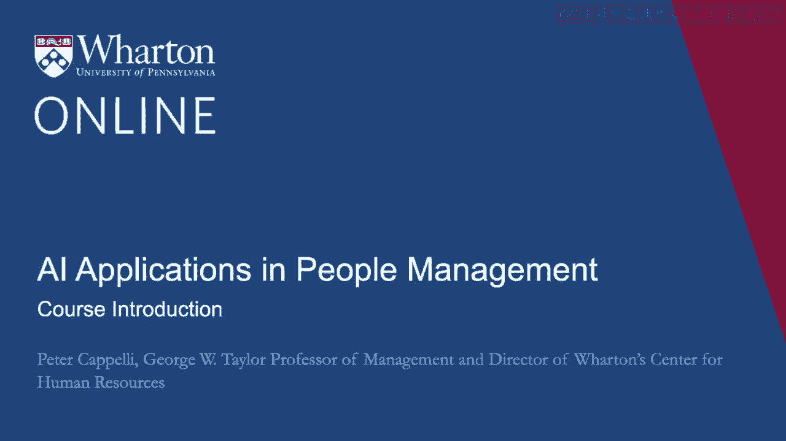
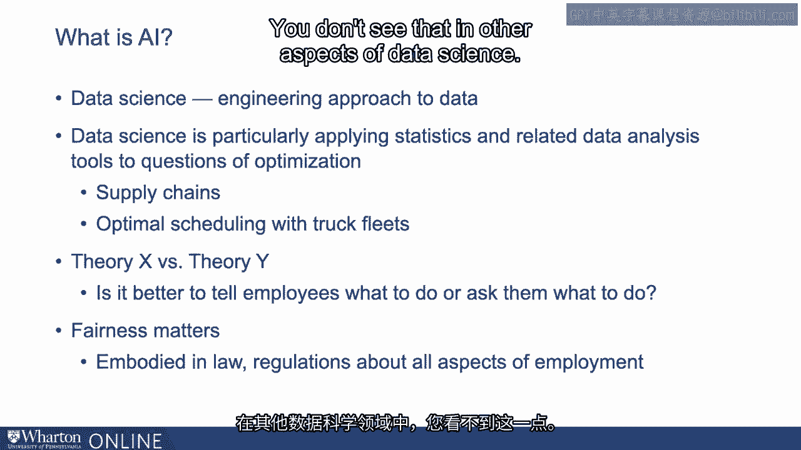
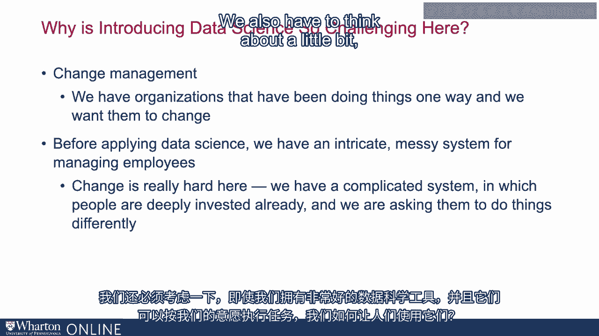
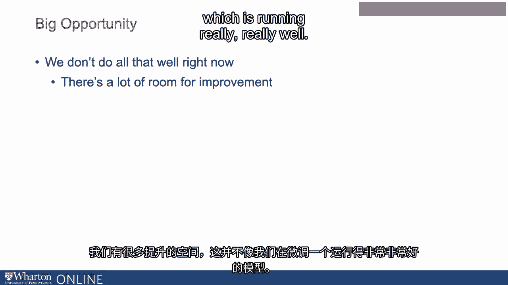

# P63：0_课程介绍.zh_en - GPT中英字幕课程资源 - BV1Ju4y157dK

大家好，欢迎你们的到来。很高兴你们能与我们同在。这是我们关于影响的节目。

人工智能在人员管理及相关问题上的应用。我的。我的名字是彼得·卡佩利。我在沃顿商学院担任教授已经35年了。运营我们的**人力资源中心**，以及其他事务。还有我一直在布置工作场所。很长一段时间以来。最近，我一直在关注人们的变化。

关于薪酬、绩效管理方式的变化，以及我们所经历的更广泛的转变。看到过去一代人朝着更加开放的劳动力市场和员工流动的发展。我和我的同事们在这个项目中一直在探讨人工智能的角色。正在管理人员。**马修·比德威尔**，你会很快听到他的声音，他是这里的同事。

这里在沃顿商学院创建人力分析课程的是**索尼·坦比**和他的同事。我想我们可以说，他是一位改行的计算机科学家，研究工作场所。问题，特别是各种电子市场如何影响招聘等问题。所以我们将花大约接下来的四个小时与你在一起，具体取决于你观看这个内容的时间。

讨论这些问题。那么让我先从管理人员的一般观点开始。可能有一些人正在观看这个，他们在管理方面的经验不多。在此之前，人们，尤其是如果你是从数据科学或人工智能的角度来看这个问题。智力方面。管理人员是一项巨大任务。如果我们考虑相关成本。

在一个典型的组织中，例如，三分之二的成本来自员工。或者进行各种类型的劳动。如果你仅仅查看美国，每年我们雇佣6600万。每年都有很多人。 而这仅仅是从1.6亿的劳动力中得出的。 所以你能感受到一些。那些人正从一扇门出去，再走进另一扇门。 这是另一个问题。 沿着。

我们必须讨论如何管理人们的表现，因为关键问题在于如何。我们如何让人们做我们想让他们做的事，以及我们需要他们做的事？我们必须思考。关于我们如何支付他们、他们所走的职业道路，以及我们如何帮助他们转变所有这一切。这些问题。要了解这有多大，如果你仅仅关注这个行业。

这是由人们推动工作外包、管理人员问题、薪资等形成的。还有绩效问题，以及人员配置和招聘问题。如果你将其总和。这个行业，仅在美国就有五千亿美元。所以这几乎是。现在整个美国建筑行业的规模。因此，这这是一个非常重要的问题。

对组织和社会而言，涉及到真实金钱的后果。尤其是对企业而言。他们关心的事情之一是公司品牌如何受到人员管理的影响。问题。我们现在看到很多关于性骚扰、多样性和包容性的关注。问题是它们如何影响公司的财务表现。现在许多公司被要求。

以证明他们遵守各种多样性包容政策和反骚扰措施。政策。当我们思考公司如何竞争时，商业战略中的关键问题。至少在我看来，这个问题是关于能力的，究竟一个企业如何运作。以一种能够让他们与竞争对手竞争并取得成功的方式掌握某项技能。

在他们周围。几乎所有的对话现在都归结为人们和的相关问题。我们管理它们的方式，因为这在各家公司之间几乎没有差别，坦率地说。当然，

最终，关于所有这些话题令人担忧的原因在于管理人。影响他们的生活。管理不善会导致一系列与健康相关的问题，压力相关。特别是问题，坦率地说，这只会让人痛苦。如果我们能够管理好人，嗯。我们可以让他们的生活变得更好。因此，这本身就是一件重要的事情。

绝对值得我们认真对待。那么我们来稍微讨论一下我们面临的问题是什么。接下来几个小时我将和你讨论的内容。我们开始吧。关于什么是人工智能的问题。那我们来看看是否可以谈论这个。等一下。这是一个动态目标，人工智能。其背后的理念是这些。

这种智慧所能做出的决策种类，只有人类才能作出。问题在于这是一个动态的目标，因为我们在计算机科学上不断进步。以及决策等。我们发现我们可以进行越来越多的决策。目前人们谈论人工智能时，我们所拥有的就是这些。主要是数据科学。数据科学的核心是对数据的工程化处理。所以你可以说，这相当于工程与科学的关系，数据科学。是统计学。因此，统计学是数据科学所基于的基础学科。现在。数据科学特别应用统计学和相关的数据分析工具来解决问题。

优化的意思是什么？我们指的是什么？举例来说，就是考虑供应链。思考我们如何确保将适量的货物送到我们的商店。在恰当的时间段内。你可以考虑类似于最优调度的事情。例如，**卡车车队**，以确保我们知道我们恰好拥有适量的卡车。

恰到好处的舰队。 然而，当我们思考人时，问题在于与之不同。也许是卡车， people get sick， people also get angry and they act out when they're angry。 They quit。

如果他们对工作没有投入，他们就不会在乎它。他们会放慢事情的进展。他们实际上可以破坏。 这在工会界是一种旧技术，称为**按规章工作**。如果你对管理层真的很烦恼，你可以做的是。只需从手册中直接提取工作规则，逐字遵循它们。你完全可以。

基本上就是让组织停滞不前。所以这会带来很多后果。你如何管理人以及许多与优化截然不同的影响。数据科学的规范源于研究机器和设备等方面。在过去一个世纪左右或自开始以来，管理领域的根本辩论。关于管理的内容，我们将在节目稍后讨论一些。管理观点与领导观点之间的划分，后者认为人是理性的。演员，并考虑沿着那些等效的线条管理人员。与运动相比。这项研究始于1930年代，但直到1950年代才真正发展起来，更多地受心理学的影响。

思考人们实际的反应。有时人们称这些为理论 X **道格拉斯**。麦格雷戈在这里著名的区分。理论X是指人们是理性的。这实际上意味着。他们并不真的想工作，除非你支付他们，如果你不检查，他们就不会努力工作等等。理论Y认为，如果你正确管理他们，他们实际上可能会。

做你希望他们做的事情。因此，测试你认为自己在这个区别上的位置的方法是。是思考，是告诉你的员工该做什么更好，还是问他们该做什么。这是友善的。两种极端观点的对立。前者是一种X理论的观点，而后者。这是一种理论 Y 的观点。理论 X 的观点与工程原则相一致。

稍后我们将看到。数据科学及其相关的数据管理。这基于机器学习等技术。你可以举两个设备的例子。什么。他们在尝试做什么？我们正在试图弄清楚球轴承在这个上可能何时会失败。一件非常昂贵的设备。那我们想怎么做呢？我们可能会说我们。

不太在乎，只要你能预测到就行。我们只会听，可能会放上麦克风。在那里查看或寻找石油方面的申请，或者你知道的其他任何事情，只要它。预测轴承何时会发生故障，我们不关心是如何做到的。这就是我们所关心的全部。这已经足够好了。一旦你转向员工，如果你问这样的问题。

那么这些员工什么时候会辞职呢？而且你做了像窃听他们的事情。比如打电话或去他们的社交媒体查看。我认为这就是区别所在。我们关心你是如何得出那个答案的。这个答案不仅仅是一个好的预测。当人们准备放弃时。如果你有一个很好的解释，人们会变得非常恼火。

可以以100%的准确率预测谁会辞职。如果结果显示我们是通过倾听得出的。到你的电话记录。所以，当然，管理中最不同的一件事是。人们认为，像公平这样的议题非常重要，而公平问题体现在。例如，法律在政府对所有就业方面的规章中起着重要作用。因此，当我们。

开始处理就业问题和决策时，我们开始遇到这些公平性。在实践中，这意味着我们经常与法律发生冲突。而你并不。在数据科学的其他方面也可以看到这一点。因此，与管理相关的一个大问题。

当我们将数据科学与之对抗时，人们面临的问题是变更管理。一种在管理中非常重要的通用能力。基本上是变更管理。意味着我们有一些组织一直在以一种方式运作，而我们希望它们发生改变。所以在数据科学出现之前，我们有一个非常复杂、可以说是非常混乱的情况。

员工管理系统。如果你不同意，可以去你的人力资源部门。并要求查看那里描述员工如何工作的文件和手册。应该是被管理的。你会发现现在一切都是电子化的，但你会看到很多。还有很多文件和数百页解释我们应该如何管理人员。我们已经投入。

在培训人们如何管理员工方面花费了很多时间。如果结合数据科学的话。我们采用了一种截然不同的方法来对某些事情做出决策。招聘时我们面临这个变化的问题。我们有一个复杂的系统，其中人们。他们已经深度投入了，我们现在要求他们以不同的方式来做。因此。

这是一个我们也需要稍微思考的大问题。即使在我们拥有时。

数据科学工具非常出色，能够完成我们想要的任务，我们该如何使用它们。让人们采纳它们。这部分是关于我们如何让他们放弃的故事。他们目前正在进行的一些决策，将会转交给这些算法。所以，简单理解的话，如果你将数据科学应用于某些事物，比如。

分配酒店房间时，让我们思考最佳定价，以确保我们保持我们的。房间的入住率达到100%或尽可能接近。酒店房间是不会起诉你的。如果你在这方面犯了错误。但是如果你在工作任务中分配员工。例如，工作分配的情况，结果发现这些分配对某些方面有一定的影响。

公平性可能导致员工最终起诉你。相同的算法。在不同的环境中会导致截然不同的结果。因此，我们的其中一件事。需要考虑的不仅仅是人力资源界的抵抗。目前以完全不同的方式工作的基层管理者。所以这是好的。仔细管理这一过程的原因，是为了考虑尝试做得更好。变化的机会。所以让我们稍微思考一下这里的机会。我认为在。我的一生回顾我所见过的那些改变商业的事物。并改变了对人们的管理。这可能是其中最大的变化之一，因为。

它的潜力在于我们通过施加影响改变决策方式所产生的连锁反应。上面的数据科学工具改变了我们收集数据的方式，进而改变了资源的分配。关于影响这些公平问题的决策权分配给不同人的各种情况。有很多东西。好消息是，在引入数据科学方面这里有一个很大的机会。

原因在于，我们所讨论的许多决定实际上并没有得到很好的执行。现在很好。正如你所知，关于招聘这样的问题有很多担忧。我们不仅没有把合适的人放到合适的工作岗位上。并找到优秀的员工，但涉及很多偏见和歧视。在这些结果中。所以还有很多提升的空间。并不是说我们只是在调整。一个运行得非常非常好的模型。 如果我们变得更好，这会改善人们的生活。

也可以更好。所以我们现在的情况就是这样。这是一个真正提升自己的机会。思考如何应用这些为之开发的工具确实是一个真正的挑战。在制造等领域中，将其应用于人类的背景截然不同。正如我之前所说，我将在这个项目的不同阶段与您同在。

我的同事**马修·比德尔贝尔**也会在这里待一段时间，另外我们的同事**索尼·坦比**也会在场。也如此。在这个项目的过程中，你会看到我们进出。我们期待着。期待与你们一路走到最后。 [ 静默 ]。

