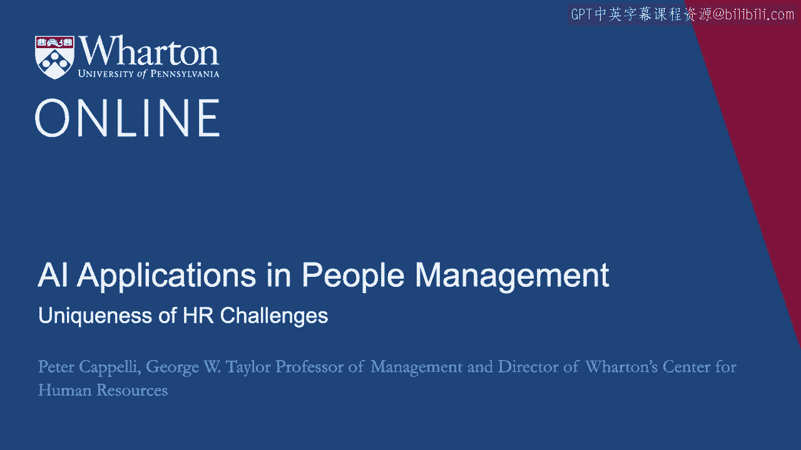
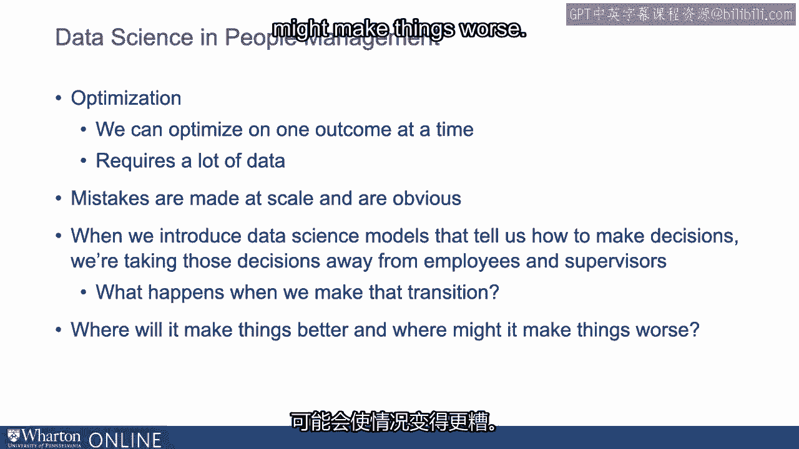

# P64：1_人力资源挑战的独特性.zh_en - GPT中英字幕课程资源 - BV1Ju4y157dK

在这一部分，我们将讨论一些独特的挑战。

广泛管理人员和人力资源问题。

这对于那些为了某种目的而接触这一主题的人可能特别相关。

第一次。那么我们来聊聊我们对管理人员问题的了解。

尤其是因为它们交叉了数据科学这一主题和优化的基本范式。

所以如果我们将时间回拨到大约100年前，现代工厂时代的开端。

你会看到的事情之一，很多实际上发生在*费城*。

在南北战争之前，大约在1930年代，费城是第二大城市。

世界上讲英语的城市以及美国一个伟大的制造中心。

如果你在大约1900年左右走进费城附近的一家工厂，那里的一件事。

如果你停下来问人们，很多正在工作的人会让你感到惊讶。

在那栋建筑里并不是员工。它们是独立承包商。根据某些标准。

到大约1910年，美国工厂中的工人多达**40%**。

他们实际上是独立承包商，而不是员工。

你可能还会注意到，组织是非常混乱的。

这栋建筑内部简直是一团糟。你大致可以理解为什么。

仅从之前的描述来看，你有一栋建筑，你有一个拥有它的业主。

但他还有一些承包商在那儿，他们基本上是独立工作的。

有时他们实际上会获得一部分收益，也就是利润的分享。

作为他们在那里的工作的一部分，他们退出了这项业务。

我们还会看到的是人们来来去去，新的工人明天会来。

现有的工厂也被留下。 这些工厂的员工流动率大约为300%，这并不罕见。

管理实践真的非常、非常随意。所以，到这个时候。

世界上最大的制造业运营位于现在费城市政厅附近。

这是鲍德温机车工厂。他们制造火车。

这就是工头在博尔德温机车厂如何运作的方式。

他们会在一天开始时进去，看看当天有多少工人。

在之前出现过。如果缺少两个人，你就没有休假时间和病假的政策。

如果那天你缺席了两个人，他们就会走到工厂的门口，在那里。

会有一群寻找工作的人的围观，他们会扔几个苹果进去，围观的人群。

如果我需要两个人，我就扔两个苹果。如果你接住了一个苹果，你就来为我工作。

你跟着我进了工厂。工厂另一边还有其他人缺少三个人。

他们可能会把三对丢进人群中。你得到了一个对，你为他工作，你得到一个苹果。

你为我工作。挺简单的，挺直接的，也挺快的，但同时也真的很混乱。

而公司们开始慢慢发现的事情之一，最初是在福特汽车公司。

这个高周转率和非常随意的工作系统并没有奏效。

一旦人们不再仅仅依靠自己的双手工作，这一切就变得非常好。

锤子、锯子和搬运东西。所以在流水线，例如。

福特汽车公司在刚开始时意识到。

结果是这些汽车从生产线上下来时非常糟糕。它们无法启动。

它们无法工作，缺少部件，简直是一团糟。

其中一位工程师想到，也许这与那令人难以置信的事情有关。

高离职率。因此福特进行了一项重大实验，称为亨利·福特的“每天5美元计划”。

如果你了解经济历史，你可能听过这样的描述。福特曾著名地说。

"我希望给我的员工支付足够的工资，让他们能够买得起我的车。"

他这样做根本不是为了这个。他这样做是为了实现营业额，并且他还发明了很多其他的东西。

像离职面谈一样，询问人们为什么离开。

他们所说的与今天所说的差不多，“我讨厌我的老板。”

所以他解雇了主管，带来了新的主管，创建了一个工业社会学部门。

他称之为，他的工资翻倍，员工流失率像石头一样从300%降到每年大约50%。

几乎在一周左右。他们发现汽车的质量大幅提升。

所以我们认为装配线的工作其实是非常低技能的工作。

但是如果你在生产线上犯错，那比你在其他地方犯错要糟糕得多。

自己用锤子工作，因为你停止了装配线。

而你可能会损坏一件非常昂贵的设备。于是福特开始发现。

和其他雇主一样，稳定你的员工队伍真的很重要，人才管理。

将合适的人放在合适的职位上，确实非常重要。

另一个重大进展始于西方电气厂，也许是在大约10年后。

大约在1920年代中期，他们开始尝试工作设计。

这最初是作为一项政府研究的一部分，旨在研究照明。

而这个想法是，也许更好的照明会提高表现。

如果你上过心理学课程，你可能听说过这个。

本研究是在西方电气公司的霍桑工厂进行的，那里生产电话。

他们所做的就是把灯拆掉，然后换上新的荧光灯。

他们发现生产力提高了。因此他们想，“太好了，这显然是灵光一现，太棒了。”

我们了解到。“”，不过，作为优秀的研究人员，他们把旧的灯泡装回去，并发现了。

生产力再次提升。最后他们从中了解到，根本不是灯光的问题。

这是在与员工交谈，询问他们的情况，问他们新的进展如何。

灯光就像，关注它们似乎很重要。因此是西方电气。

尽管对照明的研究停止了，西方电气公司决定继续探索这一领域。

他们在手机组装操作中有一小部分只是玩耍。

尝试不同的工作组织方式，更加关注工人，更加关注。

关注他们的需求和兴趣。随后，名为**埃尔顿·梅奥**的人进入了这个领域，他的职业生涯始于沃顿商学院。

我早该提到的是，最初创造这个模型的弗雷德里克·泰勒。

他将科学管理应用于工作的工业工程也开始了他的。

他在费城附近的职业生涯。 他伟大的赞助人是经营贝斯莱姆钢铁的**约瑟夫·沃顿**。

而沃顿所做的，你看，他聘请了弗雷德里克·泰勒来看看他能否做到。

他的工人更有效率。泰勒的洞察是你可以对工作进行细分。

将它们拆分为单独的任务，并把它们视为一种机器。

所以我们将分析一名机械师所做的工作，确定机械师所执行的每个独立任务。

我们将看看是否能将这些任务拆分，将更简单的任务分配给非熟练工人。

并让机械师只做那些独特于加工的事情。

我们将其拆分成多个部分，我们可以为每个部分设定时间，我们可以看到每个部分应该花费多长时间。

然后我们可以开始告诉机械师到底要做多少，应该持续多久。

为每个任务制定时间，追究他们的责任，并推动他们前进。回到艾尔顿·梅奥。

他是泰勒的对立面。他创办了沃顿商学院，之后又转到哈佛商学院。

他们去了这项西电研究，开始检查并跟踪它。

他们认为这里有一些非常有趣的事情发生，因为在这些。

在小组中，他们可以看到生产力差异以数量级的方式提升，你知道的。

当员工更积极参与时，效果提高了五倍。

所以梅奥创作了文学和一套被称为人际关系运动的理论。

基本上归结为工人有心理需求，他们不仅仅是理性的机器。

你可以知道该怎么做。但是如果你关注那些需求。

生产力和表现会显著提高。因此，在1930年代左右的梅约之后。

一些人抓住了这个，所以德明，爱德华·德明，作为二战中的质量大师。

他在战争期间帮助美国提高了制造质量。

当时真的很重要。但战后工程师们回来了，我们或多或少地采用了弗雷德里克·泰勒的理论。

科学管理方法。将工作分解，计时，设定标准。

为实现这些目标而支付人们报酬，等等。到1970年代时。

我们发现制造商的工作效果不太好，出现了很多质量方面的问题。

等等。我们开始看到在石油危机期间，日本汽车进入美国市场。

真正高效的小型汽车，他们开始获得市场份额。

但我们发现的另一件事是，这些车的质量确实更好。

我们发现日本人学会了采用德明的质量方法。

特别是，质量圈，这意味着你在赋予员工对质量做出决策的权力。

他们在检查，责任不在于队伍末端的某个人，而是如果出现质量问题，他们要负责。

这不好，他们会尝试修复质量。

在这方面，从日本学到的最后一步是了解丰田制造。

他们称之为精益生产的系统，我们称之为精益生产。

这是一种比质量圈更进一步的模型。

在这里，工人和他们的团队被赋予权力来解决质量问题，发现并解决它们。

还要弄清楚如何提高他们在操作中的生产力，如何。

通过更快地移动汽车，也许需要更少的劳动力，有时甚至可能更少。

部件或更便宜的部件。因此，我们从工业工程转向**弗雷德里克·泰勒**。

装配线，质量圈，赋权于员工的质量，精益生产。

使他们在质量和生产力方面更有能力。到2010年代中期的最后一步。

这是源于信息技术的变革，即敏捷项目管理的兴起。

敏捷项目管理的发现始于软件领域，即最佳方式。

管理软件并使其构建的方式是赋权给这些团队，基本上让他们独立。

支持他们，提供他们所需的东西，在他们需要的时候，并让他们决定，而不仅仅是**质量**。

不仅仅是生产力，还有设计问题，以找出最佳解决方案。

在最后，客户的需求。很多面对面的互动，很多交流。

很多透明度。因此，这就是道格拉斯·麦格雷戈在我们的介绍中所描述的理论。

Y。因此，我们在西方电气公司意识到这确实很重要，以至于需要支付。

关注工人的需求到质量圈，我们开始赋予他们在质量方面的权力。

向精益生产转型，让我们提升他们的生产力，向敏捷转型，让我们赋予他们权力。

几乎涉及所有事物。那么，理论Y的主题是什么呢？就是赋权，赋权，赋权。

让员工做得越来越多。现在，为了使这一切奏效。

你必须为员工构建一个支持所有这一切的系统。

这之所以重要，是因为当我们现在谈论数据科学时，我们谈论的是。

关于将其引入到一些已经在赋能员工方面取得进展的系统中。

所以这意味着我们将讨论数据科学如何做出决策，但它是。

在这种情况下，许多组织已经有了他们的员工。

自己做出很多这样的决定。我们也讨论管理人员的问题。

除了这些关于我们如何组织工作的问提，还有各种各样的事情我们。

必须考虑这些因素如何影响员工的激励，这意味着他们的动力有多大。

要完成的事情。我们如何对待这些行为？

我们如何衡量他们的表现，并判断什么是好，什么是坏？

与其他人相比，他们的相对薪酬是多少？他们对此非常在意。

我对比其他人相对于我的薪水的感知贡献是什么？这是一个公平性问题。

我从这里的 MBA 学生身上学到的一个奇怪的事情是，过去大约 30 年来我们都有相同的期中考试。

迎新 MBA 学生的考试要求他们写关于自己上一份工作的内容。

他们辞去上一份工作的主要原因是因为这些公平性问题。

这主要是因为他们意识到自己完成的事情比其他人更多。

没有得到认可。所以，员工关心的各种问题将会影响他们。

绩效，这将影响组织的绩效。

在这个背景下，数据科学必须非常小心，以免搞砸这一点。

让我们谈谈一些已经实施的政策和程序。

关于管理超越单纯绩效的人。

雇主现在也关心这些事情，比如劳动力的人口结构平衡。

跨种族群体，跨性别和性别基础的群体。多样性与包容性。

今天是一个重要的话题。我们不仅仅关心聘用那些我们认为是最佳表现者的人。

但我们希望拥有一个整体的劳动力，能够代表这个人口统计。

社会中的平衡。我们对公众对我们工作实践的看法感兴趣。

我们希望被视为一个良好的雇主和一个理想的工作场所。

你知道几年前有一部叫《实习生》的电影，你们中的一些人可能看过。

这已经过去几年了。谷歌是那部电影的地点，按我所理解的。

谷歌支持了那部电影，从经济上来说，你可能会想他们为什么要这么做？好吧。

因为谷歌作为雇主的品牌正在被传播，而谷歌从中受益。

这提醒我们，除了仅仅拥有有效的工作方法，其他因素也很重要。

无论人们是否相信并看到你在管理人方面所做的事情都是有意义的。

这是理想的。当然，另一件在美国显得尤为重要的事情。

在其他国家，这同样重要。这种执行方式不同的是合规。

当你想到美国的人力资源时，很多人开始关注**合规性**。

皱眉的表情是因为他们在考虑因歧视而被起诉的法律问题。

或影响残疾人的行为或侵犯每小时工资的行为。

所以有各种因素限制了原本可能是**最佳**的决策。

在性能和生产力方面，他们必须遵循这些规则。

法律问题。因此，这里有各种参数需要担心。

然后数据科学就介入其中，对吗？数据科学的起点是优化的假设。

我们可以一次优化一个结果。因此，如果我们想说我们希望雇佣那些会是最佳的人。

这项工作的表演者，听起来很合理。好的，你如何衡量表现？好的，嗯。

绩效评估分数。好的，这还不错。

但这是否包括他们是否会辞职呢？嗯，可能不包括。那么，这重要吗？

是的，这可能是对的。好的。关于他们的人际交往能力和与他人相处的能力，或者他们的潜力如何呢？

为了进步？那么那些事情呢？是的，它们可能也很重要。好的。那么。

选择你想要优化的一个，因为我们不能同时对两个进行优化。

所以一开始就给我们带来了一些小麻烦。

预测一个滚珠轴承何时会破裂是一回事。

预测谁会成为优秀的表现者是另一回事，尤其是当我们无法完全做到这一点时。

以简单的方式定义优秀表演者的意义。

我们将要遇到的第二个问题是，你已经从我们的同事那里听说过这个。

Sunny Tambi和Will Turat讨论的工具如机器学习需要大量的数据。

大量的数据意味着如果你是一家相对较小的雇主，比如说有500名员工，

某些事情，你可能没有足够的员工变动，足够的离职来建立。

一个机器学习模型。即使你从历史上追溯，这也会成为一个问题，因为我们将会。

稍后会有一些关于隐私的问题出现。

我们应该保存就业数据多久？例如，某个在10年前离开的人。

提出了有关隐私的有趣问题。关于数据科学的另一件事。

一旦我们推出一种技术，数据科学就像招聘一样。

我们在整个组织中都在使用它，如果我们犯错误，这些错误是容易的。

要发现这些，因为它们现在正在大规模发生。还有其他值得考虑的事项。

采用一种通用方法的风险承受能力。

这可能比我们之前的做法要好得多，但如果你犯了错误，容易被发现。

如果它违反了法律，原告律师也容易发现。

我们需要思考的一个重要问题是，当我们引入机器学习模型时。

算法，数据科学模型告诉我们如何做出决策，我们正在进行。

这些决定让其他人远离。通常我们是让主管远离这些决定。

那么当我们进行那种转变时会发生什么呢？所以这里有一个快速的例子。

假设现在我们需要为员工安排每天上班的日程。

那么在什么时间，我们可以这样说，对吧？所以我们把员工聚在一起，讨论这个问题。

我们可能建立一个系统，而那里的监督者稍微有些不同，我们进行一系列的谈判。

我星期六不能工作。好吧，如果你能接手星期天，我就同意。

这有点混乱的事情让我们明白了。但是随后我们决定。

让我们优化这个并使用调度软件。

我们确保在合适的时间有恰到好处的人数到场，并且我们分散了。

彻底均匀地锻炼。现在会发生什么？好吧。

假设我是一个员工，这个星期六我被安排工作，我并不是特别喜欢。

下个星期六，日程安排将公布，我也安排在下个星期六工作。

我对此感到非常愤怒。现在的系统让我去找我的主管向他抱怨，并且说。

这真是糟糕，你能对此做些什么吗？她可能会回复我。

我明白这确实是个问题。我稍后会处理这个。我们不会再这样对你了。

我们用调度软件替代了那个，我被安排在星期六，不太高兴。

下周六，我又被安排了。我去找我的主管说，嘿，这里发生了什么？

我的主管说，这就是软件。它做到了。这太糟糕了。我的主管说。

这是开发该软件的程序员的电话号码。你为什么不和他们聊聊呢？

现在我们面临一个公平与公正的问题，而我们没有好的解决办法。

所以我们在数据科学方面需要做出的一个重大决策是我们可以在哪里引入。

以能够改善事物的方式使用它，而如果我们引入它，可能会使事情变得更糟。

所以这是我们在整个程序中将要处理的重要问题。

这就是判断的问题。我们理解数据科学能够做什么。

我们理解劳动力的复杂性。 这在哪些方面可能会有帮助？

这实际上可能会在哪些地方产生更多问题？这是我们希望在这个项目结束时得出的判断。

[空白音频]。

