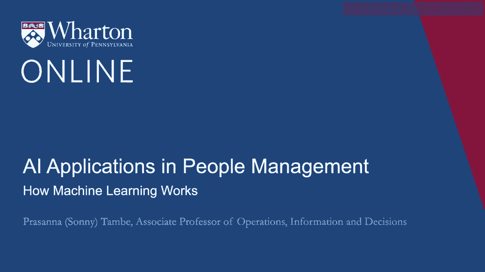
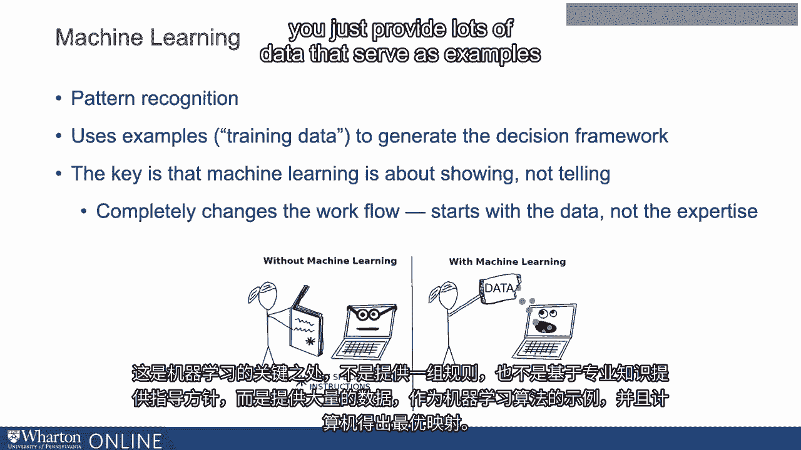
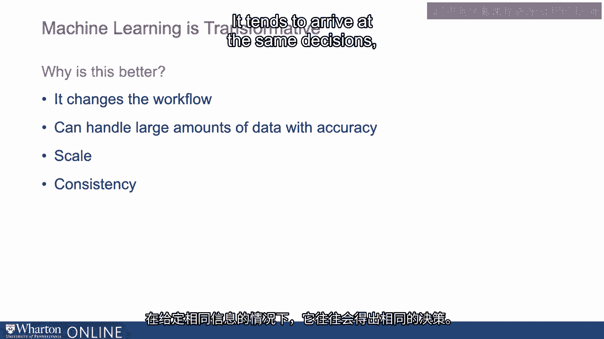

# P68：5_机器学习的工作原理.zh_en - GPT中英字幕课程资源 - BV1Ju4y157dK

我们讨论了人类决策和基于规则的系统，在这些系统中，软件开发者可以将某人的专业知识融入软件中。

机器学习在一定程度上改变了这一范式。所以机器学习本质上是模式识别。机器学习的作用在于它使用示例。我们称这些训练数据为生成决策框架。关键在于机器学习实际上是关于展示而不是讲述。所以不如让一个人解释他们是如何做某件事的。你所做的是提供大量大量的例子。而机器本身学习如何构建决策框架。这完全改变了工作流程。它从数据开始，而不是对专业知识的编码。

机器学习的关键在于提供一套规则，而不是基于专业知识提供指导。你只需提供大量大量的数据，这些数据作为机器学习算法的示例。

计算机达到了一个**最优**的映射。因此，例如。而不是提供大量关于什么因素或变量的信息。假设我们有很多关于申请该公司的候选人的信息。而不是提供专业知识或大量关于特定组织在候选人中重视什么的信息，以及如何思考评估不同因素或优先考虑不同候选人。

你可以选择用机器学习系统或构建机器学习系统来提供大量关于申请者的历史数据。这些不同的因素，即申请人资料的不同部分。关于候选人的最终决定已经做出。所以想象一下，你拥有这种数据，其中包含关于候选人的大量信息。

然后你会了解到关于候选人最终做出的决定的信息，无论他们是否被邀请参加面试。在这里的第二种情况下，当我们拥有这些数据时，机器学习算法可以仅通过观察数据来学习它们应该如何思考或应该如何思考。或者它应该如何考虑等待申请人作品集中的不同部分。是否应该优先考虑以往雇主的经验、特定技能等。

你从来不需要告诉它。人类专家从来不需要准确告诉它对特定组织或上下文来说什么是重要的。从展示的示例数据中，它可以学习该做什么。所以这就是机器学习与之前使用的一些系统或方法之间的区别。所以这在多个方面都是一个变革性的进展。这是为什么呢？

我们为什么会认为这种使用示例的方式是具有变革性的？

为什么我们认为机器学习系统是变革性的？

首先，它改变了工作流程。一个我们讨论过的基于规则的系统的例子是我们需要接触专家。在某个环节，我们需要人类的专业知识。而这可能会很昂贵，尤其是涉及到真正专业的高技能专家。获得这样的专业知识可能很困难，而且向这样的专家请求解释他们对某一知识领域或应用的所有了解也可能很困难。

在机器学习的案例中，我不需要专家，我需要专家生成的数据，所以也许我可以走到医院，获取从业者做出的之前的决策或医疗预测的数据。如果我拥有那个，我就不再需要实际专家的帮助。这也是一种变革，因为在某些情况下，你拥有的数据量如此庞大，以至于人类专家根本无法有效地将所有信息进行综合。所以我们讨论的例子中，我们提到了投资组合的几个不同部分，但在许多机器学习案例或信息上下文中，你可能面临的不仅仅是三或四个变量，而是成千上万的变量在影响预测。

在金融领域的广告空间，有时在环境领域，比如你可能会有成千上万的变量，认为一个人类专家能够一次性考虑所有这些信息来得出预测，这有点过于雄心勃勃，但机器学习算法可以做得相当不错。如果你提供两千个变量，并且有这些最终结果的例子，在这种情况下算法可以做得相当不错，往往比一个人做得更好，因为人可能会觉得一次性综合所有这些信息非常困难甚至不可能。

这也是具有变革性的，因为一旦我们建立了算法，显然可以大规模运行它，无论是查看十份简历、一百份简历、一十万份简历，还是一千万份简历都没有关系。这在很大程度上是恒定的，所以一旦我们把它启动并运行，它的扩展性非常好。

这也是一个非常一致的特点，这是像这样的系统的一个不错的特性，因为它是一个算法，它倾向于在给定相同信息的情况下做出相同的决策。它不会在一天中感到疲倦，也不会在周日相对于其他日子开始犯错误，它非常一致。

在某些情况下，这真的很重要。所有这一切的关键在于训练数据，这些你输入系统的示例是构建这些系统并实现这些好处的关键，这就是我们将在下一个视频中讨论的内容。[空白音频]。

