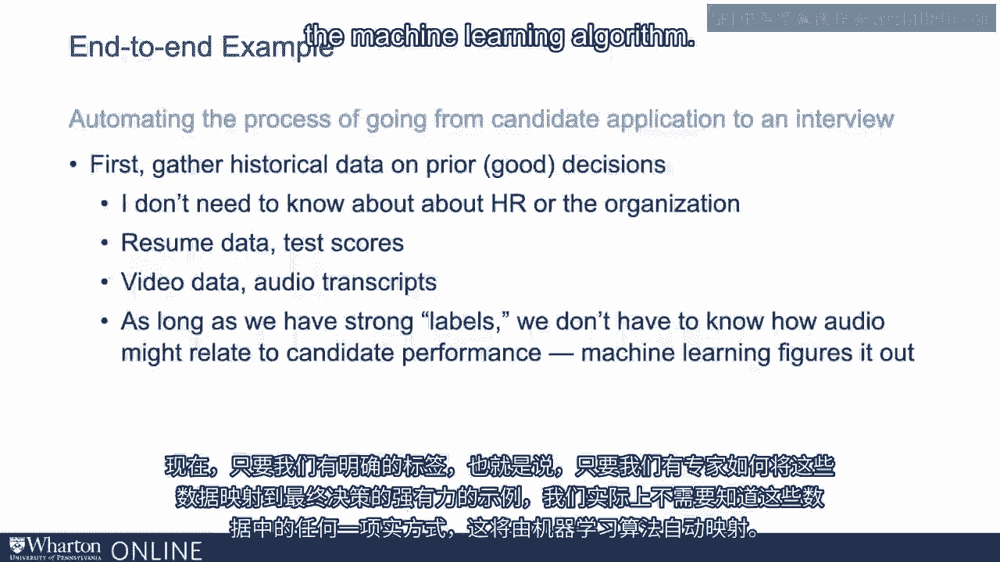
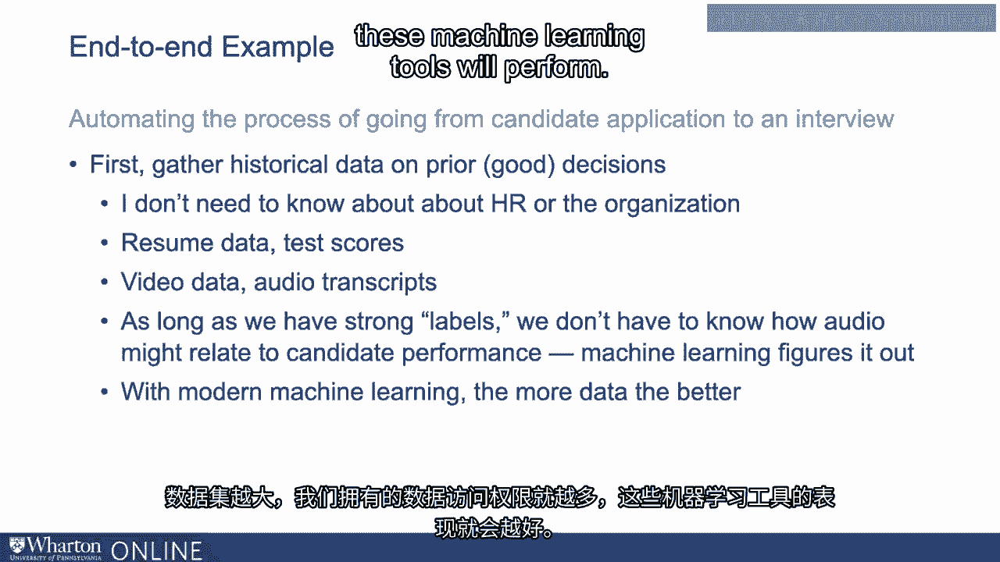
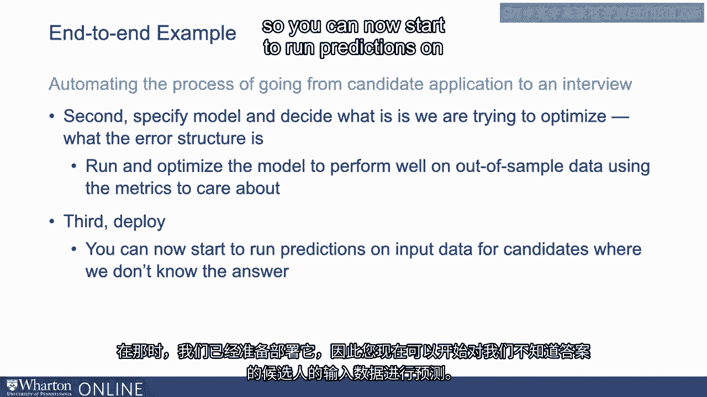
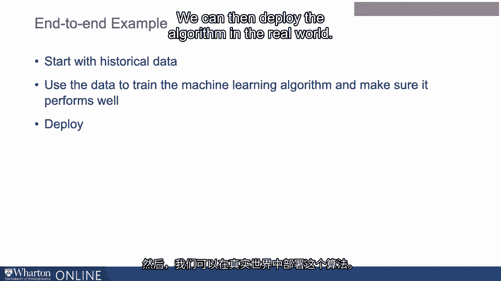

# P72：9_端到端示例.zh_en - GPT中英字幕课程资源 - BV1Ju4y157dK

让我们谈谈与机器学习相关的一些我们提到过的概念。

相关的训练数据，以及它在整体工作流程中的结合方式。那么我们来谈谈我们一直在处理的例子，即申请人筛选。所以想象一下，我们想要构建一个系统来自动化这个过程。候选申请将在面试中展示。那么整个工作流程是什么样的？

所以我们要做的第一件事是收集以往决策的历史数据。之前做出的良好决策。因此，我们想确保选择的是由我们所信任的人所做出的决策。知道在这个特定领域拥有丰富的专业知识。所以我们将收集关于良好决策的历史数据。还有，再次。

在这个阶段，我们不需要了解任何关于人力资源或组织的内容。只要数据来自于我们正在研究的特定商业背景。这就是为什么机器学习如此具有变革性和强大。所以第一步是从某个来源收集过去良好决策的历史数据。它可以是档案数据。它可以是你专门为这个任务生成的内容。这可能包括在此情况下的简历数据测试分数。如今，这种情况越来越普遍。这包括你在访谈中收集的视频数据，以及访谈的音频转录。以及其他非常规的。

产生或生成数据的来源。现在，只要我们有强标签。只要我们有强有力的意义，专家会如何将这样的数据映射到最终决策的例子。我们实际上不需要了解这些数据是如何重要的。思考候选人的表现，这将被自动映射。机器学习算法。

比如，我们不需要知道或事先了解音频是如何工作的。转录本可能与候选人质量相关。机器学习将会自行学习这一点。而且，随着现代机器学习的发展，数据越多越好，因此这些数据集越大。我们对数据的访问越多，这些机器学习工具的表现就会越好。

所以我们将从数据开始。 我可以访问数据。 然后我们将指定一个模型。确定它是什么。我们正在努力优化我们关心的错误。然后我们将运行并优化模型，以确保其表现良好。不仅仅是我们正在使用的数据，构建模型所用的训练数据。

我们还将确保它在一个我们称之为**保留样本**或测试数据的情况下能够良好运行。所以我们在这个过程中想要做的是利用这些训练示例来构建模型。然后在其他样本数据上测试模型的性能。只是为了确保它在我们不需要的数据样本上运行良好。

还没有习惯实际构建模型本身。因此，这个过程也是机器学习工程过程中的一个重要部分。只是为了确保它在现实世界中处理见过的数据时表现得足够稳健。不仅仅是用于训练模型的数据。 在我们对其性能满意之后。我们已经进行了这些测试和检查，以确保它能达到**最佳性能**。

关于我们关心的错误类型，我们已经准备好进行部署。所以你现在可以开始对候选人的输入数据进行预测，而我们并不知道答案。

所以，我们再次以我们知道的良好历史数据为起点。我们使用这些数据来训练机器学习算法。我们确保它在样本外数据上表现良好，我们对此表现感到满意。然后我们可以在现实世界中部署该算法。

[空白音频]。

