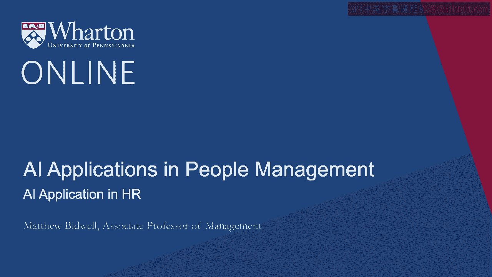
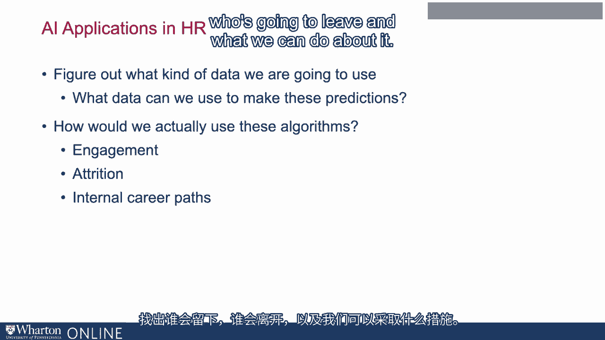

# P73：10_人力资源中的AI应用.zh_en - GPT中英字幕课程资源 - BV1Ju4y157dK

到目前为止，我们讨论了两件事。

首先，我们讨论了在某种独特挑战中管理人员的问题。它创造了什么，以及组织如何倾向于应对这些挑战。索尼还向你展示了机器学习的魔力。这些新工具和技术。技术使能，并且现在被用于构建更强大的东西。算法和更好的预测我们之前拥有的广泛事物。所以现在我认为我们已经到了一个很好的时机，可以真正将这些算法应用到。我们之前提到的管理人员的问题。而且想想机器学习可以用来改善方式的不同方法。

我们管理人。现在在这样做的时候，我认为我想强调一个关键点。这是索尼描述的算法。这些是通用目的技术。我指的是它们是一套我们可以应用于任何问题的技巧，你知道的。无论是模式识别的问题，还是训练计算机识别每一只猫。

互联网正在解决一些生产问题。你说吧。好的。所以当我们谈论如何将其应用于管理员工时，所不同的是。将有几个事情。所以一个是弄清楚我们将使用什么样的数据。所以索尼所描述的这些算法真正擅长的就是处理一堆。输入数据和输出，以及弄清楚这些输入数据中的哪个。所以我将举例谈论营养预测。我们可以利用哪些信号来预测谁会领导，这些信号与人们的行为有关。因此，关键的一点是弄清楚哪种数据效果最好。

预测谁将离职的工作。因此，我们常常考虑的是我们可以使用哪些数据来进行这些预测。预测，数据越聪明，结果就越好。我们在应用这些时，另一个我们真正想要考虑的事情是我们该如何去做。实际上使用这些算法。算法只是给你提供预测。

对自己的预测没有用。那么这些行动邻居究竟在做什么呢？

由此产生的行动是什么？所以我将讨论这些算法如何应用于管理的三个不同领域。人们。因此，首先要关注员工的参与度，追踪我们员工的动机有多高，他们的满意度如何。在这里。一个 attrition，弄清楚谁会留下，谁会离开，以及我们可以做些什么。怎么处理它。

第三，在组织内部建立职业发展路径。这并不是机器学习使用的所有方式的详尽列表。管理人员。我认为建立这样一个详尽的列表会很困难。我特别想说的是，机器学习正在显著影响的一个巨大领域。used is hiring。 我将忽略这一点，因为彼得会花很多时间谈论。那个。我将讨论这三个主题：**参与度**、**流失率**和**职业发展路径**。我们将从互动开始。谢谢。 [沉默]。
