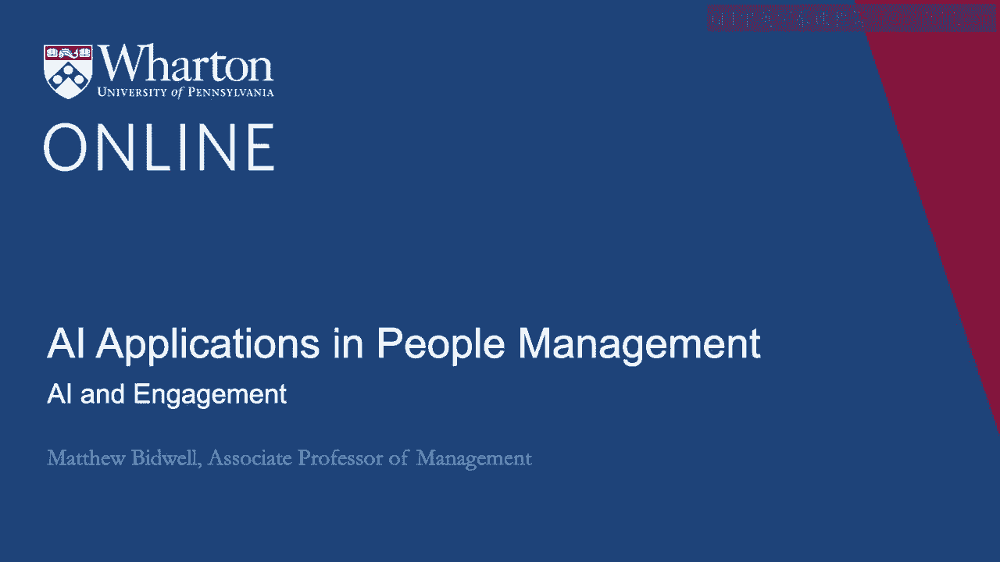
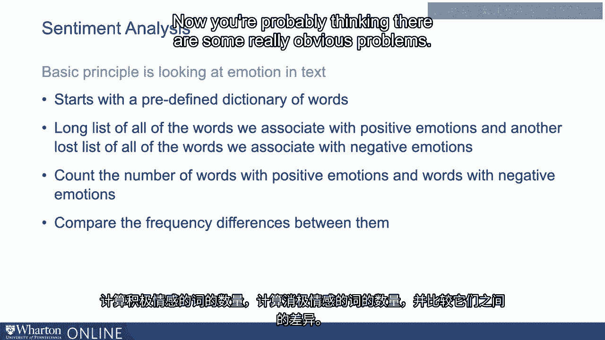
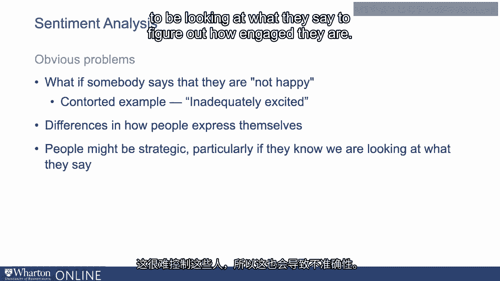
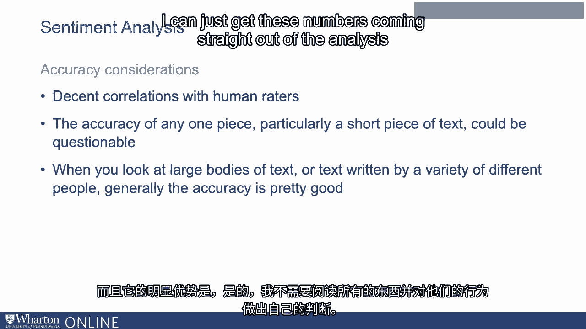
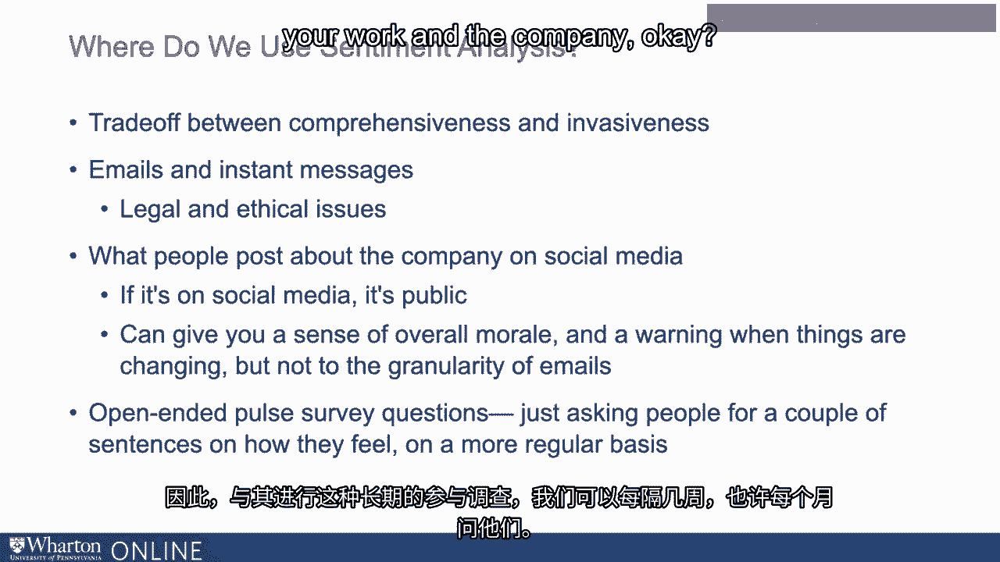

# P74：11_AI与员工参与度.zh_en - GPT中英字幕课程资源 - BV1Ju4y157dK

公司非常关注员工的参与度，因为他们认为参与度更高的员工更有可能。

更有动力，努力工作，表现更好，他们更有可能站稳。所以这一直是公司非常关注管理的一个方面，因此。尝试去测量。因此，我指出了组织过去实现这一目标的关键方式。使用年度调查。还有其他方法可以做到这一点吗？是的。这是人们开始探索使用机器学习的领域之一。这个是如何工作的呢？好吧，为了理解这些算法是如何运作的。我实际上认为，思考我们可能如何做到这一点是相当有用的。假设你是一名经理，你想要评估每位下属的参与度。

不用进行调查。基本上只需在心情好的时候或心情不好的时候弄清楚谁是兴奋的。你会怎么做？你要做的第一件事，也是最明显的，就是在他们说话时倾听。在说话。他们是否抱怨很多？他们是否在说工作很有趣，而且对此感到满意？

还是说他们有点更内向，因为他们谈论的大部分内容是关于这个。他们工作的缺点是什么？仅仅通过追踪这些，这可能是你尝试了解的第一种方式。人们参与其中。结果发现，这些事情是机器学习非常擅长的。所以我想讨论的关于跟踪参与度的内容是使用**机器学习**。

以系统的方式，研究员工所说的内容，讨论两种方法。第一个是情感分析，第二个是主题建模。那么让我们从情感分析开始。情感分析的基本原理是处理文本。任何文本并尝试分析该文本的情感内容。是在讨论人们快乐的文字吗？是讨论人们多愁善感的文字吗？

所以再次强调，在考虑计算机之前，假设你需要训练一个朋友去做这个。假设你收集了一大堆员工对他们工作的描述。讨论他们对此的感受。你希望你的朋友告诉你有多少人对他们的工作感到满意，以及原因。许多的脱离。现在，假设你的朋友完全没有情商。

对吧？也许他们是学术型的，对吧？所以在没有明确的指导下，他们会觉得很难做到这一点。你怎么能让一个真的没有这种情商的人去弄明白呢？

好吧，你最终可能会告诉他们只需要这样做。好的。让我们看看它们描述情感的所有词汇。一些词汇将与积极情绪有关。他们将讨论快乐或兴奋的感觉。其他词汇将是负面的。他们将谈论感到沮丧或失望。所以我们可以直接统计这些词语的数量，然后比较它们的频率。在那里，人们使用了更多快乐的词汇。你知道，他们使用了像“请”这样的词。兴奋，投入。“如果他们是美国人，可能会形容自己为**非常激动**。”

如果他们使用那些词语，那么我们可以肯定他们感到参与其中。这就是情感分析的基础。所以它的工作原理是从一个预定义的词汇表开始。因此，它有一长串我们与积极情绪相关联的所有词汇和。另一长串与负面情绪相关联的所有词汇。

因此，任何一段文本，任何你想以这种方式编码的答案。它只会经过，统计单词数量，积极情绪。负面情绪词汇的数量以及它们之间的差异。现在。你可能在想，这样做确实存在一些明显的问题。

如果有人说他们不快乐，应该如何处理这个问题？

所以通常这些算法足够复杂，你知道，比如说如果有。不是在它之前，我们要么忽略这个词，要么反转它的意义。显然，这并不完美。你可以想象可能会有一些扭曲的例子。你知道，如果我说我兴奋得不够。你知道吗，这是不是一个负面的东西呢？很难判断。所以是的。

这里可能会有一些错误。我们也可以想象，人们的表达方式是有差异的。你知道吗，如果你是英国人，说“工作很好”，其实你是非常兴奋的。如果你是美国人，并且你说“这个工作很好”，基本上意味着“还不错”。没关系。而且有点随意。你知道，不仅能看到这些国家之间的差异，而且显然，人与人之间也有。

有些人是不同的。有些人总是充满活力并且说，你知道。能够对那些人进行控制是困难的。因此，这也会导致不准确性。然后第三件事，结合调查，我们可以想象人们可能会采取战略性的方法。尤其是如果他们知道我们将会分析他们所说的话以进行推理。

他们的参与度有多高。问题可能不是我有多投入，而是我希望人们认为他们有多投入。我是？我说，这绝对存在问题。我是说，当你看待它时。人们基本上已经尝试验证这些类型的分析。使用这些算法对文本的情感进行编码，然后让人类评估者进行评判。

相同类型的编码。实际上，当你这样做时，你确实会看到计算机之间相当不错的相关性。说的内容以及人们所说的。你知道，我的感觉是，最终，你知道，任何一部分。特别是一段相对较短的文本，其中可能会有各种各样的错误。但是当你查看大量文本时，当你查看你知道的已经写下的内容。

在人们之间，通常通过这些方法获得的准确性真的相当不错。这显而易见的优势是，嗯，我不需要阅读所有内容并进行整理。自己对他们所做事情的判断。我可以直接从计算机的分析中获取这些数据。

情感分析只是一种工具。它是一种对文本进行情感编码的方法。我们想问自己的显而易见的问题是，我们是否计划用这个来理解。我们的员工有多投入，我们将使用什么文本？

这可能是他们写的任何东西，但我们该去哪里找呢？

在考虑在哪里使用情感分析时，我认为这是一种权衡。在雇主方面，权衡**全面性**和**侵入感**之间。所以，是的。如果我真的想知道人们是否兴奋，可能最好的办法。我能查看的是他们的电子邮件和即时消息，对吧？我的意思是。

近年来，在组织内部，我们的交流量巨大。以电子方式进行并进行调解，对吧？所以所有的数据都在这里。我们可以轻松地对人们所写的所有内容进行情感分析，以便理解。你知道的，*他们感觉有多兴奋*？这在日常生活中是如何变化的？

哪些群体表现出更多的参与？哪些群体表现出较少的参与？

你确实可以看到一些工具，例如，用于查看Slack消息的工具。深入研究这些分析。我们应该这样做吗？接下来。我是说，当然，我认为。从法律角度来看，在美国，我们是没问题的。我认为对电子邮件没有隐私的期望。人们在工作中处理的其他事务，正是在工作技术上。所以我们应该没问题。伦理上来说。

我认为在某些组织中，他们不会对此感到困扰。在其他组织中。人们可能会将其视为对隐私的重大侵犯。确实，我认为如此。一旦你开始深入了解人们在这个层面上所写的内容。确保人们理解你对他们数据的处理方式。并确保人们对此感到舒适，我认为保持他们的**信任**是很重要的。所以你可以这样做，无论你是否应该，可能是特定于组织的。我们还可以用它来做其他事情。因此，你也可以用它来思考人们在社交媒体上发布的关于公司的内容。媒体。现在，我认为这更公平，对吧？我的意思是，如果它在社交媒体上，从定义上来说。

这是公开的。因此，查看人们对公司的帖子可以给你一个不错的感觉。整体士气。显然，你获得的信息变少了。我们没有能够跨不同邮箱查看的那种细粒度。在群体和时间的交叉中。我们只是数据较少。但这是一件值得关注的事情。

另一个人们常用这个的地方实际上就是询问别人你感觉怎么样。关于你的工作。因此，与其进行这种长期的参与调查。我们可以每隔几周，甚至每个月问问人们，但你知道，有些作家。关于你对工作和公司的感受，写几句话。

好的，这段开放文本对他们来说更简单。它为我们提供了更丰富的信息。我们可以做的第一件事就是对所有内容进行快速编码。所以，你知道。我们在这里看到的整体满意度如何？这段文字有一个不错的地方。它不仅适用于情感分析，但询问人们他们的感受。

这也给了我们更多的杠杆作用去尝试弄清楚，他们为什么会有这样的感觉。我会说。这其中有哪些主题？缺点是现在我们可能会有成千上万的这些句子。我们试图从中提取那些主题。因此，这是我想讨论的第二个工具的一个伟大任务。这就是主题建模。 [BLANK_AUDIO]。

