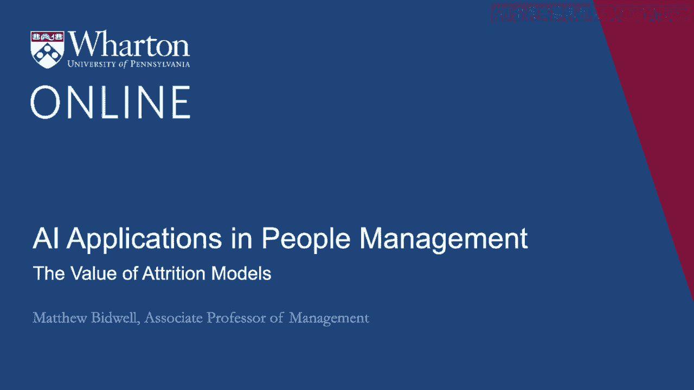
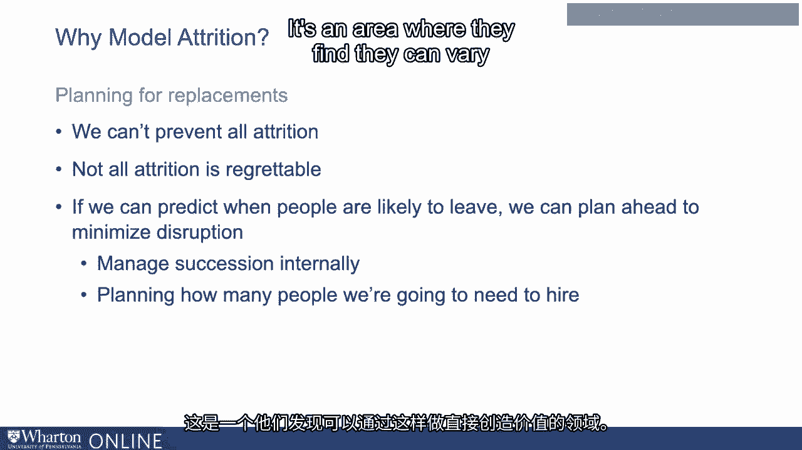

# P78：15_流失模型的价值.zh_en - GPT中英字幕课程资源 - BV1Ju4y157dK

所以我们可以利用大量有趣的数据来构建这些流失模型。

可能花几分钟时间聊聊，这也是值得的。

你构建了一个复杂的流失模型。你会怎么处理它？这值得付出努力吗？是的，我是这么认为的。

我认为许多组织都做过这一点，他们将其视为机器学习在人员管理领域中最有价值的应用之一。

为什么？这让他们能够做三件事。

首先是对影响员工流失的因素提供更多的洞察。

当我们更了解那些真正预测离职的因素与那些不预测的因素时。

我们可以开始了解我们能做的一些事情。所以，例如。

我认为一些采用这些方法的组织发现，这确实让他们开始关注员工在入职初期的体验。

有一个组织进行了一些分析，发现经理在新下属的第一周是否安排了一对一会议，是预测该员工是否会留下的一个相当强的指标。

显然，那些没有安排一对一会议的经理，导致员工最终离职。

来自另一个组织的第二个类似见解。

他们发现，当某人的新团队派人来接他们参加新员工培训时。

当新雇员被期望自行找到团队时，聘用他们的留任可能性更低。

这到底有多少是关于那些活动的，多少是对团队欢迎程度的一种更广泛的信号。

无论如何，强烈建议组织认真考虑他们如何引导新员工。

他们在早期阶段所做的事情，对员工流失是很重要的。

请问您希望我在翻译中关注哪些具体方面？

如果我们更多地了解谁是潜逃风险者，那么我们就能更清楚地知道我们真正需要关注谁，以确保他们留在这里。

这里的想法是我们的模型告诉我们人们是否有离开的风险。

其实很多人已经下定决心要去。

所以我们可能能够说服他们留下来。特别是如果我们标记了某个人。

我们看到的这个人有着高于平均水平的流失概率。

如果有一个经理，我们会关注这一点，然后说，“我不想失去这个人。”

失去这个人将会很昂贵。“这是采取行动的好时机。”

很多组织讨论进行留职访谈。

我之前提到的想法是，当人们常常离开时。

我们进行离职面谈，以了解他们离开的原因。

留任面谈的想法是，我们提前进行，以了解让那个人留任需要什么。

理解他们的需求，理解他们对组织的感受。

我们可以做些什么来让它对他们更有吸引力，通常是有效的。比如，IBM。

使用了一种营养模型，并结合了真正接触管理者的程序。

让他们主动与人合作以留住人才。

他们声称通过这样做节省了超过**3亿**美元。

基于飞行风险模型的这些主动干预措施可能是有效的。

你可以做的第三件事显然是为替换进行规划。

我们无法阻止所有的流失。老实说，目前还不清楚我们是否想要阻止所有的流失。

大多数人员流失对组织是不利的，但有些人会对某些离开的人表示。

“是的，这不一定令人遗憾。我对那个人离开并没有意见。”

我可能可以接受他们离开，但这仍然会造成干扰。

如果我们能更多地了解人们何时可能离开，我们就可以开始提前规划。因此。

当我们开始思考如何在内部管理成功，甚至规划将要雇佣多少人的问题时。

能够理解不同人离开的可能性是什么。

我们预计离开的人员数量也可以帮助我们制定 staffing 计划。

帮助我们弄清楚需要引入多少人，并减少在人员流失时可能出现的一些空缺。

很多组织正在研究员工流失的机器学习模型。

这也是他们发现通过这样做可以直接创造价值的领域。

[沉默]。

