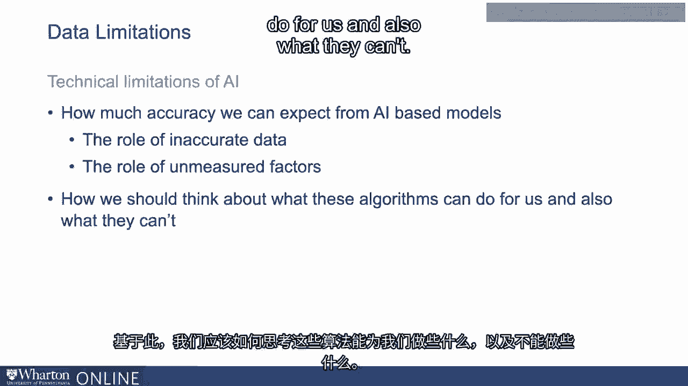
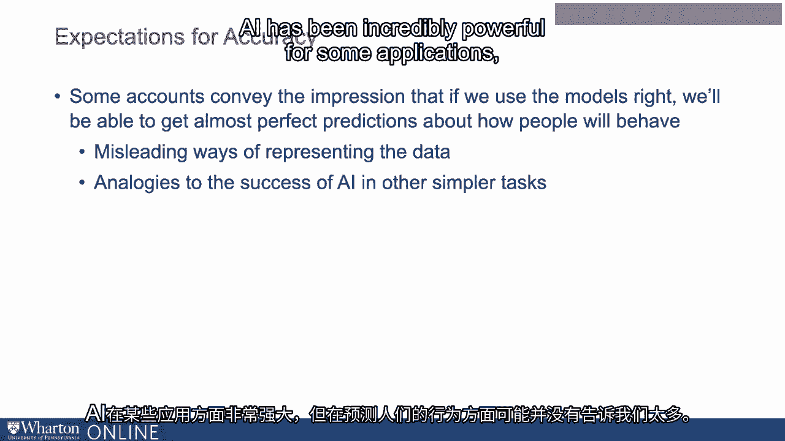
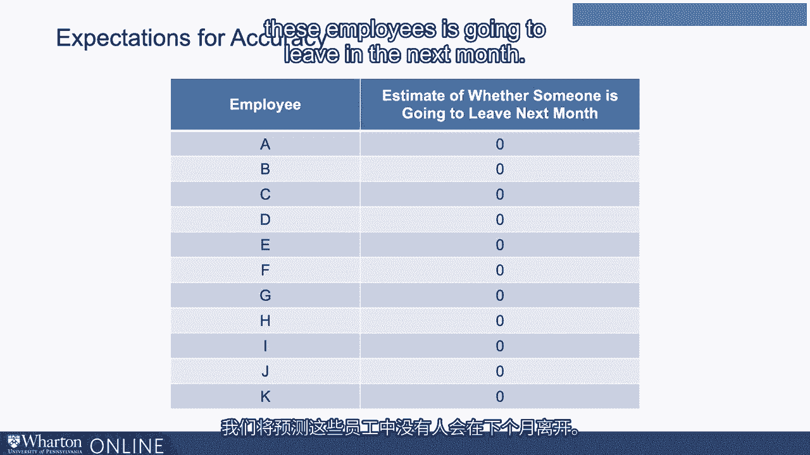
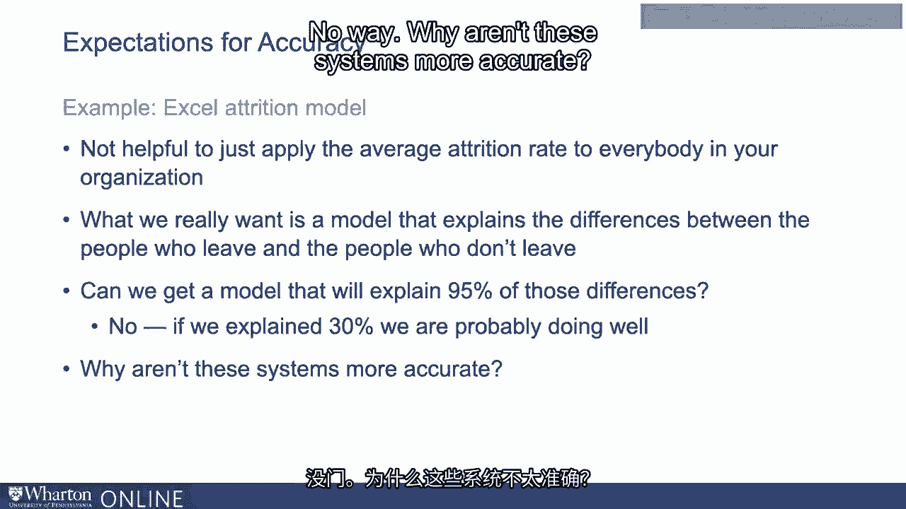

# P83：20_数据局限性.zh_en - GPT中英字幕课程资源 - BV1Ju4y157dK

我们在这些视频中试图传达的是人工智能机器学习的真实潜力。

改善我们管理人员的方式。与此同时。

我们可以使用这些模型的程度存在许多重要限制。

我现在想重点关注一些技术限制。好的，具体来说。

我想谈谈我们从这些模型中真正可以期待多大的准确性。

模型及其问题，特别是数据不准确的角色，尤其是。

未测量因素的角色。基于此，我们应如何思考这些算法能为我们做什么。

他们无法做到的。

让我们先谈谈我们真的可以期待多大的准确性。

所以当你听到一些人谈论机器学习时，他们会给你一种印象：如果。

如果我们正确使用这些模型，我们将能够几乎完美地预测人们的行为。

人们会如何行为。这仅仅是有正确算法的问题。这并不完全正确。

我认为很多这种印象来源于两个方面。

我认为一种最终颇具误导性的数据表现方式。

我认为这也有点类似于人工智能在其他任务中的成功。

所以人工智能在某些应用中非常强大。

但以某种方式，也许并不能告诉我们它在管理方面的成功程度。

尤其是预测人类行为。让我谈谈每一个方面。

当我们描述算法的准确性时，实际上有多种方式。

我们可以做到这一点。而这些角色中，描述算法的一些方式最具误导性。

或更糟，深具误导性。我最喜欢的例子是，你常常会听到人们告诉你有流失率。

模型对谁将离开和谁不会离开的预测准确率为90%。

或95%的准确性。当你听到这个，你会想，这真了不起。

他们确实知道人们能做什么。这真有点《少数派报告》的感觉。可能并不是。

现在我想展示一下我的惊人能力。

所以我将向你提出一个模型，用于预测谁将离开。

你的组织将在下个月内完成这项工作。准确率至少为95%。

至少对大多数组织而言。实际上，我们现在将进行这项服务，不会收取额外费用。

这里是你可以用来预测谁将在下个月内离开的模型。

准确率至少为95%。所以我希望你创建一个Excel电子表格。

在每一行写下你所有员工的名字。

我想要第二列，并希望在那一列中，每个单元格都会有。

是对这个人下个月是否会离职的估计。

我希望你在那一列的每个单元格中填入零。

所以我们预测这些员工下个月都不会离职。

只要下个月你员工的离职率低于5%，大多数情况下相当准确。

组织，只要离职率低于5%。下个月。

那么这个模型至少会有95%的准确率，对吧？

因为我们几乎预测所有员工都不会离职，而他们确实没有。

没有离职的人。好吧，太好了。我们有一个95%准确的模型。它有用吗？不，不，它没有。

你不想做的就是把平均离职率应用到所有人身上。

通过这样做，组织意识到大多数人下个月不会离职。

这没有帮助，对吧？我们真正想要的是一个能够解释人们之间差异的模型。

离职的人和不离职的人。现在，我们能否得到一个模型来解释95%的差异？

对吧？那些在下个月离职的人的概率将接近。

离职的概率接近零，而那些留下的人将更接近于一。

我们能把这些差异接近95%吗？不，坦率地说。

我会说，如果我们能解释30%的人之间的差异。

留下的人，我们的表现会很好。招聘也类似，对吧？

当我们考虑招聘时，实际上是我们对人们表现的预测。

将来，对吧？我们能通过我们的招聘测试解释多少人表现的差异？

大多数证据表明，候选人之间的差异在30%到50%之间。

我认为没有太多证据表明更复杂的算法会有帮助。

让我们变得更好。好的。所以我认为我们需要理解在所有这些方面获得强大结果的能力。

算法的能力是有限的。我们可以更好地解释谁会离职。

我们可以更好地解释谁会表现良好，而不仅仅是凭运气。

我们能达到95%吗？绝对不可能。那么这些系统为什么不更准确？

[BLANK_AUDIO]。

