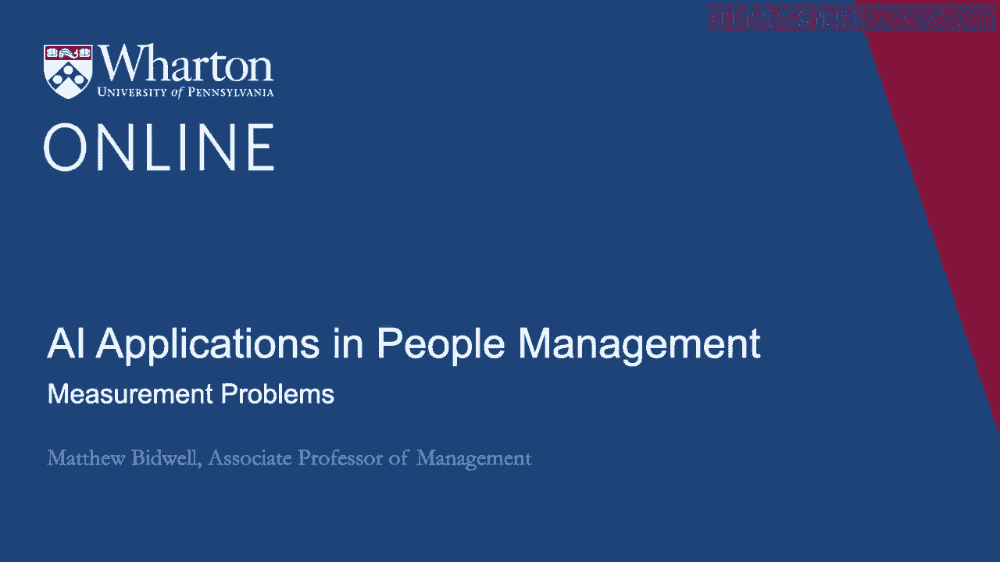
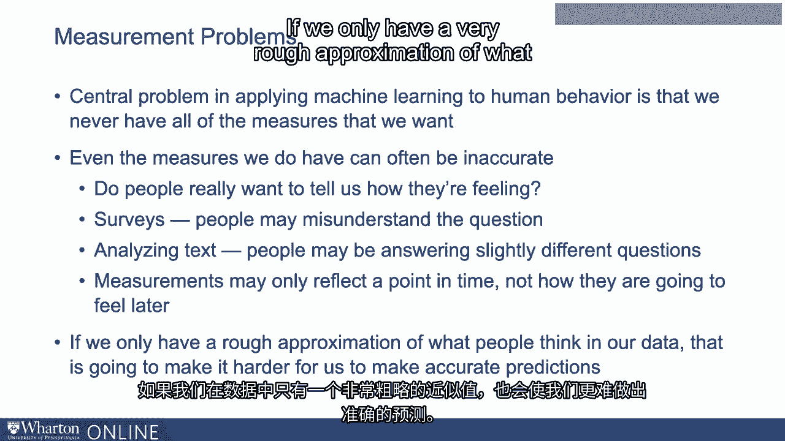
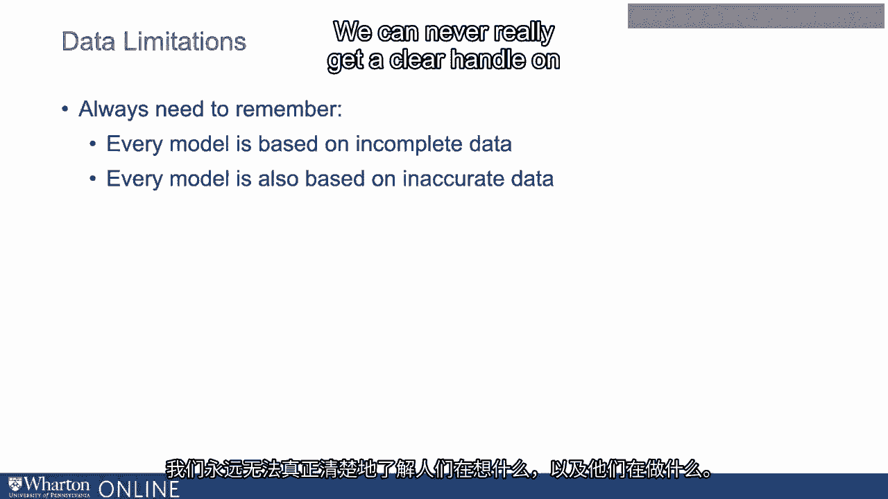

# P85：22_测量问题.zh_en - GPT中英字幕课程资源 - BV1Ju4y157dK

所以在将机器学习应用于人类行为时，一个真正的核心问题是我们从来没有。

我们没有所有我们想要的指标。但即便如此，我们还有第二个问题。这我在这些视频的过程中提到过几次。这就是我们所拥有的指标往往可能是不准确的。所以当我们试图理解人们的表现，他们将如何行为，他们会做什么。所有这些各种事情。他们在想什么，他们的态度。他们的心理状态非常重要。我在评估参与感时谈了很多这个。我试图强调的事情之一是，有很多有用的事情。我们可以做的是真正开始理解他们的参与感。但所有这些方法都有缺陷。

所以我们谈了很多， people真的想告诉我们他们的感受吗？

因此，人们可能非常有策略性。还有其他事情。如果你考虑调查，当我们调查人们时，他们可能会误解问题。如果你谈论分析文本，人们可能会回答稍微不同的问题。这可能会影响他们所描述的情感。当我们试图研究人们的态度时还有其他问题。我们真正想知道的是相对稳定的态度。当他们在普通日子里进来时。他们对工作的感受如何？但每当我们衡量它时，我们都是在某一时刻进行测量。这可能无法反映他们明天的感受。

每当你做调查时也会有问题，有些人会以不同的方式填写。方法。有些人喜欢填写极端值。一切都是一。这是糟糕的或七分，这是伟大的。会有更多的衡量。一切都是三或四。所以我们想要衡量的一些核心内容。我们总是用空气来测量它。我们这样做。我们在调查中遇到这些问题。我们在情感分析上遇到了这些问题。不管怎样，我们试图了解这些态度。

所以如果我们在数据中只对人们的想法有一个非常粗略的估计，这也。这将使我们更难做出准确的预测。因此使用这些模型。我们必须适度谦虚。它们可以非常有用。但我们总是必须记住，每个模型都是基于不完整的数据。有很多关于人们的事情我们希望能够衡量，但我们就是无法做到。而且它们也基于不准确的数据。因此我们所有的衡量方式都比没有要好。但我们必须记住，它们总是嘈杂的指标。

我们从来无法真正清楚地掌握人们在想什么，他们在做什么。[BLANK_AUDIO]。

