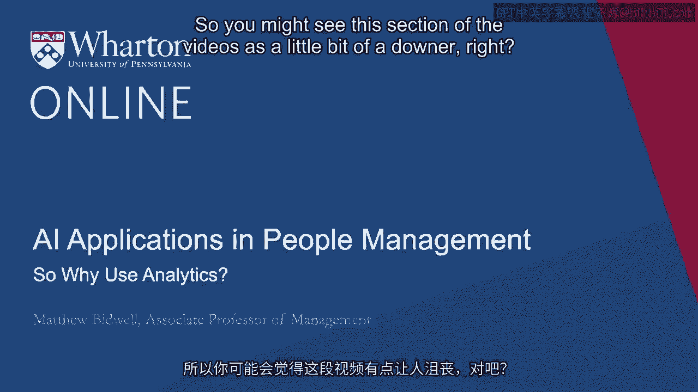
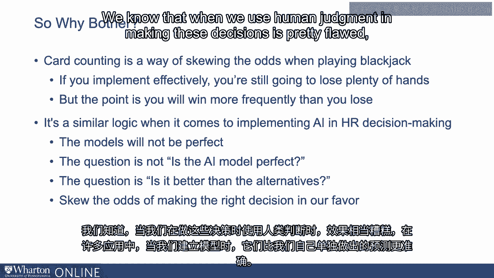
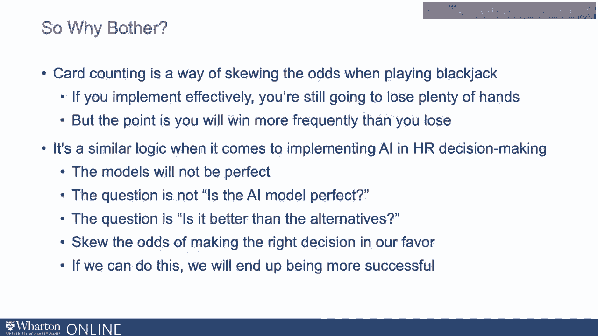

# P86：23_那么为什么使用分析.zh_en - GPT中英字幕课程资源 - BV1Ju4y157dK

所以你可能会觉得这个视频的部分有点消极。对，我在告诉你。

我们通常只能期待这些模型提供有限的准确性。

如果我们能解释30%到50%的离职或表现变化。

我们做得很好。现在，它说：“好吧，问题是。”

我们是否在浪费时间，花那么多时间思考使用人工智能和就业的问题？

但实际上，当我们这样做时，结果并不好。“我不认为我们在浪费时间。”

我最喜欢的例子来自《点球成金》。

我不知道你们中有多少人读过《点球成金》这本书或看过电影。

这对许多人力分析工作来说是一个基础文本，就像我们的。

《伊利亚特》，如果你觉得自己真的很自负。对吧。

这本书算是第一本思考我们如何应用分析的书之一。

以及各种不同的建模来理解人们。这基本上是。

这本书和电影的基础是关于一个叫做奥克兰运动家的球队。

他们正在挣扎，试图弄清楚谁是合适的人。

雇佣他们并应用分析来试图弄清楚哪些团队成员应该加入。

而不是那种通常的侦察技巧。我为什么提起这些？

电影中有个精彩的时刻，布拉德·皮特靠着椅子说：“各位绅士。”

我们现在就像是在二十一点桌上的牌计数员，我们要把赌场的赔率翻转。

说实话，当布拉德·皮特说这句话时听起来好多了。

但我认为基本观点很重要。所以，我不知道你们中有多少人对牌计数感兴趣？

你知道这有什么用。它基本上是一种在玩二十一点时扭曲赔率的方法。

这是一种经常在赌场玩的纸牌游戏。同样，当你在赌牌时。

你真正想知道的就是哪些牌。

你会得到什么牌，庄家会得到什么牌。我是说，如果你真的知道。

然后你可以完美地下注，因为你可以投入大量资金。

在你的牌比庄家的牌更好时下注，而在你的牌。

情况会变得更糟。现在，你永远无法知道这一点。

但事实证明，因为在任何时候，牌局中只有有限数量的牌在玩。

如果你知道哪些牌已经发出，哪些牌最近被使用过。

这些牌不再出现。所以这让你对剩下的牌有了感觉。

那么，未来你或庄家更可能会收到什么样的牌？

事实证明，有时当某些牌在局中更常见时。

未来的牌堆中，你更可能获胜。当其他牌在即将到来的牌堆中更常见时。

如果你知道那样，你更有可能会输。所以知道这些。

你并不知道确切会得到什么牌，但你知道。

你更有可能得到什么牌。好的。所以这可以指导你的下注，对吧？

所以如果你有效地实施牌数统计，你仍然会输掉很多手牌。

会有很多时候你下注，结果发现你的牌更糟。

比起庄家。但是重点是你会比你输的频率更高。

这是在你有利的情况下倾斜几率。如果你这样做得持续。

如果你做到成功的事情，胜率将会大幅上升。

你应该实际上预期平均赚钱而不是亏损。因此。

赌博场所通常对你实际这样做持负面态度。他们并不喜欢这个，对吧？

但重点是你并不需要对每一张牌都正确。

你只需要对哪些牌出现得更频繁比你错的次数更正确。

当涉及在HR决策中实施AI时，这个想法是相似的，对吧？

模型不会是完美的。会有一群我们期待表现良好的人。

他们表现不好。会有一群我们认为表现不佳而因此拒绝的人。

他们最终会被证明是优秀的雇佣，对吧？

但我们实际上并不需要系统是完美的。

我们只需要它们比其他选择更好。因此，再次考虑招聘时。

我们知道，如果不加干预，很多我们雇佣的人因为我们期待他们表现良好而实际上并没有。

我们必须假设一些被拒绝的人也会表现出色。

我们需要问自己的问题不是，AI模型完美吗？

我们想问自己的是，这是否比其他选择更好，对吧？

所以在所有这些应用中，我们真正想做的就是偏向。

偏向于做出正确决定的几率，好的？

我们知道，当我们在做这些决策时使用人类判断，它是相当有缺陷的。

在许多应用中，当我们构建模型时，它们的预测比我们在不干预的情况下做得更好。

当我们做出更好的预测时，是的，我们的一些决定会证明是错误的。

但它们中的较少一部分会证明是错误的，而不是我们做决定时会发生的。

这些决策是不加干预的，好的？如果我们能偏向于做出正确决定的几率。

我们最终会更加成功。这就是为什么投资于构建这些模型通常是值得的。

将它们应用于我们如何管理人员。[BLANK_AUDIO]。

