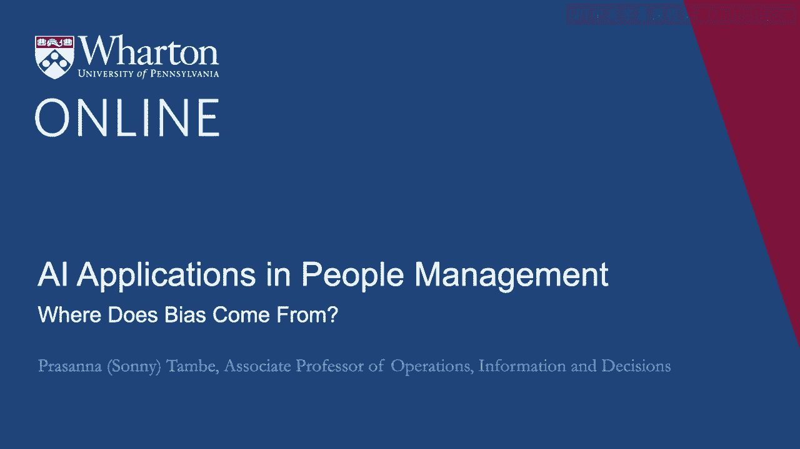
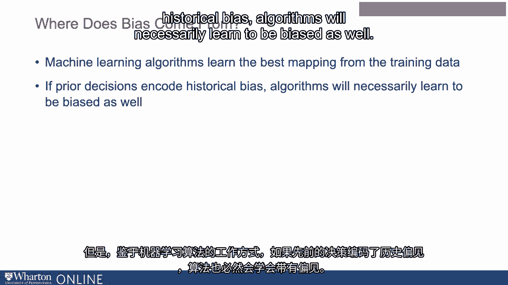
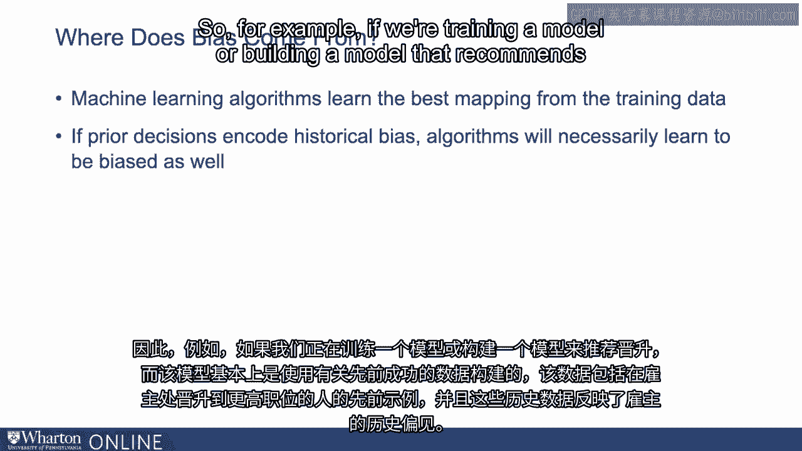
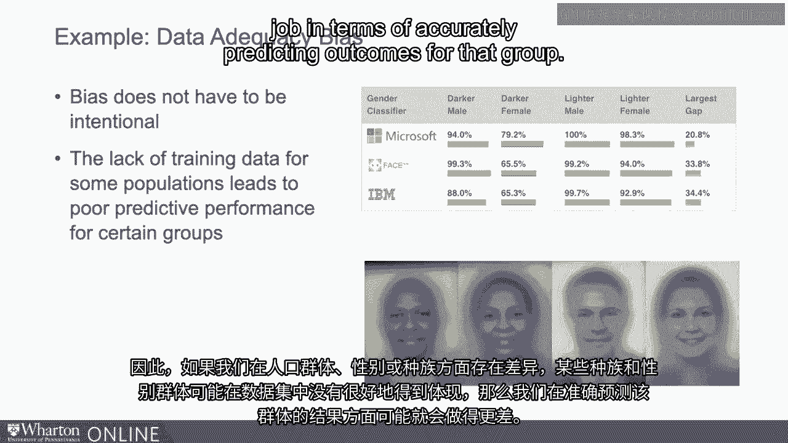
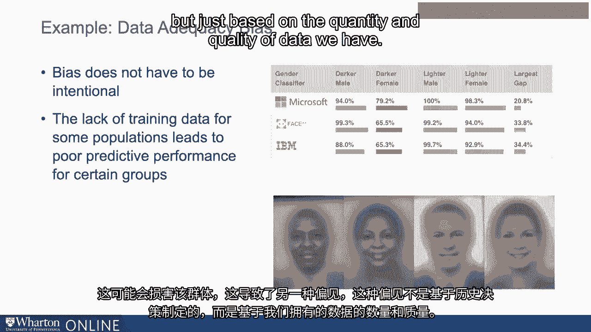
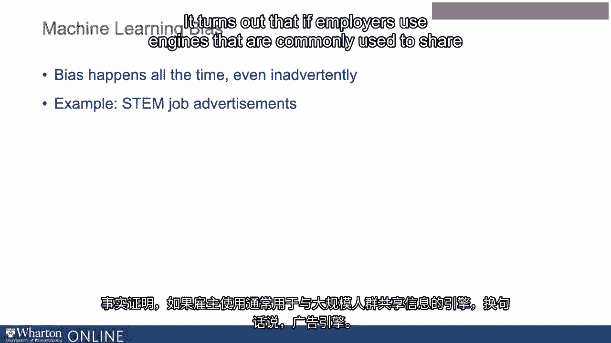

# P87：24_偏见从何而来.zh_en - GPT中英字幕课程资源 - BV1Ju4y157dK

在人力资源系统中使用人工智能带来了许多问题和挑战。

但也有许多新兴解决方案来应对一些这些挑战。

最大的问题之一是偏见问题，这可能是你听说过的。

这在媒体上非常受欢迎。它的观点是，当你将机器学习算法应用于数据时。

它们可能会产生不平等、不公平的预测或推荐，针对某些群体。

我们早先谈到过机器学习算法的观点，它们基本上。

所做的是学习你提供的例子的映射。

但这意味着，如果你提供的例子包含某种固有的偏见，如果它们。

例如，包含人类本身存在偏见的决策，机器。

随后学习模仿这种偏见。当前机器学习的一个重要焦点是学习如何识别这种偏见并。

扩展可能消除这种偏见。但考虑到机器学习算法的工作方式。

如果以往的决策编码了历史偏见，算法必然也会学习到偏见。

所以例如，如果我们正在训练一个模型或建立一个推荐晋升的模型。

而该模型基本上是使用以往成功的数据建立的，以往人们的例子。

在公司内被晋升到更高职位的人，这些历史数据反映了。

雇主的历史偏见，以及我们使用的模型，我们正在构建的模型可以。

学习识别这种偏见，这正是我们希望在行业中解决的问题。

学习如何识别并消除这些机器学习系统中的偏见。

所以偏见进入这些系统的一个方式是使用训练数据，使用。

包含历史例子的偏见，偏见本身就存在于其中。

这并不是偏见出现的唯一方式。还有一种叫做数据充分性偏见。

所以考虑使用视频数据或音频数据的访谈例子来制作。

一些关于候选人适配性的预测。结果显示，许多系统在被喂入更多数据时工作得更好。

结果显示，我们喂入这些系统的许多数据集，恰好。

对某些群体的数据比其他群体多得多。

所以如果我们在不同的人口统计群体、性别和种族之间存在差异。

性别群体在数据集中表现不佳，我们可能只会做得更差。

在准确预测该群体结果方面，这可能会对该群体造成不利影响。

这导致另一种基于历史决策的偏见。

但只是基于我们拥有的数据的数量和质量。

现在这种偏见可能会随时出现，甚至是无意中。

最近一个相当有趣的例子是在广告 STEM 职位方面。

所以科学和数学职位。最近对这些工作的关注当然在于它们的曝光。

工作机会面向男性和女性。事实证明，如果雇主使用那些常用来分享信息的引擎。

在大规模人群中，也就是说广告引擎，比如说 Facebook 引擎。

Google 引擎，这些是优化过的信息获取引擎。

需要看到这些信息的人。雇主们认为这可能是有用的。

能够将职位空缺信息输入这些引擎可能是有价值的，这样更多可能合适的人能够看到。

对于这个工作来说，人们可以看到它。这是一个非常合理的想法。

结果证明，这些引擎的优化方式影响了信息的传递。

以这样的方式进行优化，这实际上可能会无意中导致这些职位空缺不成比例地被转发。

对某些群体来说。因此，在这种情况下，雇主没有恶意。

建造这个引擎的公司没有恶意，但由于算法的运行方式。

它向男性和女性展示不同的信息，因为这是一个人力资源或工作上下文。

它开始产生对某些群体在劳动市场上的不利结果。

所以这是一个普遍存在的问题，即使人们没有明确的意图也会出现。

对他们的决策施加偏见，接下来的视频我们将开始讨论原因。

这是一个难以管理的问题。谢谢。[BLANK_AUDIO]

