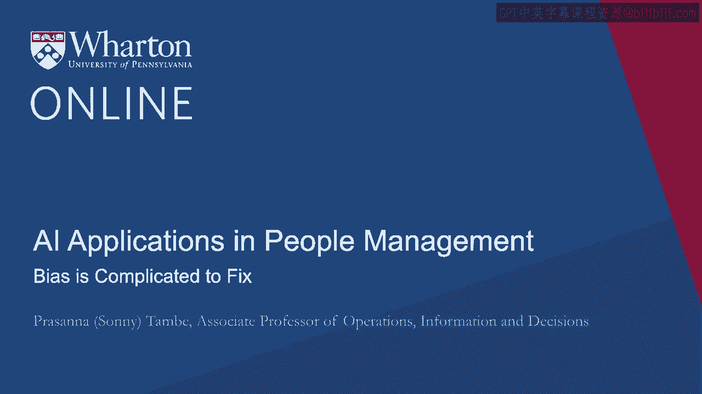
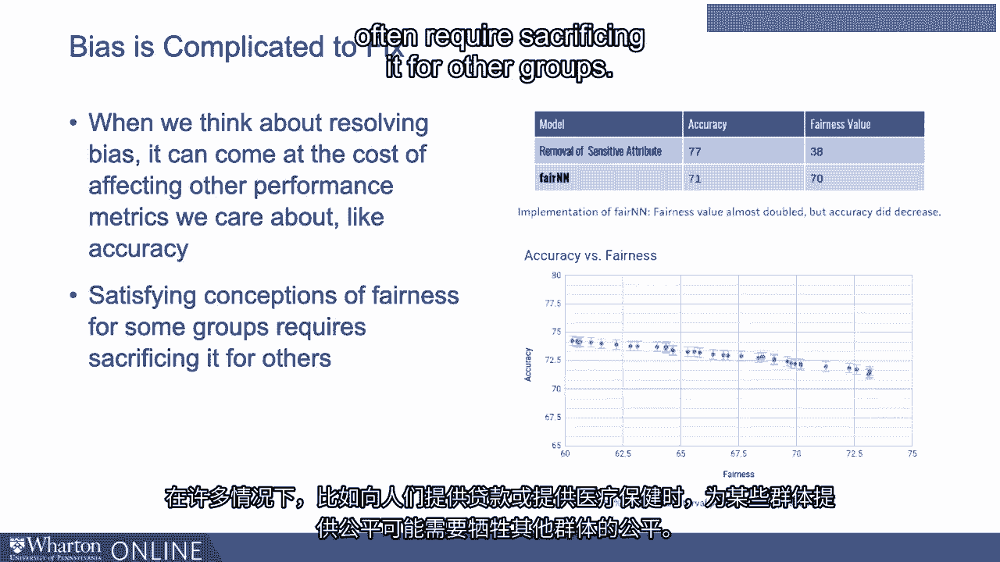
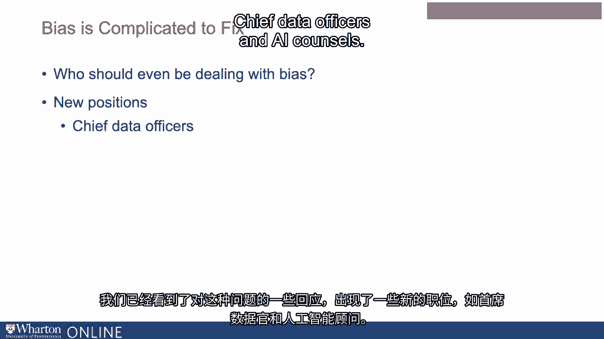

# P89：26_偏见很难修复.zh_en - GPT中英字幕课程资源 - BV1Ju4y157dK

我们讨论了偏见管理的挑战性。

修复这一问题可能相当复杂，原因多种多样。

所以即使我们知道想要修复机器学习系统中的偏见。

修复这种偏见相关问题可能很复杂。

这有许多原因。第一是存在权衡。

所以当我们考虑解决偏见时，往往会付出其他成本。

影响我们关心的其他绩效指标，如准确性。

所以在贷款等各种上下文中，比如给人们贷款，或者医疗保健。

因此，满足某些群体对公平性的认知。

通常可能需要为其他群体牺牲一些利益。

我们在许多机器学习的不同应用中看到了这一点。

许多人研究过这类权衡。当然。

理想情况是尽可能地最小化这种权衡。

因此我们可以实现构建既公平又准确的系统的双重目标。

这通常是个难事。这是人们经常遇到的一种工程权衡。

在考虑如何消除系统中的偏见时。

另一个出现的问题是获取更好的训练数据很困难。

所以我们之前谈到偏见往往会出现在系统中。

因为训练数据本身就有偏见。嗯。

有时候获得更好的训练数据并不是那么容易。

我们谈到了数据充分性偏差，意味着你实际上没有足够的数据。

有时候某些人口统计群体的训练数据不足。

解决这一问题有时并不容易。如果你在谈论某些特定类型的数据。

以更好或更具代表性的方式填充数据库并不是那么容易。

你可能服务的不同群体之间。某些组织中会出现实际问题。

这就涉及到谁应该处理偏见问题。

我们之前谈到了这一点，需要对组织有一个整体的看法。

需要做出决策，基本上要考虑多个组织优先事项。

因此我们考虑这些决定时会涉及深刻的、哲学性的权衡，道德权衡。

基于价值的权衡。甚至不清楚在组织中谁应该负责做出这些决定。

而这本身可能在思考偏见时成为瓶颈或障碍。

这对开发人员来说是个需要处理的问题吗？

这对高级管理层来说是个需要处理的问题吗？

其实应该由谁来考虑处理与偏见相关的问题？

我们看到了针对这一类型问题的多个回应。

一些新职位，如首席数据官和人工智能委员会。

这些基本上是被明确委托的职位群体。

考虑数据的任务，它在组织中的角色以及带来的问题。

但关于谁应该处理偏见的更大问题往往难以回答。

这通常成为思考我们应该从哪里以及如何开始处理的主要障碍。

在一个组织系统中存在偏见。[沉默]。

