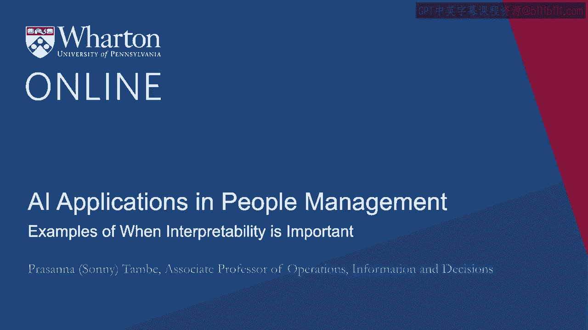
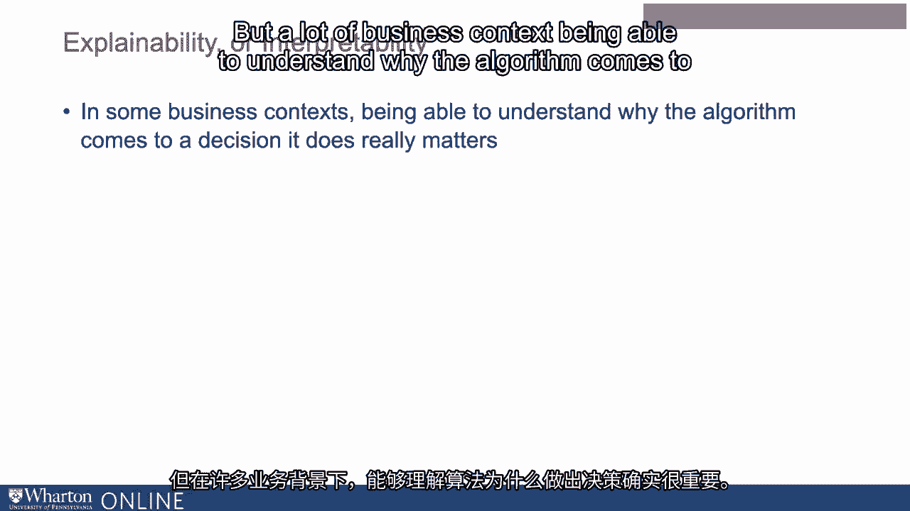
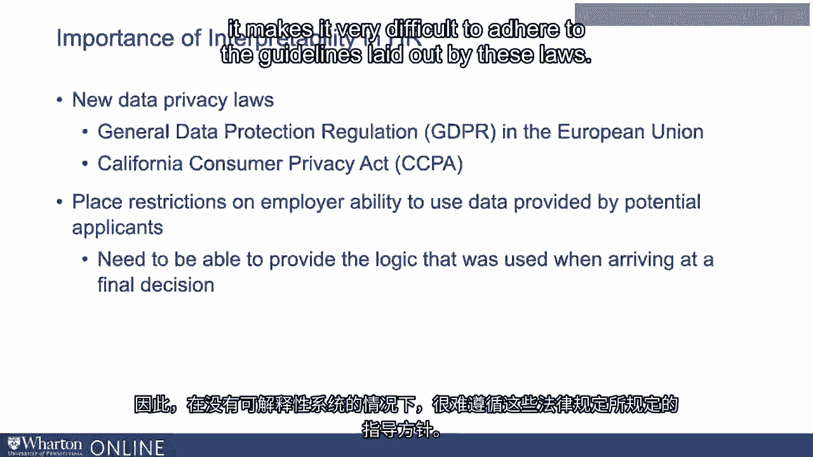
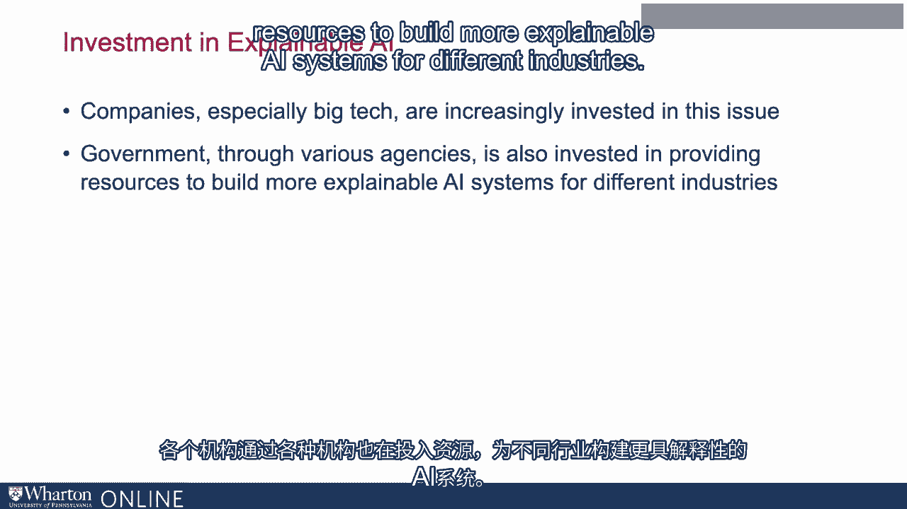

# P92：29_解释性重要的示例.zh_en - GPT中英字幕课程资源 - BV1Ju4y157dK

可解释性或解释性，有时被称为可解释性，在许多情况下都可能很重要。

在不同的背景下，有时如果你只是试图做出预测，可能没有那么重要，但是在。在许多商业环境中，能够理解算法为何做出该决策非常重要。

这确实很重要。例如，考虑一个医疗背景，其中你有一个深度学习系统。以推荐患者是否应该接受治疗。当你有一位高度专业化的医生与这种评估意见不一致时，这就不是问题。如果系统只是给出不同的结果，这通常是很容易解决的。

医生想知道你是如何得出那个决定的，以及依据是什么。这需要纳入决策流程中。因此，这就是一个可解释性非常重要的例子。事实证明，在人力资源领域，可解释性尤其重要，因为这里。人力资源领域有许多指导方针和法律保护，要求人力资源组织或。

组织的人力资源部门需要能够清晰明确地记录他们是如何做出决策的。例如，EEOC（平等就业机会委员会）有关于你雇佣的员工类型的规定。这些规定要求你能够记录你所做的各种决策。你不能简单地将数据输入深度学习系统，然后让它做出决策。

如果你所做的预测在这样的环境中不可持续。你确实希望有非常清晰的文档，说明你是如何得出某一决策的。确保你遵循与就业保护法相关的指导方针。有着悠久的历史基础。因此，这些限制使得使用不可解释的系统非常困难。如果你不能退后一步问自己，为什么会做出这个决定，或者为什么会这样。如果你无法退后一步并调整系统以便满足决策，那就会有问题。你需要满足这些指导方针，这使事情变得更加困难。这是一个可解释性重要的例子，这就是为什么人力资源尤其需要关注这个问题。

可解释性或解释性往往会产生很大的影响。另一个在HR领域产生重大影响的地方与新数据隐私有关。在许多不同领域新兴的法律。考虑一下欧洲联盟的通用数据保护条例（GDPR）。加州也有类似的CCPA法律。这些法律对雇主使用提供的数据施加了限制。潜在申请者也会受到影响。因此，当它提到一些法律规定时，当你使用自动化。决策过程中，你需要能够解释你是如何得出决策的。能够提供在做出最终决定时所使用的逻辑。

因此，在缺乏可解释的系统时，遵守标准变得非常困难。

这些法律规定的指导方针。因此，说明性在考虑人力资源技术采用时是一个关键问题。幸运的是，很多资源正在投入到这个问题上。很多公司，尤其是大型科技公司，越来越重视这个问题。有许多新工具正在出现，提供更可解释的人工智能支持。

政府通过各个机构也在投入资源以建立更多的。不同产业的可解释人工智能系统。

在下一个视频中，我们将讨论一些挑战和权衡。在使系统更加可解释时出现的问题。[BLANK_AUDIO]。

