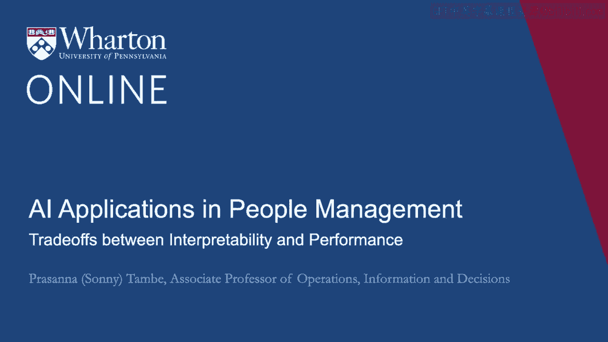
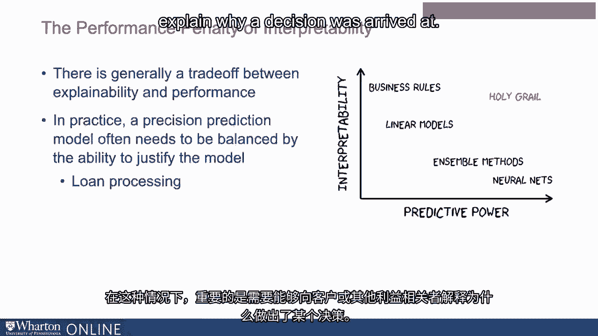
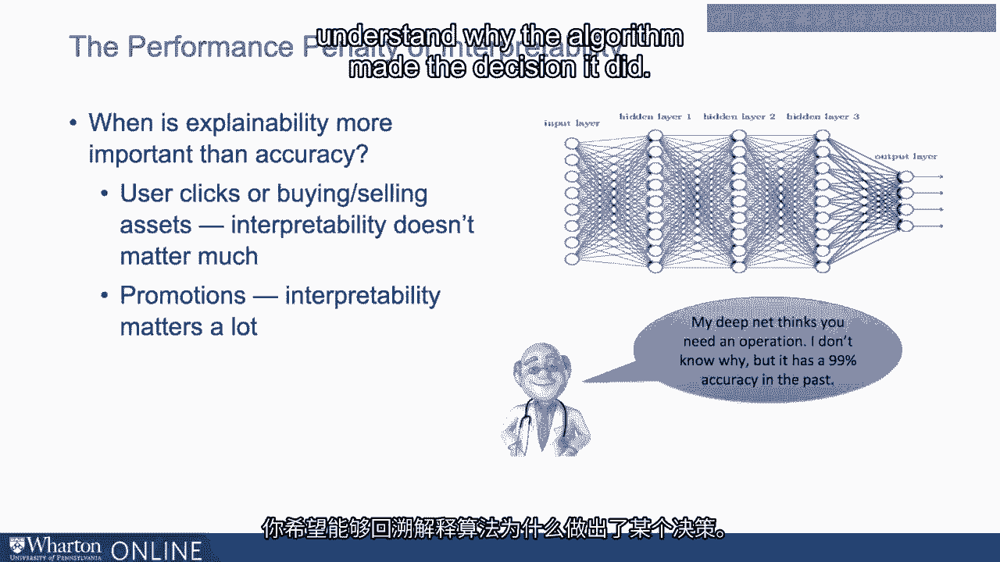

# P93：30_解释性与性能之间的权衡.zh_en - GPT中英字幕课程资源 - BV1Ju4y157dK

我们已经讨论过可解释性对多种类型的重要性。

在商业背景中。我们希望能够理解算法得出某个决策的原因。那么，为什么我们不总是让算法可解释呢？结果证明存在权衡。通常在可解释性和性能之间存在权衡。所以，就像公平或偏见一样，有时当你想让一个算法。更可解释的模型会以性能为代价。实际上存在这种情况。你几乎可以把这些视为一个光谱，具有不同的机器。常用的学习模型，越可解释的模型，预测能力越低。他们的预测能力有多强。有些预测性较低的模型，有时反而是最容易解释的。

那些非常高、非常预测性的深度学习模型，神经网络模型。通常很难解释。当然，我们希望找到实现两者的方法。我们希望找到一种方法，在可解释性和预测之间找到最佳平衡。但这当然是很难做到的。因此在实践中。精确的预测模型通常需要平衡模型的可辩护能力。组织通常试图在拥有一个高预测性和高度可解释的模型之间找到平衡。预测模型，但也能够回过头去为其辩护，比如说。贷款处理或类似的事情。或者重要的是能够回头去解释，比如说。

客户或其他利益相关者需要解释为什么做出这个决定。

不过，这确实提出了一个困难的问题，因为这两者都涉及很多上下文。可解释性非常重要，准确性也是如此。再次回到医疗背景。很难简单地说这两者都很重要。你希望能够向医疗保健中所有不同的利益相关者解释决策。以及患者。但是，当然也是这样。当你希望得到非常准确的预测时。你正在处理影响人们健康的事情。所以很难说。这不是一个简单的问题，关于如何使这些模型可解释。

这取决于组织背景或商业背景的权衡。一些应用程序。如果你在考虑预测用户点击或买卖金融资产。如果你能够回头去解释决策，那就没那么重要。你对人的影响并不一样，因此你是否能够解释就没那么重要。能够回过头去解释算法为何做出预测决策。在这种情况下，你可能希望使用高度预测性的模型。它不需要可解释。对于员工晋升这样的事情，准确预测确实很重要。你希望能够回过头来理解算法为何做出这样的决策。

因此，对于这种类型的应用，组织可能会努力在可解释性和其他因素之间取得平衡。模型和一个能够做出良好预测决策的模型。[BLANK_AUDIO]。

