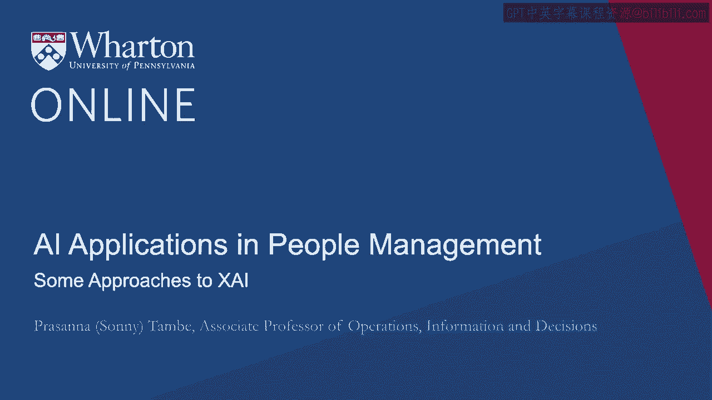
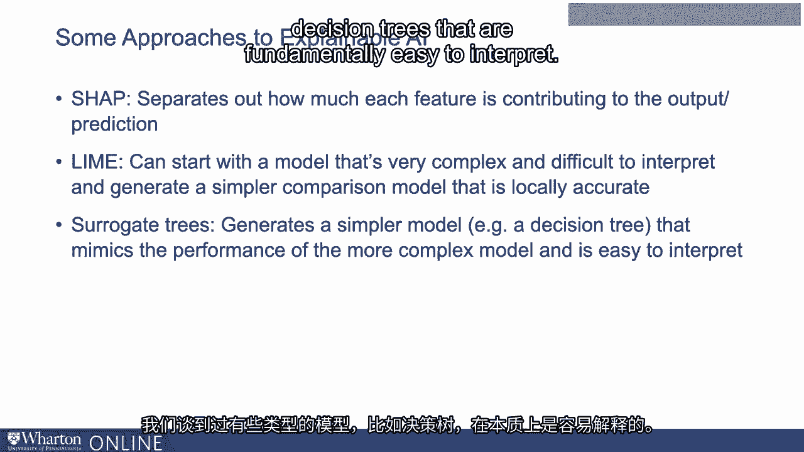
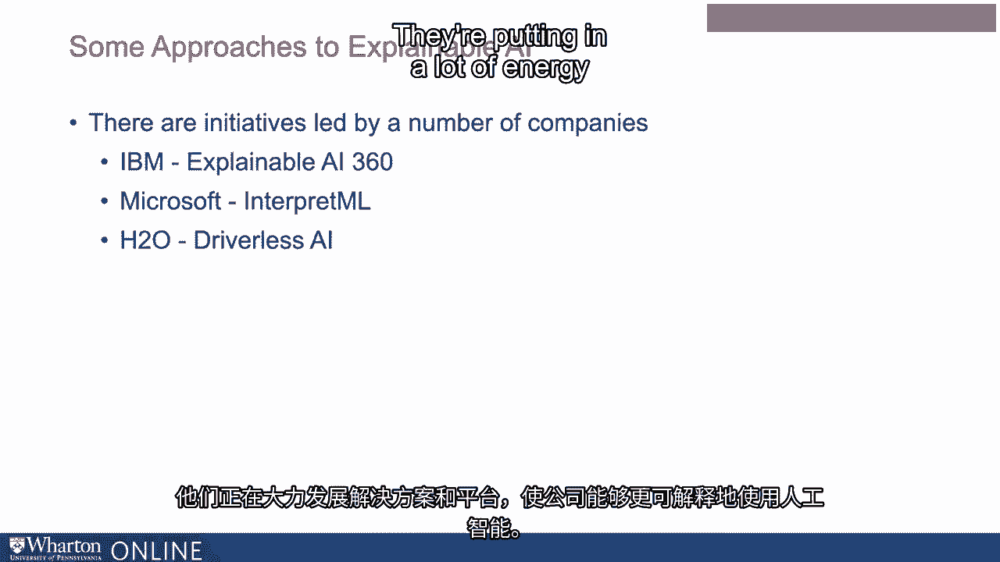

# P94：31_一些可解释AI的方法.zh_en - GPT中英字幕课程资源 - BV1Ju4y157dK

我们谈到可解释AI在某些商业背景下非常重要，人力资源是其中之一。

其中之一，同样公司和政府都在投入资源进行开发。更加可解释的方法。所以让我们谈谈其中的一些。只是让你了解人们如何思考这些问题中的一些。所以我们将讨论几个。其中之一被称为SHAP。这个方法的作用是观察不同的信息片段。输入预测模型的信息，这些不同的特征正在被使用。用于进行预测。输出将告诉你每个特征对预测的贡献。预测。所以想象一下，你对一个申请者或员工有一堆信息。

在公司试图对那位员工做出决策时，它会做出决定。然后它可以告诉你每个信息片段的影响。访问对于最终做出的决策至关重要。另一个叫做LIME的例子。这个基本上是从一个非常。复杂且非常难以解释或说明。但它可以生成一个更简单的比较，这对于看起来相似的人是准确的。针对相关的候选人。因此，这种类型的方法可能会说。它可能是一个非常复杂的整体模型。

在所有被使用的人中并不是可解释的。但它可能会说，如果我将员工X与实际上非常相似的员工Y进行比较。但在这一点上有所不同，那么我们可以创建一个更简单的解释来进行说明。这两者之间的差异导致了对一个人和另一个人的决策。

所以它创建了一个在局部准确的更简单模型，即使整个模型，即全局模型。模型相对难以解释。另一种使用替代树的方法。这种方法生成一个更简单的模型来模拟。更复杂模型的表现，但易于解释。我们谈到了一些模型类型，如决策树，它们是。从根本上易于解释。

所以替代树方法可能会使用一个行为非常类似的更简单的模型。在大多数维度上更复杂的模型。也许不是100%，但在大多数维度上更容易解释。因此，这两者可以同时使用，以实现某些预测的好处，但也可以。一些解释的好处。然后有新的技术出现，比如自动编码器，它基本上会。数据并将其简化为一小部分特征，使模型输出更易于理解。用于解释它所使用的前向预测。这些只是一些不同的方法，公司正在投资以深入了解。

关于建立更好的技术和工具，以达到那个理想的平衡点。或者试图在拥有高度预测性的模型和其他方面之间实现那个理想的平衡点。还需要可解释性。因此，像IBM这样的公司有许多倡议。微软等公司正在投入大量精力开发解决方案和平台，使公司能够使用。

以更可解释的方式使用AI。谢谢。[BLANK_AUDIO]。

