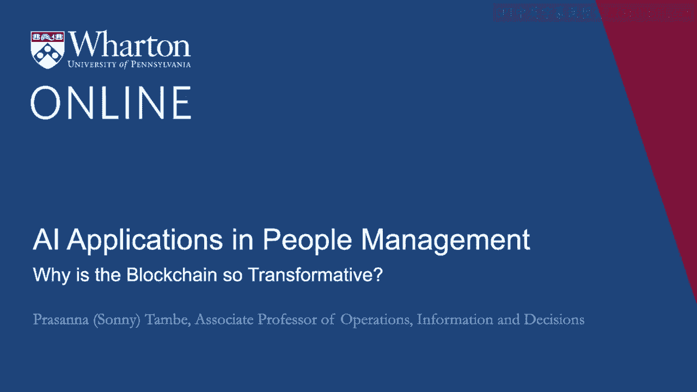
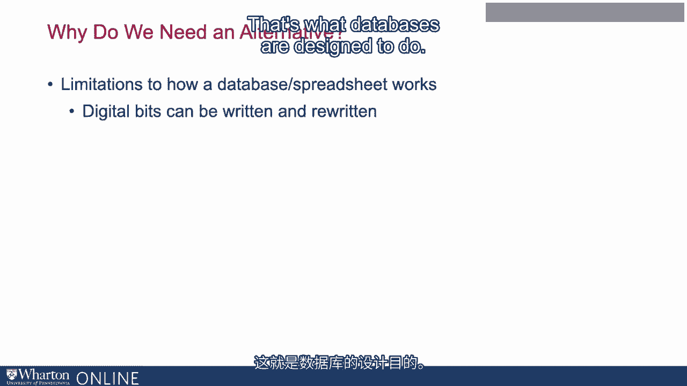
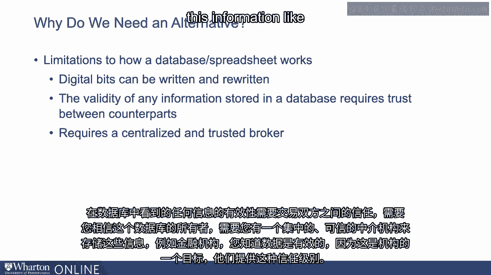
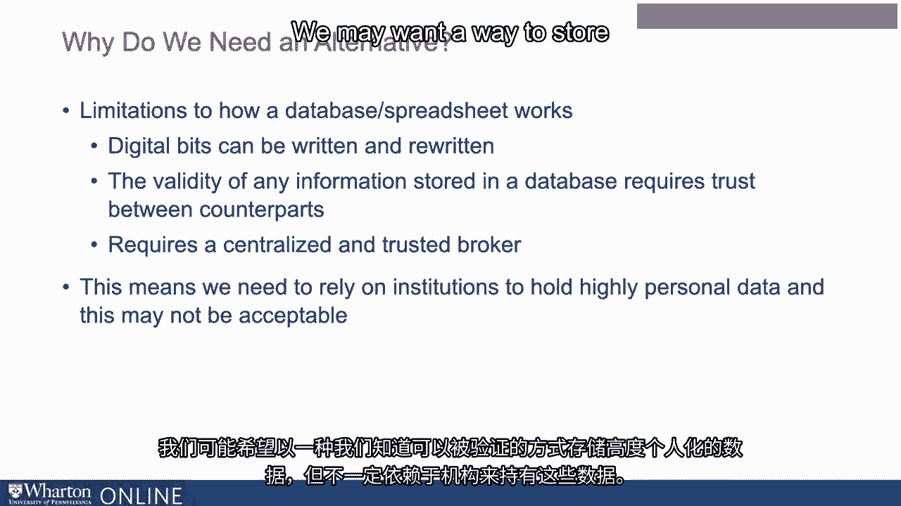
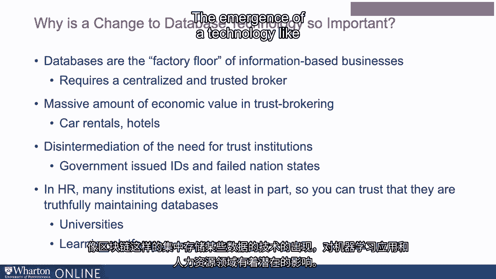

# P96：33_区块链为何如此颠覆性.zh_en - GPT中英字幕课程资源 - BV1Ju4y157dK

通常，区块链为什么是一种潜在的变革性技术？

让我们首先谈谈区块链试图解决的问题。

我们有良好的数据存储技术。数据库已经存在很长时间。

它们确实是现代信息化经济中最重要的技术之一。

我们为什么需要一个替代方案？数据库工作方式存在各种限制。

区块链开始解决的关键限制之一是数字位，当然。

数据库中的数据可以被写入和重写。当我说“限制”时，当然。

这也是一个特性。这就是数据库的设计目的。

但数据库的一个特征或功能是这些数字位可以被写入。

并且可以重写。它们可以被更改。你可以追溯并更改数据库中的信息。

你在数据库中看到的任何信息的有效性都需要交易方之间的信任。

这要求你信任数据库的拥有者。

它要求你有一个集中式的可信中介来存储这些信息。

金融机构，例如，你知道数据是有效的，因为其中之一。

机构所服务的目的之一是提供这种信任级别。

这意味着我们需要依赖这些机构来持有高度个人化的数据。

在某些情况下，这可能是不可接受的。我们可能希望以某种方式存储高度个人化的数据，确保能够验证。

但这并不一定依赖于机构来持有这些数据。

这是我们在社会上关于数据隐私讨论的中心。

这对个人和经济中的各种利益相关者意味着什么。

区块链是一种软件协议，以算法方式实现信任。

它基本上试图解决这个问题。它以算法方式实现信任，因此你不需要一个集中式机构或。

中介可以介入并说：“嘿，你可以相信这些信息，因为我说你可以信任它。”

你不需要那种级别。你不需要机构扮演那个特定的角色。

区块链可以在算法层面实现那种信任。

这意味着个人可以使用区块链来存储个人数据。

公司可以利用区块链进行人力资源分析。

不涉及任何中央第三方，数据在整个过程中都可以被信任。

我们知道，因为它在区块链中，基于区块链的设计方式，我们知道。

数据可以被信任。这实际上可能是一个重大的变革。

从某种意义上说，我们谈论的只是数据技术或数据存储方式的变化。

为什么这如此重要？好吧，再次强调，数据库在许多方面是大多数信息型企业的生产车间。

数据存储方式的改变对组织可能产生非常大的影响。

各种经济机构。例如。

在作为信任的中介中拥有巨大的经济价值。

想想汽车租赁公司或酒店。很多时候，他们的核心角色之一是成为一个你可以信任的机构。

在考虑租车或寻找住宿时，你可以信任的对象。

能够绕过在信任中扮演中心角色的一些机构，可以带来。

影响非常大。过去与这类区块链应用相关的一个例子。

政府签发的身份证件。我们考虑政府签发的身份证件。

政府基本上表示这是我们国家的公民，你可以。

我们信任我们作为政府所支持的。 这有时会带来许多问题。

例如，针对失败国家的公民。

他们在全球范围内使用身份证明非常困难。

拥有一种能够让我们信任彼此提供的数据的技术，而无需依赖。

基于集中机构的做法可能有重大影响。在人力资源方面。

存在许多机构，至少部分原因是为了让你可以信任。

他们确实在真实维护数据。例如，大学提供凭证。

他们提供学位，并提供学位的验证。

学习平台提供有关技能和证书等信息。

许多这样的机构部分存在是为了让你信任你对潜在事物的了解。

公司中的员工。

像区块链这样的技术作为集中存储某些数据的地方的出现。

数据对人力资源中的机器学习应用访问数据的方式有影响，而无需。

遇到我们可能担心的其他问题，如果存在一个集中。

提供这些数据的经纪人。这里潜在的最大好处是，我们越来越多地获取细致数据。

例如，考虑可能详细记录员工个人生产力的数据。

也许是日常任务或某人如何处理代码的一些细致数据。

检查开源代码库，非常细致的数据可能会提供丰富的信息。

关于人们的表现。这种数据是我们可能不愿意交给第三方的。

我们可能不信任第三方处理这种数据，但对人力资源来说可能有用。

所以区块链是一个潜在的中介，可以用于保存这些数据。

仍然用于机器学习应用，以一种仍然保护隐私和数据的方式。

所有权权益。 [ 静默 ]。

