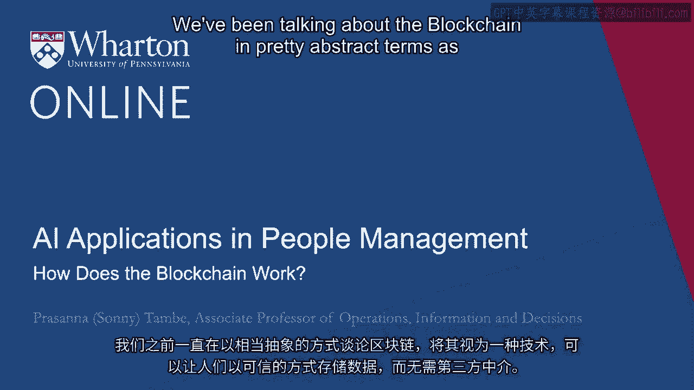
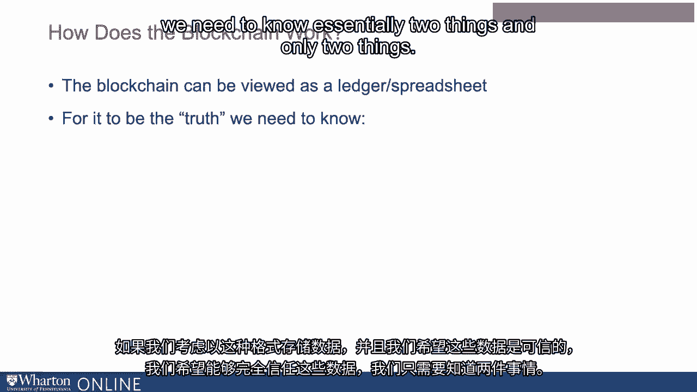
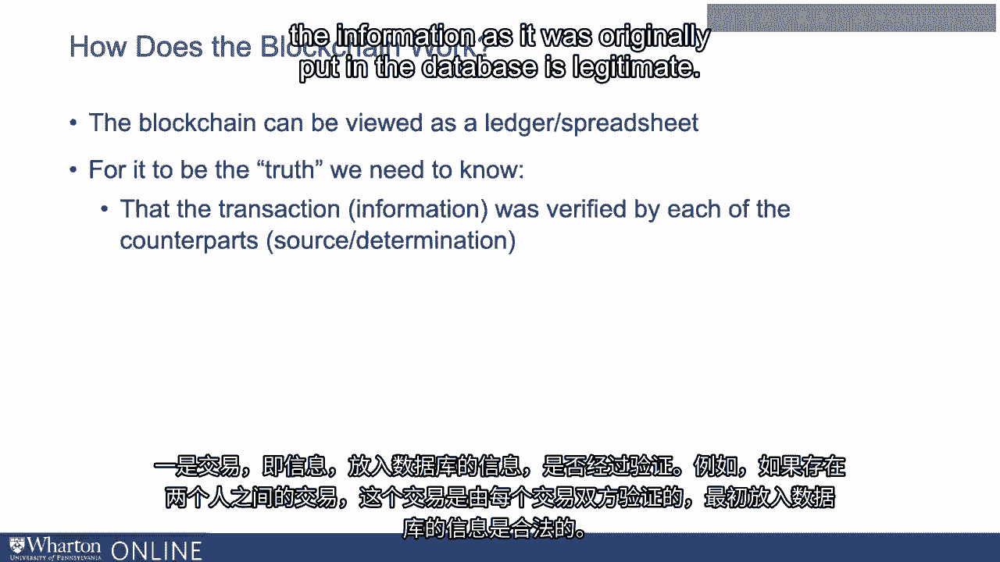
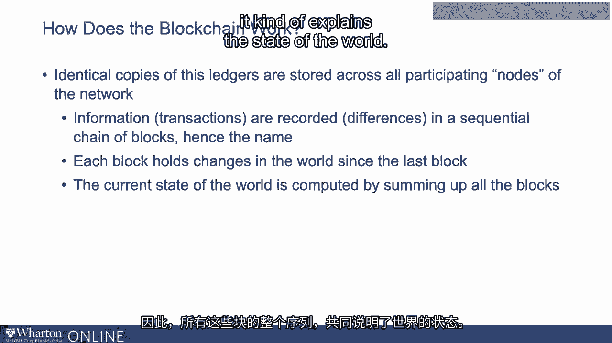
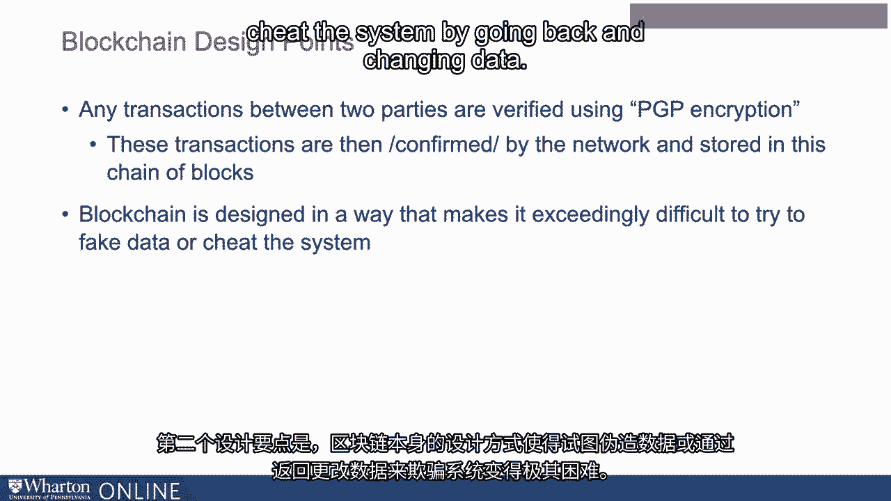
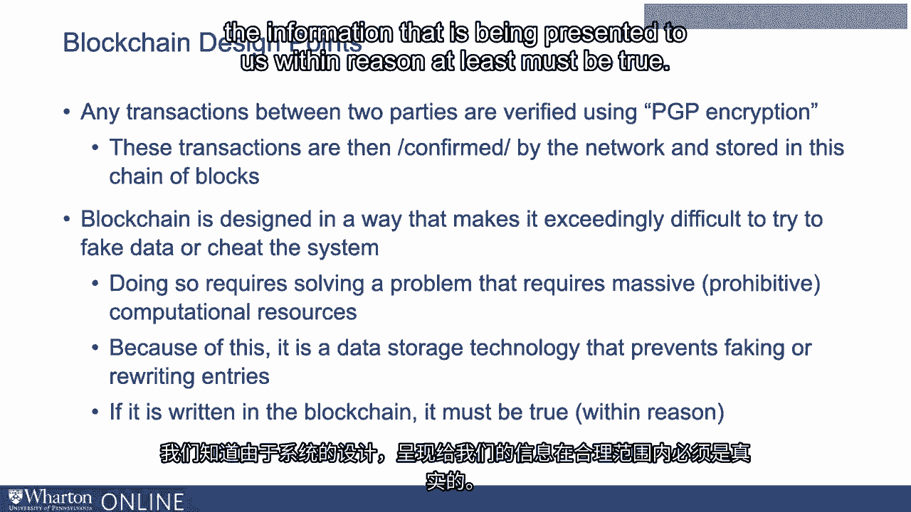

# P97：34_区块链如何工作.zh_en - GPT中英字幕课程资源 - BV1Ju4y157dK

我们一直在用相当抽象的术语讨论区块链，作为一种。

可以让人们以受信任的方式存储数据，而无需第三方中介。

从高层次来看，讨论它如何工作的内容是有用的。

让你了解区块链上实际发生的事情以及它如何提供价值。

区块链可以被视为账本或电子表格。

如果我们考虑以这种格式存储数据，并希望它是可信的。

我们希望能够完全信任数据，我们需要知道基本情况。

两件事情，仅这两件事情。

一是交易，放入数据库的信息是经过验证的。

例如，如果两个人之间有一笔交易，那么这笔交易。

是由两个参与方验证的，确保最初输入的信息。

数据库是合法的。然后第二点是它从未。

我们从未回过头来更改、更新或删除那条虚假信息。

如果我们知道这两件事，我们可以确信在区块链中看到的信息。

是正确的。所以第一个是最初的信息是有效的并经过验证，第二个是没有人。

回过头来更改那条信息。这就是区块链所实现的目标。

实际上，第一个是我们长期以来一直在进行的验证，但区块链。

第二点是区块链所实现的目标。确保。

确保我们可以确信没有人回去伪造、更新或删除数据。

所以区块链再次是账本电子表格，但与单一的稍有不同。

电子表格。它本质上是存储在整个。

网络中的这些称为节点。因此，在网络的所有参与节点上。

这些网络的信息被记录在一个顺序的区块链中，这也是它被称为区块链的原因。

每个区块都记录了自上一个区块以来世界上发生的变化。

因此，当前世界的状态是通过查看整个序列来计算的。

这些区块，而不仅仅是最后一个区块。因此，整个区块序列共同解释了世界的状态。

它有一个系统，使用网络中的一堆电子表格。

信息以区块的序列记录，所有这些共同表达了世界的状态。

我们有设计点来理解区块链如何提供价值。

一是任何交易，任何放入区块链的信息都是经过验证的。

一种加密形式。因此，假设我们使用区块链来保存关于技能的信息。

关于我在线获得的一些技能。因此，这笔交易可能是在我和提供该技能基础教育的供应商之间进行的。

因此，该交易本身是通过一种加密形式进行验证的，双方都参与其中。

意思是我自己和平台可能会说这个人具备技能，这笔交易。

然后由网络确认，并存储在区块链中。因此，这是设计的第一个要点。

所有这些交易在首次录入时都会被验证。

然后第二个设计要点是区块链本身被设计得极为。

很难伪造数据或通过回溯更改数据来欺骗系统。

因此，与数据库不同，在数据库中更改数据相对简单，而区块链的设计。

区块链的特性实际上是非常昂贵的，甚至是禁止性的昂贵。

在大多数情况下，无法返回并尝试伪造、假冒或更改过去的数据。

因此，第二个设计要点真正提供了数据验证的保障。

是真实的，并且始终保持真实。因此正因为如此。

区块链最终是一种数据存储技术，可以防止任何。

条目被修改或重写的形式。如果信息在第一时间就经过验证。

它从未被更改。因此，我们知道它必须是真实的。

我们不再需要第三方来说，嘿，这是一条有效的信息。

我们知道，正因为系统的设计，呈现的信息。

对我们来说，至少在合理范围内必须是正确的。

事实再次表明，这解决了许多问题。

因此，区块链中的信息本质上是可以信任的。

因此，它不需要第三方来持有数据。正如我们上次讨论的那样。

这可能会带来多项变化。

在不同的行业中，信任经纪人的角色是什么，以及它们所带来的价值。

在工作流程的各个不同点提供。[沉默]，[空白音频]。

