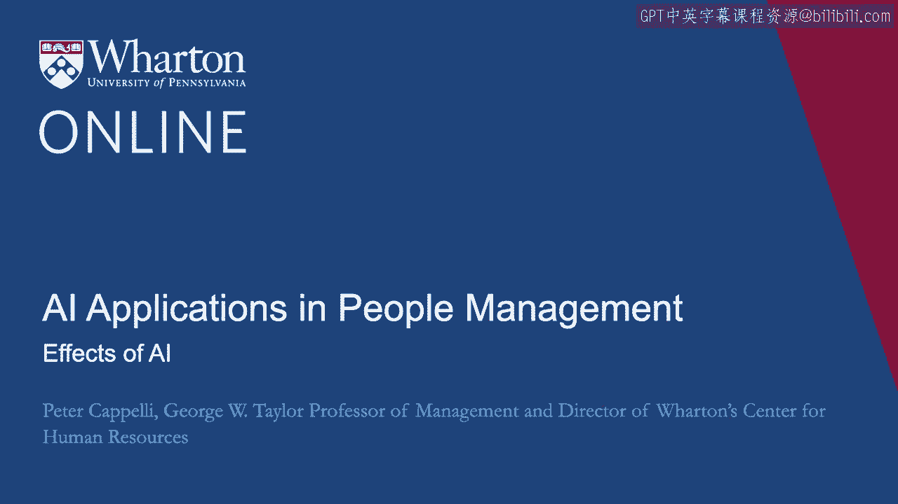
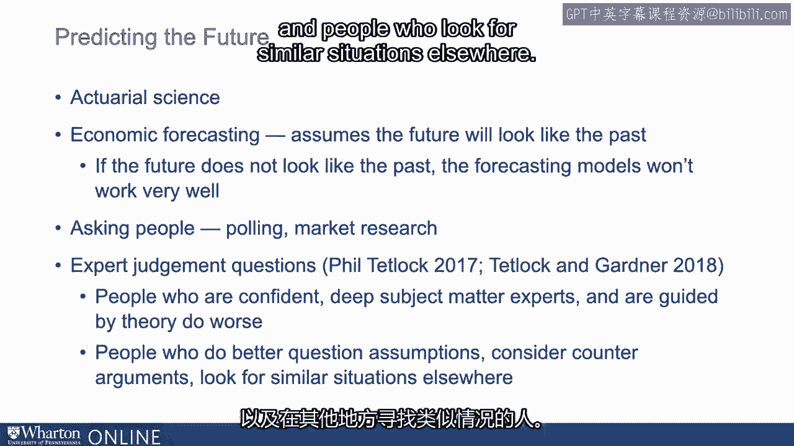
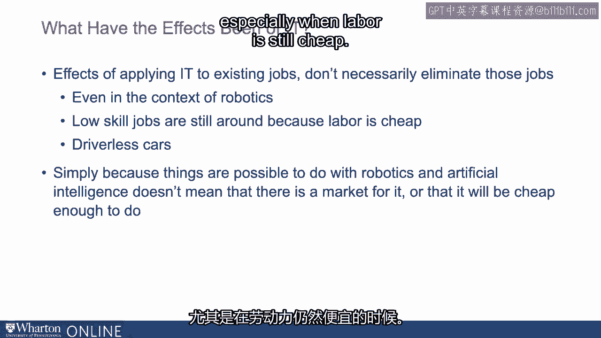
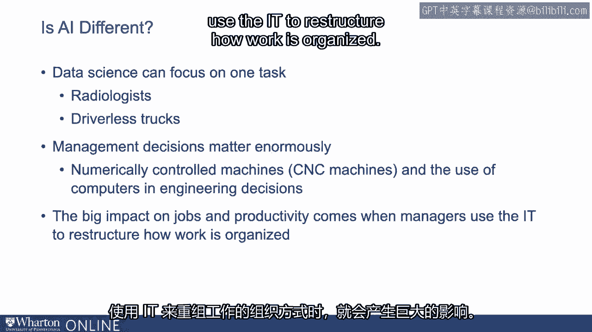

# P99：36_AI的影响.zh_en - GPT中英字幕课程资源 - BV1Ju4y157dK

在这一部分中，我们将讨论人工智能的影响，特别是社会。

层级效应。尤其是我们将讨论工作以及人们对人工智能崛起的担忧。智能将消除工作，消除这边、那边的工作等等。这些是引人注意的预测。其中一些极为戏剧化。我的意思是。我们几年前听说过，未来几年有40%的工作将会消失。

等等。最重要的一点是，至少到目前为止，所有这些预测。引人注意的预测，有些是错误的。但是，尽管如此，它们仍然引起了很多关注。所以我们想谈谈我们所知道的事情，但也要思考这些预测，因为。它们不会消失。我们将继续看到它们。

所以我们在这一部分中想做的部分是了解我们应该如何。我们思考这些预测时的想法。首先要知道的事情是，可能花几分钟时间来谈谈预测。未来。有些事情我们做得相当好。例如，精算科学。我的房子着火的可能性有多大？好吧，我们可以相当准确地估算。因为周围有足够多的房子，而且有一些房子烧毁了。而且情况相对相似，我们可以基于我房子的属性进行评估。相当准确地预测在某个特定时期内它可能会烧掉的机会。

经济预测大致上也做类似的事情。我们假设未来将与过去相似。因此我们建立了一个模型。在某种程度上，像机器学习模型，试图预测某些东西。像经济增长、国民生产总值增长，基于一系列因素。如果这个模型在过去运作得很好，那么我们将其带入未来。通过输入今天模型中的变量测量来看看这对。增长率。 当然，这些问题的关键在于，如果未来与过去不一样。预测模型的效果并不好。这是一个问题。

如果我们看一个主题的预测，而这个主题没有足够的数据来建立预测模型。模型、近期事件，例如，或者政治反应会如何。民主党人会如何应对这种情况，类似这样的事情。然后我们进入询问人们的领域，市场调研和民意调查，你知道的，询问。

试图弄清楚选举将如何进行，民意调查数据相当不错，我们如何。你会投票吗？市场调研相当不错。如果这个产品存在，你会买吗？

对吧？问题是，有时我们在询问一些更大的事件。这种情况并不常见。还有一些民意调查无法奏效的事情，对吧？

这类似于新技术的引入。这些都是专家判断的问题。我们在Worden的同事菲尔·塔特洛克研究这些已有几十年，他进行了研究。进行大规模实验。而他最近也进行了一些实验，试图理解什么样的人。哪种属性的人在专家判断方面表现良好。例如，预测。

美国会向左转吗？某个特定国家会选举出不同的议会吗？

中东会有战争的可能性吗？这种事情。这是他发现的，擅长这一点的人。首先，高度自信的人。这些深谙主题的专家，他们知道很多关于这个话题的事。而受到理论指导的人表现得更差。表现更好的人是那些质疑假设的人，那些考虑反对意见的人。争论，以及那些在其他地方寻找类似情况的人。

他们表现得更好。因此，当你关注某人或某个组织的预测时。你想做的就是开始往下看，并说。他们是否在论证中考虑了反对意见？

他们是否质疑所使用模型中内建的假设？

他们是否至少能够清晰地表达这些假设？他们是否在寻找其他地方类似的情况？

如果他们的判断相对可靠，那么可能值得倾听，如果不是的话。如果做了这些事情，按照菲尔的估计，成功的机会很大。这就像是猴子投掷飞镖，谁说这只是随机的描述。那么，预测来自哪里？关于当代社会，有一点要记住。私营部门对关注度有很大的竞争。这意味着如果你能引起注意，就会有资金支持。而资金往往也会获胜。所以如果这些是那些在向你推销东西的人做出的预测，他们有自己的利益。在特定的故事中。而让我指出一些事情。

我还没见过一份顾问报告说。未来基本上会与现在保持一致。而我从未见过有人说，你知道的。这里没什么好担心的。原因是这些不会被销售。这些信息不会引起关注，即使它们是正确的。让我给你举几个我曾经历过的工作场所的例子。一个是在2000年代初期。当时有许多组织预测即将出现劳动力短缺。当然，这种情况从未发生。这是因为他们误解了。最初他们误解了来自普查的一些人口数据。

然后其他人开始站出来说，是的，劳动力短缺即将到来。每个人都对即将到来的劳动力短缺发表了报告。当然，这种情况从未发生。而了解人口统计学的人知道这不会发生。但这并没有阻止公司制定关于如何处理的计划。这个即将到来的劳动力短缺因为大家都在谈论它。让我们谈谈另一个流行的话题。这是千禧一代及其代际差异。国家科学院在过去的夏天发布了一份报告，研究了这个问题。他们基本上得出的结论是这一切都不是真的。

没有证据表明千禧一代作为一个独特的群体甚至存在。关于他们出生前后的人。这一代故事根本没有依据。然而，它依然存在。它之所以持续存在是因为听起来很酷，听起来很有趣。听起来像是我们有点知道的事情，尽管没有证据表明这是真的。

我们拥有的所有证据表明这不是真的。就在几年前，我们非常担心无人驾驶卡车要来了。消除卡车司机。我知道有些公司已指派人力资源人员去弄清楚。他们要如何处理所有失业的卡车司机，因为技术在发展。消除卡车。预测是这将迅速发生。当然，自那以后我们没有听到任何关于它的消息。也许部分是因为其他新闻更重要，但我们在这一方面也没有看到进展。那么，让我们谈谈关于人工智能的一般预测，但先退一步。

跟随我的同事菲尔·塔特洛克一点点，看看我们从类似的情况中知道什么。在过去的几代中，我们花了很多时间研究……的影响。引入信息技术。这对工作产生了什么影响？

那么，整体经济中，这是否消除了工作？没有。经济中的工作总数继续增长。我们稍后会谈谈原因。你可能会问，那特定职业呢？当然可以看到一些这样的情况。在我有生之年中我看到的最大变化是打字员的工作消失了。但打字员的工作消失的原因并不是因为文字处理取代了打字。正是文字处理促使管理层决定即使是高管也应该自己操作。打字。因此，这是一个被软件推动的管理决策。但这将是一个关键点，最大的变化发生在技术推动管理层。

对工作组织做出不同的决策。但关于IT还有一件事需要记住，这在未来肯定会成立。IT并非专门设计用来消除工作的。在许多情况下，它的设计目的就是引入之前不存在的新功能。例如，早些时候，当你可以在线购买和订购东西时，其中一件事。你没有看到的是软件向你提供推荐。也就是说，购买这个的人也会购买那个。你考虑过获得所需工具来把这个组合起来吗？

你总是得到的那些建议在之前并不存在，也没有消除任何工作。那里的信息技术增加了功能，应用信息技术于现有工作所产生的效果并不一定。消除那些工作。这是我们需要认真思考的问题。如果我们考虑这个工作的方式，比如考虑信息技术。

更广泛地说，人工智能的作用并不是为了消除工作，即使在机器人技术的背景下。机器人似乎是为了消除工作而设计的。在组装线上，可以用机器人代替人。结果显示，这种情况并没有发生，至少在我们目前看到的研究中。如果你查看引入机器人的数量以及工作的数量。它们并没有抵消这一点。部分原因是机器人所做的事情是帮助接管一项任务。员工的工作。机器人正在组装线上提升轮胎。他们早期进行了焊接工序的消除，但这里有一个很好的故事值得记住。

这是丰田在美国超越通用汽车机器人的胜利。在1980年代，通用汽车决定尽可能消除生产。工人们在组装厂的工作很少，因为你无法信任工人及其。质量很差。他们在机器人技术上投入了巨额资金。花费430亿美元在组装厂引入机器人。丰田进入美国并接管了加州弗里蒙特的通用汽车工厂。以前制造老式汽车的工厂，现在丰田开始为通用汽车制造卡罗拉。它们被称为novos，但它们是丰田用美国工人生产的丰田卡罗拉。

使用自1970年代以来的旧设备，但采用精益生产。与此同时，通用汽车花费430亿美元来自动化其工厂。因为精益生产比通用汽车的生产更高效、更便宜且质量更高。机器人并不是总能胜过员工，即使在质量等方面也是如此。

生产力。部分原因是人们真的非常适应。即使我们考虑简单的、低技能的任务，你会想到设备和信息技术。机器人可以做这些工作，但还有很多事情是机器人可以做的，我们并没有让他们去做。而原因之一是劳动力相对便宜。我们可以让机器人清扫所有的地板，而不是清洁工。清洁工的成本仍然相对便宜，让他们来做更容易，而不是试图让。机器人要完成这项工作，因为机器人仍然相对昂贵。无人驾驶汽车也是如此。其实是否存在无人驾驶汽车的市场？这里的答案并不那么清晰。

当然，有些人会希望使用它们，但我们来看看最畅销的车辆。在美国。它们都是卡车。我们都在电视上看到过卡车广告。电视上的卡车广告都是一些强壮的家伙戴着牛仔帽驾驶卡车。在建筑工地上反弹，最后拉动一些很大的东西感兴趣吗？

假设你能制造一辆无人驾驶卡车。谁会买这辆卡车？

吸引那些卡车广告的人中，有人会对。一辆由机器人斯基皮驾驶的卡车，广告中坐在他旁边的是某人。有人一边做指甲，一边让斯基皮驾驶穿越建筑工地。买卡车的人想自己开车。买跑车的人想自己开车。我说的是无人驾驶汽车没有市场，但这并不是无限的。市场。一个大问题就是，尽管可以通过机器人和人工智能来实现某些事情。智能并不意味着有市场。

或者这是否意味着做起来会足够便宜，尤其是在劳动力仍然。相当便宜吗？

我们听到的最常见的声明之一是，人工智能是不同的。这次是不同的。问题是回到我们的同事菲尔·泰特洛克以及他对什么使事情的看法。进行良好预测的关键是每当你听到某件事是独特的声明时，应该是非常慷慨的，对吧？

这完全不同于我们以前见过的任何事情。你想质疑这一点，对吧？

我们之前提到的一个值得质疑的事情是，人工智能可能是什么。现在数据科学能够做的是专注于一个任务，对吧？

所以看看放射科医生。例如，有一些著名的研究表明放射科医生。如果你比较放射科医生对某一种特定疾病（如乳腺癌）的筛查，算法做得比放射科医生更好。他们做得并不是极其出色，但确实做得更好，明白了吗？现在。这是否会消灭放射科医生？那么你没听到的第二部分发现是放射科医生。

与算法合作时，效果甚至比单独工作更好，对吧？

第三点要记住的是，放射科医生除了阅读，还做很多其他事情。X光。他们当然也负责诊断。他们的部分决策基于屏幕所告诉他们的信息。他们所做的一部分工作也是进行放射治疗，对吧？

所以很可能他们的某些任务会被自动化，但这并不意味着。这并不意味着他们所做的一切都会自动化。例如，无人驾驶卡车，对吧？

美国大多数卡车司机是送货司机。他们的工作是开车到你家，或许一个机器人司机可以做到，但然后。他们会出来，卸下你的包裹，把它们放在台阶上，让你签名。某些事情，我们没有一个机器人能做到这些，对吧？

这里要记住的另一件事是，管理决策在信息技术方面非常重要。被定义，并引入了数据科学工具。所以让我们稍微回溯一下数控技术的引入。机器和在工程决策中使用计算机。我们有机器、技工和机器。一些工作可能会被CNC机器接管，对吧？

它们需要被编程，而我们在20年前看到它们首次引入时。雇主做出的决定是什么？我们是要雇佣工程师来编程这些机器，还是要教会他们？

教会已经在做这种工作的技工如何编程机器，好的？

如果你教技工如何编程机器，你不会失去那么多技工的工作。如果雇佣工程师来编程，那么你将失去所有技工的工作。你还在招聘并创造更多的技工工作。这个结果是管理层的决策。对吧？那么我们已经知道信息技术对工作和生产力的影响是什么？

重大影响在于管理者如何利用信息技术重组工作组织，对吧？

在那时，你会获得巨大的生产力提升。仅靠信息技术并不能做到。好的。[空白音频]。

