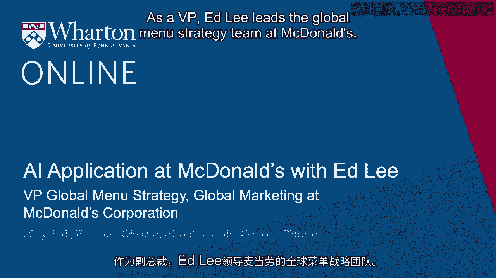

# 沃顿商学院《AI For Business（AI用于商业）》 - P33：32_Ed Lee访谈.zh_en - GPT中英字幕课程资源 - BV1Ju4y157dK

作为副总裁，艾德·李领导麦当劳的全球菜单战略团队。

在这个角色中，他推动核心类别和品牌的增长。

创建未来增长平台，并在麦当劳构建食品营销和开发能力。

最近，他还领导了全球战略洞察团队。

在这个过程中，他利用消费洞察和商业分析为麦当劳寻找新的增长机会。

在加盟麦当劳之前，艾德在凯洛格工作了12年。

你能分享一下你的视角，告诉我们你在麦当劳的经历和角色，以及你所领导的团队吗？

当然。我在消费洞察方面的培训是在快速消费品行业进行的，该行业以理解消费者和构建相关能力与技术而著称。

我很高兴能在麦当劳应用其中一些。你知道。

过去五年，行业因数据的爆炸而发生了巨大变化。

过去，只需进行一些调查或焦点小组就足够了。

现在有了所有可用的数据和信息。

我们真的需要新的工具和流程来分析所有数据。

我们试图在麦当劳实施这些。因此，当我来到麦当劳时。

这正是我想尝试做的事情之一，带来新的工具、技术和科技。

将能力和人才引入麦当劳，以应对这个新世界。因此，总的来说。

对于麦当劳的顾客而言，AI应用最大的价值驱动是什么？你知道。

潜在的，麦当劳的客户能期待哪些因为AI或机器学习模型而产生的两三种结果。

好吧，第一个，玛丽，是个性化。我们对顾客的理解越深。

你知道，我们每天有很多顾客光顾。我们大约有6000万顾客。

我们能够利用大数据更好地理解每一个客户。

我们将能够提供更适合每个个体的个性化体验。

第二个要点是客户体验和客户满意度。我们知道。

如果你去麦当劳，你可能会被要求填写收据或调查，我们每年也大约有6000万份这样的调查。

有了这些数据，我们能够利用人工智能挖掘信息，寻找改善客户体验的机会。

因此，如果我们能够提供更个性化、更愉悦的客户体验。

我们能理解自己在哪些方面存在不足，以便进行改善。

我们应该能够推动业务增长。好吧，这是数据的爆炸，与此同时，AI应用在各行业的证据也在激增。

所以我了解到，麦当劳正在进行一些非常独特的尝试，因为你们应用了人工智能和机器人技术来改善得来速的体验。

那么，你能否描述一下客人体验如何从这种创新中受益？

是的，当然。 你知道，得来速对麦当劳非常重要，在疫情期间，我们的销售从大约50%上升到超过60%。

这对我们来说是一个非常重要的渠道。而且，我们有很多客户通过得来速光顾。

我们所做的是，几年前收购了一家叫Dynamic Yield的公司。

谁是个性化方面的专家，他们主要是在网站领域工作。

而我们能够做的是将其应用于得来速。

所以当你进入得来速时，机器会查看，好的。

今天天气怎么样。 这是最后订购的10辆车中的一辆。

人们通常在星期二下午两点会点什么，并能将这些整合在一起，提供实时建议。

所以当你开始点餐时，比如，嘿，什么可以搭配双层芝士汉堡，那些建议将实时出现在菜单板上。

这对我们来说确实是一个成功的故事，推动销售并提高客户满意度。

现在随着人工智能，很多公司都在使用自然语言处理。

这是否在麦当劳使用，潜在地，哪些商业决策受到自然语言处理的影响。

是的，事实上，我们在公司很多不同的领域使用自然语言处理。

你知道，一个例子，回到这个，客户对收据的满意度。

我们可以挖掘真实的文本。如果你进去，你可以说，好的，按一到五的评分。

你的体验如何？然后输入评论。

如果你有成千上万的评论。

实际上很难去查看并理解发生了什么。

但我们可以利用人工智能来挖掘情感，这样我们就能了解客户对某个特定产品的喜好。

也许是我们推出的新产品。我们还可以了解我们为新的安全协议所做的工作是否有效。

在COVID期间，给客户提供良好的体验与否。然后根据这个，我们可以做到。

实时获取这些数据，我们可以做到这一点，并提供非常。

非常快速的反馈直到每个单独的餐厅。这样我们就可以，嗯，你知道的。

改进，并利用这些来提供更好的体验并增加销售。

因此，人工智能实际上不仅在个性化上帮助消费者，也在每个单独商店的运营上提供帮助。

我们通过这些不同的工具提供实时反馈。

这引出了一个更广泛的问题。麦当劳的做法与五年前有什么不同？

你知道，这个，改变了很多。我会说，玛丽，五年前。

这非常有趣。然后，一年前，这非常随意，你知道的。

所以这是一个新能力，新技术，公司某些部分能够比其他部分更好地利用。

但这非常新。然后我们开始进行更多实验。

现在我会说，人工智能是我们从上到下追求的真正战略意图。

然后我们开始与中心的数据和分析中心合作。

这里的想法是建立一个具有真正能力的专业中心。

先进的知识和理解。我们在硅谷和特拉维夫通过收购获得了一些中心。

然后，这些中心的分支中，有来自不同国家、不同职能的业务实践者。

而这些实践者会进行分析，好的，今年。

这些是我想要能够做的不同事情。

我们能够将正确的注意力、资源和重点放在公司最高优先级的领域。

所以这确实是一种正常的商业实践，我们带着战略意图在进行。

就像在得来速更快或者拥有更美味的食物。

我们已经讨论了人工智能如何应用于特定的商业问题，比如得来速以及得来速的创新。

麦当劳和正在使用的人工智能技术类型，例如自然语言处理。

现在，你能谈谈业务单元何时与数据科学家联系或连接吗？

然后，把他们带入到客户业务问题或客户访客问题中。

那么，技术专家和主题专家如何在麦当劳合作创新，你提到的卓越中心。

但也许你可以谈谈那两个，两个小组。是的，绝对可以。那么在我的部门。

例如，我负责这个全球洞察小组。

但你可以用法国的全球洞察小组或德国的运营团队来替代那些。

通常他们会提出业务问题。我有这个业务问题。

我要么试图增加销售，要么进行更好的促销，或更好地理解我的业务。

我想查看历史数据，了解这个新产品的影响是什么。

嘿，我在推出新产品的同时推出了送货，同时进行促销。

每一项销售来自各自多少，他们会将这些带出来。

无论是来自专业中心的人，还是与专业中心有联系的业务人员，都会解决这个问题并利用人工智能工具。

发生了很多民主化的事情。市场上出现了全新的工具和平台，帮助我们将所需的工具提供给业务单位，以便他们能够进行自己的分析。

这真是太棒了。你知道我们不希望的是一个小组做所有的工作。

我们希望有一个专家小组来帮助公司其他部门完成他们的工作。

所以这就是我们现在努力建立的那种东西。考虑一下一个工具。

你能否突出构建良好的A/B测试工具和模型的关键要素？

当你的团队在使用先进的AI和机器学习方法进行A/B测试时，需要考虑的事情。

我很高兴你问这个，因为A/B测试是与AI合作中非常重要的一部分。

你知道，这应该是自然而然的，像是水到渠成的事情。

是实施AI项目的同时推进。

因为通过使用A/B测试，你可以获得很快的反馈。

非常迅速，实时生成。你可以生成改进，知道。

无论是每天还是每小时进行分析。许多人不知道，当你访问新闻网站时，所有那些标题都是经过A/B测试以吸引最多点击的。

所以，我们想要尝试的是将它引入实体空间。

所以我们正在用你提到的自取窗口的户外数字菜单板来实现这一点。

当你经过那个巨大的户外数字菜单板时，展现出我们美食的漂亮图片。

我们的食品。在字体、大小和位置上，A/B测试可以做很多事情。

我们可以进行一个测试，假设在下午三点，我们将为咖啡留出更多空间。

需要为其他项目留出更少的空间，因为人们在下午需要提神饮品。

因此，我们可以进行所有这些类型的A/B测试，并迅速确定到餐厅级别的细节。

菜单板的设计应该是什么样的机会。

以推动公司的销售。因此，这是一个巨大的工具。

我们在所有不同的应用中都严格使用它。那么在你看来。

如果麦当劳的创始人雷·克罗克今天还活着。

有哪一项AI或机器学习创新会让雷·克罗克惊叹？

我知道他非常著名的是他的摇摇机。但现在有什么关于机器学习的东西会让他惊叹？

好吧，我们总部仍然有那台摇摇机。它是一颗受人尊敬的瑰宝。

但是我们目前正在进行的一个测试实际上是自取窗口的语音自动化。

基本上，拥有一个AI机器人能够与客户互动并在他们进入自取窗口时接收订单。

我们可以做的事情是，如果将其连接到我们在菜单板上展示的优惠或者忠诚计划。

人们可以开车到这里，他们可以被称呼名字。你好，玛丽。

感谢你光临麦当劳，嘿，看起来你还有200个忠诚积分。

你想点一个芝士汉堡吗？这些体验提供了非常有趣的个性化体验。

另一个方面是机器人可以讲多种语言，或者如果我们正在进行迪士尼促销活动的话。

也许这听起来像达斯·维德的声音。所以这些都是我们现在应该能做到的事情。

我认为这种创新和技术如果能让雷看到的话，肯定会让他惊讶不已。

我也这么认为。我想结束。我非常感谢你今天的时间。

认识你以及麦当劳在商业中使用人工智能的情况真是太好了。谢谢。好的。

非常感谢你。谢谢。

