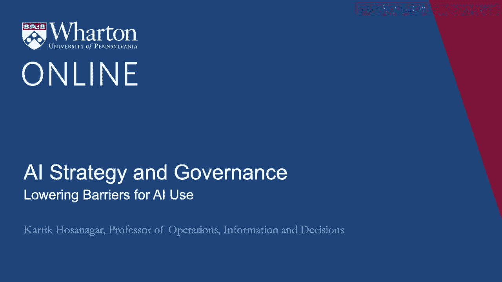
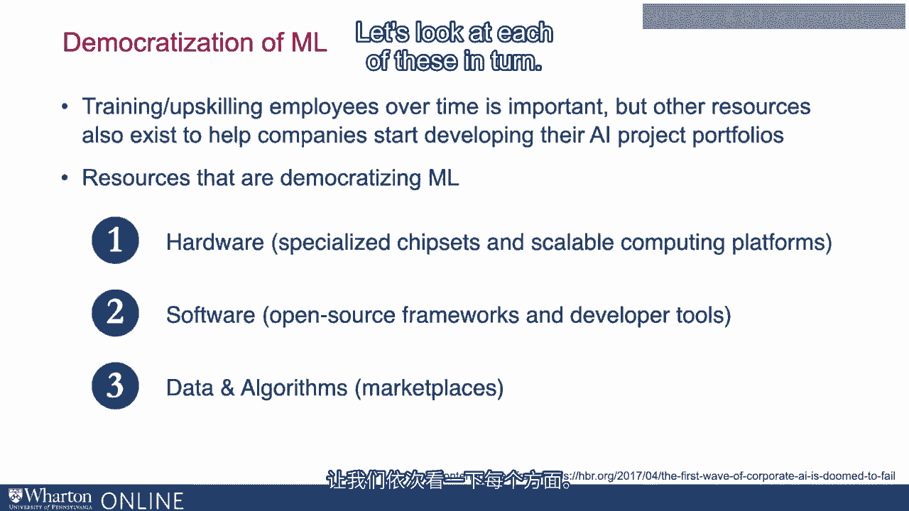
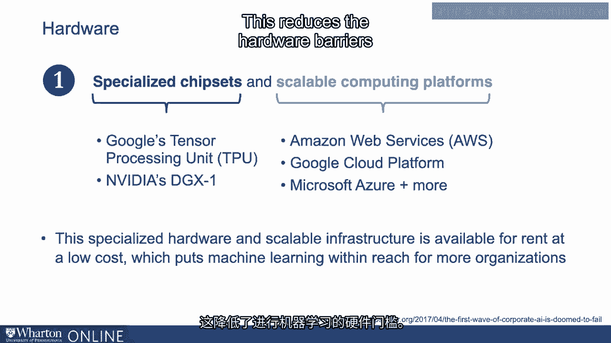
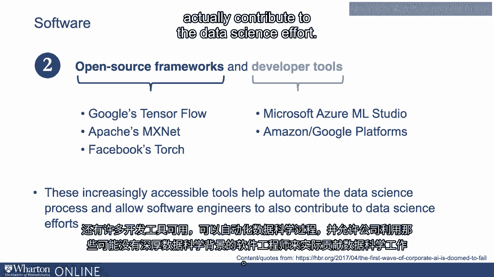
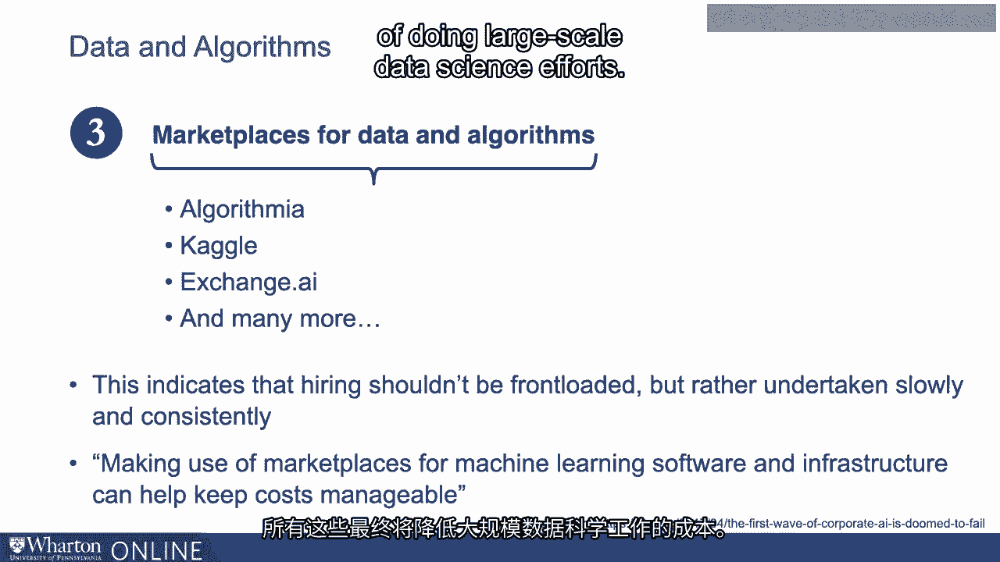

# 沃顿商学院《AI For Business（AI用于商业：AI基础／市场营销+财务／人力／管理）》（中英字幕） - P104：3_降低AI使用壁垒.zh_en - GPT中英字幕课程资源 - BV1Ju4y157dK

在上一次讲座中，我们谈到谷歌如何利用AI重塑自己并创造了。

一个以AI为首的组织正在为公司带来丰厚的回报。

现在很容易看出，大公司，像谷歌这样的科技公司拥有资源。

以及内部的工程能力来围绕AI进行重塑。

但是小公司如何做到这一点，或者没有技术基因的大公司又该如何做呢？

好消息是，正在发生一场转变，即机器学习的民主化。

允许各种组织访问某些能力和资源的学习。

和开展以AI驱动的业务转型所需的资产。

当我谈论机器学习的民主化时，我是说民主化。

在进行机器学习的硬件、软件和数据方面。

进行机器学习、机器学习模型本身，以及人们。

进行机器学习所需的数据科学家。让我们从这些方面看一下。

首先，让我们从硬件开始。大规模机器学习通常需要定制硬件。

例如，甚至用于重度机器学习的处理器都是定制的。

有用于机器学习的GPU，而不是传统的CPU。

现在，对于公司来说，创建定制硬件和定制基础设施可能非常昂贵。

用于机器学习。好消息是，大多数主要的云计算平台，如亚马逊。

谷歌、微软、阿里巴巴等公司已经创建了可扩展的计算平台来进行机器学习。

所以公司不必提前投资，而是可以以低价格租用。

当它们需要时。这降低了进行机器学习的硬件门槛。

另一个对许多组织非常有帮助的趋势是，许多开源。

已经创建了框架来进行机器学习，因为它们是开源的。

非常容易获取，再次降低了进行机器学习的门槛。

还有许多可用的开发者工具，可以自动化数据科学。

处理并允许公司利用其软件工程师，这些工程师可能没有深厚的背景。

和数据科学实际贡献于数据科学的努力。

实际上有很多龙狗工具，还有许多可视化工具。所有这些都可以被利用。

这些工具来自微软、亚马逊和谷歌等大公司，但它们也。

包括像H2O这样的开源工具，以及来自其他供应商的许多工具，如Data和Robot。

最终，这些工具使得公司能够轻松入门机器学习。

无需构建自定义软件。最后，要成功应用机器学习，您需要良好的数据和优秀的模型。

现在出现了一些市场，公司可以下载或购买数据集。

还可以下载或购买算法或模型来进行机器学习。

例如，Kaggle已成为一个提供数据和算法的市场。

包括亚马逊、Snowflake等在内的一些主要云计算平台正在创建。

数据市场和算法市场也在不断发展。

所有这些最终将降低进行大规模数据科学工作的成本。

最后，需要数据科学家来进行数据科学，当然，数据科学家。

这在今天可能是昂贵的。但随着越来越多的工程师和数据科学家的培训，数据的成本。

科学家的数量也在减少。所有这些趋势都意味着，在您的行业中使用机器学习的门槛正在降低。

迅速下降。其含义是，您希望在人工智能方面进行缓慢而稳定的投资，而不是一次性大量投资。

大量前期投资，缓慢而稳定的投资将在长期内产生回报。

未来几年，门槛将继续下降，使得应用变得越来越容易。

供公司启动或发展其人工智能项目。[BLANK_AUDIO]。

