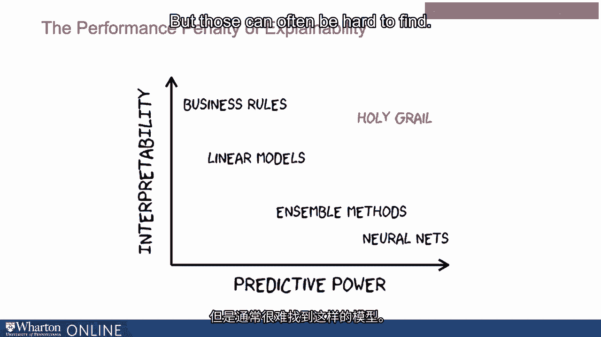
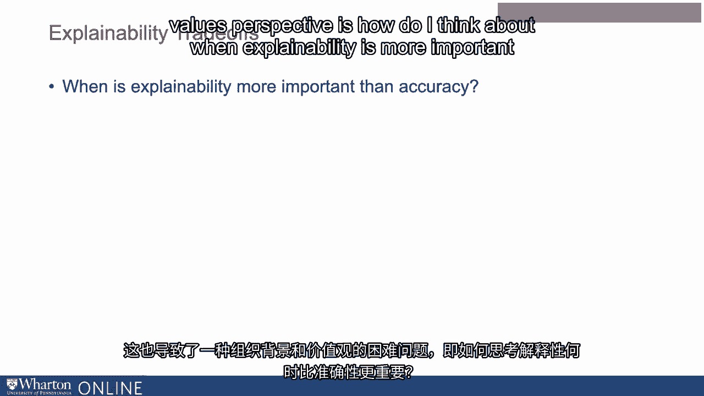

# 沃顿商学院《AI For Business（AI用于商业：AI基础／市场营销+财务／人力／管理）》（中英字幕） - P132：31_解释性与性能之间的权衡.zh_en - GPT中英字幕课程资源 - BV1Ju4y157dK

鉴于解释性对于AI的使用和采纳如此重要，为什么不直接制作。

每个模型都可解释吗？结果发现，性能之间通常存在权衡。

特别是在复杂的数据环境中，解释性显得尤为重要。

当你考虑使用解释性时，往往会有性能上的惩罚。

所以可以考虑算法的预测能力与。

它的解释性。因此，正如我们之前所讨论的，商业规则相对容易解释。

简单的决策树或线性模型是可以解释的。

但它们在预测能力上相对较有限，无法与像神经网络这样更复杂的应用相提并论。

随着我们接触到神经网络，它们具有更高的预测能力，但更难以解释。

当然，我们希望找到一种平衡点，也许是在拥有。

同时具备高度预测性和解释性的两个模型，但这些往往很难找到。

因此，当你考虑一个算法或算法的使用时。

通常情况下，你必须在精准度的问题上进行权衡。

我想要这个算法在预测中非常精确吗？

但我也许需要能够解释模型的作用和原因。因此，举个例子。

在贷款处理或医疗保健的情况下，如果我有一个非常具有预测能力的模型。

一个不具解释性的模型，可能是无法使用的。

所以这就是这两个因素之间的权衡。

这也从组织的价值观角度引出了一个困难的问题。

我如何考虑解释性在何种情况下比准确性更重要？

举个例子，在医疗保健的情况下，你可能会有一个非常准确的系统。

这是为人们推荐治疗的方法，这在过去非常准确。

但它又不具解释性，这对医生来说是一个显著的缺点。

以便能够向患者解释为什么做出这样的决策。

医生想要了解算法，如果他们的想法不一致。

或者算法正在推荐什么。因此，缺乏解释性是一个主要缺点。

所以在这样的上下文中，哪个更重要，使用算法的问题。

哪个更具解释性或更准确，这并不总是容易决定。

需要优先考虑。例如，有些情况下显然解释性并不重要。

如果你只是考虑预测用户点击或推荐是否购买。

或出售金融资产时，算法是否具有解释性可能不是那么重要。

这个决策并不是针对人们的，它们不会直接影响人。

所以这并不是那么关键。但对于像组织内部的晋升这样的事情。

这可能非常重要。因此在某些情况下，可解释性可能不那么重要。在这种情况下。

你可能想要优化预测准确性，但在某些情况下，这将非常重要。

然后你需要在这个上下文中做出艰难的取舍，考虑什么更重要。

以及你如何考虑在预测的精确度或性能与模型的可解释性之间取得平衡。

[沉默]。

