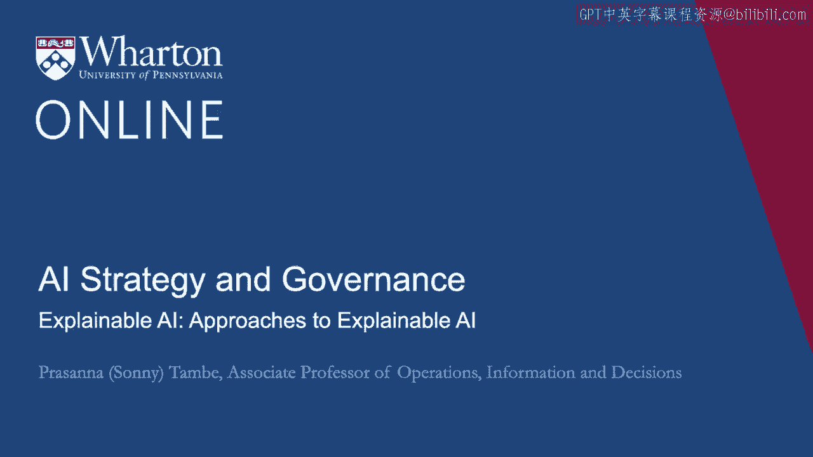
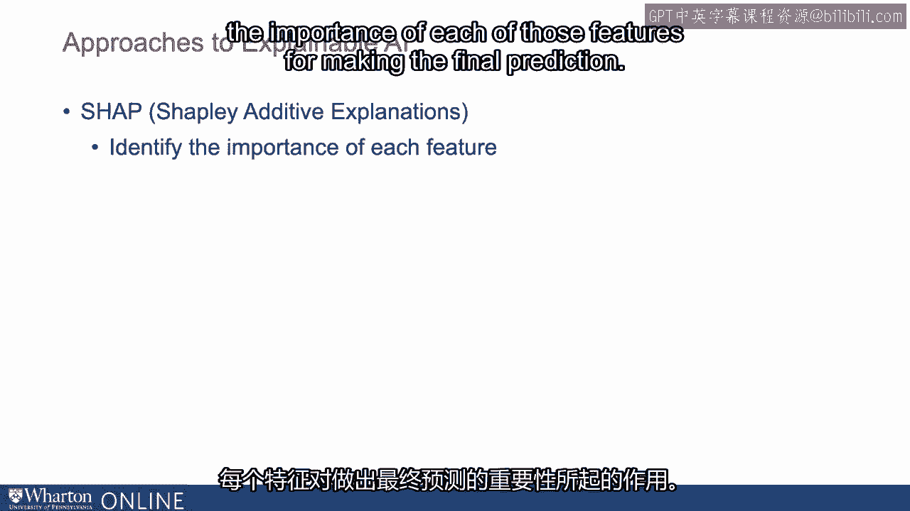
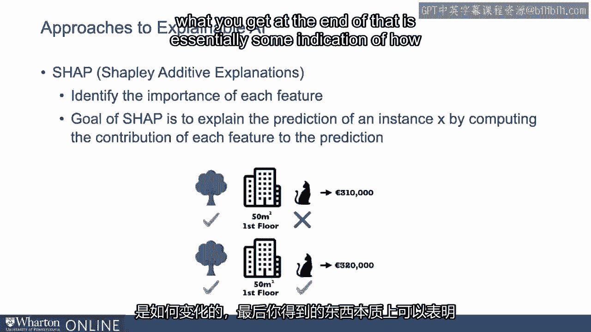
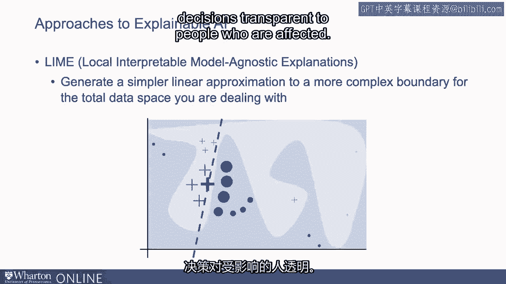
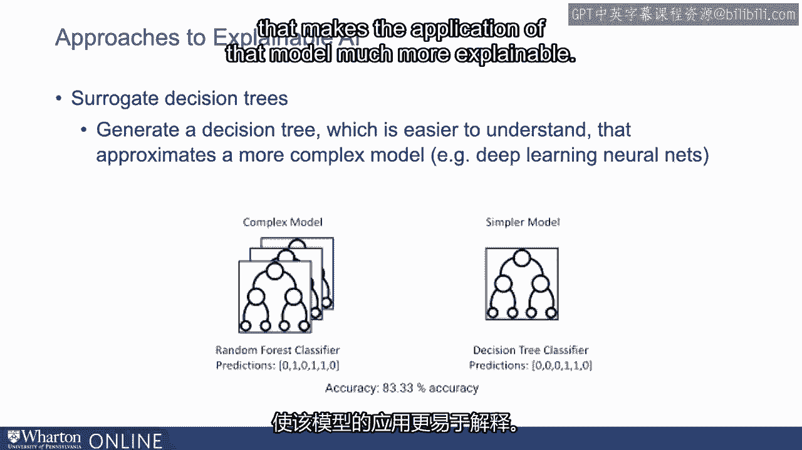
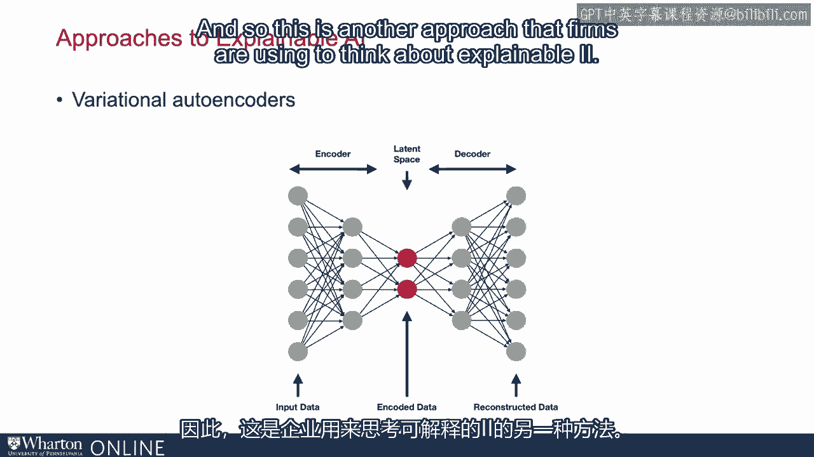
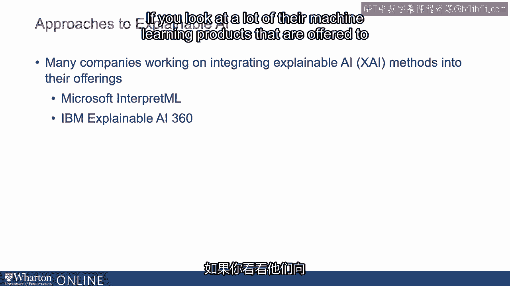

# 沃顿商学院《AI For Business（AI用于商业：AI基础／市场营销+财务／人力／管理）》（中英字幕） - P133：32_可解释AI的方法.zh_en - GPT中英字幕课程资源 - BV1Ju4y157dK

让我们谈谈正在采取的一些不同的方法。

使算法更具可解释性。所以我会谈谈几个方法。一个叫SHAP。

SHAP的全称是Shapley加法解释。SHAP背后的理念是，如果你有多个变量或数据类型。

用于进行预测的是什么，SHAP将告诉你。

关于每个变量在最终预测中有多重要的内容。

它将识别每个特征在预测中的重要性角色。

影响最终预测。

其目标是通过计算每个特征的贡献来解释实例的预测。

对于每个特征与预测之间的关系。所以它将基本上替换掉每个不同的。

特征以查看预测如何变化。

最终你得到的是每个特征重要性的某种指示。

特征是什么。你可以查看这些，并说：“好吧，当我考虑最终决策时。

这个特征，这个变量是真正重要的。" 从人口统计的角度来看。

如果考虑性别、年龄等因素。

它会告诉你哪些因素对最终决策最为重要。

预测可以让你了解哪些因素对结果重要。这就是SHAP。

一种方法叫做Lyme，本地可解释模型无关解释。

其思想是生成一个更简单的线性近似，以处理更复杂的边界。

你所处理的整个数据空间。所以想象一下你有一个空间。

你有很多很多客户，而你正在使用的模型是。

用于预测的模型在整个客户空间中确实很难解释。

Lyme的基本作用是缩小到一小部分可能相似的客户。

在那一小部分客户中相似，它将能够提供一种解释的方式。

对于那些客户，至少在那个小范围内，确切地说，决策是。

得到的结果是准确的，即使这可能不适用于更大的数据集。

所以你可以开始告诉人们，与那些与你相似的人相比，这。

这就是为什么你有些不同，以及这是如何得出决策的，预测。

模型得出的决策略有不同。这就是Lyme。

它提供用户界面，帮助使这些决策透明。

对受到影响的人。

第三种方法称为替代决策树。

这里的想法是生成一个决策树，这样更容易理解。

逼近更复杂的模型。因此，可以想象一个更复杂的模型，比如深度学习网络。

替代决策树的背后理念是创建一个模仿真实决策树的模型。

深度学习网络及其输出有很多种方式，但决策树是。

相比深度学习模型，它要更容易被解读。

因此，替代树可以用来以一种方式解释深度学习模型。

使得该模型的应用更加可解释。

另一种应用称为变分自编码器，这些变分自编码器将会。

将数据提炼成一些关键特征，而这些关键特征往往是。

比原始数据本身更具可解释性。因此，我们可以考虑原始数据输入后，预测结果输出。

模型。在这里有一个中间步骤，将数据简化为一组可解释的。

特征。因此，这也是公司们用来思考可解释AI的另一种方法。

因此，有多种不同的方法正在被用来使AI系统更加。

可解释的。不同的方法有不同的优缺点。

但现在这是一个非常活跃的领域，比如微软、IBM等。

很多公司在寻求将可解释性整合到他们的产品中。

如果你查看许多提供给客户的机器学习产品，来。

例如，在云计算中，许多公司提供可解释性或可解释的功能。

在模型输出方面，这将对采用而言至关重要。

许多行业背景。[BLANK_AUDIO]。

