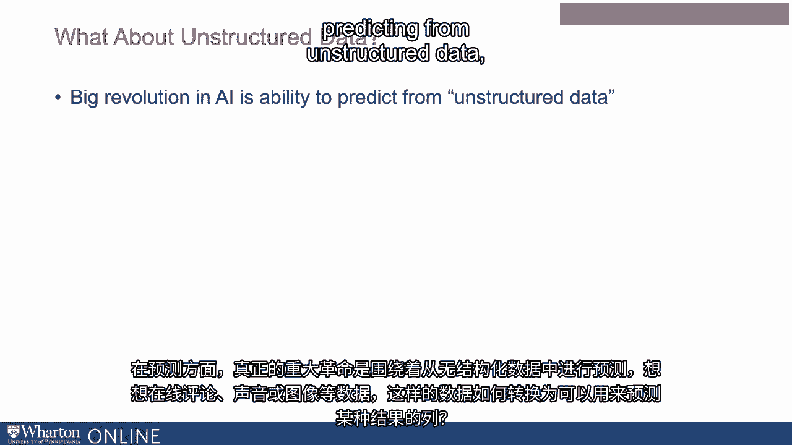
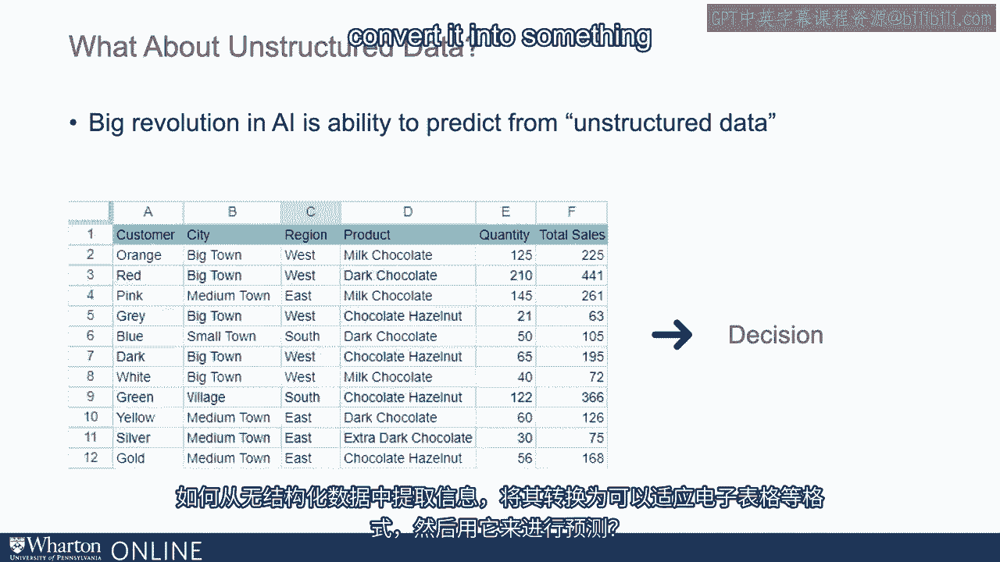
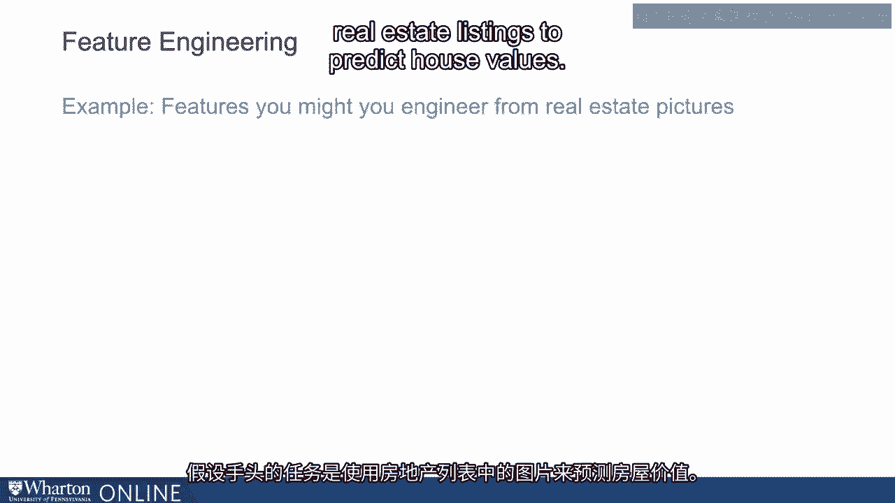
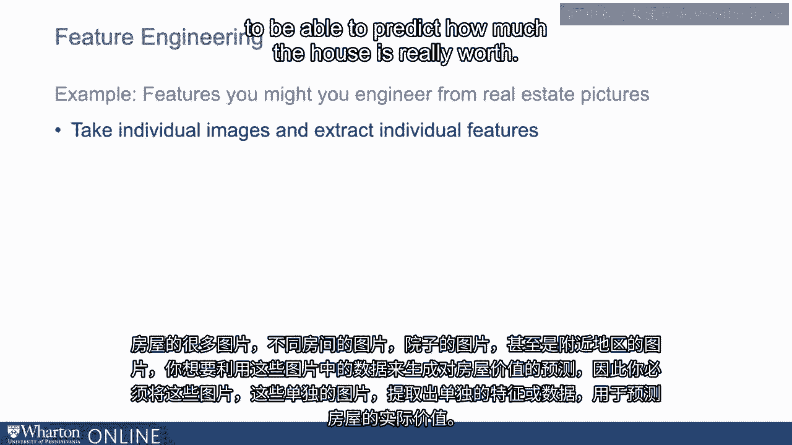
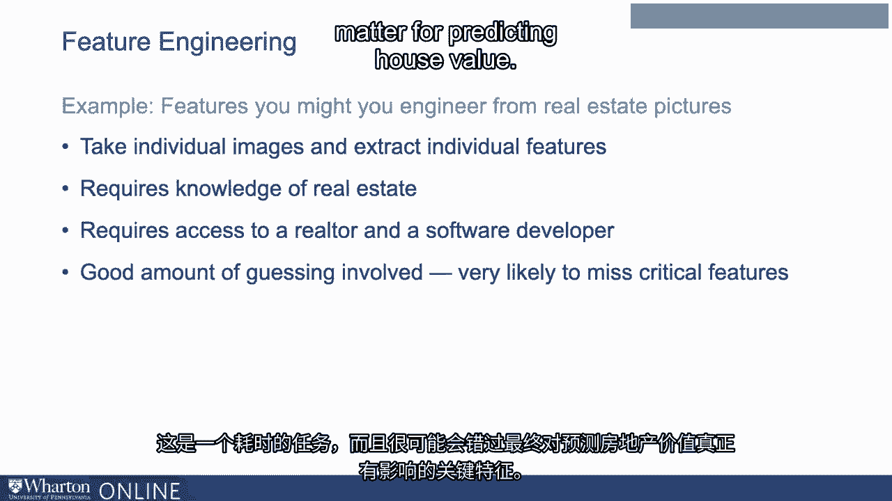

# 沃顿商学院《AI For Business（AI用于商业：AI基础／市场营销+财务／人力／管理）》（中英字幕） - P14：13_特征工程与深度学习简介.zh_en - GPT中英字幕课程资源 - BV1Ju4y157dK

>> 嗨，我的名字是Prasana Thambay。

我是沃顿商学院OID系的教职员工。

我教授与分析和人工智能相关的课程，特别是在商业背景下的人工智能。

我在几个不同的领域进行研究，特别与技术经济学相关。

我对劳动市场以及人工智能在HR中的应用也特别感兴趣。

给定一组变量，机器学习算法旨在使算法学习映射。

在这些输入变量与算法要预测的内容之间。

所以想象一下你有一列变量或几列变量，并且。

你正试图用这些来预测某种输出。但是非结构化数据呢，对吧？

预测的重大革命确实是在于从非结构化数据中进行预测。

所以想想在线评论、声音或图片。

这些数据是如何转换为可以用于预测的列的？

某种结果？你如何从这些非结构化数据中提取信息。

将其转换为例如可以适合电子表格的格式，并且。

然后用这个来预测？当数据不是结构化时，当它们是非结构化的。

比如在线评论，你需要经过一个称为特征工程的过程。

特征必须从数据中构建。这意味着你需要从非结构化数据中提取。

你基本上是从那些非结构化数据中创建或编码单个特征。

这是一个耗时且通常相当具有挑战性的过程。

而且通常还需要相当多的领域专长。

这在许多方面都是机器学习中最困难的部分之一。

过程，而这正是数据科学家通常会花费大量时间的地方。

这可以在艺术和科学之间取得平衡。所以让我给你举个例子。

假设当前的任务是使用房地产列表中的图片来。

预测房屋价值。因此很多房子的图片，包括房子的不同房间和院子。

也许甚至是该地区的情况。你想利用那张图片中的数据生成某种预测。

房屋价值。因此你需要做的是获取这些图像，这些单独的图像。

并提取可能会用到的单个特征或数据。

你可能会用来预测房子价值的变量。

房子实际上值多少钱。

所以如果我们提取这些图像并提取你可能关心的特征。

当考虑房地产价值时，这将需要多种不同类型的知识。

这不仅仅是软件开发任务，因为你还需要了解。

房地产经纪人知道哪些重要的事情。你在寻找什么？

在房间和布局方面你在寻找什么？

在地块和地块风格方面，对吧？这些都需要一定的知识组合。

所以如果你考虑特征工程，在这种情况下。

这需要房地产经纪人的知识。同时也需要软件开发人员。

他们可以合作尝试从图像中提取这些信息。

一起坐下来，讨论一下，好吧，我们写点什么来提取。

这些图像的相关方面可能对预测房屋价值很重要。

但这涉及到相当多的猜测。这是一个耗时的任务。

你很可能会错过那些最终重要的关键特征。

用于预测房屋价值。

深度学习，我们接下来要谈的，解决了许多这些问题。[BLANK_AUDIO]。

