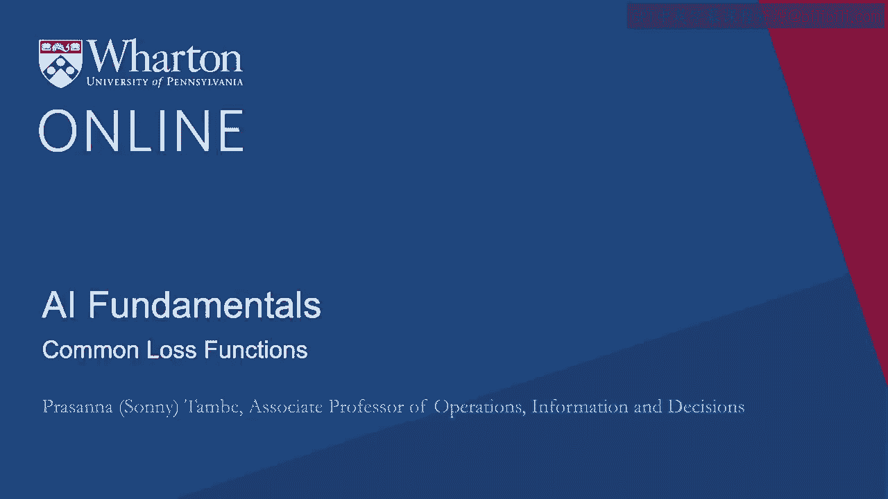
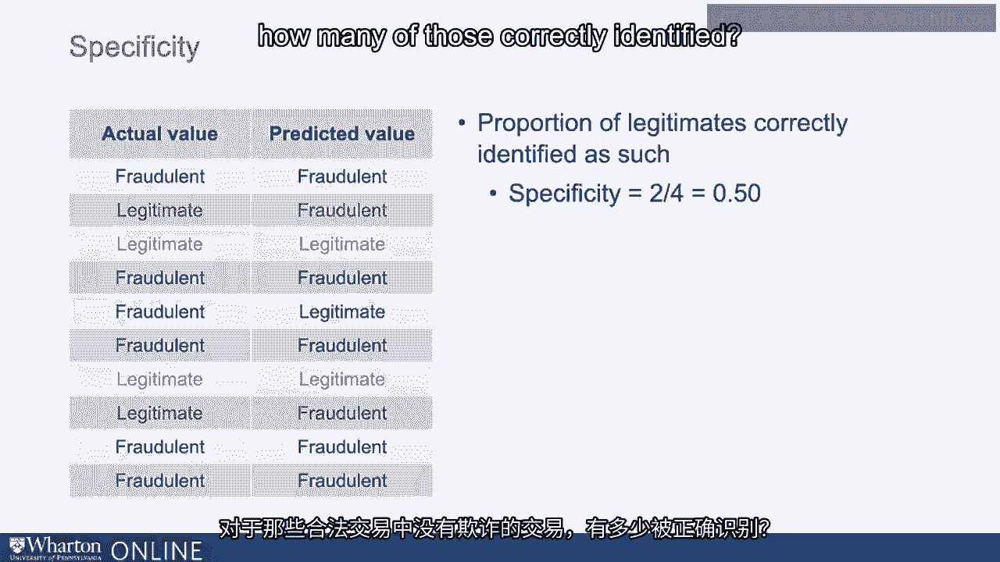
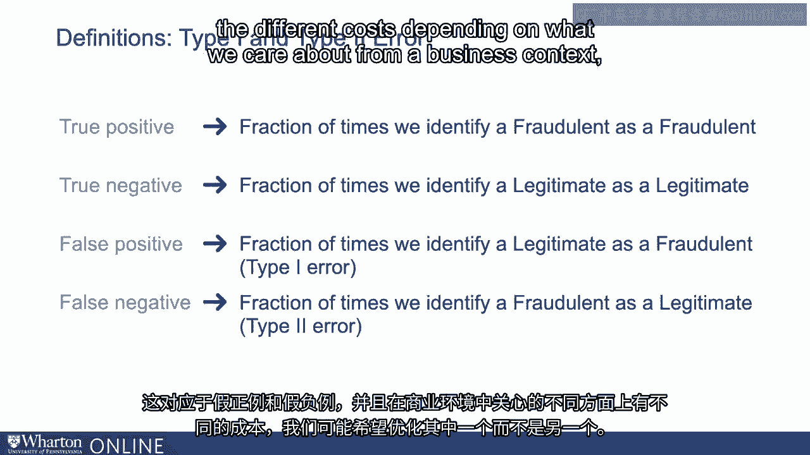
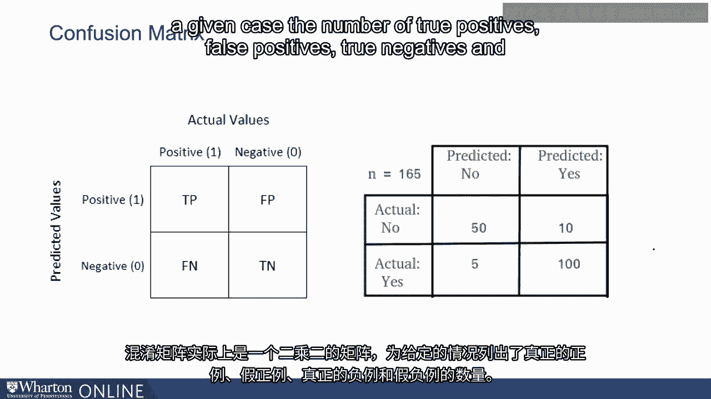
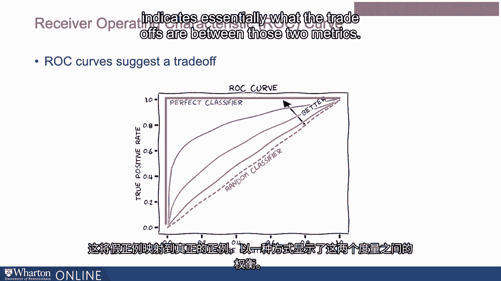

# 沃顿商学院《AI For Business（AI用于商业：AI基础／市场营销+财务／人力／管理）》（中英字幕） - P19：18_常见损失函数.zh_en - GPT中英字幕课程资源 - BV1Ju4y157dK

让我们讨论一些更常见的方式来衡量机器学习输出的误差。

也许最简单理解的就是准确率。

所以让我们回到我们的例子，考虑欺诈和合法交易。

在一列中，我们可能有交易是否合法的实际真实值。

或欺诈。在另一列中我们有预测值。

我们的机器学习输出是某个交易是欺诈还是合法。

准确率简单地表示我们正确回答的次数的比例。

所以它基本上是在对比这两列，它是我们。

一列与另一列匹配的情况。因此这就是准确率。

分类错误是其逆。基本上是两列不匹配的比例。

所以这就是准确率。另一个常见的指标是精度。

精度是在询问正识别中有多少实际上是正确的。

那么什么是正识别？所以通过机器学习输出，二元分类器试图预测某事。

在两类中，如合法或欺诈。

这两类中的一类被标示为正类。

一个可以称为一，另一个是零。

所以我们可能会识别出在这种情况下欺诈是正类。

精度所指的是我们实际称之为欺诈的比例。

实际上是欺诈的。如果我们有一定数量的预测是欺诈的，我们将查看如何。

有多少是，我们得到的正确比例。

从某种意义上说，这忽略了一些数据或表现的其他方面。

它基本上是在查看这一特定的片段，这一特定的频率度量。

我们称之为欺诈的案例中，有多少实际上是欺诈。

敏感度是一种不同的方式来看机器学习输出的表现。

在这种情况下，这是在看你抓住了多少相关实例？

所以想想这里的这两列，实际值和预测值。

如果实际值是合法的、欺诈的，敏感度问的是多少。

你抓住了多少欺诈案例？有没有漏掉其中的任何一个，还是你能抓住大部分？

所以敏感度，高度敏感的分类器基本上是让非常少的。

相关实例，实际上欺诈的交易漏掉了。

所以这看的是与精度完全不同的东西。

特异性是在看这情况下合法交易的比例。

负类被正确识别为如此。

所以在那些合法而非欺诈的交易中，有多少是。

被正确识别。因此再次强调，特异性、精准度和准确性。

它们都在从不同的方面看待你在预测中正确和错误的内容。

当你讨论使用一种与另一种进行评估时。

机器学习的输出，我们隐含地做的是在不同的方面赋予不同的权重。

你关心的，是否更重要的是确保，例如，你永远。

错过欺诈交易，或者，例如，确保。

以至于你绝不会错误地将合法交易标记为欺诈。

在考虑这些不同的指标时，会有不同的权衡。

并且有多种方法来思考何时使用这些。

关于使用一种与另一种不同的成本，有一些特定的术语。

你可能会听到真正的正例、真正的负例、假阳性和假阴性。

真正的正例和真正的负例是你正确识别的数量，或者你识别出的数量。

你识别正确的次数。真正的正例是你在正类中识别某物的比例。

在这种情况下，将欺诈标记为欺诈。真正的负例是我们识别合法交易为合法的次数的比例。

交易。因此，真正的正例和真正的负例基本上指示了交易的次数或数量。

我们正确识别的次数的比例。假阳性和假阴性指的是错误，这些通常。

伴随而来的成本。因此，假阳性和假阴性是两种可能导致的不同类型错误。

涉及两种不同类型的成本。假阳性是我们将。

例如，将某些东西视为合法的，但标记为欺诈。

假阴性是我们将某些东西标记为欺诈但视为合法的比例。因此再次强调。

这取决于错过欺诈交易的成本是否更高，或者。

是否更昂贵错误标记某些合法事务为欺诈，这些。

映射到假阳性和假阴性以及不同的成本上。

根据我们在商业环境中关心的内容，我们可能希望优化一种。

与其他指标相比。有多种方式可以表示这些，来可视化这些。

向不同的利益相关者传达这些。其中一个被称为混淆矩阵。

混淆矩阵本质上是一个二维矩阵，为给定案例列出。

真正的正例、假阳性、真正的负例和假阴性的数量。

另一种流行的表示机器学习输出的方法被称为ROC曲线或。

接收者操作特征曲线。这将假阳性与真正的正例进行比较，基本上指示。

这两个指标之间的权衡是什么。

这些是一些常见的损失函数。我们已经定义了它们。在下一个视频中。

让我们讨论一下在什么情况下它们中的某些函数可能比其他函数更可取。[BLANK_AUDIO]。

