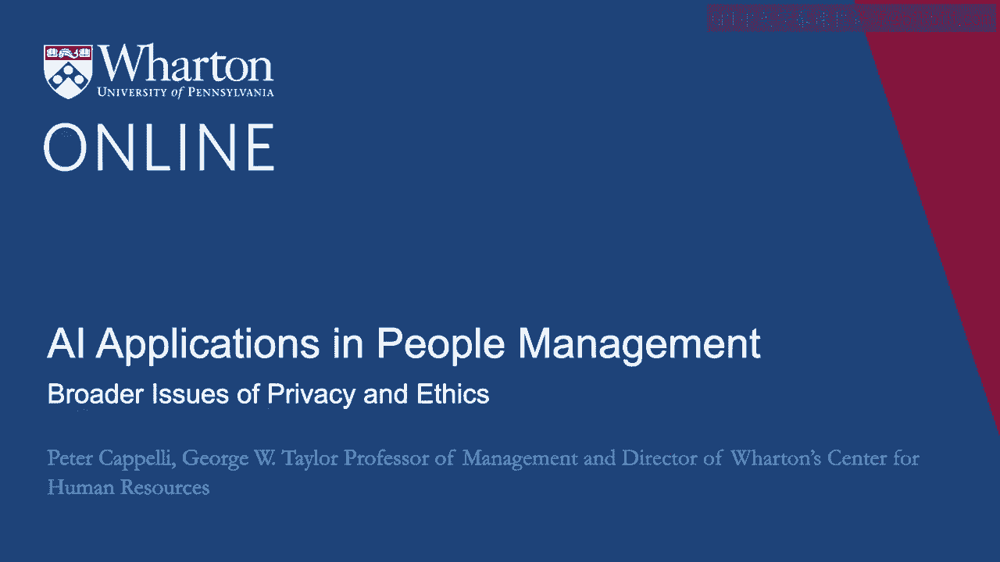
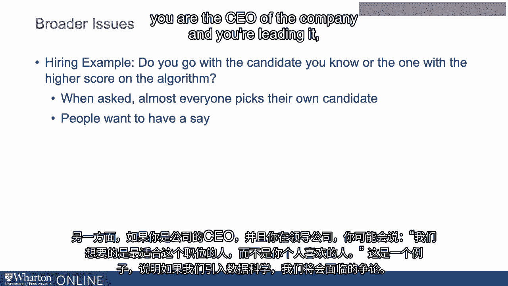
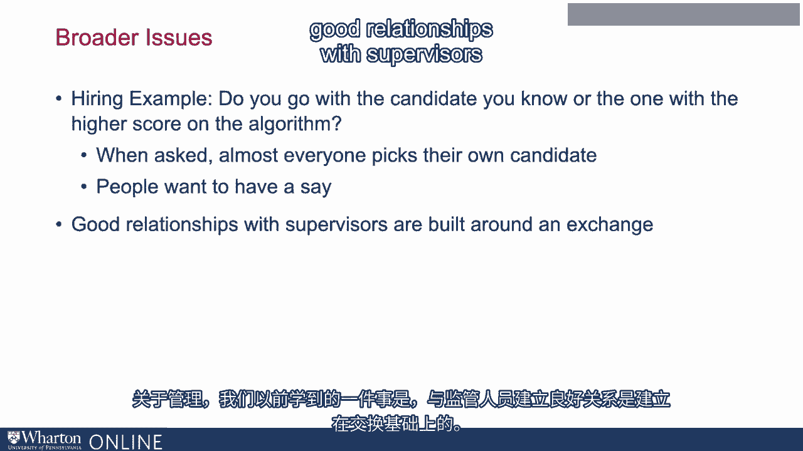
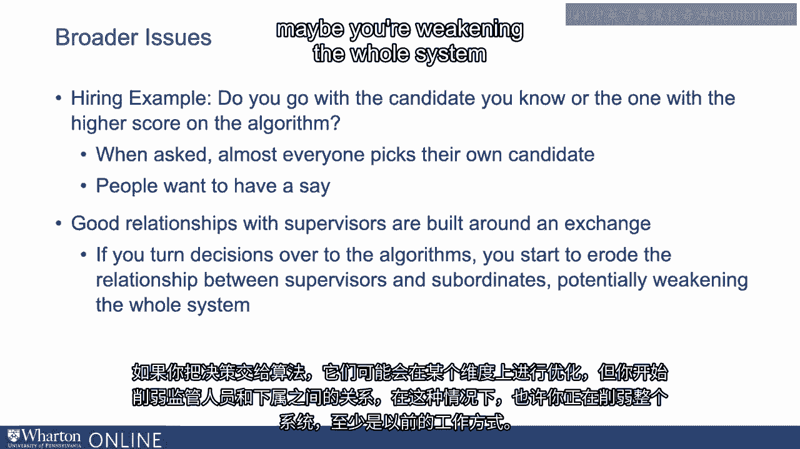
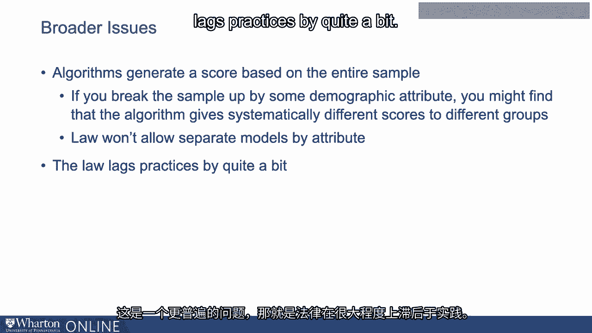
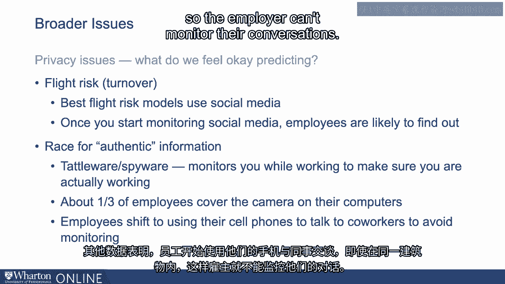
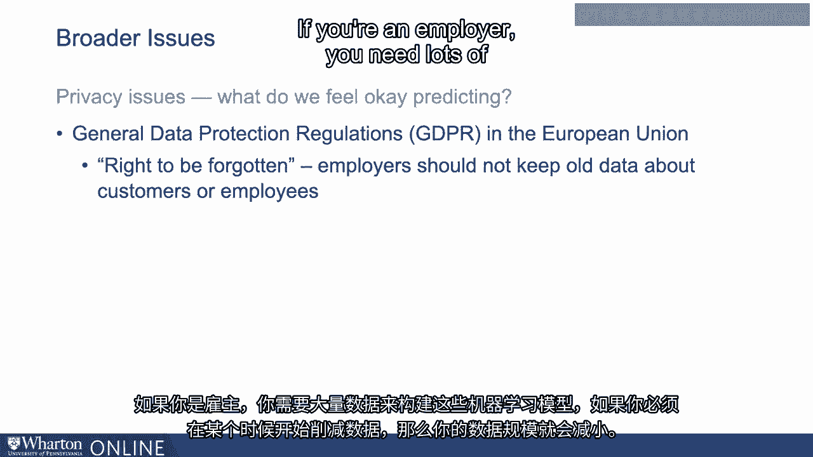

# 沃顿商学院《AI For Business（AI用于商业：AI基础／市场营销+财务／人力／管理）》（中英字幕） - P82：19_更广泛的隐私和伦理问题.zh_en - GPT中英字幕课程资源 - BV1Ju4y157dK

所以让我们讨论一下关于使用数据科学和人工智能的一些更广泛的问题。

一般来说，在工作场所管理人际关系。这些是伦理问题，也是隐私问题。

所以让我们谈谈这些问题以及它们的表现。

所以让我们回到之前的招聘例子，简单一点。

这是我从我们的同事杰夫·波尔特借来的一个小故事。

假设你在组织内做招聘决策，这就是某个人。

为你工作的副总裁，这个人将成为一名主管。

你有一个内部候选人，某个在你单位工作的人，你喜欢这个人。

还差得远。你认为他们挺不错。人力资源人员说，你知道的。

还有另一个候选人和你的候选人做同样的工作。

但在组织的另一个部分。所以你不认识这个人。

但他们的经验基础大致相同。所以你的候选人就是另一个人。

所以你面试了另一个人，他们表现不错，而你意识到你可能会。

你对现在与你合作的人有偏见，你的候选人。

你认为另一个人似乎不错，但你仍然更喜欢你的第一候选人。

你可能认识到，这也许只是因为你对这个熟悉。

然后人力资源打电话给你，他们说，我们有这个算法来预测。

谁将在这份工作中取得成功。你的候选人与最佳表现者的算法匹配度是82%。

而我们希望你关注的另一个候选人得分是92%。你将如何决定？

你有一个已经认识的候选人，你对他们更喜欢一些，但你知道这可能是偏见。

另一个候选人看起来大致相同。

你面试过他们，他们看起来还不错，但他们在算法中的得分更高。

你会选择哪个？我问过很多不同的人这个问题。

我学到的一件事是，几乎每个人都选择自己的候选人。

然后我稍微改一下，问如果不是82到92呢。

因为分数是80到95，几乎每个人都做出同样的决定。

他们选择的是他们已经了解的候选人。那么这个结论是什么呢？

我把它提高到100%。你知道的。

这看起来像是完美的匹配，但人们仍然想继续。

几乎每个人都想选择他们最熟悉的候选人。

我认为这个教训反映了人们想要参与的事实。

他们觉得自己应该能够选择他们想要的人。

如果另一方面你是公司的CEO，并且你在领导它，你可能会说。

我们想要的是这个职位的最佳人选，而不是你个人喜欢的某个人。

嗯，这是我们引入数据时将要面对的斗争的一种例子。

科学。我们有一些情况下，人们以前有发言权，也许他们觉得应该。

你要剥夺他们的发言权。

当我们查看例如晋升、职位分配或排班等问题时，其中之一。

这最严重影响的是主管的决策。

这是主管在其他情况下拥有大量控制权的时刻。

我们之前学到的管理知识之一是良好的关系。

与主管的关系是建立在某种交换基础上的。

主管说如果你能帮我解决这个问题，我会看看我能为你做什么。

晋升或者我会看看我能为你做什么，比如加薪等。

如果你把决策交给算法，它们可能会在某些维度上进行优化，但你。

开始侵蚀主管和下属之间的关系，在这种情况下也许。

你正在削弱整个系统，至少在以前的工作方式下是这样。

还有一些其他问题，我们来谈谈其中一些。

其中一个是算法会基于它们所查看的整个样本生成分数。

但是如果你按一些人口属性把样本拆分开，你可能会发现。

算法对不同群体给出系统性不同的分数。因此，例如。

用于做假释决策的算法，我对此并不知情。

直到大约一年前，但现在美国很多地方，许多政府正在使用。

算法试图决定谁应该获得假释，谁不应该。

所以这里的衡量标准是再犯率。假释者是否成功融入正常社会，还是再次跌入。

违反假释条件而重新入狱？这正是你认为算法会非常擅长的事情，因为。

结果的衡量在这里非常清楚。当他们查看这些指标时。

在这些算法中，他们发现非裔美国人和白人的分数系统性不同。

所以你可能会说，“好吧，我们知道了，我们会处理这个问题。”

我们需要一个针对非裔美国人的独立模型，以及一个针对白人的独立模型。

问题是法律不允许你这样做，因为你在以不同的方式对待人。

基于种族。因此，至少在这一点上，法院和法律已经表示“不能这样做”。

这是一个更普遍的问题，那就是法律在实践上滞后得相当严重。

在这种情况下，大多数关于算法可能做什么的问题与什么对抗。

法律规定或以各种方式存在的冲突尚未裁决。但现在。

也许在某个时刻，法律会说：“是的，拥有不同的事情是可以的。”

算法，但在这个时候你不能这么做。“所以有许多这些问题让我们碰到了算法的运作方式。

和我们可能认为比较客观的更公平的事情。

现在我们听到的最多的是隐私问题，因为为了使用。

数据科学，我们需要数据，并且需要大量的数据。所以让我们在这里考虑一些例子。

数据科学中的一件事情，或者一个相当受欢迎的工具是测量。

被称为离职风险或我们以前称之为离职率。当人们会辞职？

你可以使用数据科学估计一个人辞职的概率。顺便提一下。

这并不新鲜，早在1960年代，就有软件大致在公司内部做同样的事情。

但你现在可以做得更好。最好的这些离职风险模型使用社交媒体。

这意味着什么？好吧，如果你更新了你的LinkedIn个人资料，例如。

这是一个代理，表明人们正在开始寻找新工作。你在社交媒体上发布的内容。

在Facebook或其他地方，如果你开始发布信息。

这表明你开始关注，离职风险上升。查看你的电子邮件流量。

例如，看到它的发展方向，你的情绪，分析。

如果我们开始监听你或阅读你的电子邮件，看到关于公司的负面内容。

我们可能能够相当好地衡量你的离职风险，构建。

从中生成一个机器学习模型。问题是很多人觉得这很 creepy。去做那件事。

我们在监听你的电子邮件，也许在监听你的电话，我们在。

阅读你的社交媒体，所有这些事情。好吧，也许是。如果你看，例如。

在阅读电子邮件时，这似乎是公司相当敏感的事情。

尽管关于，我认为我看到的一些数据表明，大约40%的雇主承认。

他们在阅读。实际上，几乎所有人都在监控电子邮件。

他们在寻找几年前开始的关键词，当时他们在关注冒犯性的内容。

电子邮件并且不断改变冒犯性定义。所以他们在扫描它。

真的在阅读它。好吧，可能不是。许多人在这么做。

但是如果40%的人说他们正在监控电子邮件流量，当你问IT人员，在公司里。

三分之二的人表示他们的公司在阅读电子邮件。

所以这是对什么算作阅读的一个小争论。

另一个复杂性是，一旦你开始将某些东西用于就业目的。

像社交媒体，我很可能会发现那件事。

因此，互联网所做的其中一件事是使员工筛查变得相当合理。

透明的意思是，一旦我完成与你公司的面试，我。

在线上，我告诉人们问题是什么，所有这些事情。

所以人们会学会这个。一旦我意识到你在查看我的Facebook页面，一些雇主会要求。

访问请求你添加他们为好友，以便他们可以查看你的Facebook页面。

一旦我知道这种情况就要发生，我就会改变我Facebook页面上的内容。

我的春假照片被删除，取而代之的是我辅导孩子的照片。

然后它就不再那么有用，或者至少用法不再完全相同。

因此，在获取真实信息方面存在一种竞争。

雇主和供应商继续试图找到关于你的揭示性信息。

不是那种游戏行为。但一旦我了解到你正试图这样做。

我开始尝试去规避这个问题。因此，这一切都与隐私问题有关。

在这个期间，尤其是疫情期间，这些问题得到了提升。

一些公司有员工在家工作。而这些公司中的一些在所谓的Tattleware上进行了大量投资。

间谍软件，基本上是在你工作时监视你，以确保。

他们确实在工作。他们可能在统计你的击键次数等。

他们可以看到你要去哪里。实际上，他们是在查看你是否在电脑上闲逛。

嗯，其他数据表明，大约三分之一的员工会遮挡电脑摄像头。

这样雇主就无法判断他们是否真的坐在办公桌前。

其他数据表明，员工开始使用手机与同事进行交流。

即使在同一建筑内，雇主也无法监控他们的谈话。

所以这是一种小博弈，双方都在努力争取隐私。

作为员工，试图根据雇主的要求进行监控。这一隐私问题，当然。

导致了一些法规，其中最著名的是。

欧洲联盟的一般数据保护条例。

员工享有一系列权利。雇主在尝试跨管辖区移动员工数据时尤其面临这些问题。

所以如果你有遍布全球的员工，其中一些在欧盟，你想要采取。

从他们那里获取数据以构建有关员工的一般模型以及员工流动情况。

和那些事情一样，你会碰到这些法规。

在讨论中可能最受欢迎的权利是被称为。

被遗忘的权利。被遗忘的权利基本上意味着雇主不应保留旧数据。

特别是关于客户，但也涉及员工。

如果你是雇主，你需要大量数据来构建这些机器学习模型。

如果你不得不在某个时候开始丢弃数据，这将减少你的数据量。

加利福尼亚州现在有自己版本的基本上与欧盟数据保护权利相同的法规。

不久我们就会看到各州的情况。在美国。

这些法规不断涌现。伊利诺伊州已经有一些。

因此，隐私问题对伦理问题很重要，但现在也对法律问题很重要。

这可能是数据科学面临复杂性时最明显的情况。

劳动力中，这些公平性问题嵌入在法律和法规中。

[沉默]。

