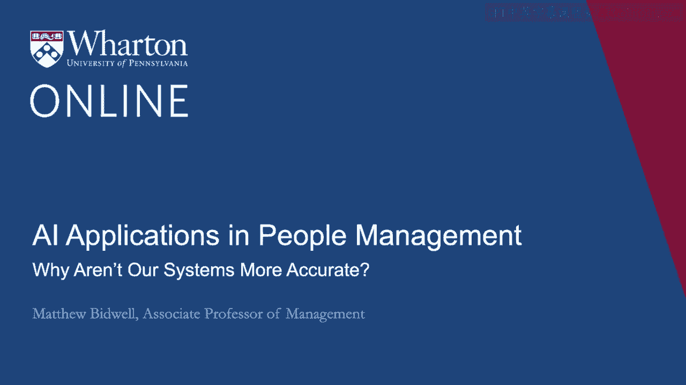
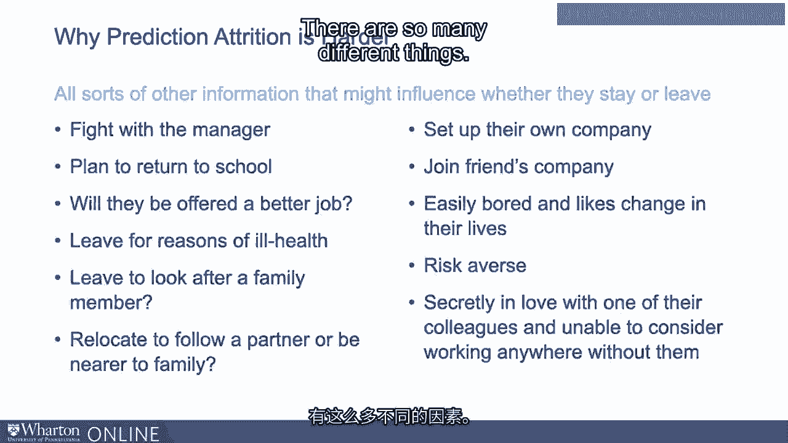
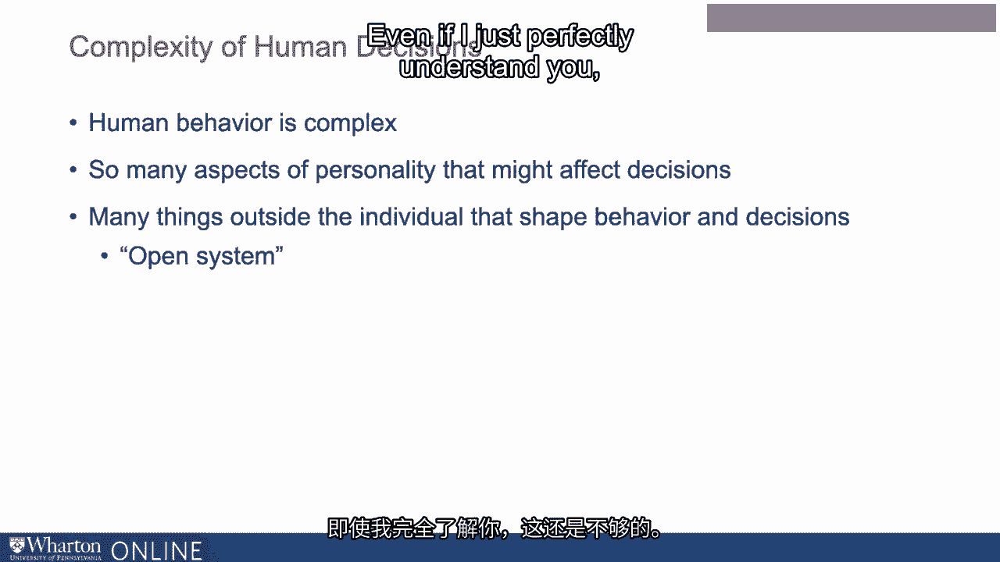

# 沃顿商学院《AI For Business（AI用于商业：AI基础／市场营销+财务／人力／管理）》（中英字幕） - P84：21_我们的系统为何不够准确.zh_en - GPT中英字幕课程资源 - BV1Ju4y157dK

在这里，比较我们使用机器学习的问题是有帮助的。

比如说，谁会离开，面临机器学习实际存在的问题。

识别效果要好得多。所以，尽管机器学习让人兴奋。

已经有一系列应用程序，使其真正颠覆了性能。

我认为最好的例子可能是语音识别。

实际上，当我准备录制这些视频时，我写了一堆笔记。

实际上，我在我的电脑上使用语音识别。我知道你在想什么。

你可能在想，他有笔记。但无论如何，当我在做这个时。

我在对计算机口述，老实说，几乎没有错误。

这基本上就像我在对一个人进行口述一样好。

我已经玩弄语音识别软件超过25年。

它以前远没有那么好。你知道，它以前每10个词就会出错一次。

现在它每100个词才出错一次。对。这确实是99%以上的准确率。对。

与索尼所谈论的同样类型的机器学习算法。

那么，为什么这与营养预测如此不同？好吧。

我认为部分原因是在一种情况下的语音识别中，你正在处理某些东西。

这已经发生了。我说了一个词，然后你试图将其分类到某个类别。

那个词是什么？与预测未来有些不同。

部分原因是，当你在做这种分类任务时，你有点需要所有的。

所需的信息。因此，当你进行语音识别时。

我说一个词，然后计算机试图对其进行分类。让我们来看看。比如说，海龟。

我不知道为什么。听起来是个好词。说海龟。像披萨一样的小型两栖生物。

根据一些说法。好的。所以当我说海龟时，我们需要什么来进行分类？

我们需要音频文件。所以我们需要我用声音产生的声波数据。

我们还需要知道我在说哪种语言。从某种意义上说，长句子。

通常，了解每个词周围的上下文是有用的。但实际上，在这种情况下。

仅仅一个词，海龟，通常计算机能很好地识别它。

它确实拥有进行此操作所需的所有数据。现在让我们思考一个流失预测。好的。

我们需要什么来做出真正准确的流失预测？所以，你知道的。

我们讨论了许多有助于这里的数据。所以人口统计信息。

了解他们在这个职位上工作多久，了解工作是什么，了解。

他们的绩效评估，申请的职位，社交媒体上的帖子。

这类事情。所以我们可以把所有这些都放进去。我们认为这是我们需要知道的全部，以做出完全准确的预测吗？

他们是留还是走？没有。我的意思是，我们可以想象所有其他可能影响去留的信息。

他们是留下还是离开。那么，你知道，我们还想知道些什么呢？

他们下个月会和经理发生争执吗？好吧。

他们是否有一个没有告诉我们的回校计划？你知道的。

他们是否会被提供更好的工作？我们在模型中没有考虑这个。

更好的工作是否会薪水更高，通勤更方便，对职业更有利？这会解释。

即使保持所有这些因素不变，其他事情也可能重要。例如。

他们是否可能因为健康原因不得不离开？我们在模型中没有考虑这个。

他们是否可能决定离职去照顾家人，或许因为他们觉得。

想要追随伴侣或更靠近家人？还有什么可能导致他们离开？好吧。

你知道，也许他们一直想创办自己的公司，结果发现。

现在是做这件事的好时机。也许朋友一直想创办公司。

他们做到了，现在这个人已经去加入他们了。这其中有一些个性因素。

所以即便把所有这些因素保持不变，我们可以想象有人。

容易感到无聊并喜欢改变生活的人更可能离开。

那些真正厌恶风险的人会更不可能离开。

也许即使保持所有这些因素不变。我们并不知道所有事情。

也许他们暗恋某位同事。

他们无法考虑在没有他们的情况下去其他地方工作，因此他们不打算离开。

有这么多不同的事情。人类行为复杂得很。

在个性层面，有很多不同的个性方面。

可能会影响决策的因素，我们不太可能测量到所有这些。但即便如此。

外部有很多因素影响他们的行为，他们的表现。

你可能会把它描述为一种开放系统。即便我完全理解你。

这也不够，因为我还需要。

需要理解你与组织中所有其他人的互动。

然后我还需要理解你与所有外部机会的互动。

组织中，有很多因素影响你是否离开。很多。

我们无法测量，并且我们永远不会真正测量。并不仅仅是你是否离开。

所以当我们考虑一些其他事情时，再次，招聘，我们试图预测表现。

所有这些外部因素也会影响你的表现。

有太多你想知道的事情，你永远无法得知。所以没有这些数据。

在这些复杂的因素和互动中塑造你。

这使得很难做出非常准确的预测。谢谢。[BLANK_AUDIO]。

