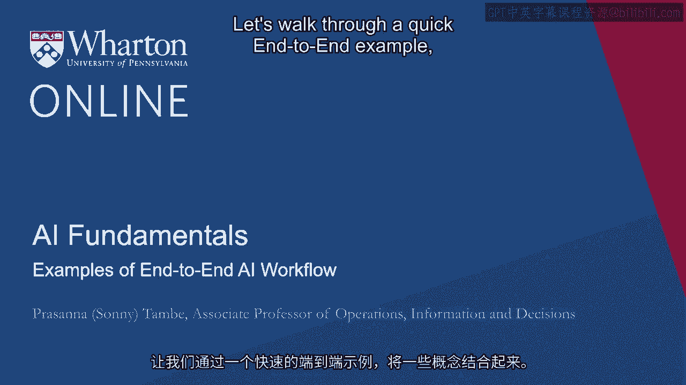
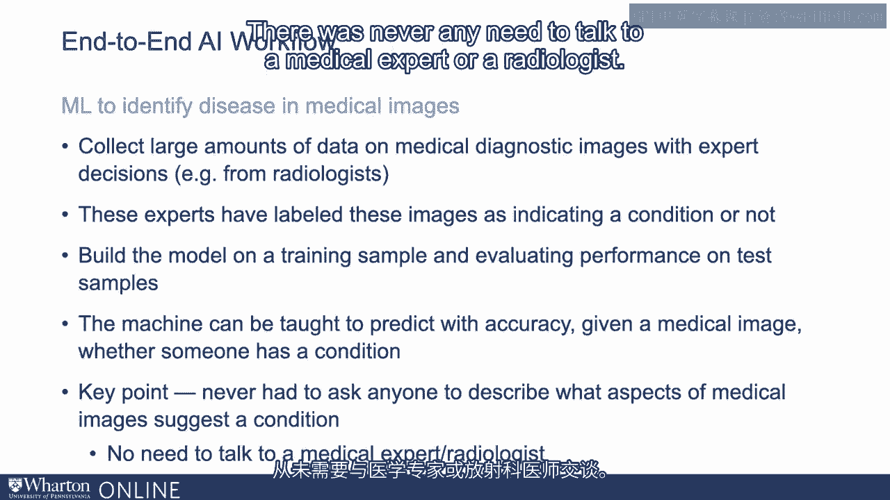
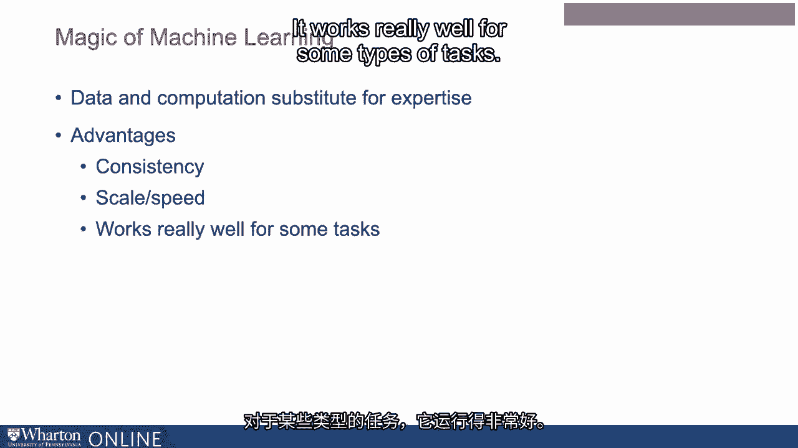

# 沃顿商学院《AI用于商业（AI For Business：AI基础／市场营销+财务／人力／管理）》（中英字幕） - P24：23_端到端工作流程的示例.zh_en - GPT中英字幕课程资源 - BV1Ju4y157dK

让我们快速浏览一个端到端的示例，将这些概念结合在一起。

让我们讨论一个之前提到过的案例，即使用机器学习。

特别是深度学习用于识别特定病症，利用医学图像。

因此在这种情况下，第一步是收集大量的医学诊断数据。

包含专家使用这些图像所做的决策的图像。

想象一下，如果你拥有一个包含大量X光片和放射学决策的数据库，那会怎么样。

根据这些图像做出治疗决策。因此，去医院并获取这样的数据库将是一个良好的起点。

可能生成数年甚至数年的医学诊断图像和决策数据。

最终由放射科医生决定一个人是否应该接受特定的治疗。

是否需要某种治疗。因此这是第一步。第二步是注意这些专家。

在这种情况下，放射科医生已经对这些图像进行了标注。

了解一个病人是否有某种病症。因此，我们拥有一个符合这种结构的数据库。

进行预测任务。我们有大量的图像数据，也有大量的决策已被做出。

因此，我们现在可以使用这些数据来构建一个算法，并评估该算法的性能。

我们要做的是获取这些数据。我们可能将其分成训练样本和测试样本。

在训练样本中，我们可以利用这些图像数据喂给深度学习引擎。

我们可以将放射科医生创建的标签输入给它。深度学习引擎。

神经网络将运行以自我配置。

使其能够以最准确的方式进行预测，与此相符。

放射科医生所做的决策，我们可以利用测试数据确保其有效性。

在构建的算法的各个点上，表现不仅良好。

训练数据不仅包括我们可能接触到的其他样本外数据集。

然后可以教机器根据医学图像预测相对的准确性。

判断某人是否有病症。仅仅通过这几个步骤。

比如从医院获取数据库，它具有正确的结构。

它拥有图像数据，并且得到了专家做出的决策。

我们将数据分为训练和测试数据。我们利用训练数据进行预测。

我们使用测试数据来确保它仍在样本外数据上有效。当它表现良好时。

然后我们可以部署这个算法，让它处理图像。

在判断某人是否有病症时，做出的预测或推荐的准确度相对较高。

这里的一个关键点是，在这个过程中我们从未要求任何人坐下来。

描述医学图像的哪些方面暗示某种病症。

我们并不需要那种医学专业知识。它隐含地包含在数据库中的标签里，但我们不需要询问。

任何人都可以坐下来详细解释一下某种情况的具体表现。

X光片或我们应该如何识别它，或者我们应该如何利用图像来判断。

或者某人是否有某种情况。实际上无需与医疗专家或放射科医生交谈。

这实际上就是机器学习的魔力，即数据和计算将最终。

替代多种不同类型的专业知识。当我们以这种方式进行操作时。

这样做有很多优点。其中一个就是一致性。

如果考虑相对于由人类做出的决策的算法决策。

算法能够提供一致的决策。

无论是在繁忙一天的结束，还是在早晨开始，这都没有关系。

这将保持一致性。显然，这也涉及到规模和速度的问题，因为经过训练的算法。

准确做出决策的能力可以扩大到相对准确地做出大量决策。

这在某些类型的任务中表现得非常好。

如果任务能够按照我们之前讨论过的方式进行结构化，那么给定一些。

现在新兴的深度学习工具，以及考虑到深度学习的事实。

可以处理标记的原始非结构化数据，而机器学习算法将完成其余部分。

实际上，构建这些解决方案可能比。

需要和某人深入交谈他们的专业知识。 [BLANK_AUDIO]。

