# 沃顿商学院《AI用于商业：AI基础/市场营销+财务/人力/管理》（中英字幕） - P122：21_AI和药物的例子.zh_en - GPT中英字幕课程资源 - BV1Ju4y157dK

在之前的视频中，我解释了AI如何影响创新，以及哪种类型的创新。

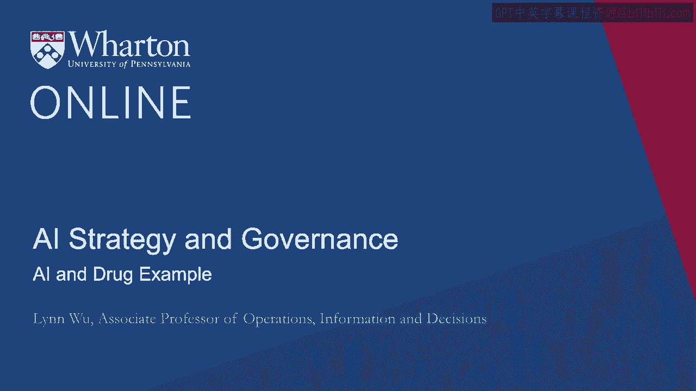

组织结构、实践、雇佣变化、管理变化都是相关的。

企业需要有效利用AI，这可能听起来有些抽象。

尽管我立刻给了你许多例子，例如IBM Watson，Hallosine。

汽车底盘、艺术。让我深入探讨药物行业或制药行业，以便提供。

我给你一个例子，说明在药物领域究竟发生了什么。药物创新非常重要。

尤其是在我们刚经历疫情之后。总共有大约30种。

由各种细菌和病毒引起的000种疾病，只有三分之一可以治疗。

药物的生产成本极高，通常需要超过10年。

一种典型药物的生产成本为20亿美元，部分原因在于。

药物发现的复杂性是非常、非常、非常大的。

人体生物系统极其复杂，涉及到更多的组合空间。

超过10的60次方分子。

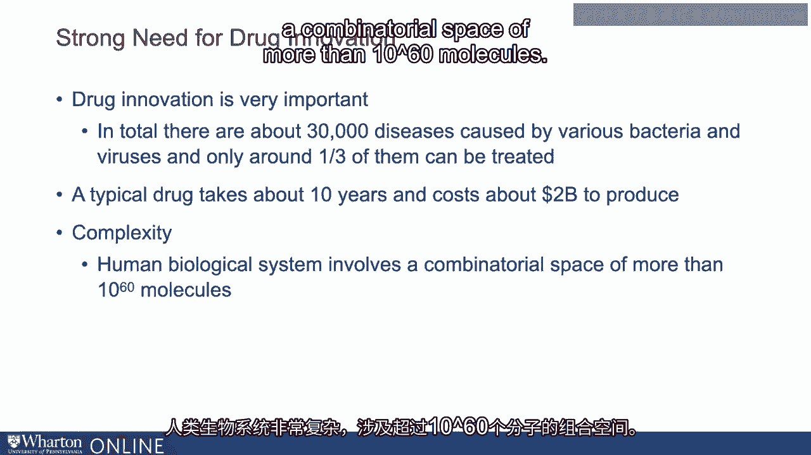

因此，我们看到了COVID-19疫情和超级细菌，抗药性。

超级细菌，我们几年前见过埃博拉疫情。

我将向你展示AI如何可能解决这些问题。

这是许多制药公司，无论大小，心中关注的问题。

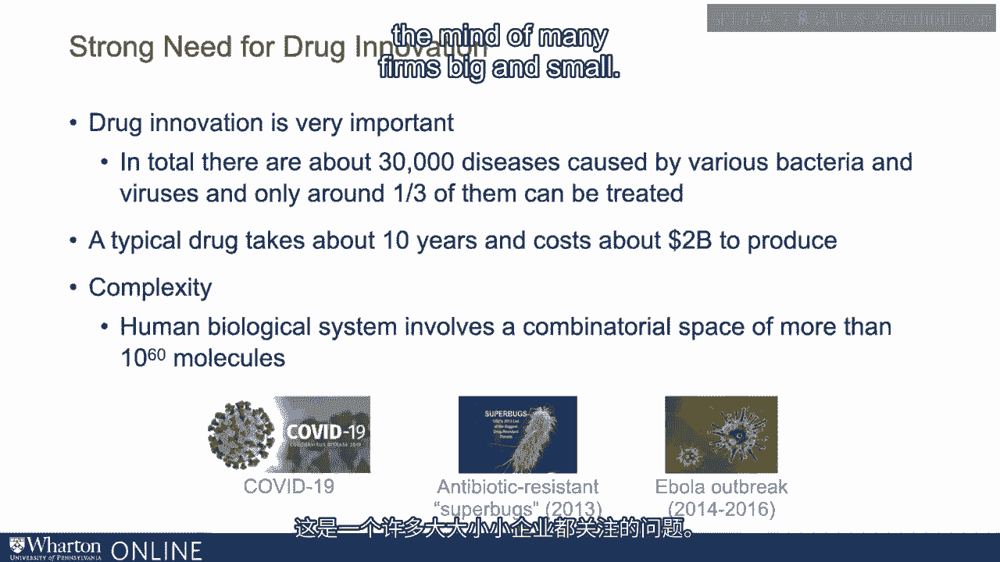

对他们来说，AI具备纠正和解释外部数据并从中学习的能力。

数据并利用这些学习来实现特定目标，税收是至关重要的。

那么，AI对药物的影响是什么？我们如何使用AI来利用已知药物化合物的数据，并预测该化合物。

实际上，能否开发出人类可以安全消费的药物？

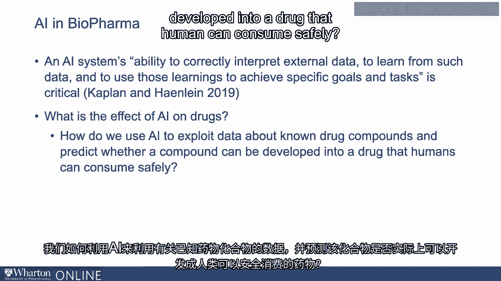

Atomize和许多其他初创公司开发了复杂的深度学习神经网络。

在我们关于药物、生物相互作用等丰富数据上进行了部署。

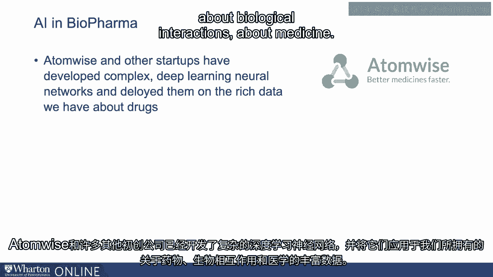

医学。由于这庞大的数据集。

两种新的药物化合物可以被发现用于埃博拉。

一周内识别出这种疾病，并提交了相应的专利。

这实际上对于许多其他情况也是相当典型的。

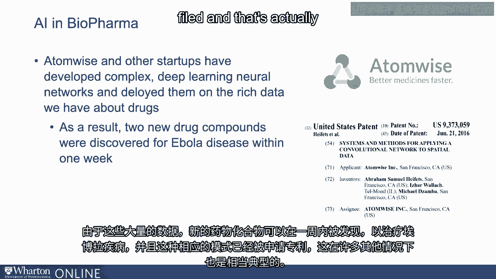

这就是制药行业的AI投资，它反映了一个更大的趋势。

尤其是在最近几年，制药公司在AI方面的投资巨大。

我们真正感兴趣的是药物作为创新。

AI在多大程度上能真正帮助解决这个漫长复杂的创新过程？

并且请记住，在我们的综合研究中，我们展示了AI在发现重组方面确实很出色。

关于创新或中等新颖性，从引用来看，AI在最佳位置表现最佳。

50-60%来自你自己的知识，40-50%来自他人的知识。

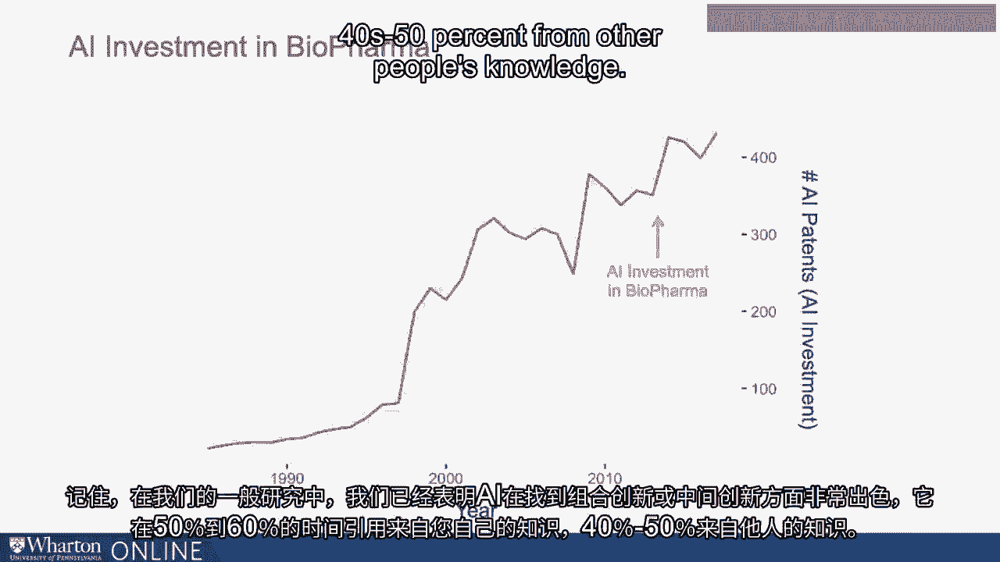

我们为药物新颖性进行了复制。所以在这里，药物新颖性是通过化学新颖性来衡量的，具体是它的结构如何。

相较于所有这些相同的化学化合物，它是新颖的。有趣的是。

我们发现非常相似的事情，尽管它的测量并不完全相同，涉及重组。

然后我们发现一般来说，AI在中间范围内表现很好。

所以AI在寻找你之前从未见过的全新化学化合物时并不是很好。

对于增量创新是有效的，但效果并不显著。但书中最大的内容是与中等水平有关。

AI确实可以帮助制药公司找到药物和中等水平的新颖性。

如果你考虑中等水平的新颖性，它可能会是某种类型。

关于重组创新。

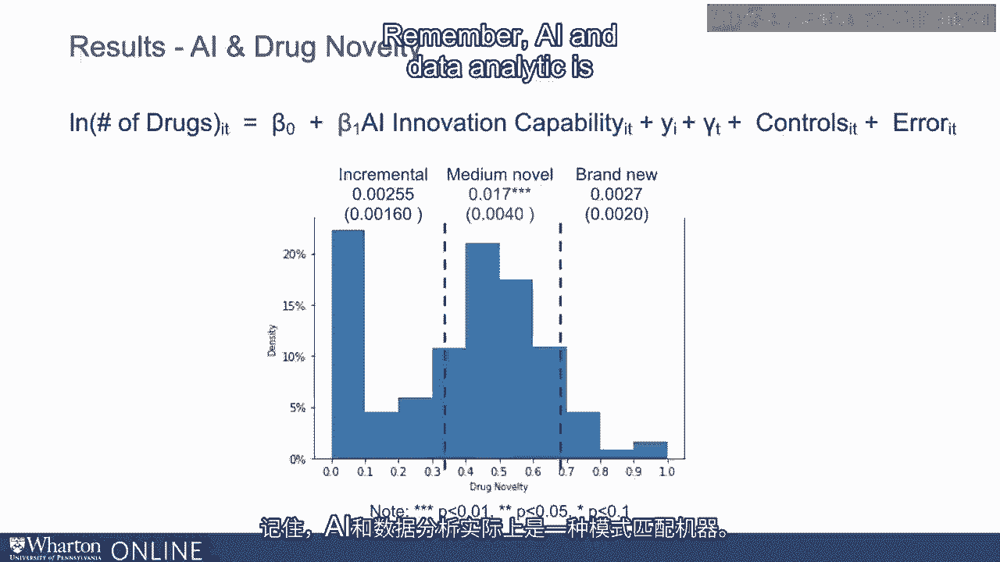

请记住，AI和分析实际上是一个模式机器。

它发现各种相关性，并利用这些相关性进行预测。

但我们都知道相关性并不等于因果关系。如果你找到错误的相关性。

这意味着在药物行业中一个20亿美元的错误。因此即使它可以提出很多、很多的方案。

有许多潜在的化学化合物可以解决某种疾病情况。

许多相关性可能只是虚假的。它可能是错误的。

那么我们如何知道哪个是哪个呢？因为事实可能会很戏剧化。

如果目标或化合物错误，AI可能对药物创新产生负面影响。

被选为进一步开发的药物。所以我们通过将这些药物化合物分类来研究这个问题，以了解我们知道些什么。

机制对它们如何针对或治疗疾病的影响，或者如果我们不知道机制。

所以我们观察AI对这些药物或我们发现的新化学化合物的影响。

通过AI。所以第一栏是当没有找到机制的情况。

所以我们不知道这个特定药物如何针对这些机制。

但我们知道许多药物有效，但我们并不确切知道如何。如果我们确切知道如何。

也许创造药物会更容易。这就是为什么我们有时许多由病毒引起的疾病很难治疗的原因。

机制的转变，我们不知道确切的机制。

我们是细菌，我们知道，因为我们知道抗生素如何杀死细菌。

在这种情况下，我们知道机制是什么。所以当没有已知机制时，第一栏显示AI的影响是微乎其微的。

几乎是零。所以当你不知道机制影响时，AI并不能帮助你找到化合物。

这很有意义，因为你在寻找相关性时是盲目的，不知道哪个是哪个。

相关性是正确的，但无论你发现什么相关性可能都是虚假的。

不过，如果你知道在细菌的情况下机制，当你找到。

你知道它会有效。你知道它为什么有效。好的。

当你能够验证时，因为你知道如果你已经知道。

机制和人工智能可以产生很大影响。好的。但即使是已知机制，你也会看到，在化学新颖性方面。

三个图表，真正的中间新颖性正在推动这一事实。

即使你知道机制，如果它的影响真的很小，基本上化学。

该化合物是现有化合物的增量改进，其效果相对较小。

正面影响相对较小。当它非常新颖时，再次影响几乎为零。

我们看到人工智能对已知机制的影响，大多数来自药物。

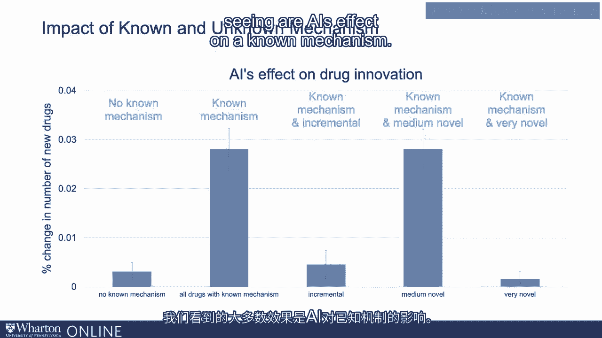

它涉及到中间的创新性。因此，主要的结论是，很难知道哪些药物候选者是真实的。

哪些是错误的。再次，人工智能是一台出色的数据挖掘机器。

发现各种相关性和模式，以及你从未想过的隐藏联系。

你从未见过的。例如，以新的方式组合事物。

或者一种连接你未曾见过事物的方式。

但在寻找真正新颖的药物化合物方面，这只是，你知道，接下来。

影响相对较小。但这并不意味着这种新的组合和新的方式没有益处。

它们极其有益。这就是我们发现 Hellesine 可能帮助我们解决下一个超级细菌问题的方式。

这就是我们如何利用人工智能找到 COVID-19 疫苗。因为它们不一定是激进的。

这是因为它们是组合事物的新方式。这仍然意味着这是非常有用的。

但这里的关键是考虑创新是否真的是重组创新。

无论你是否已经知道它如何影响疾病的机制。

该机制的影响确实帮助你辨别虚假相关和真实因果关系。

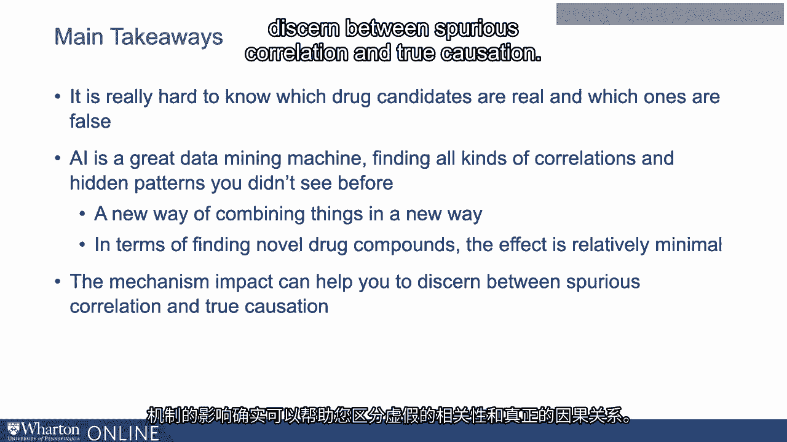

我们如何看待这种新颖创新，实际上是这种新类型的首创，对吧？

如果你仔细想想，正如我之前在我们的早期研究中提到的，我们没有看到。

在专利研究中。我们看不到人工智能在这种首创创新上的影响。请记住。

确实在之前的视频中，他班级的第一项技术。

如果你考虑人工智能如何影响这些创新领域，在药物方面，情况很复杂。

因为它们如此新颖，关于该特定药物的数据非常有限。

那个特定条件。临床经验中有很多隐性知识。

对吧？而且这并不完全是可编码的。在人工智能、机器学习和数据分析能做的事情上非常有限。

当这种隐性知识无法使用时，聚合和检测模式。

不能编码。如果你考虑突破性药物，即针对疟疾的新疗法。

这是由Dr。Yu Yu 2发现的。她是2015年的诺贝尔奖获得者，好的？

这款药物来自一段古老的中文文本，好的，结合了她的临床经验。

对疟疾病情的专业知识和深入理解。这就是Dr。

Yu Yu 2将那段古老文本与第一款疟疾药物疗法的创造联系了起来。

再次，在这种情况下，人工智能实际上做不了太多。数据有限，即使有多于一条数据。

你知道，人工智能无法使用这些数据。它们需要的数据远远不止这些。

而且大量的临床经验、隐性知识，对人工智能而言无法编码。

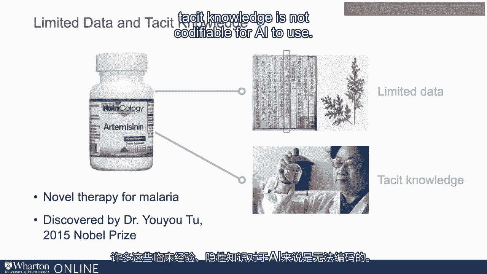

也许有一天它们会出现。当它们准备好被使用时，或许我们能取得突破。

但现在隐性知识尚未能够编码。

我们能够使用人工智能进行这种类型发现的事情非常有限。

所以主要的结论是，人工智能可以在药物发现的早期阶段提供帮助，但目前还无法做到。

发现阶段的机制是它可以通过数百万种化合物进行筛选。

在非常短的时间内。我发现了很多相关性。

有很多以前未见过的模式。这些模式对于生成关于特定药物的假设至关重要。

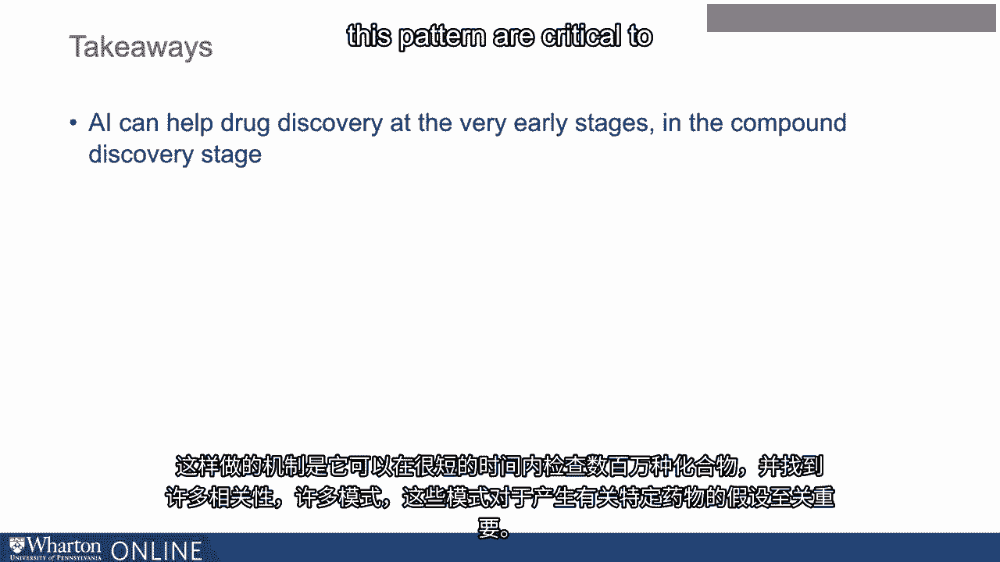

当你已经知道该药物的机制影响时，这种事实尤其强大。

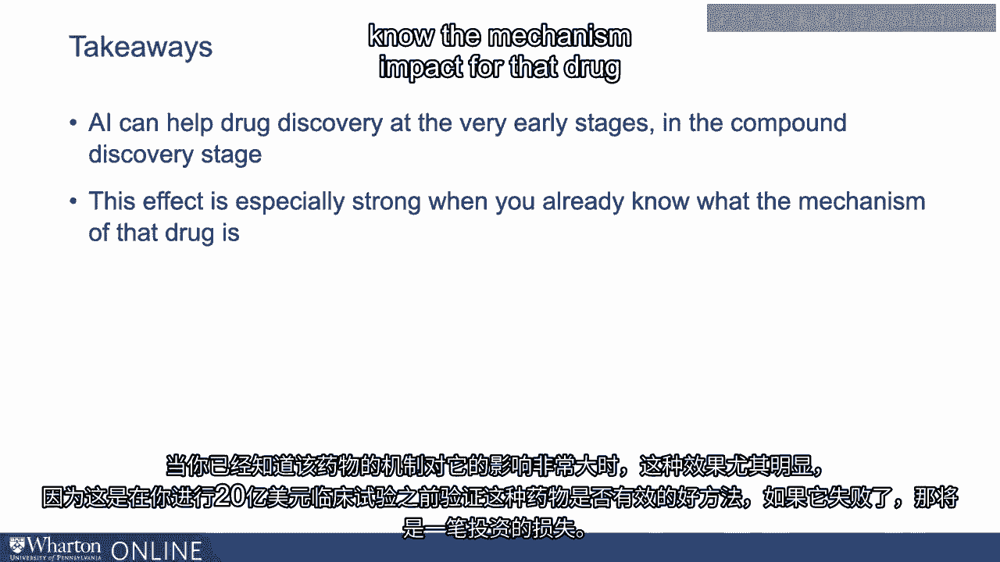

是的。这是验证这款药物是否有效的好方法。

在你走上价值20亿美元的临床试验路径之前，弄清楚这种药物是否有效。

如果在临床试验中有效，那就算成功；如果不然，那就是失败。这就是投资的浪费。

而且我们看到，利用专利数据进行创新时，人工智能确实在药物研发中提供了帮助。

通过寻找中间的新化合物来发现。

这些与重组创新非常相似。但对于真正的新药疗法。

通过新的化学创新手段，仍然受到限制。

使用它是因为没有关于那种特定药物的数据。

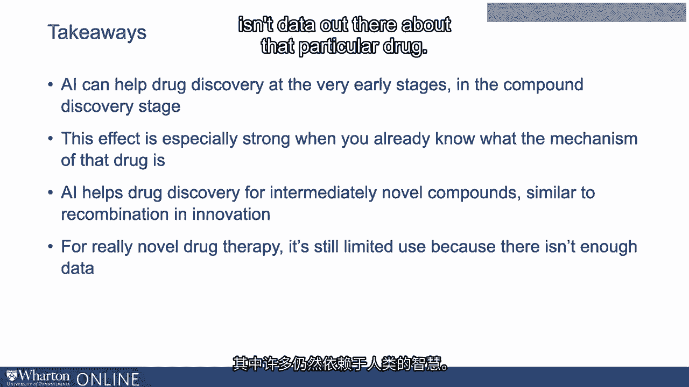

而且在很大程度上，我们几乎仍然依赖人类的聪明才智。[BLANK_AUDIO]。

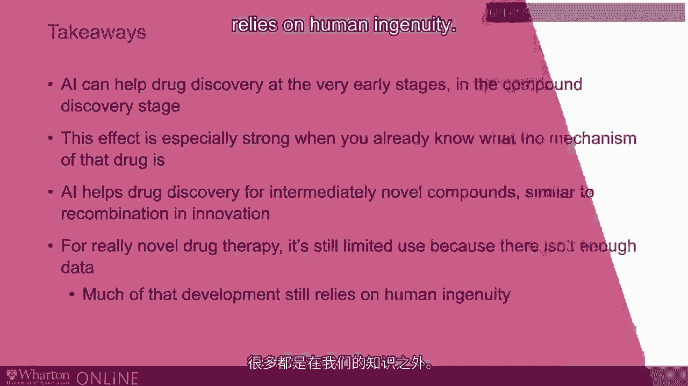
