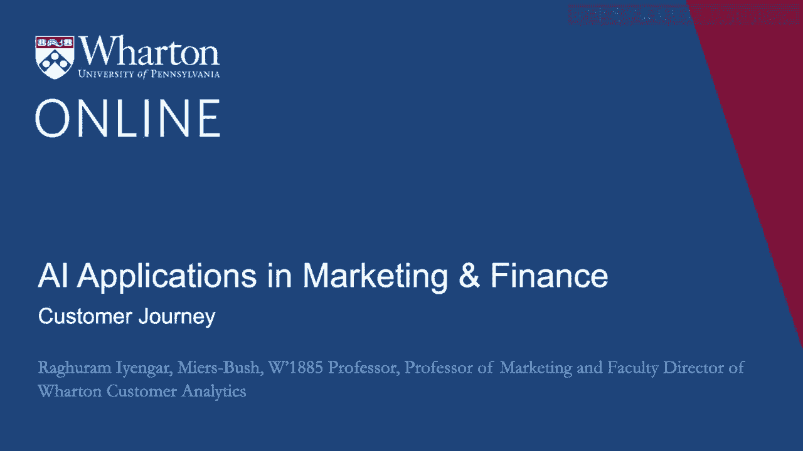
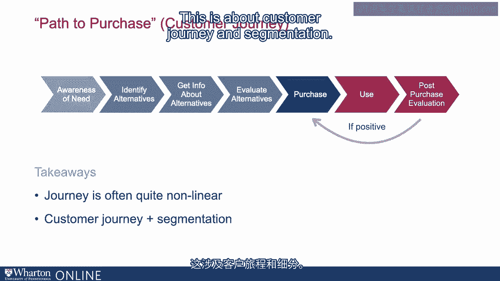
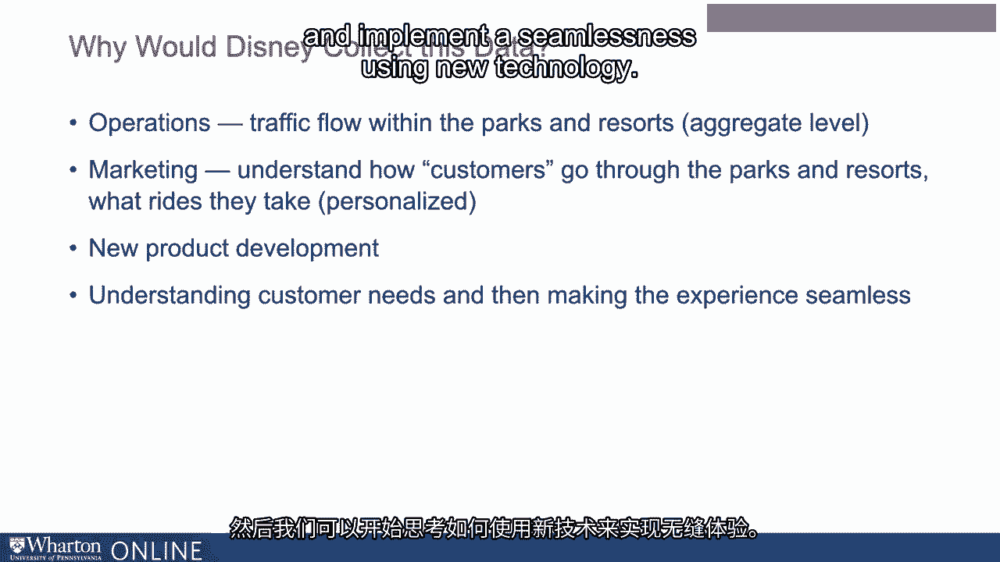
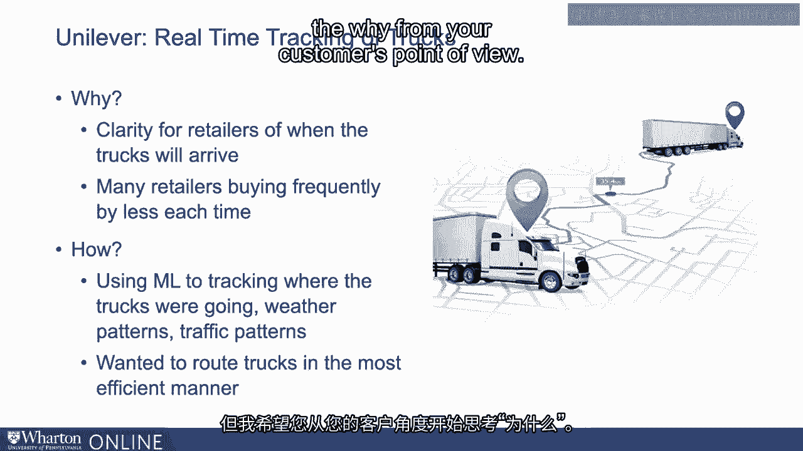
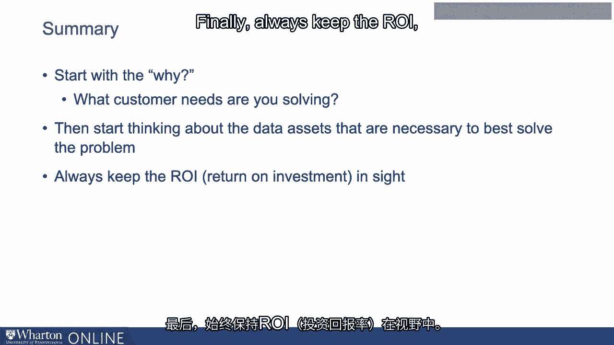

# 沃顿商学院《AI用于商业：AI基础／市场营销+财务／人力／管理》（中英字幕） - P36：2_客户体验.zh_en - GPT中英字幕课程资源 - BV1Ju4y157dK

所以在这个模块中，我们将讨论客户旅程。

在之前的内容中，我们讨论了很多AI应用。

我认为思考AI应用的最好方式是考虑客户需求。

而思考客户需求的最好方式是什么呢？就是思考他们的旅程是怎样的。

所以如果你考虑一个典型的客户旅程，它始于对需求的意识。

你开始思考也许你想买一件新毛衣，假设。

然后你开始查看考虑集，即。

市场上有什么公司能帮助我找到一件好毛衣？

然后你开始仔细评估所有不同的选择。

也许在那之后做出购买。然后你继续说，嗯，这次购买怎么样？

所以如果是积极的，你显然会得到积极的反馈。如果是消极的。

也许你可能需要重新开始。但是，正如你所想象的，在这个时代。

当你开始思考所有不同的AI应用时，外面有很多，比如说。

当一个客户在思考一件毛衣时，假设，我们以这个例子为例。

他或她可能在看Instagram。也许他们的一个朋友有一件漂亮的毛衣。

在Instagram上。或者他们可能会访问一个网站。或者他们可能会查看客户评论。

他们可能会经历这个旅程的一部分，然后决定，嗯。

他们想重新开始，因为他们感兴趣的产品并不存在。

可用的。最大的收获是什么？最大的收获是客户旅程。

我之前画的那幅画是非常线性的。你有意识，然后你有。

在某种意义上，考虑集。然后你有了你的选择。

然后你会考虑这个选择有多好。如今。

你发现这个旅程是相当非线性的。这在某种意义上。

有时是一种限制。你可以考虑它。但我认为从AI应用的角度来看。

这是一个机会，因为消费者，首先，A。

需要帮助以思考如何进行他们的旅程。对于公司来说，你可以。

开始思考你的AI应用在哪里——无论是语音、视觉还是语言——。

无论情况如何，他们如何在客户旅程中提供帮助？

这就是我们想讨论的。这样做时，暂时离开技术。

并开始思考客户旅程和客户需求。

然后开始思考在哪里，需求能得到最好的满足。现在。

我想提到的另一件事情是幻灯片所暗示的每个人的客户。

旅程可能会有很大不同。这是关于客户旅程和细分。

没有两个客户是相同的这一想法。现在，再次。

有时你可以把这看作是一个限制。你可以把它看作一个挑战。

但我希望你再次把这看作是一个机会。

因为这是人工智能和所有可能性的结合，能够进行定制。

能够了解哪个客户在移动。

在他们的旅程中，了解他们处于哪个阶段，这就是机会所在。

所以让我们举一些例子来理解，如何思考这些问题。

让我们以一个非常受欢迎的例子——迪士尼来举例。我们中的许多人当然可能去过迪士尼度假区。

或者当然，必须听说过迪士尼。现在，迪士尼投入了很多资金。

正如你在这里看到的，有很多流行词，比如说。

迪士尼在物联网方面花费了数十亿美元。还有大数据。

机器学习，所有这些。这里的想法是什么？

这个想法基本上围绕着一种叫魔术腕带的东西。

幻灯片上的这个人戴着魔术腕带。

这个想法是魔术腕带基本上可以在某种程度上给你。

作为客户有很多信息，同时也给迪士尼提供了很多信息。

让我给你一个它提供的信息的例子。

所以如果你在去迪士尼度假区之前购买魔术腕带，你可以放入很多信息。

在那条魔术腕带中。例如，你住在哪里，如果你住在度假区。

你可以使用魔术腕带打开你的酒店房间，还可以充值。

在无现金交易中，你可以选择你想去的项目。

迪士尼以前有一种叫快速通行证的东西。

他们试图用魔术腕带替代这一点。从客户的角度来看，当然。

有很多机会，很多有趣的事情正在发生。

但让我们从迪士尼的角度稍微思考一下。现在。

从技术的角度来看，显然，这是一个非常有趣的投资领域。

在大技术、大数据和机器学习中。但让我们从迪士尼的角度开始。

想想他们为什么要投资这种技术，他们为什么要关心这些数据。

所以这里有很多事情在进行中。让我们一步一步来。现在。

从运营的角度来看，这对迪士尼来说是一个很大的帮助。

你可以想象，在迪士尼度假区，交通流量是一个大问题。

所以你可以想象，如果你和家人一起去度假区。

但外面还有很多其他家庭。迪士尼正在考虑。

不同家庭的需求，他们想去哪里，想玩什么项目。

度假区某一特定部分的交通情况，他们如何获取这些数据？嗯。

早些时候，他们在某种程度上必须尝试从快速通行证中获取这些数据。

但现在一切都数字化了。所以从运营的角度来看。

他们可以快速获取度假区内交通流量的信息。

显然这对运营人员有帮助。现在，从市场营销的角度考虑。

从迪士尼的角度来看，他们也想要理解。

你对哪些游乐设施感兴趣？有哪些事情让你感到兴奋。

你在计划这次迪士尼之旅时？现在，显然理解客户正在经历什么。

理解他们想要哪些游乐设施，了解他们的期望是什么。

这对迪士尼来说是一个巨大的优势，因为他们可以个性化所有这一切。最后，当然。

从新产品开发的角度来看，这同样令人兴奋。因为你可以开始思考。

人们可能在寻找哪些东西。显然，迪士尼现在有迪士尼Plus。

流媒体平台。所以你可以想象这里有很多有趣的事情。

在前往迪士尼度假村、使用迪士尼Plus以及利用所有这些信息之间的互动。

对于新产品开发。所以更广泛地说，我想思考的内容。

在我们继续之前，我再给你一个例子。

在这个阶段的思考是，少考虑技术本身，而更多考虑客户旅程。

客户的需求是什么？有哪些事情能让他们的体验更加无缝？

然后我们可以开始思考，如何去实现无缝衔接。

使用新技术。我们再举一个例子。这次从企业对企业的角度。

就像我们谈论在迪士尼度假村内跟踪客户一样，联合利华。

大型消费品公司，消费者包装商品公司。

他们还实现了货车的实时跟踪。现在你可以想象，嗯。

这两个应用程序是相当不同的。确实是这样。

但让我们先从基本问题开始，为什么。现在他们为什么想这么做？

他们是联合利华。现在，他们的客户是谁？他们的客户通常不是你和我。

作为个体客户。他们的客户是企业。现在。

你可以想象还有其他的商业需求。所以想想零售商。

零售商想知道库存在哪里？他们什么时候能收到下一个货运？

所以再次从他们的角度来看，他们希望能有更好的想法。

了解联合利华的货车什么时候到达。所以这是一个例子。

另一件联合利华发现的事情是，许多零售商也就是他们的客户。

希望更频繁地购买，但每次购买的东西更少。

在他们开始跟踪货车之前，这对联合利华来说是相当繁重的。

不断派送货车。所以这是我希望你开始思考的问题。

每当你开始考虑使用新技术时，首先要问的就是为什么。

你解决了什么客户需求？当然，在此之后，如何同样重要。

你将如何进行？这就是机器学习等技术介入的地方。

联合利华最后做了什么？他们开始思考，从某种意义上说，像是货车的优步。

他们开始追踪卡车的行驶路线，天气状况如何。

交通模式是怎样的，他们想做什么？他们基本上想要。

从某种意义上讲，最有效地让卡车出发，使它们能够，A。

尽可能按时完成更多的交付，以及B。

还要确保他们不需要进行重复的出行。因此他们最后做的就是这样。

他们基本上成功地追踪了那些卡车，减少了自己的碳排放。

他们实际上增加了卡车上物品的数量。

所以这是一个双赢的解决方案。但请注意我们提问的顺序。

为什么应该是第一个问题？当然，如何也非常重要。

这就是新技术的用武之地。但我希望你考虑一下背后的原因。

从客户的角度来看。

所以在我们转向客户旅程的其他方面之前，简要总结一下我们所讨论的内容。

这些是我希望你提出的管理问题。首先要问的是为什么。

你正在解决什么客户需求？无论是我们在迪士尼举的B2C例子。

或者是我们在联合利华举的B2B例子。

我认为客户需求是相当普遍的。所以站在客户的角度去思考。

思考他们面临的障碍。考虑你可以帮助他们解决哪些障碍。

然后开始考虑数据资产，以及所有必要的其他技术。

去解决这个问题。最后，始终关注投资回报率（ROI）的洞察。

很多时候，作为经理的我们可能会对我称之为最新的闪亮物体感到非常兴奋。

我认为保持兴奋是好的。知道未来会发生什么是好的。

但一旦你开始思考投资回报，这就会让你认真考虑。

关于我应该把资金放在哪里，以及我可能应该进行一些测试的地方。

在我决定投资之前。[BLANK_AUDIO]。

