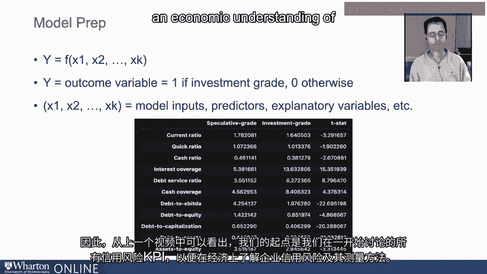
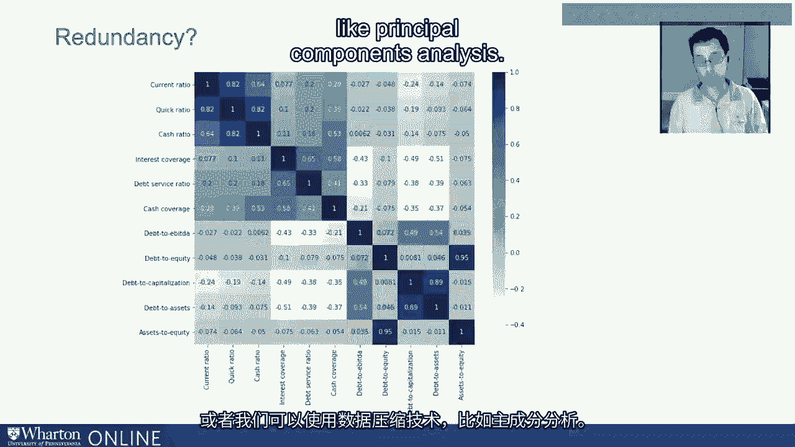
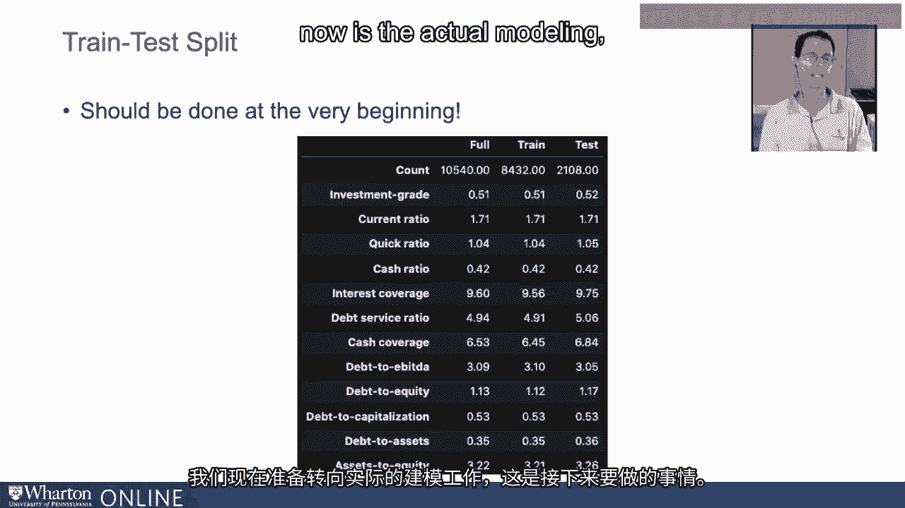

# 沃顿商学院《AI用于商业：AI基础／市场营销+财务／人力／管理》（中英字幕） - P54：20_信用风险模型准备.zh_en - GPT中英字幕课程资源 - BV1Ju4y157dK

好的，我们正朝着模型训练和测试迈进。

继续准备这个建模过程。为了明确，我们来重置一下场景。

对吧？这里的目标在某种意义上是估计一个函数 F。

使用一系列输入变量或预测变量，帮助分类。

我们的结果变量 y 要么是投资级，要么是投机级。对吧？

所以 y 是我们的结果变量，若为投资级则为一，其他情况为零。

是一和负一，这无关紧要。这些 x 代表我们的模型输入或预测变量。

因此，在上一个视频中，我们开始了这个练习的起点。

将是我们一开始讨论的所有信用风险 KPI，以便获得经济。

了解企业信用风险是什么以及我们如何衡量它。

说到这里，我要查看这些预测变量的相关矩阵。

我已经以热图的格式完成了这一点。让我解释一下这个五彩缤纷的图像所展示的内容。

每一行和每一列对应不同的变量组合。对吧？

第一行对应当前比率，第一列为当前比率，第二行。

速动比率，第二列，速动比率，依此类推。

矩阵中的每个数字对应一对变量之间的相关性。

现在你会注意到，在对角线上，它们全是 1，因为。

这些代表变量与自身之间的相关性。

所以当前比率与当前比率之间的相关性为一，正如相关性。

资产与股本比率和资产与股本比率之间。

着色只是为了帮助识别更强或更弱的相关性。

较强的相关性被识别出来，我需要在这里保持谨慎。

你的正相关通过较深的颜色来识别。

这是规模，1 是最强的。较强的负相关通过较浅的颜色来表示。

我们没有任何完美负相关的情况，但我们确实有一些相关性。

低于负 0.4 的值，甚至负 0.5 的情况，例如债务与资产比率和利息覆盖比率。

现在我为什么要向你展示这个？我在幻灯片上标注了冗余的问题，因为我们第一次介绍这些。

我们在度量时，基本上是根据它们不想要测量的内容进行了分组。

所以第一组流动性指标，包括当前比率、速动比率和现金比率。

他们都在尝试获取流动性指标。现在这并不令人惊讶。

它们也是正相关的，仅仅从观察来看。

数字以及阴影的深度，它们是非常强的正相关。

同样，我们也有一些非常强烈的负相关指标。

当我们考虑债务与资本化比率相对于利息覆盖比率时。

或者债务与资产比率与利息覆盖率，我们的分子和分母都是债务。

分母。所以这里有一个非常强的负相关。

这个练习的目的是提出一个想法，即我们可以把这些。

将变量放入模型中，让它解析哪些有效，哪些无效。

这并不总是最佳策略。模型的简约性或简单性是非常重要且相当有用的。

当涉及到样本外预测时。因此，我们可能需要削减我们所看的变量数量。

这也是我们稍后会调查的内容，但需要注意。

当然，任何完全相关的东西都会造成各种问题。

针对模型。所以这是我们可以从这个相关矩阵中识别的其他内容。现在。

在数千个变量的情况下，查看并可视化那个矩阵是完全。

不切实际，但我们当然可以通过编程方式逐步分析，或者我们。

可以使用数据压缩技术，例如主成分分析，这样的东西有点。

超出了我们今天要讨论的范围。好吧。现在。

我想讨论的下一件事是训练测试拆分，这应该在。

这个过程的开始。所以我在这里做了一些不该做的事情。

但这在某种程度上缓和了讨论的流畅性。我们需要做的是将那份数据样本拆分成几部分。

一个我们将用于训练模型的训练部分，估计我们的模型，尝试。

找到最佳模型，然后是一个测试部分或保持样本，我们只看一次。

我们已经确定了一个模型。看，我们想要避免的是过拟合。

我们不想建立一个能够非常好地描述我们拥有的数据的模型，因为那样就会。

当新数据进入时，它可能表现得非常糟糕。分类准确性可能非常差。

所以我们真的希望在我们拥有的数据上训练模型，只有在我们确定之后。

在一个模型上，确定在测试数据的后端是否值得。

所以我们要对我们的样本进行训练测试拆分。我将会执行这个操作。

所以这里是我们的完整数据集，共有10,540个观察值。我的训练数据有8,432个观察值。

我的测试数据有2,108个观察值。我在这里展示的是我们所有预测变量的平均值。

以及结果变量。所以投资等级是一个指示符，当观察值为投资等级时，等于1。

否则为零。我在这里展示的是这些变量在完整数据集中的平均值。

训练和测试子样本非常相似。实际上，如果我真的。

我在这里没有向你展示的是我们的测试统计，统计上。

测试这些数字之间的差异，它们都非常小。

因此，它们在经济上和统计上是不可区分的，这正是你应该预期的。

如果你随机分配观察值到训练集和测试集。所以让我总结一下。

我们已经完成了所有的数据采集验证，以及数据准备/模型准备。

而我们现在准备过渡到实际建模，这就是接下来的内容。

接下来是。[空白音频]。

