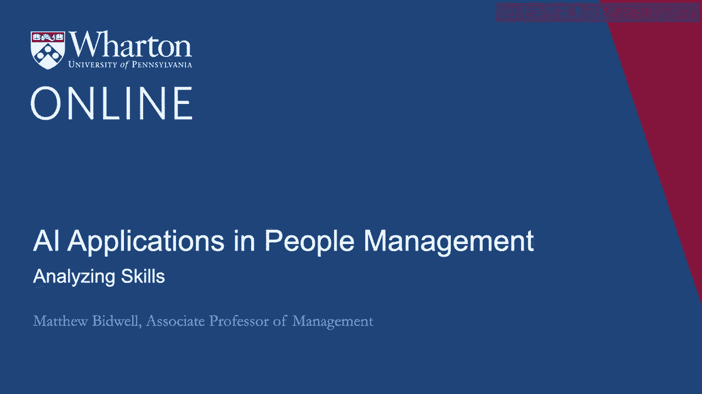
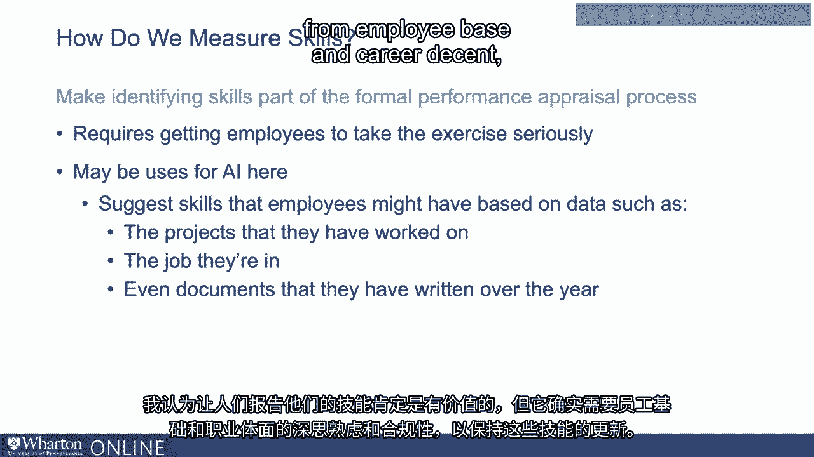
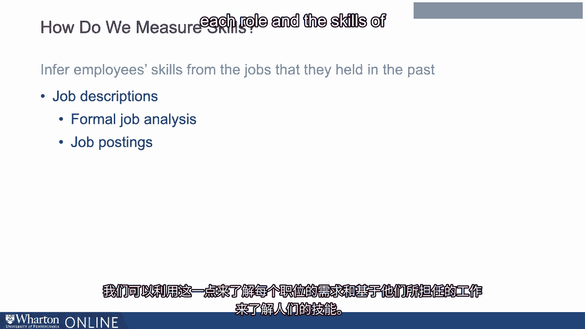

# 沃顿商学院《AI用于商业：AI基础／市场营销+财务／人力／管理》（中英字幕） - P80：17_技能分析.zh_en - GPT中英字幕课程资源 - BV1Ju4y157dK

所以很多正在朝这个方向发展的组织，试图建立。

一些基于真正理解他们技能的想法的应用程序。

员工技能，现在正试图弄清楚我们可以做些什么来真正衡量技能。

员工和他们转岗的工作都是这些系统的输入。

总的来说，我们可以采取几种方法来衡量技能。

所以确定人们拥有什么技能的一种方法很简单，就是问他们，好吧。

你想让他们列出他们所拥有的所有技能，然后你也要。

想要要求他们在学习新东西时继续更新那个档案。

合理。这里的一个挑战是让人们实际上填写这些档案并保持更新。

使其保持最新。有几个方法是组织为实际维护这些档案所采取的。

这些技能档案。一个是确实在为人们报告他们的技能创造强烈的激励。

所以有一些组织开始关注外部世界，并说，你知道，什么是。

真的令人沮丧的是，LinkedIn对我们雇主技能的数据要好得多。

我们自己也这样做，通常会想到，但如果我们创建自己的LinkedIn呢？

也许如果我们能创建内部档案，特别是如果这些档案是有用的。

内部获得工作时，人们也会在此填入他们的技能数据。

根据我所听到的，这些努力并不总是取得良好的效果。

我认为这些内部LinkedIn项目常常面临鸡与蛋的问题。

鸡蛋问题，对吧，如果我知道招聘者会看这个档案，我就很高兴填写。

你会查看这些技能档案，招聘者也很高兴查看这些技能档案，如果。

每个人都填好了。但如果双方都不开始，那我们就永远无法真正推动进程。

因此，我认为这些尝试取得的成功是参差不齐的。一些组织在衡量技能时采取的第二种方法就是。

将识别他们技能作为正式绩效评估过程的一部分。

所以每年我会接受绩效评估，也许我得为自己设定目标。

明年。我必须报告我掌握的所有技能，以及我今年所学到的内容。

这些事情有效吗？再说一次，这里的一个挑战就是让员工认真对待这个过程。

有些可能会这样做。其他人可能只是变成一种走过场的检查。我的意思是。

我认为这是AI还有其他用途的一个地方，所以一些组织。

已经进行了实验。如果我们能建议他们可能拥有的技能。

也许这会帮助这个过程。他们可以勾选他们拥有的技能，忽略其他的。

你知道，我们怎么能做到这一点？我们可以基于他们参与过的项目来进行。

他们所在的工作，其他人在该工作中具备的技能是什么。

我们甚至可以开始查看他们多年来写的文档和资料。

并利用这些数据编码出他们可能使用的技能。

这里肯定有机器学习的应用，无论它是否准确。

是否足够可靠，或者我们是否需要人们至少确认其准确性。

这仍然是一个开放的问题。是的，我认为让人们报告他们的技能绝对是有价值的。

但这确实需要员工基础的深思熟虑的工作，嗯，没错。

有相当不错的合规性。

他们保持这些技能的最新状态。所以，如果我们无法让员工报告自己的技能。

还有什么我们可以做的呢？好吧，我们可以尝试理解人们具备的技能的另一种方法是查看。

他们所担任的工作。好吧，所以一个很好的简化策略基本上是说，嗯。

不仅技能决定人们现在能做什么工作。

而且技能还决定他们过去能做什么工作。

所以我应该能够假设，任何人从事的工作，他们要么具备所需的技能。

在工作中需要的技能。所以通过查看人们过去经历的一系列工作。

我对他们应该具备的技能有一个不错的了解。好吧，显然为了做到这一点。

我们需要知道每个工作的技能是什么。我们如何弄清楚这一点？你知道吗。

再次，有多种方法。因此一种是我们可以使用现有的数据库。

这里最常见的一个是，称为O-Starnet或O-net。这是一个政府数据库。

他们考察了大约900个职业，即我们在经济中看到的广泛工作。

对于每个职业，他们编制了一整套技能和能力的代码。

预期在这些职业中拥有的技能。明白了吗？所以，仅通过查看我们组织中的职业以及人们的职业。

在他们之间移动时，我们对他们应该具备的技能有一定的了解。

这里的好处是非常简单，所有的数据都在那里。你知道。

挑战在于，它假设每个职业内的工作拥有相同的技能。

他们并没有。所以，这显然在这方面存在很多测量误差。

但这仍然是很多组织的常见做法，首先获取。

根据人们的工作，我们可以了解我们组织中存在哪种技能。

所以，更准确地理解每个工作的技能要求，实际上是去。

每个组织内工作的描述。

所以有些组织可能会进行一些正式的职位分析，他们所做的是什么。

进行心理学家的介入，以确切了解每个工作的要求。

但这也是一个有些官僚的过程。就像所有这些事情一样。

这些分析可能很快过时。提供更可靠的信息来源关于这些职位分析。

实际上，发布的职位要求在招聘时是什么。

因为最终在招聘时，公司的关注点往往在此。

关于他们在这些工作中所需的内容，人们将做什么，实际上进行规范。

因此，这些职位发布可以成为理解职位技能的良好数据来源。

需要的确，有许多公司，最显著的是一家叫Burning Glass的公司。

他们开发了相当复杂的算法，以分析职位发布并实际。

传授给他们并识别这些工作所需的所有技能。

有时这些分析是跨公司的，因此我认为索尼和彼得会讨论一下。

关于AI如何改变更广泛劳动力市场的一点点。

许多已经进行的研究关注这一点，实际上得出了一致的结论。

以及职位发布作为理解技能需求变化的一种方式。显然，。

这些相同的方法也可以在组织内部使用。

因此，我们可以查看组织内部的所有职位发布，以了解。

这些角色的技能和在职人员的期望技能。因此。

我们应该期待那些经历过这些角色的人拥有什么技能。

然后我们可以利用这些来理解每个角色的需求和技能。

根据他们经历过的工作来评估人员。随着组织变得更加复杂。

让人们自己找到职业变得更加困难。

我们需要给他们指导，帮助他们理解可能性。

但随着组织变得更加复杂，帮助他们理解变得更加困难。

所以这是AI工具真正有帮助的地方，帮助组织理解。

理解职位之间的关系，帮助他们了解组织中的技能分布。

帮助他们建立人们可以通过的职业路径，如果他们想在其中发展职业。

组织。[BLANK_AUDIO]。

