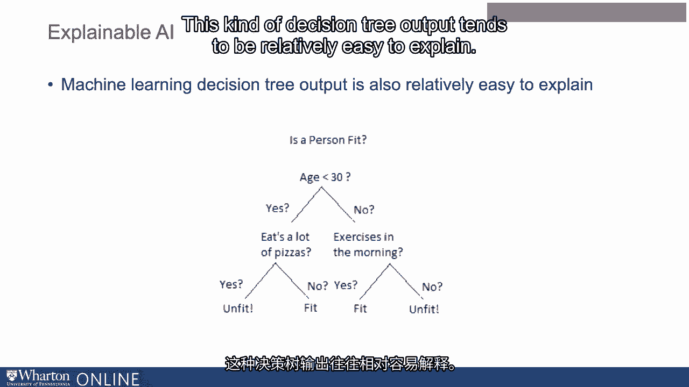
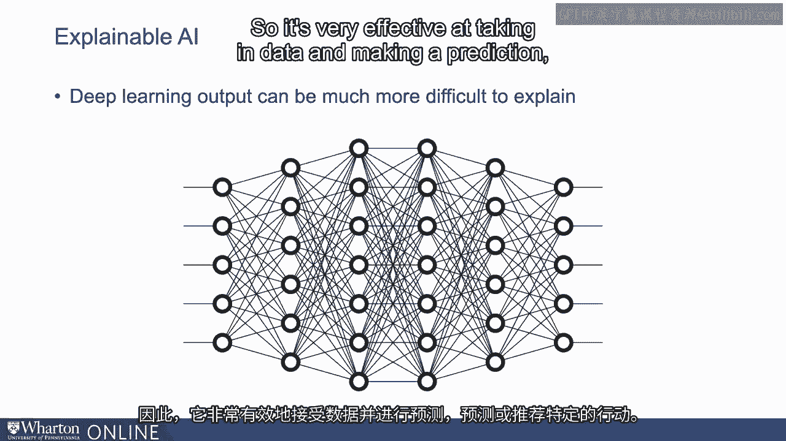

# 沃顿商学院《AI用于商业：AI基础／市场营销+财务／人力／管理》（中英字幕） - P91：28_什么是可解释的AI.zh_en - GPT中英字幕课程资源 - BV1Ju4y157dK

另一个在HR中应用AI时可能出现的挑战和解决方案涉及可解释的AI。

那么什么是可解释的AI？可解释的AI与方法有关，这些方法可以让人类专家理解算法是如何以及为什么做出决策的。

这与一些类型的机器学习形成对比，后者更像是一个黑箱。

因此，一些类型的机器学习会输入数据并得出决策。

我们已经谈论过这个，但进行逆向工程并尝试理解或解释，好的。

嗯，我看到这个决策是由算法做出的。

为什么它会得出这个决策而不是另一个？有时候这可能非常难以追踪。

在许多行业和上下文中，这会造成一些相当显著的问题。

我们将与我们讨论过的一些其他方法进行对比。

我们谈到过基于规则的系统，即人类的专业知识是通过开发者放入算法或软件中的。

这看起来许多时候像一棵树，这些系统往往相对容易解释。

如果你考虑一下决策树，考虑一下你是如何最终到达决策树的某个特定底点的。

很容易追踪树中的不同节点，以弄清楚它是如何得出这个决策的。

这种决策树输出往往相对容易解释。

相比之下，一旦你进入深度学习的世界，这涉及一种称为神经网络的技术。

深度学习的输出可能更难以解释。

因此，它在处理数据和做出预测方面非常有效。

预测或推荐某个特定行动。

但如果我们想回头了解为什么那个系统做出了那个特定的推荐。

这可能是一个相当显著的障碍。对于这些深度学习系统来说，总是有可能的。

在下一个视频中，我们将讨论这在许多上下文中为什么重要。[BLANK_AUDIO]。

