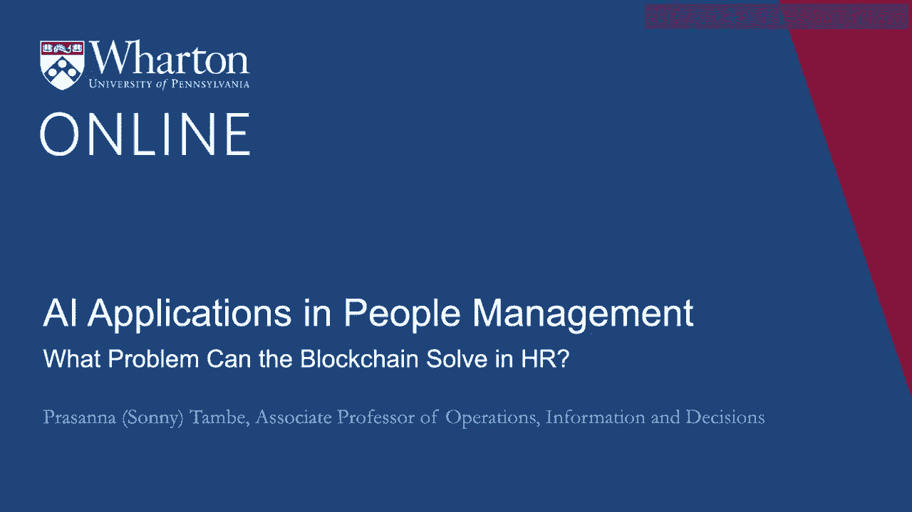
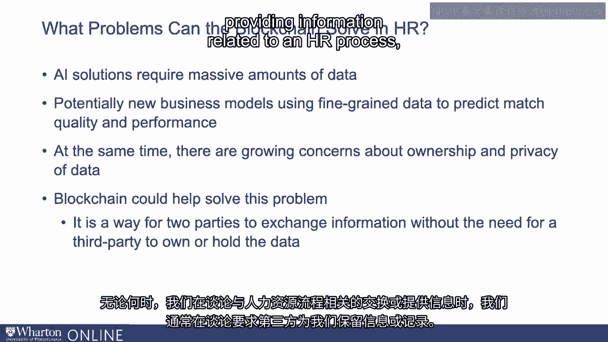
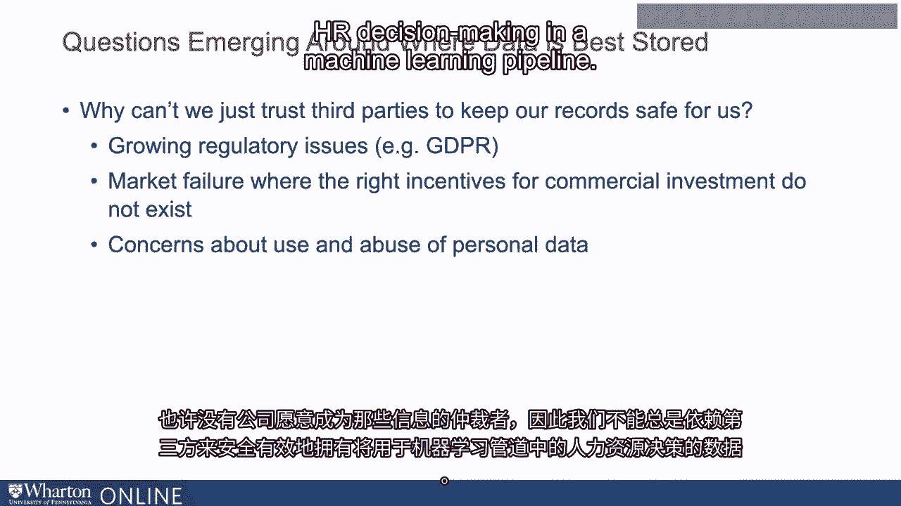
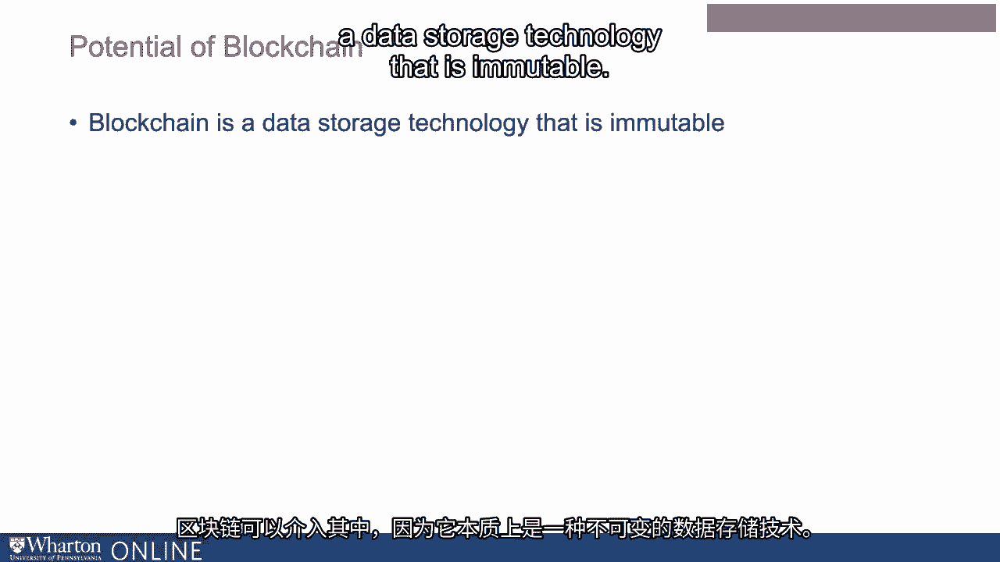
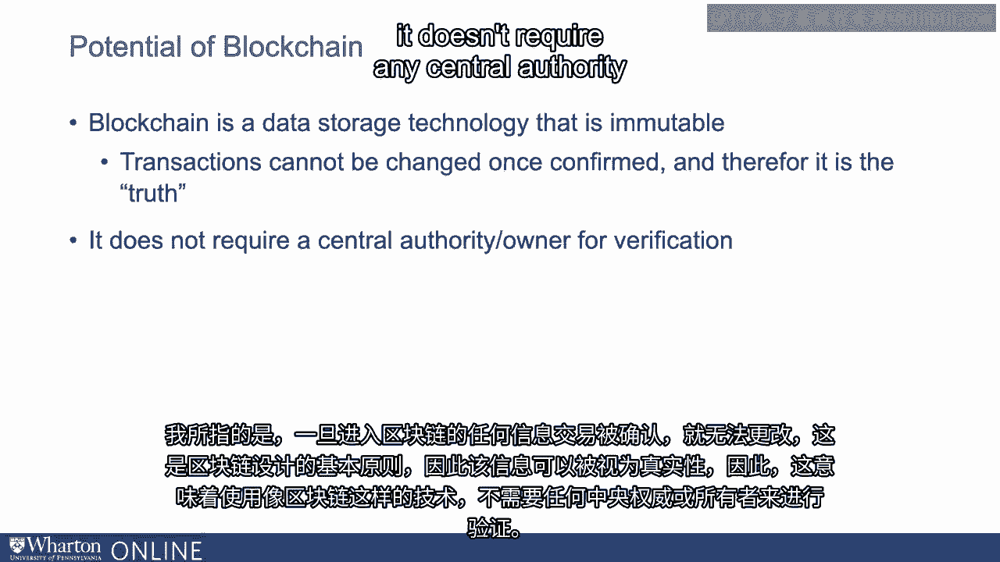
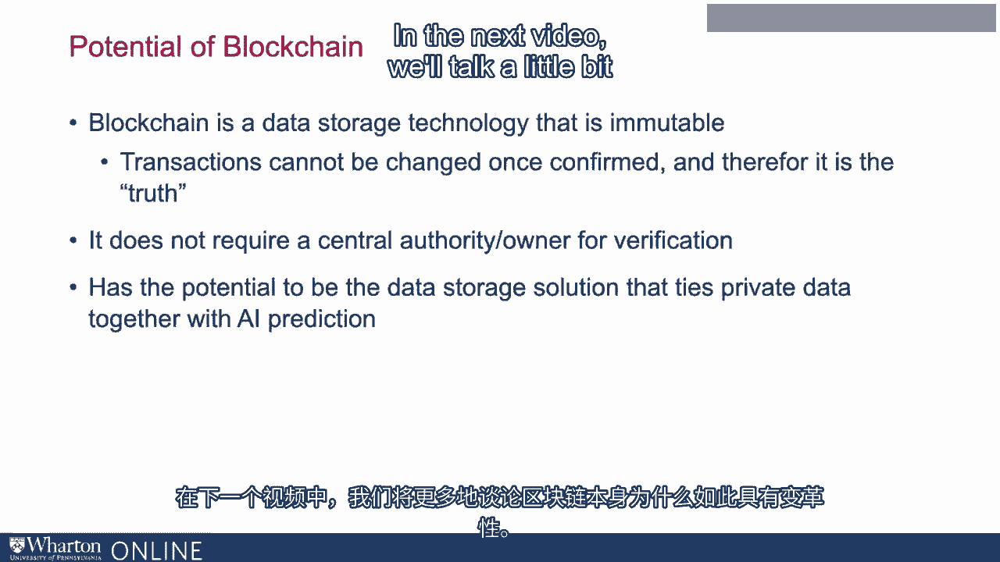

# 沃顿商学院《AI用于商业：AI基础／市场营销+财务／人力／管理》（中英字幕） - P95：32_人力资源中的区块链.zh_en - GPT中英字幕课程资源 - BV1Ju4y157dK

机器学习在HR方面具有巨大潜力。

这是因为他们可以综合关于候选人的多个变量。

为员工做出良好决定或提出好的建议。

它还可以发现我们之前可能不知道的新关系。

我们可以想象多种新应用，传统上有新的数据类型。

以前未在HR流程中使用的，可以现在整合到基于机器学习的系统中。

因此，可能是关于员工选择的非常细致的数据。

或者可以整合到这个决策中的行动。

然而，出现的一个问题与数据所有权有关。

所以我们将讨论一个外围问题，它与机器学习不是直接相关的部分。

机器学习的有效性与其实施的效果密切相关。

这与数据存储有关。我们将特别讨论区块链。

这当然是一项受到广泛关注的技术。

在其他背景下，比如比特币，区块链在HR领域也有潜力。

以解决一些与数据所有权相关的问题。因此，AI解决方案当然。

需要大量数据。同样，也可能出现新的商业模式。

当使用非常细致的员工选择数据时，可能出现的新应用。

或员工行动来预测他们是否会。

适合公司的候选人以及他们在公司表现如何。同样。

在公司内部为员工提供使用非常细致数据的应用。

或者他们执行的行动或任务，考虑职业发展等。

与此同时，各地的担忧也在增加。

关于数据所有权和数据隐私的问题。现在是一个热点问题。

这不会很快消失。对谁应该拥有员工数据有很多担忧。

谁应该拥有私人数据，以及你对自己数据的控制程度。

所以当我们考虑进入一个机器学习越来越多做决定的世界时。

数据越来越丰富，问题出现了，我们该如何存储这些数据，谁拥有这些数据？

这就是区块链作为这一问题潜在解决方案出现的地方。它可以解决。

至少，这是这个问题的一部分。区块链是任何两方交换信息的一种方式。

在没有第三方的情况下交换信息，拥有数据或持有数据。

所以每当我们谈论与HR过程相关的信息交换或提供时。

我们经常谈论让第三方为我们保管信息或记录。

但这是一种凭证化或基于技能的证书。如果只是大学。

基本上可以保证我们拥有那所大学的学位。

我们有一个第三方为我们保存数据。如果这是我们学习的平台。

或者在上面学习课程，它可能是一个保存数据的平台。

所以出现了一些问题，围绕数据最佳存储的位置。

这有很多原因。其中一个是存在许多监管问题。

正在出现的一些问题。例如，全球数据保护条例GDPR相关的问题。

在欧盟。有市场失灵的潜在可能。

我们可能认为有些类型的数据对于人力资源决策非常有用。

但那里的商业模式并不存在。所以也许没有公司出现。

愿意成为该信息仲裁者的。

所以我们不能总是依赖第三方，以确保数据的安全和有效性。

这将用于促进人力资源决策。

在机器学习流程中。因此，区块链可以在这里发挥作用，因为它本质上是。

这是一种不可篡改的数据存储技术。

我所说的意思是，任何输入区块链的信息交易。

一旦确认，就无法更改。这是区块链设计的基础。

因此，那些信息可以被视为真相。

所以这意味着使用像区块链这样的技术。

它不需要任何中央权威。

或所有者进行验证。一般来说，当我们有一组数据时。

想想银行信息，我们需要一个中央权威或所有者来验证该信息。

基本上作为对该信息的信任保证。

区块链是一种旨在解决这一问题的工具或技术。

这有潜力成为一个数据存储解决方案，可以将私密数据结合在一起。

这对于人力资源决策是有用的，基于人工智能的预测。在下一个视频中。

我们会多谈谈。

关于区块链本身为何如此变革性的原因。[ Silence ]， [BLANK_AUDIO]。

