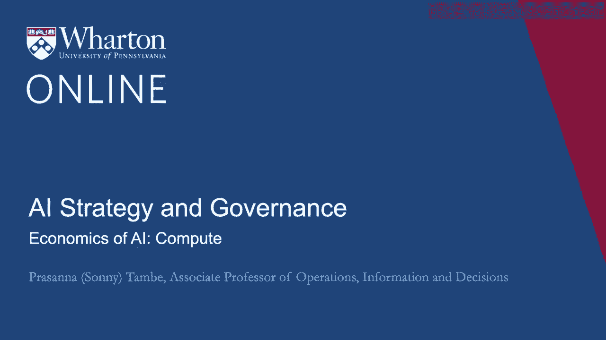
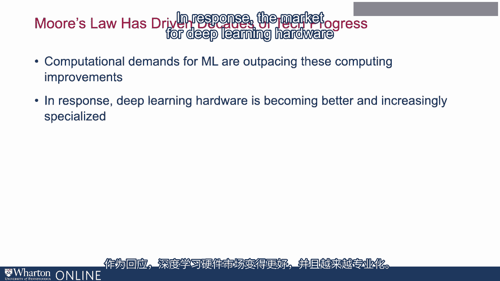
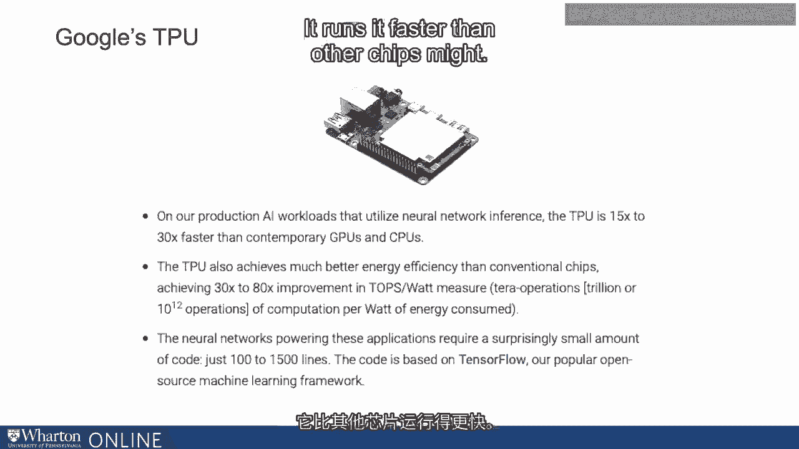
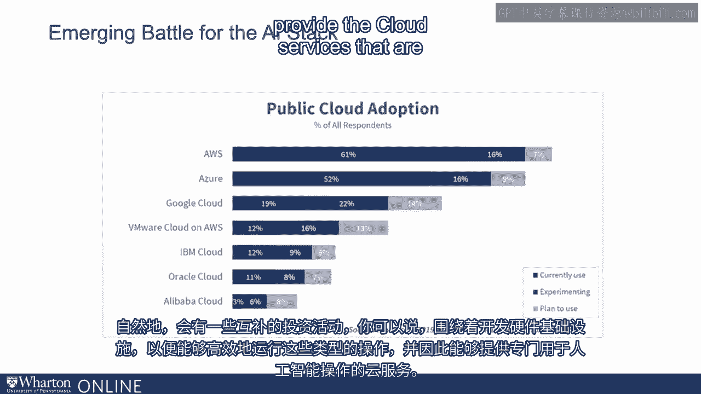

# 沃顿商学院《AI For Business（AI用于商业：AI基础／市场营销+财务／人力／管理）》（中英字幕） - P107：6_AI计算的经济学.zh_en - GPT中英字幕课程资源 - BV1Ju4y157dK

 As we see AI become easier to use in terms of the software requires。

 in terms of the skill it requires。

 We're going to see more organizations and more parts of the world for more use cases。

 use these types of technologies。 Up until now， many of the advances in machine learning have been driven by Moore's law。

 which is the law that basically governs advances in technology in terms of chips and how fast they compute and how much they can store。

 Those advances have basically driven how a lot of recent improvements in machine learning。

 As we think about machine learning， though， fanning out to more organizations and use cases。

 the computational demands for machine learning are going to start to outpace even these computing improvements。

 And so as we see AI being used for more cases， for more people。

 we're going to need more and more computation to be able to build and run the models required for these different applications。

 So in response， deep learning hardware， the market for deep learning hardware is becoming better and increasingly specialized。

 So where a lot of machine learning shifted from reliance on CPU， central processing units。

 which are general to GPUs。 There's now movement from GPUs onto more specialized hardware like TPUs。

 which is a tensor processing unit， which is something Google has created。

 There's also a vibrant market， a vibrant market in the startup space for AI chips specifically developed for machine learning computing。

 And the consumer space as well， companies like Apple， when they're developing their new chips。

 are adding an important component of that that is dedicated to machine learning。

 So there's been a lot of activity and energy around customizing the hardware and specializing in a way that is particularly fast。

 And in some cases， energy efficient as well， when it comes to running machine learning applications。

 So for example， Google's TPU has been designed specifically to complement some of the algorithmic logic in behind tensorflow。

 It runs it faster than other chips might。 It runs it more efficiently than other chips might。

 Now， why focus on computation？ Because this is certainly an emerging background around artificial intelligence。

 So if we think about why these companies are making these investments and making chips and making hardware that can run and build and train and run machine learning algorithms。

 there's going to be a big movement in the coming years as firms use AI to looking for providers that can provide the computation all back-end。

 So many of the applications we're thinking about require too much computation to be run inside the organization。

 or perhaps it's just inconvenient。 And so some of the big cloud providers， firms like Amazon。

 like Google， like Microsoft， will be very interested in becoming the cloud-based back-end for some of this AI computation。

 So naturally， there is a complementary investment activity， you might say。

 around developing the hardware foundations to be able to run these types of operations efficiently。

 and therefore to be able to provide the cloud services that are specifically efficient for AI operations。

 And this battle for what you might call the AI stack is just beginning。

 Certainly you see a lot of activity at Amazon， Google， Microsoft。

 and others as well to start to make sure that people understand that when they want to run AI in the cloud。

 these firms are able to provide the back-ends to be able to do so。

 And new players are entering this market as well。 Tesla made a recent announcement talking about providing services in this area as well。

 But this is a market that's going to continue to evolve specifically around the computational resources needed to run machine learning algorithms。

 [BLANK_AUDIO]。

