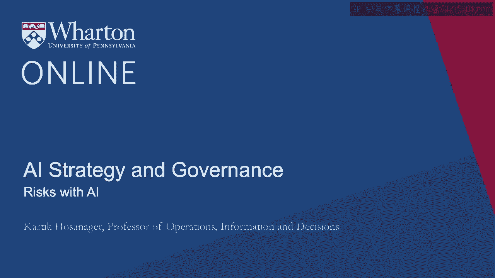
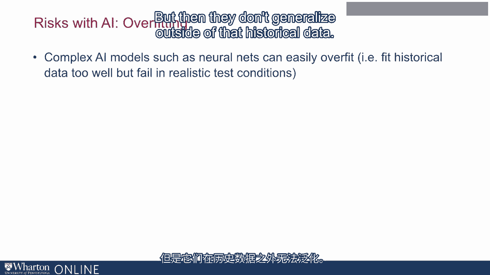
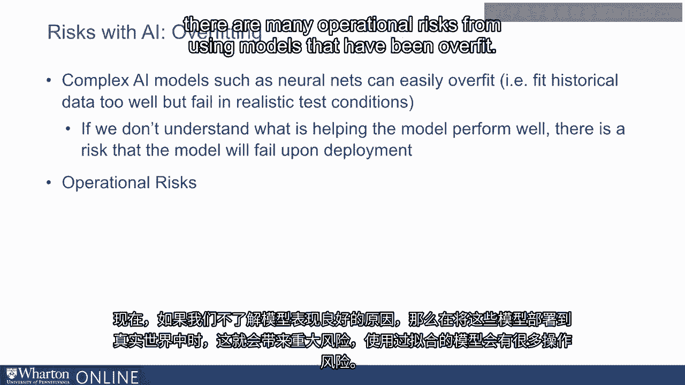
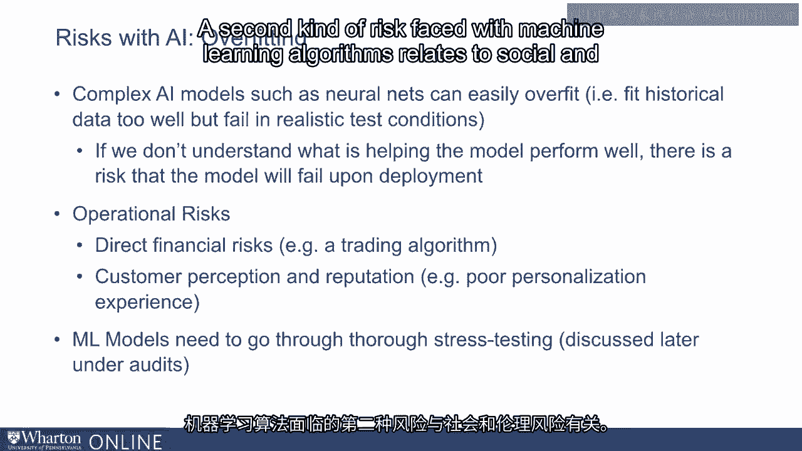
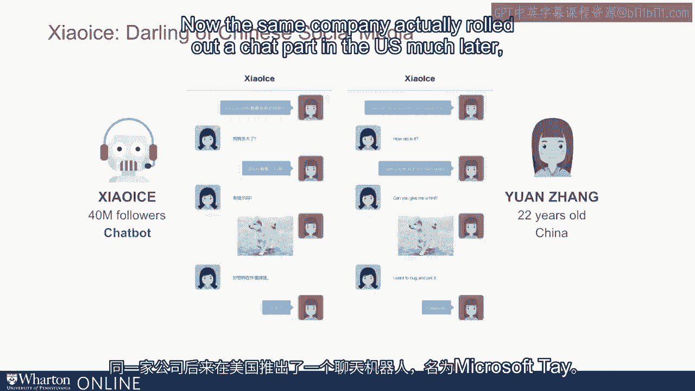
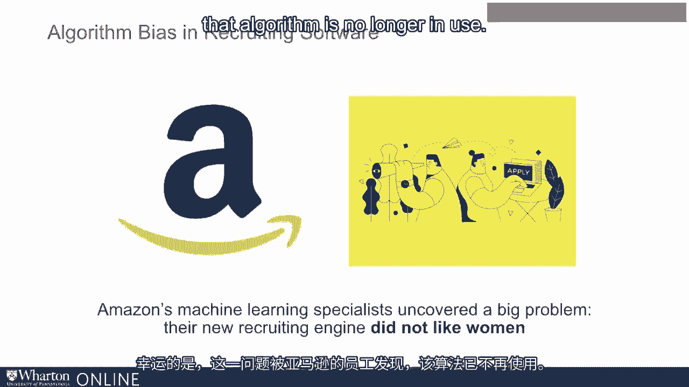
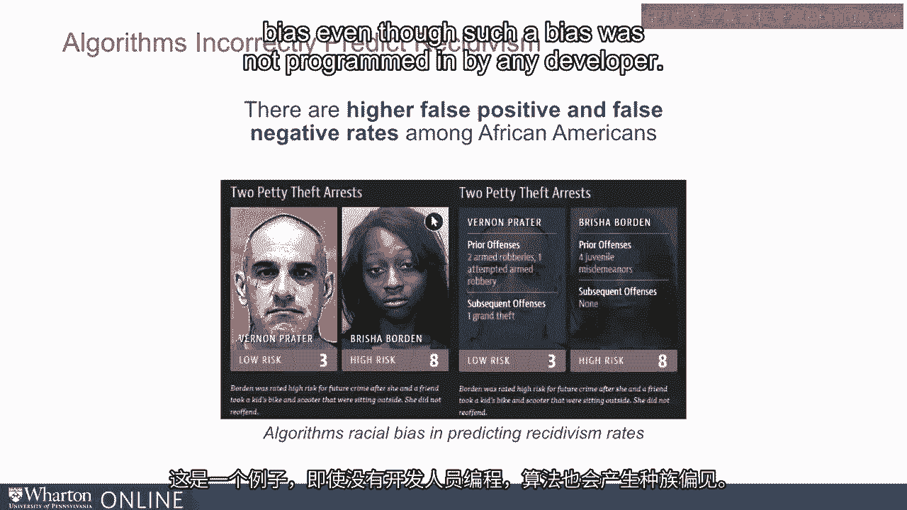
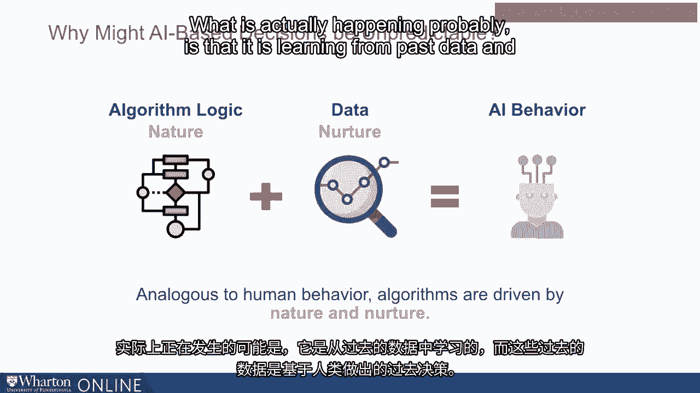
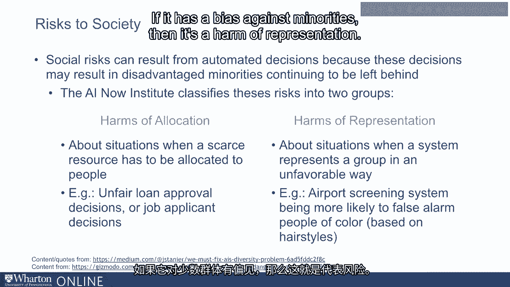
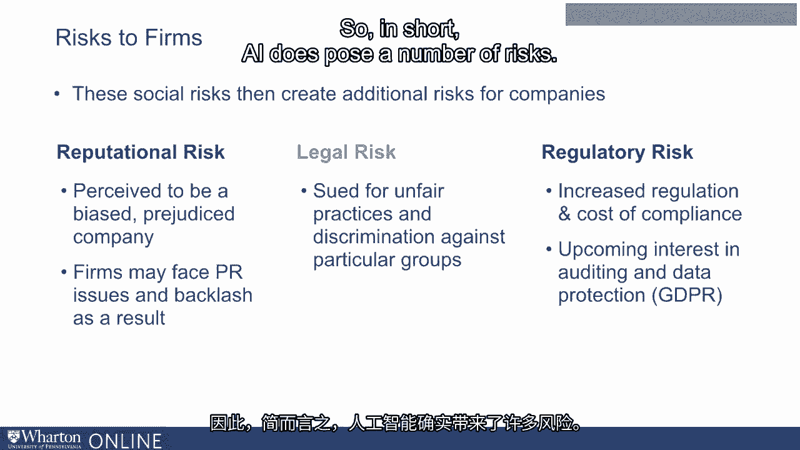

# 沃顿商学院《AI For Business（AI用于商业：AI基础／市场营销+财务／人力／管理）》（中英字幕） - P123：22_AI的风险.zh_en - GPT中英字幕课程资源 - BV1Ju4y157dK

 In this lecture， we'll discuss some of the risks with AI。

 I'll begin with a simple statistical risk， which has significant managerial implications。

 and then I'll talk about social and ethical risks。

 So the first risk I want to discuss is the risk of overfitting。

 Now many of the complex and advanced machine learning models， such as neural networks。

 gradient boosting and others， can easily overfit the data。

 meaning that they tend to fit the historical data almost too well。

 but they fail in realistic situations elsewhere。 This happens because these models often have too many parameters。

 and they can fit very complex shapes， and they tend to fit historical data just too well。

 but then they don't generalize outside of that historical data。

 Now if we don't understand what is helping the model perform well。

 then this poses a significant risk when we deploy these models in the real world。

 There are many operational risks from using models that have been overfit。

 For example， suppose you have a trading algorithm that is based on machine learning。

 and that is making stock trading decisions that are direct financial risks on it。

 There are also customer perception and reputational risks。 For example。

 you have a chatbot that is interacting with customers。

 or you have a personalization algorithm that is personalizing user experience。

 and that is not working well in practice， then it hurts customer perception and retention over the long run。

 So in short， while there are many of these statistical risks。

 they can actually be tested and so it is very important that machine learning models。

 go through a very significant stress testing exercise。

 which includes doing validation as I mentioned previously。

 but it also includes doing a number of other stress tests， which we will discuss in a later lecture。

 A second kind of risk faced with machine learning algorithms。

 relates to social and ethical risks。 To illustrate that。

 I'll provide you a few examples that I discovered， as I was doing my research on my book。

 Now one of the people I interviewed as part of my research was。

 a 22-year-old biotech professional in China by the name of Yuan Jin。

 Yuan had a very interesting routine which was that every night before she went to bed。

 she chatted with a social media celebrity in China called Shaoping。

 and she engaged in these fun and playful conversations。

 Shaoping is a teenage girl who has 40 million followers in China。

 and it's interesting that Shaoping was able to engage in these conversations。

 with so many of her followers。 Now of course as I was digging deeper into it。

 I realized that Shaoping is not a human being。 Shaoping in fact was a chatbot that was created by Microsoft Research。

 and was actually very successful in China。 Now the same company actually rolled out a chatbot in the US much later。

 It was called Microsoft Day。 And Day unfortunately engaged in sexist。

 racist and fascist conversations， with many people and had to be shut down within 24 hours of being launched。

 Now it's interesting to notice that two similar chatbots launched by the same company。

 had such different outcomes。 And that speaks to a little bit about some of the challenges with machine learning algorithms。

 and how they need to be stressed tested significantly before they're deployed。

 Another example of a challenge with machine learning is its application in resume screening。

 Now large companies like Amazon might receive hundreds of thousands or even millions of resumes。

 in any given year。 They have to sift through these millions of resumes and figure out。

 which subset of these applicants to invite for a job interview。

 It's very hard to do this at scale with human beings。

 So a lot of large companies are experimenting with the use of machine learning。

 in order to screen job applicants。 In a recent news story by Reuters it was reported that Amazon discovered。

 that their initial resume screening algorithms had a gender bias。

 Fortunately it was discovered by folks at Amazon and that algorithm is no longer in use。

 But it's interesting to note that even a large company like Amazon had to face this issue。

 where an algorithm they designed based on very cutting edge advanced machine learning algorithms。

 had a gender bias。 There's also a new story a few years back that was reported by ProPublica。

 about algorithms used in courtrooms in the US to help judges and parole officers， in making bail。

 sentencing and parole decisions。 These algorithms look at defendants histories and predict the likelihood that a defendant is likely to re-offend。

 Based on these predictions judges can then make sentencing decisions。

 The investigation found that the algorithm was twice as likely to falsely predict future criminality。

 in black defendants and white defendants。 And this is an example where the algorithm developed a race bias even though such a bias was not programmed in by any developer。

 Now the question that obviously arises is how come these kinds of biases are emerging？

 Why are some resume screening algorithms showing gender bias？

 Why are some sentencing algorithms racist？ Why are some chat bots racist？

 Notice here that when we talked about design of AI we talked about how there are rule based approaches to designing AI。

 but there's also machine learning based approaches to designing AI。

 So if you look at what drives the behavior of AI systems it's partly driven by the logic that the programmer has。

 or the rules that the programmer has provided with expert systems that are mostly rule based。

 or with traditional software that are almost entirely rule based。

 Now with machine learning there are rules but then there's also data。

 And a lot of what is learned is learned from data。

 So with human behaviors we think of human behavior being driven by our nature and our nurture。

 Our nature is our genetic code and that drives some of our behavior。

 Nurture is our environment and we learn from that environment and that drives some of our behavior。

 Psychologists have attributed problematic behaviors like let's say alcoholism partly to nature and partly to nurture。

 With AI it's no different。 If you look at problematic behavior nature and nurture again plays a role。

 Nature are the rules that the programmer has created for the AI。

 Nurture is essentially the data from which the AI learns。

 If there are biases in the data then the AI system can pick it up as well。

 And so in other words a lot of these biases might exist in the data。

 When we say a resume screening algorithm has a gender bias what is actually happening probably is that it is learning from past data。

 And this past data is based on past decisions made by human beings。

 Hundreds of thousands of people have applied for jobs at an organization。

 People decided who to invite for job interviews。 We then look at which of them got a job offer。

 We then look at which of them got promoted。 These are the kinds of people that the AI system is trying to invite for job interviews。

 If there was a gender bias in the past then that might have been now captured in the data and in turn is now captured in the AI as well。

 So when we think about AI based decisions and some of the risks associated with them it is often coming from biases in the data。

 Now what are some of the risks that are created？ First of all there are many risks to society especially when automated decisions made by AI based systems can result in disadvantage minorities continuing to be left behind。

 The AI now institute classifies these risks into two groups。 The first is harms of allocation。

 the second is harms of representation。 Humps of allocation are essentially about situations where a scarce resource has to be allocated to people。

 For example loan approval decisions or job decisions where multiple people apply for a job but only a few people are going to get it and a resume screening algorithm。

 Which of the many applicants will get allocated that scarce resource。

 Humps of representation refers to situation when a system represents a group in an unfavorable way。

 So for example if you have a screening system at an airport that is looking at people's face heal expressions and other such factors to figure out who needs to be screened。

 If it has a bias against minorities then it is a harm of representation。

 Now both these are very important harms and we should be worried about them。

 Now these are not just risk to societies but they are also risk to companies because ultimately these social risks also create reputational legal and regulatory risks for organizations。

 The reputational risk comes from being perceived as a biased or a prejudiced company and the PR backlash can result in customers leaving the organization。

 The legal risk comes from being sued by customers or other such folks for discriminatory practices。

 And regulatory risks come in when regulators feel that your algorithms are actually discriminating or creating social risks and they now put in a lot of regulation and this creates a cost of compliance。

 For example if you look at EU's GDPR regulation which is focused primarily on privacy it does have some clause that relate to automated decisions。

 One of them is a right to explanation and that certainly is one which is a very valuable right that consumers can have and should have but it also creates compliance risks for companies。

 So in short AI does pose a number of risks。 There are risks to society which is harms of allocation and harms of representation and in turn these risks to society create a number of reputational legal and regulatory risks for companies。

 The question then is how do we manage those risks we will explore that in the next lecture。

 [BLANK_AUDIO]。