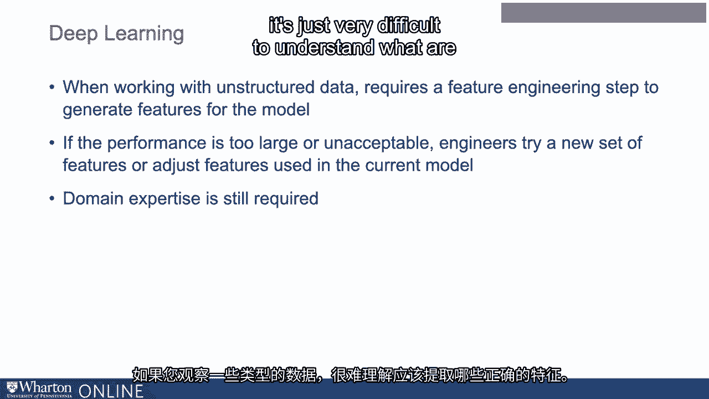
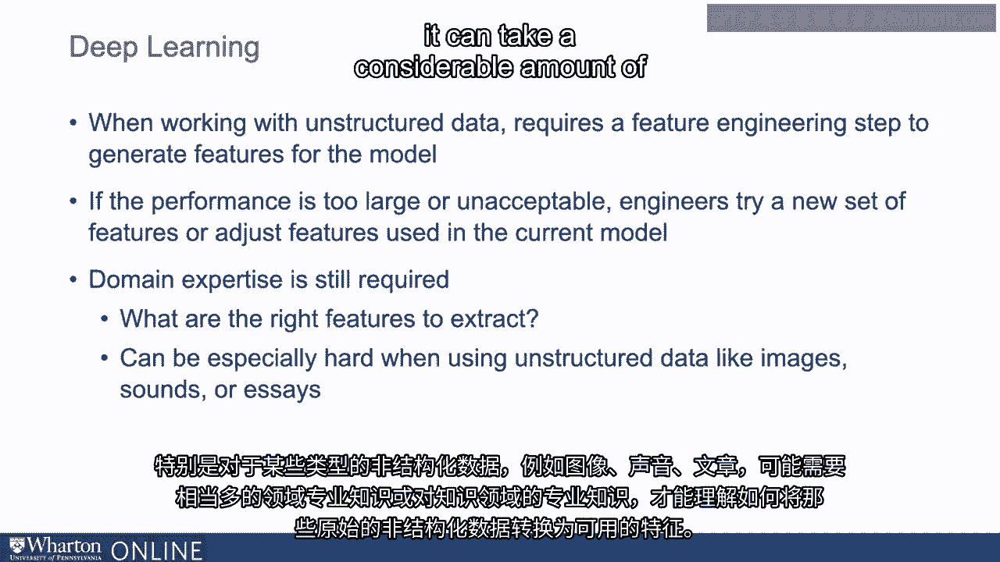
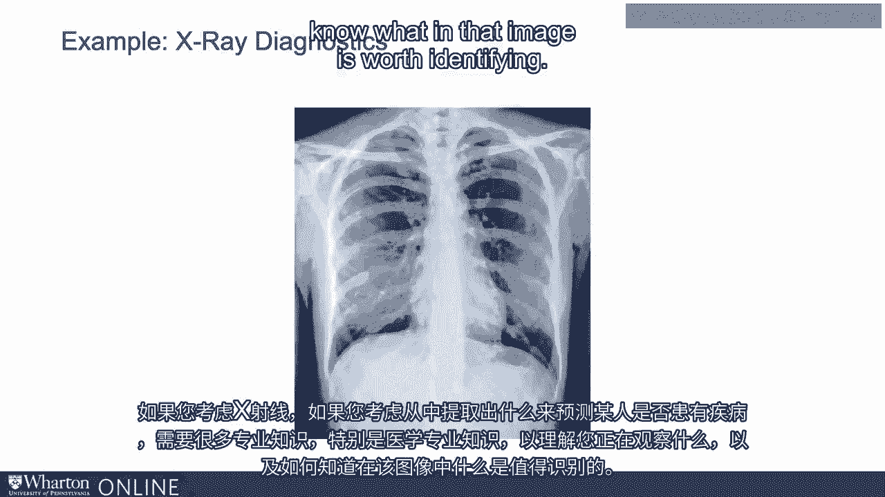
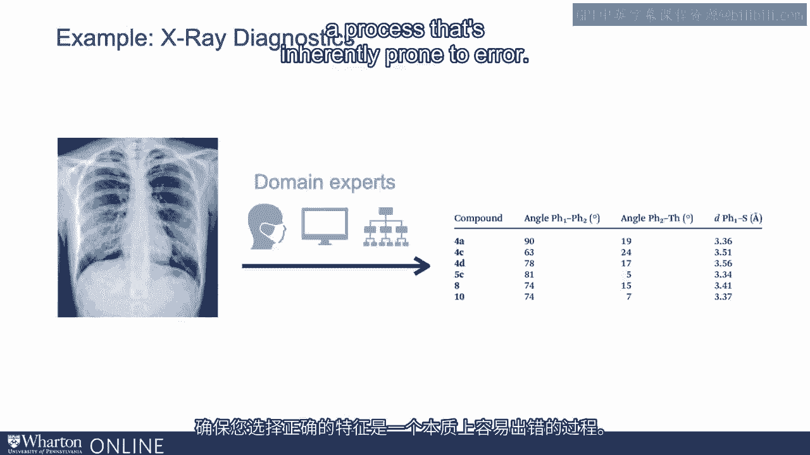
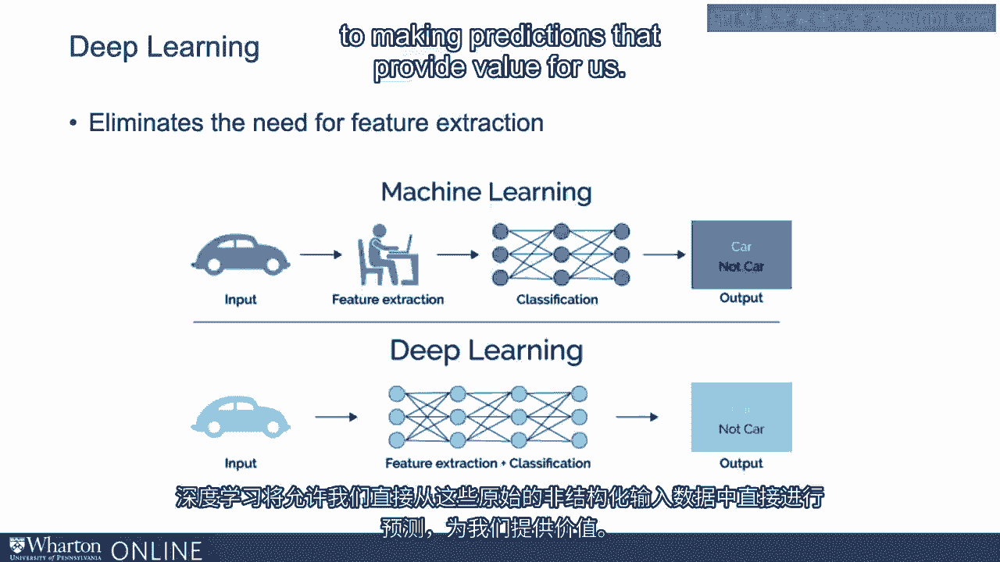
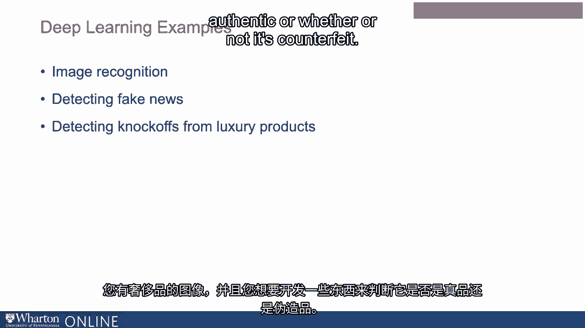

# 沃顿商学院《AI For Business（AI用于商业：AI基础／市场营销+财务／人力／管理）》（中英字幕） - P15：14_深度学习.zh_en - GPT中英字幕课程资源 - BV1Ju4y157dK

 With shallow machine learning or non-deep learning approaches， observations on what you might。

 call structured features are passed to an algorithm which learns the best mapping based。

 on some examples you give it。 So think about the data as being organized kind of like a spreadsheet。

 You have an outcome that you want to predict and then you have a number of columns which。

 have data on predictors。 You need to have data in this format where you have structured columns that describe the。

 data you're trying to predict。 As we've talked about earlier。

 when working with unstructured data it requires a feature。

 engineering step to take this raw unstructured data and generate these features。

 To turn it into a format where you can have columns of data that can be used to predict。

 some output。 Again， it takes quite a bit of work to figure out how to take this raw unstructured data。

 and to generate these columns。 How to choose what the appropriate columns are。

 how to actually create the columns given， the structured data and so on。

 And so what happens is engineers take this raw data， they'll create these features， run， the model。

 If the performance is too large， if it's unacceptable， they might try a new set of features or just。

 the features that are used in the current model。 Again， a lot of domain expertise is required。

 If you look at some types of data， it's just very difficult to understand what are the。

 right features to extract。 Especially with some types of unstructured data， images， sounds， essays。

 it can take， a considerable amount of domain expertise or expertise about the knowledge area to understand。

 how to convert that raw unstructured data into usable features。

 One example of this might be medical diagnostic imaging。

 Imagine an X-ray where you're trying to understand how to use that data to predict whether or。

 not somebody has a condition。 If you think about an X-ray and if you think about what you might want to pull out of that。

 X-ray or that image to predict whether somebody has a condition， it requires a lot of expertise。

 medical expertise in particular to understand what you're looking at and how to know what。

 in that image is worth identifying。

 It might be something to do with the color shade or certain portions of the image or looking。

 for some things appearing in the image that you might not normally expect。

 But it takes somebody with a great deal of medical expertise to be able to know that。

 And then that person will have to sit with a developer to help understand how to take an。

 image like that and pull out the relevant data。 So that's an example of you might need a number of different types of expertise to be able。

 to take raw data like a medical image and pull out data that can then be put into a column。

 format to be used for prediction。 For some kind of medical outcome。

 like whether or not a person actually has a disease。 And again， this requires domain expertise。

 It requires developer time。 It requires considerable resources。

 It can be quite error prone as well because the number of features you could pull out。

 of an image is immense。 So making sure you have the right ones is a process that's inherently prone to prone。

 to error。 We talk about deep learning。 What deep learning does is eliminates much of the need for feature extraction。

 So in the normal machine learning workflow， you have some kind of input data and then you。

 have a feature extraction process where people have to sit down and figure out what features。

 to pull out of the input data to get it into that columnar sort of spreadsheet format that。

 can be then used for prediction and then you get your output。 When you're using deep learning。

 you skip that feature extraction step。 Deep learning is going to allow us to go directly from this raw unstructured input data directly。

 to making predictions that provide value for us。

 So why is deep learning a game changer？ The reason is because this feature engineering step is particularly expensive。

 Again， it requires a lot of domain expertise。 It's error prone。 It's heavily uncertain。

 And so when we're able to use deep learning to skip that feature engineering step， it。

 can lead to massive improvements relative to a process where we have to sort of hand code。

 or hand select what features to use。 The prices we'll talk about is computation。

 but computation is getting cheaper， making deep， learning more feasible for a variety of applications。

 And this is going to let us predict from unstructured data at scale。 So again。

 think about images or online text like reviews or customer satisfaction forms， health data， audio。

 and so on。 So for any prediction or classification task。

 this is going to be an application of substituting。

 more and more data with labeled examples for expertise。

 We no longer need the domain expertise required to hand code or pull out features because。

 we have a whole lot of data that we're going to be able to use to let the machine learn。

 that piece of it itself。 So a few examples here。 Example one is something like image recognition。

 So if you want software that can basically recognize people's faces， this is an example。

 where you can take raw image data and train it to recognize people's faces without having。

 to go through the process of identifying， say something like the space between people's。

 eyes or the length of the width of the face。 You don't have to do any of that。

 you can just use the raw image data that's labeled。

 with the right people and it will essentially learn to recognize people automatically。

 Another example is detecting fake news。 How do you tell if a piece of news is fake news or real news？

 A process that requires feature engineering may require you to sit down and try to understand。

 or figure out what it is about a message or a news post that may signal that something， is fake。

 It's very hard to do， make news is getting better and better in terms of authenticity。

 What deep learning is going to let us do is just take lots and lots of examples of news。

 We don't have to know what matters in terms of prediction， just the raw news post itself。

 the label about whether or not it is fake or authentic and it's given those two pieces。

 of information that deep learning engine will figure out what is relevant in the post and。

 what is not in determining whether something is fake。 We don't have to tell it that piece。

 A third example， detecting knockoffs from luxury products。

 You have images of luxury products and you're trying to develop something to determine whether。

 or not it's authentic or whether or not it's counterfeit。

 What you might do in this case is have lots and lots and thousands of images of a particular。

 product， maybe a scarf or a bag and just labels of whether or not that product is authentic。

 or counterfeit。 We don't have to sit there and tell the machine learning engine what to look for in the image。

 We just feed it lots and lots of images and the right answers， the labels and in this。

 case the deep learning engine can automatically figure it out。

 What it is about the images that might be signaling that something is a knockoff or if。

 it's authentic。 Thank you。 [ Silence ]。

