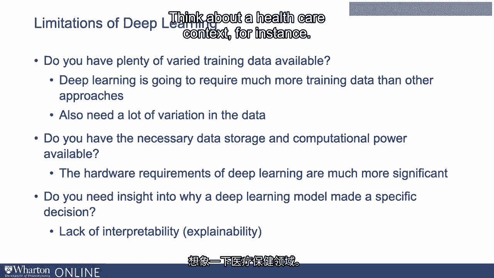

# 沃顿商学院《AI For Business（AI用于商业：AI基础／市场营销+财务／人力／管理）》（中英字幕） - P17：16_深度学习的局限性.zh_en - GPT中英字幕课程资源 - BV1Ju4y157dK

 Deep learning is incredibly powerful， but there are still a number of challenges when。

 using deep learning。 So it avoids the feature engineering step， but let's skip that step。

 It leads to incredible accuracy improvements in a number of domains。 So the question arises。

 why not always just use deep learning？ Was a number of drawbacks？

 I'll talk about three of the most important。 One is the scale of the data required。

 So the first question is， do you have an enormous amount of data， or at least a very large amount。

 of data。 So relative to other approaches， deep learning is going to require much more training data。

 than other approaches。 You need lots of data， you need lots of variation in the data for deep learning engines to perform。

 well。 So that's number one。 Closer related is that what comes along with needing more data is you need much more data。

 storage， and you also need much more computational power。 So to run or train a deep learning model。

 you really need a lot more computational power。 You need much more data storage space to go along with all that data。

 So the hardware requirements of deep learning are much more significant than they are for。

 other approaches。 The third reason that deep learning may not be right for a particular approach is the。

 question of how important is it to have insight into why a model made a specific decision or。

 a prediction model made a specific decision。 So one of the challenges with deep learning is that with these neural networks。

 it's often， difficult to go into the neural network and understand why a particular prediction was。

 made in a particular direction or not。 So in some context。

 it becomes really important to understand why a particular prediction is， made。

 Think about a healthcare context， for instance。

 If you make a judgment about a patient， it may be very important to be able to explain to。

 that patient exactly why that decision was arrived at。

 For somebody with a lot of expertise like a doctor， it may be very important to be able。

 to understand why an algorithm is recommending one thing or another。

 If there's no insight into that， it's going to be hard that doctor may not want to use。

 that recommendation。 Same thing with something like customer loan processing。

 If a particular decision is arrived at， it may be very important to be able to explain。

 to someone why that decision was reached。 It turns out that with other machine learning models that are simpler。

 it's often much easier， to understand why it is or how it was that the algorithm went from the data or the input。

 data to the final decision。 With deep learning， this is much more complicated。

 So in certain contexts where this kind of interpretability or explainability becomes very。

 important， deep learning may not always be the right solution。 Thank you。 [ Silence ]。

