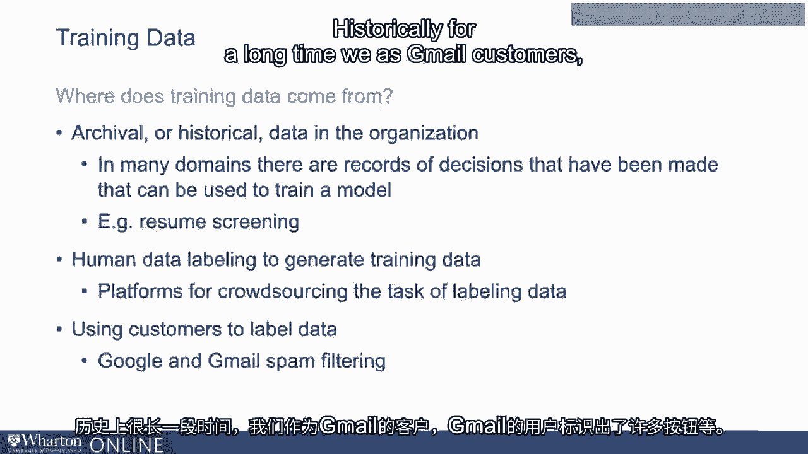
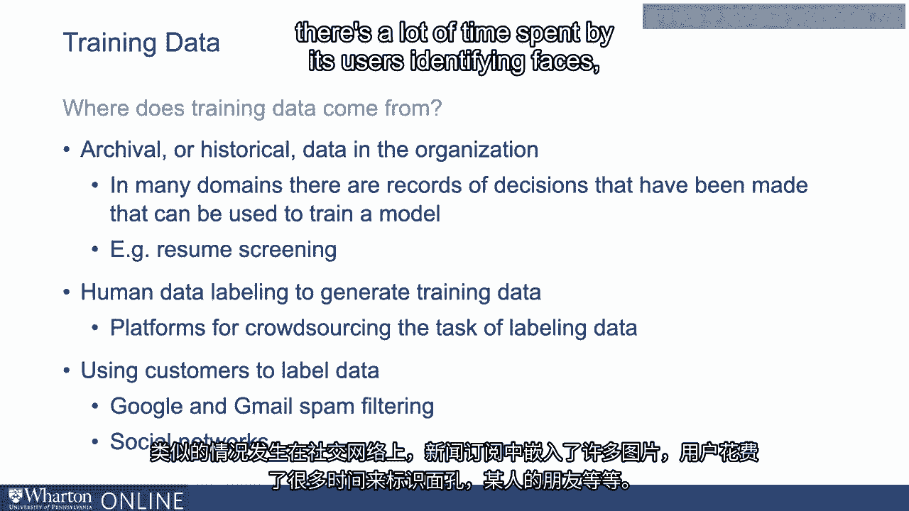

# 沃顿商学院《AI For Business（AI用于商业：AI基础／市场营销+财务／人力／管理）》（中英字幕） - P21：20_如何获取训练数据.zh_en - GPT中英字幕课程资源 - BV1Ju4y157dK

 The key to any machine learning， deep learning， any application of machine learning is training。

 the model and this requires training data。 So training data really is at the heart of the machine learning process。

 Training data again is the data that the algorithm learns or uses to learn the best mapping between。

 the inputs and the right predictions or the output。

 And so the question is where does training data come from？

 When you're building a machine learning algorithm， where do you get a data set with a lot of。

 input data and the correct decisions or the correct predictions that should be made using。

 that data or given that data？ So there's a number of places that training data can come from in practice。

 So the most common is probably archival or historical data that is already in the organization。

 In many domains there are records of decisions that have been made that can be used to train。

 a model。 For example， resume screening。 So any organization that's received lots of applications for employment will have a database。

 perhaps， of the types of employment applications that have come in。 This might include resume data。

 interview data， and perhaps final decisions that were made。

 on things like whether a person gets moved on to an interview stage， whether or not they。

 were eventually hired， perhaps how they performed at the firm later on。

 And so this is maybe the most common type of training data is archival data in the organization。

 And beyond HR， of course， there are similar applications in finance and accounting and， operations。

 All of these domains are going to have historical databases of inputs and decisions that were。

 actually made。 Anything from hiring to supply reordering to asset trading。

 lots and lots of examples， that you can think about at the organizational level。

 So that's one source of training data。 If those types of data are not available。

 sometimes humans are used to generate training， data。

 So you can see the text where you're building a new application， for instance， where you。

 might need your input data to be labeled so that it can be used as a training data source。

 So consider images。 It's a very common application。

 You have lots of images and you're trying to identify whether they're in one category， or another。

 So in the medical case， if you have medical images， you may already have information on。

 whether a doctor has identified the person as having a disease or not。

 That's the archival or historical example that we talked about just now。 And if that's not the case。

 let's say you have another kind of image， you're trying。

 to say identify a flower or something like that in an image and you have lots of images。

 and you're trying to identify which ones have flowers and which ones don't。

 Although lots of platforms that you can send the data out to， the image data out to， where。

 they basically crowdsource this type of task for you。 So you can take thousands of images。

 make them available on these platforms and you， can crowdsource the task of labeling which data or which images have flowers and which。

 don't。 What I mean by that is that on these platforms， there are people who are going to basically。

 look at these images and just visually inspect them and decide whether or not they have flowers。

 They'll label them in a way that you get the data back that has all the image data， the。

 original input data with another column of data that indicates whether or not something。

 has a flower in it or not。 So again， the number of platforms where this kind of work can be crowd sourced to thousands。

 of people who will do this kind of work so that it can be returned to you officially。

 So that's another way in which training data can be derived。

 A third and related way that's kind of common is using your customers themselves to label， the data。

 So there are a number of examples where prominent platforms have basically used customer inputs。

 to create these labels。 So if you think about Google and spam mail， for instance。

 so Gmail does a fantastic job， of identifying what emails are spam。

 the way it learned to do that is that historically。

 for a long time， we as Gmail customers or Gmail users identified， there were lots of buttons。

 and so on that we could basically click to identify whether or not something was spam， or not。

 So if you collect that data from your users over time， you have a database that's fairly。

 rich that has lots of email information or message information and is identified by those。

 users whether or not this is authentically spam or not。 Similar thing。

 the social networks that have pictures embedded in news feeds， there's a。

 lot of time spent by the users identifying faces who someone's friends are and so on。

 and that can then be used to build an algorithm to identify different people or so on。

 So lots of examples where users of the platform itself can manually， by interacting with the。

 platform， essentially create a training data set for the platform to use to then go back。

 and implement a machine learning algorithm。 Thank you。 [BLANK_AUDIO]。

