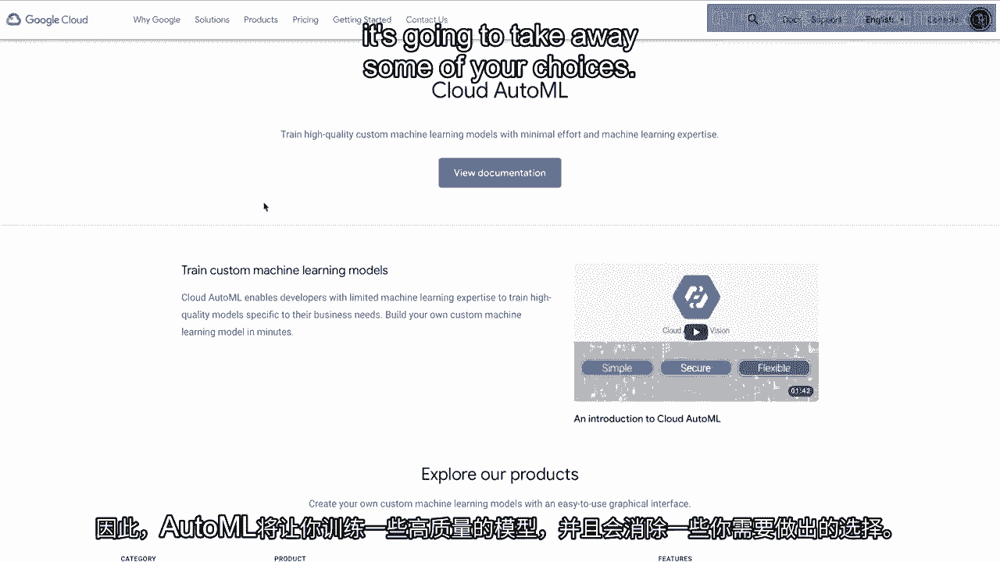
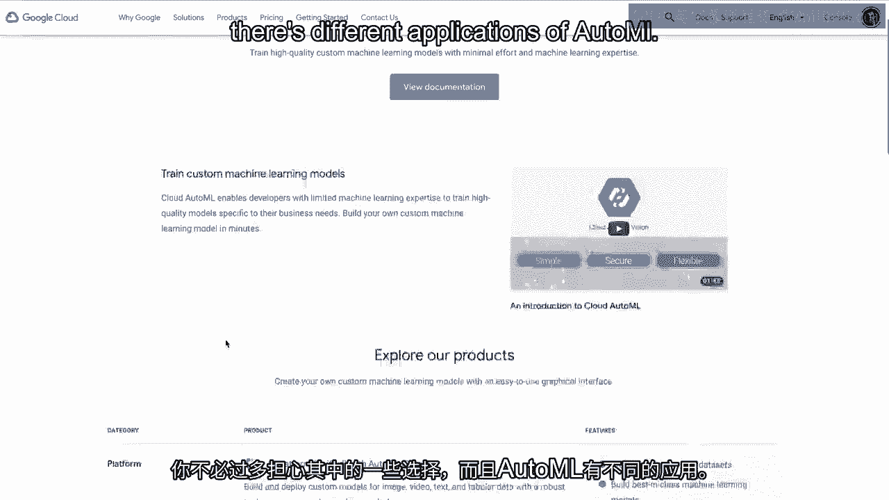
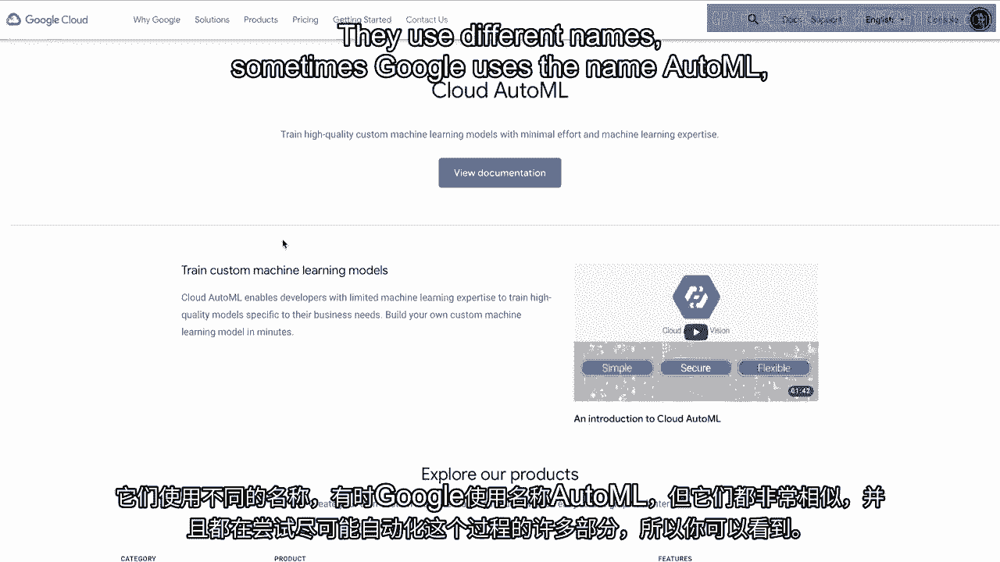
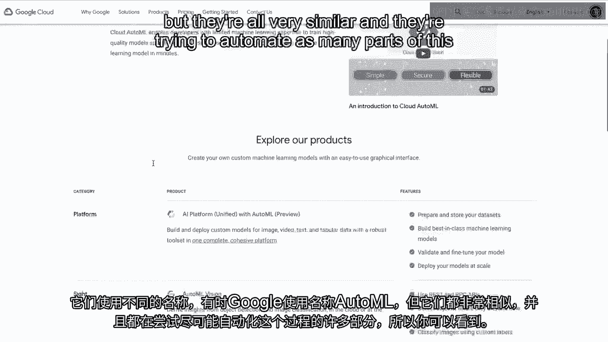
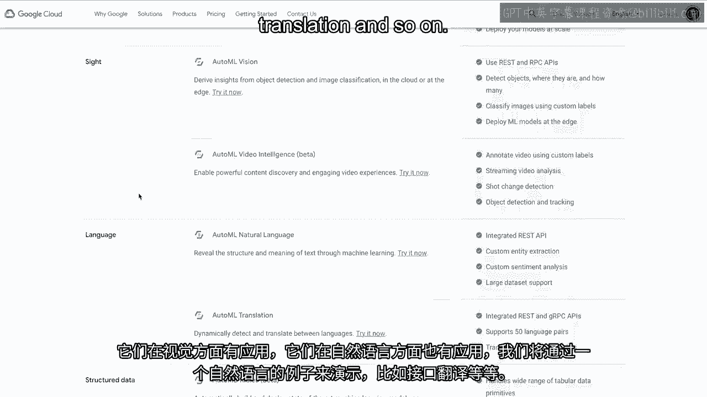

# 沃顿商学院《AI For Business（AI用于商业：AI基础／市场营销+财务／人力／管理）》（中英字幕） - P27：26_自动机器学习简介.zh_en - GPT中英字幕课程资源 - BV1Ju4y157dK

 Let's talk a little bit about AutoML。

 AutoML is short for automated machine learning， and the goal of AutoML is to automate as many aspects。

 of the machine learning process as possible。 When we think about machine learning。

 there's a data acquisition phase。 You have to prepare the data， then there's feature engineering。

 feature extraction， feature selection， all these stages。 Before you get into the model。

 then you choose a model。 You have to think about tuning the parameters and so on。

 There's a whole bunch of stages involved， when we think about building a machine learning model。

 And the idea behind AutoML is to automate， as many of these parts as possible。 And the goal。

 the marketed goal in a sense， by companies that are starting to offer AutoML solutions。

 is to make machine learning expertise in a sense， or make machine learning more available to anyone。

 regardless of whether or not they have any expertise， in machine learning。 So for example。

 looking here at Google's cloud AutoML， solutions， so as you can see here in their first line。

 right at the top， they're saying that you can train， high quality custom machine learning models。

 with minimal effort and machine learning expertise。

 And what these AutoML models are essentially doing。

 is substituting in enormous amounts of computation。

 so that you don't have to worry as much about some， of the particular choices that you're making。

 in the machine learning workflow。 So AutoML is going to let you train。

 some of these high quality models。

 And it's going to take away some of your choices。 You don't have to worry so much about some of the choices。

 And there's different applications of AutoML。

 and this Google offering， at least。 And again， a number of different companies。

 have solutions related to AutoML。 They use different names sometimes。 Google uses the name AutoML。

 But they're all very similar in that they're trying。

 to automate as many parts of this process as possible。

 So you can see here they have applications to vision。 They have applications to natural language。

 And we'll do an example of that using a natural language， interface， translation， and so on。

 But these are all going to take some of that unstructured data。

 and allow you to use that to make predictions。 [BLANK_AUDIO]。

