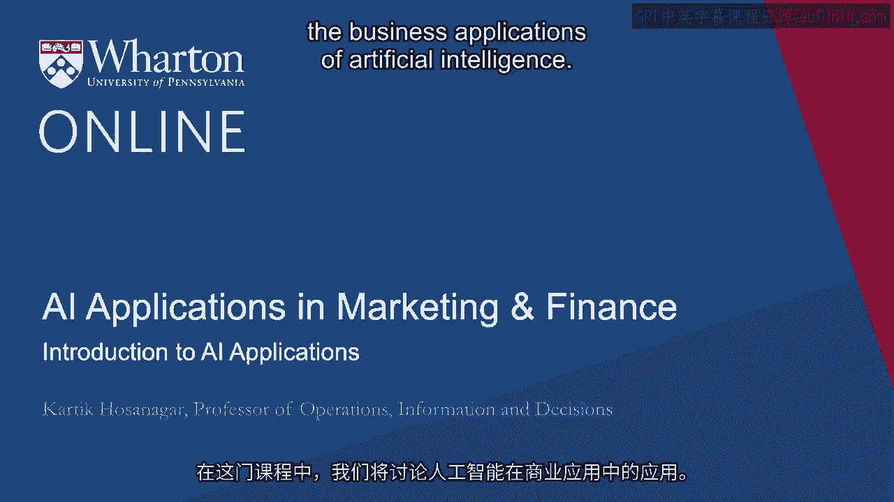
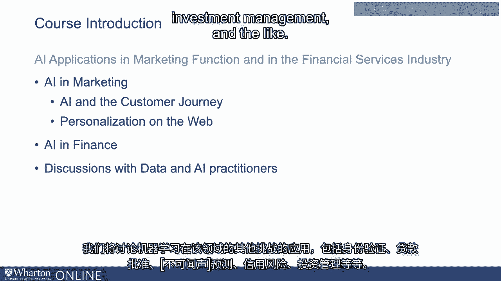

# 沃顿商学院《AI For Business（AI用于商业：AI基础／市场营销+财务／人力／管理）》（中英字幕） - P34：0_简介.zh_en - GPT中英字幕课程资源 - BV1Ju4y157dK

 In this course， we will discuss the business applications of artificial intelligence。

 In a previous course， we have talked about how AI， specifically machine learning， shows。

 early indicators of being a general purpose technology。 Now。

 the implications of AI being a general purpose technology is that we need to recognize。

 that most industries are likely to change as a result。

 We also saw how AI jobs are distributed across many industries， including healthcare， financial。

 applications， manufacturing， IT consulting， education， and many more。 Similarly。

 AI is impacting multiple job functions within these industries， ranging from marketing。

 to HR and people management。 Now in this course， we will focus on AI's applications to the marketing function and。

 to the financial services industry。 From the perspective of AI's applications in marketing。

 my colleague Professor Raghu， Angar will first talk about AI and the customer journey。 Specifically。

 he will talk about what is a customer journey， how can AI help in different， parts of that journey。

 And he will present some case studies to help us understand how AI is relevant there。 Next。

 I will discuss the role of AI in personalization。 I will begin with a brief introduction to recommendation systems。

 such as what we might， see on Amazon。 People who bought this also bought this or Netflix or Spotify's content recommendations。

 I will talk about specific challenges of different systems and how do we address these。

 challenges using AI。 And what is the role of AI and what kind of impact can personalization have with engaging。

 consumers。 We will talk about AI's applications in the financial services industry。

 I will begin by discussing problems such as credit card fraud and how machine learning。

 can be applied for fraud detection。 We will talk about machine learning applications for other challenges in the space。

 including， identity verification， underwriting of loans， churn predictions， credit risk， investment。

 management and the like。

 And finally， we will discuss with data and AI practitioners how they are leveraging AI。

 within their enterprises as well。 [BLANK_AUDIO]。

