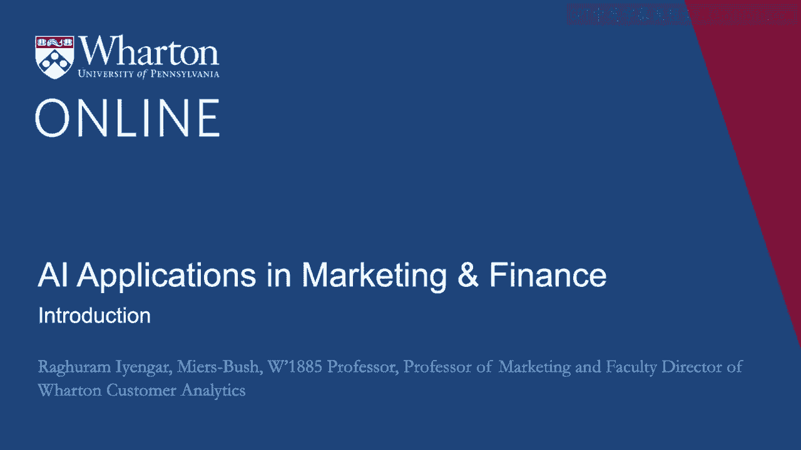
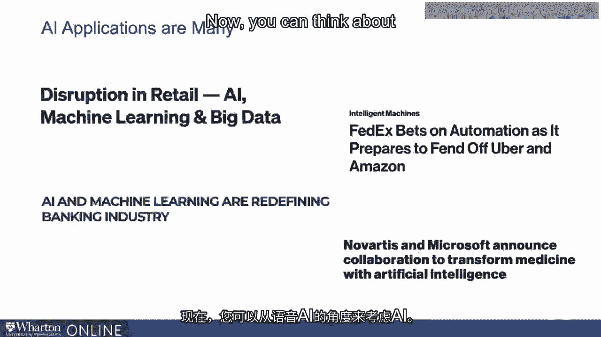
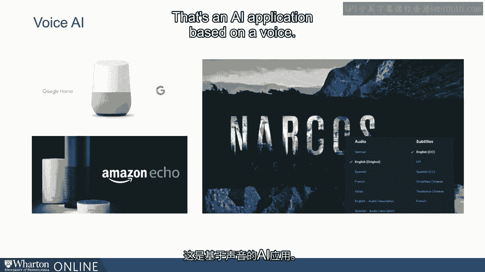
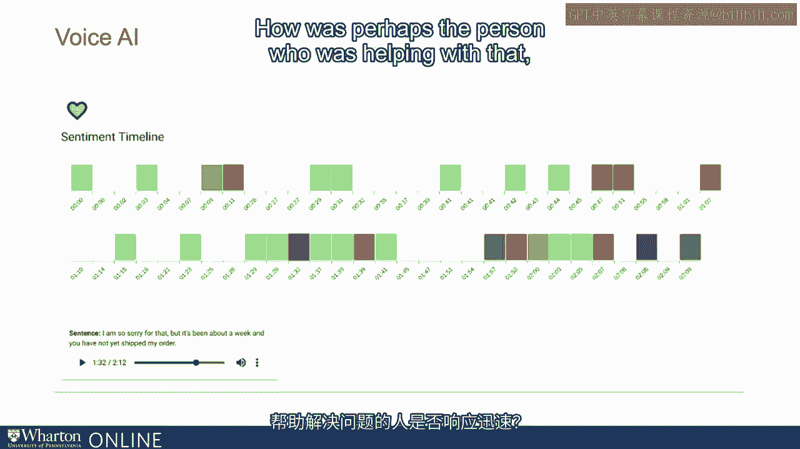
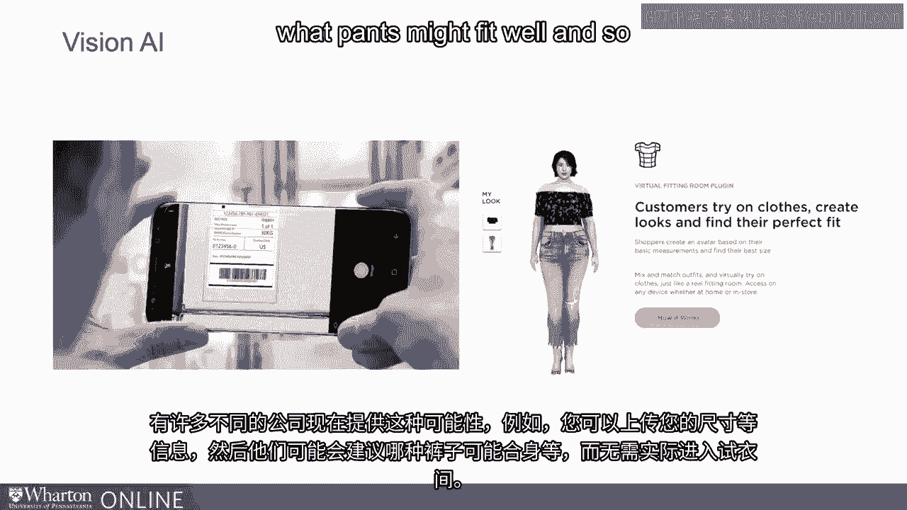
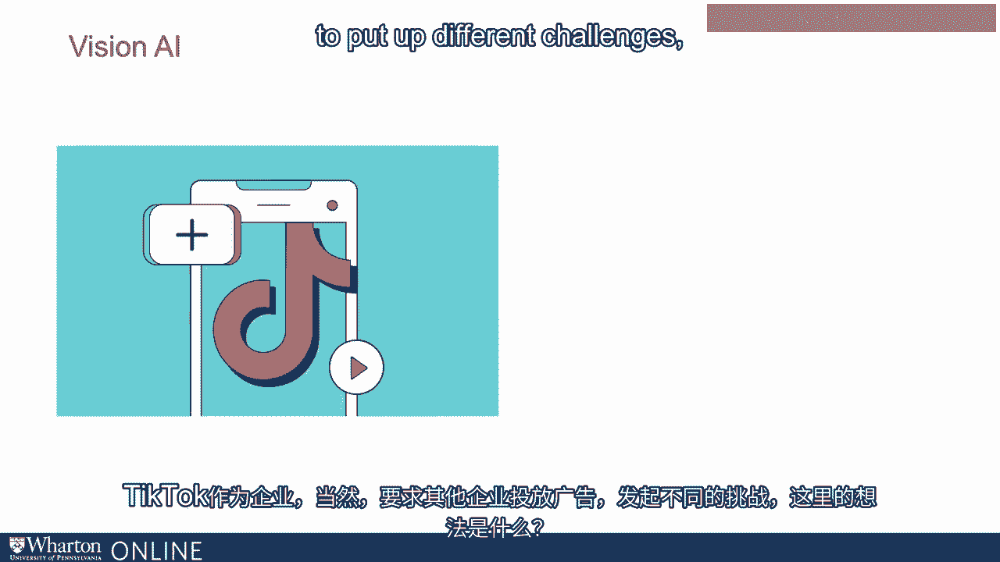
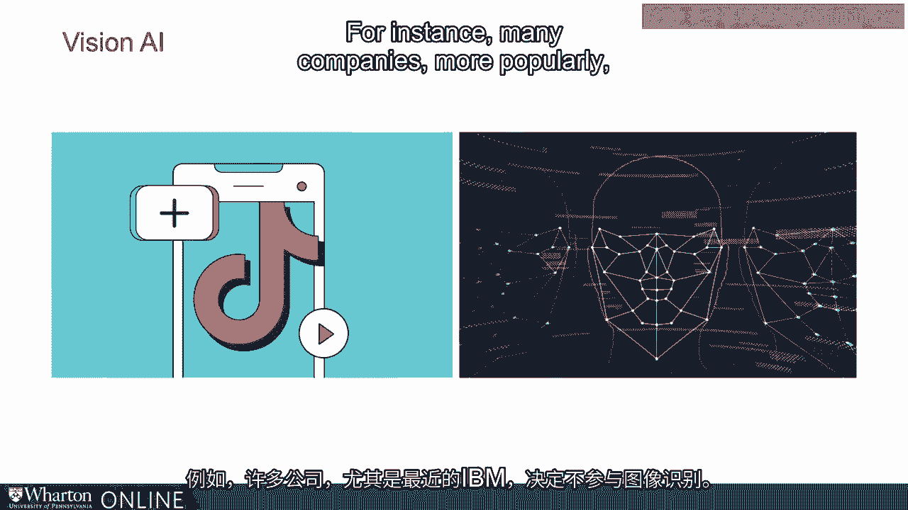
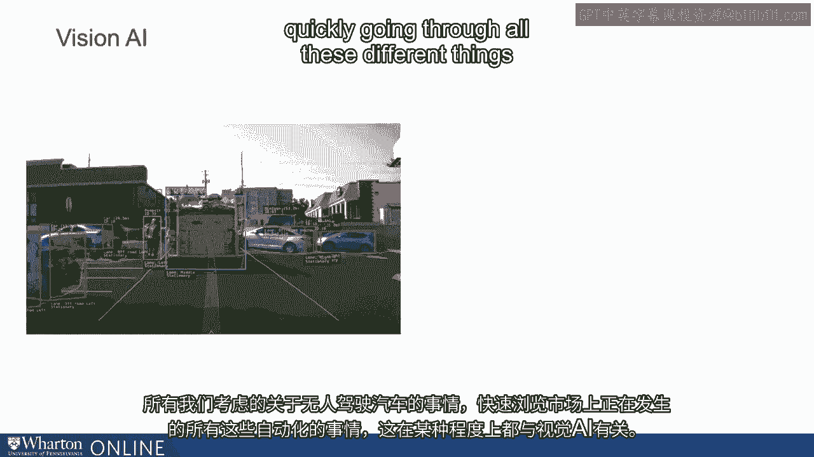
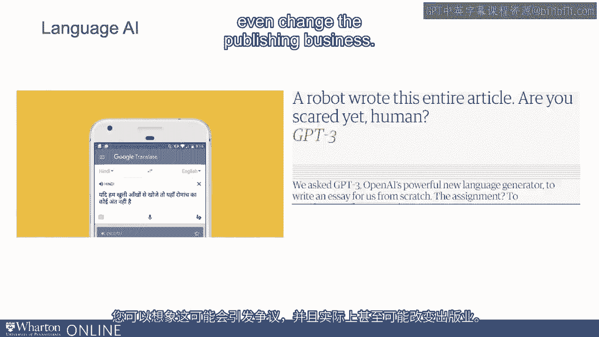

# 沃顿商学院《AI For Business（AI用于商业：AI基础／市场营销+财务／人力／管理）》（中英字幕） - P35：1_模块简介.zh_en - GPT中英字幕课程资源 - BV1Ju4y157dK

 Hi everyone， I'm Raku Aangar。

 I'm the Mars Bush Wharton， 1885 professor at Poulartan School。 I'm also a professor of marketing。

 I'm the faculty director of Wharton Customer Analytics。 In this module today。

 we're gonna talk about AI application， from a customer point of view。

 We'll talk about the customer journey， and understand where AI applications can play a role。 Now。

 there are many AI applications。 As you notice， there's lots of disruption going on in retail。 AI。

 machine learning， big data in retail。 FedEx， for example， is doing that as well。

 in terms of automating AI。 There's a lot of stuff happening in banking as well。 And more recently。

 we are hearing a lot of talks about， for example， no orders in Microsoft， coming together。

 to think about AI applications in pharmaceuticals。 There are many different applications。

 I think perhaps the best way to think about these applications， is what do they do。

 Now， you can think about AI， from the point of view of voice AI。 So an example of this might be。

 for example。

 Google Home， Amazon Echo， for instance。 So what do they do？

 They just make it easier for you， to perhaps control things using your voice。 Similarly。

 you can think about Netflix。 And when you're looking at a movie， for instance。

 and in a language that you don't know， you can easily change that language。

 to something that you do know。 So that's an AI application based on voice。

 Now， there are many other kinds of voice AI applications， perhaps in a business to business setting。

 So for instance， there are lots of applications， around how customer calls are going， for example。

 in a customer care center。 So you can start looking， for instance。

 if you own a customer call center， you can start looking at who's calling。

 what was the sentiment of that call， how long did they call for。

 how was perhaps the person who was helping with that。

 was it responsive or not？ All of that stuff is under voice AI。 And of course。

 when you think about more futuristic， we had this movie， Her， where Joaquin Phoenix。

 the actor in some sense got into a relationship， with a voice AI system。 So of course。

 that's far in the future， but you can already see， for instance。

 when you talk to an Amazon Alexa or a Google Home， you're in some sense having a conversation。 Now。

 the other set of things are what are called vision AI。 Again， it's around， for example。

 using your mobile phone， for instance。 You can now easily track， for instance， where your packages。

 So simply by looking at a QR code or a code， which can help you track different packages。

 So that's one kind of application of vision AI。 Another application， which has become。

 a lot more prominent and popular， is by looking at， for instance。

 where you can have virtual fitting rooms。 So there are many， many different companies。

 that now offer this possibility of uploading， for example， your length and all of that stuff。

 And then they might be able to suggest， for instance， what kinds of pants might fit well and so on。

 without actually going into an actual physical fitting room。 Similarly。

 you also have other kinds of vision AI applications。 So for instance。

 TikTok has become extremely popular， from a business to business point of view。 So TikTok。

 the business， of course， asks other businesses， for instance， to put up ads。

 to put up different challenges。

 and what is the idea here。 A business， for instance， can track， what its followers doing。

 How are they perceiving the different brands？ What's happening in that video？

 What kinds of things are people thinking about， when they think about a particular brand？

 On the flip side， another kind of AI application， which is around vision。

 has become a little bit more controversial。 This is about image recognition。 So for instance。

 many companies more popularly。

 more recently， IBM， for instance， decided they did not want to get into image recognition。 Why？

 Because it broaches into customer privacy as well。 So there's lots of action going on。

 But talking about vision AI， there are two interesting applications。 On the left side。

 you can think about， for instance， cars。 All of that stuff that we think about。

 in terms of driverless cars， quickly going through all these different things。

 that are happening out there in the marketplace， in terms of automation。 All of that， in some sense。

 resides B2 Vision AI。 When you're in one of these cars， the car， quote unquote。

 the computer in the car， needs to be able to understand very quickly， is that a stop sign？

 Is that a person passing through the pedestrian walkway？ What is it？ On the right hand side。

 we're talking about smart cities。 Again， there are many， many cities out there， that are trying to。

 in some sense， make the journey， of their customers， so to speak， people seamless。

 So when you're walking down， hopefully， in a smart city， it might be able to recognize。

 for instance， what your needs are and so on。 But of course， as you can imagine。

 what we were talking about in terms of image recognition。 In terms of smart cities。

 it might be even more ridden with customer privacy。

 The last kind of AI application is mostly around language。 Now， there's a huge amount of。

 for example， translations that are needed。 For instance， here I'm talking about an Indian language。

 called Hindi。 Now， there are lots and lots of people in India， for instance， who speak Hindi。

 but would like a translation， into another language， for instance English。

 So now mobile phones can easily do that translation。 Similarly， very recently。

 there was a new application， called GPT-3 that was released， which basically， in some sense。

 can write entire articles。 So you can imagine， this can be very， very controversial， and can。

 in fact， even change the publishing business。

 So as you can imagine， there are lots and lots of application， around AI。

 But what's critical is to think about， what kinds of applications are you interested in？

 Is it around vision？ Is it around voice？ Is it around language？ [BLANK_AUDIO]。

