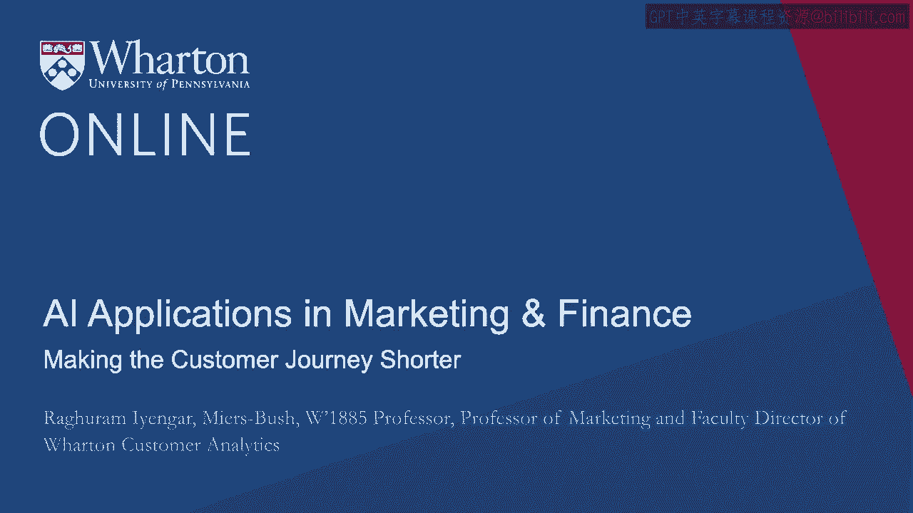
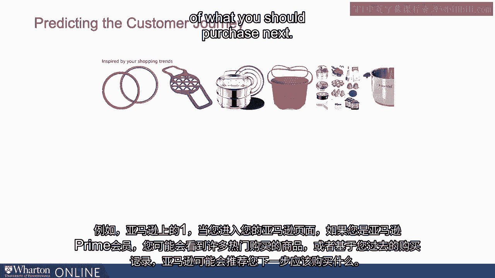
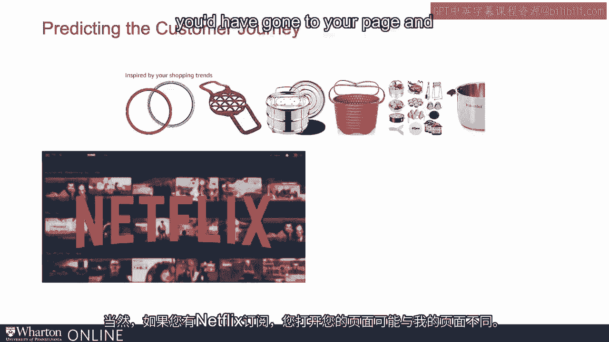
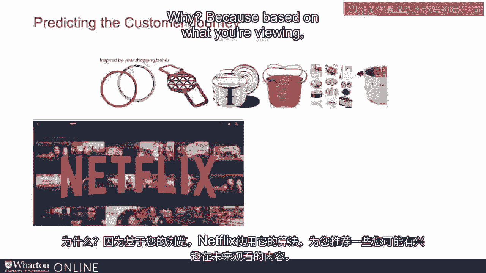
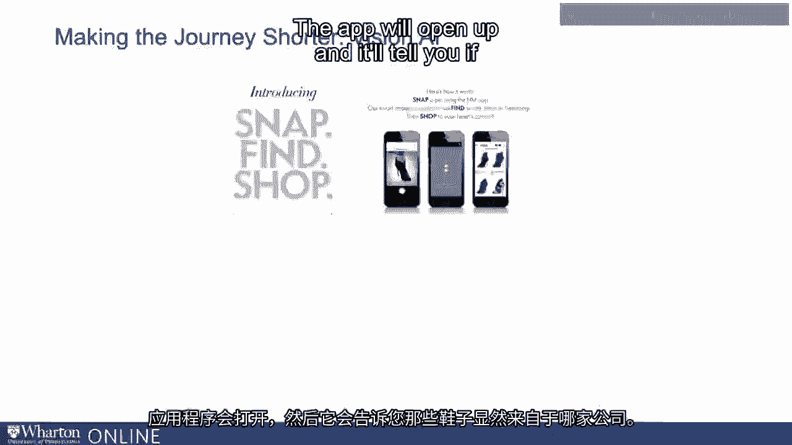
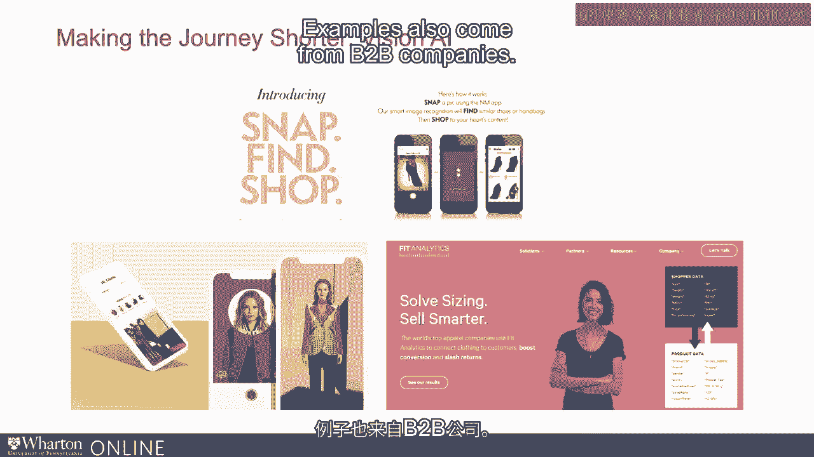
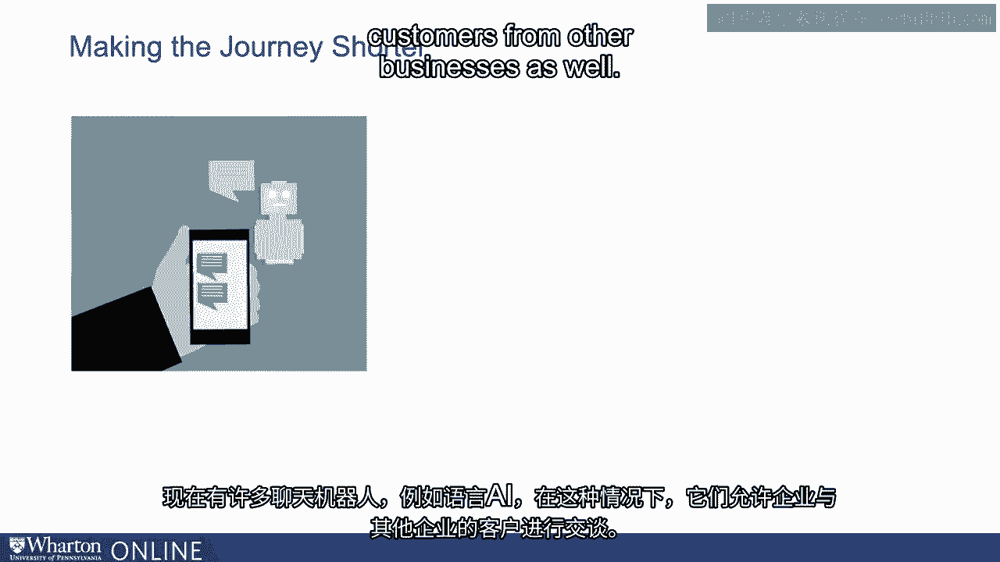
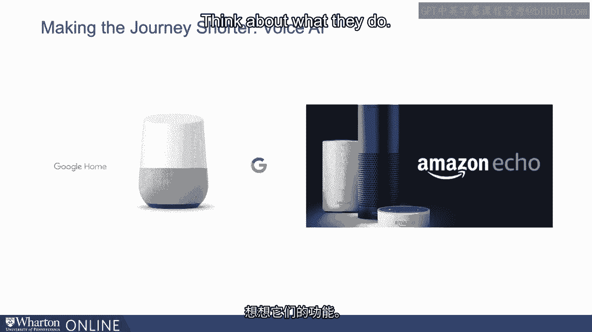

# 沃顿商学院《AI For Business（AI用于商业：AI基础／市场营销+财务／人力／管理）》（中英字幕） - P37：3_缩短客户体验周期.zh_en - GPT中英字幕课程资源 - BV1Ju4y157dK

 So in this module， we'll start talking about customer journey and AI together。

 especially from the point of view of what can AI do for。

 either predicting the customer journey or making it shorter。

 Let's take some examples and better understand how technology， machine learning， AI。

 all the things that we talked about in the previous modules can help us in。

 understanding the customer journey。 Let's start talking about predicting the customer journey。

 So these are very common examples。 So for example， the Amazon one， when you go on your Amazon page。

 if you let's say you're an Amazon Prime customer， you'd probably see， for， example。

 lots of things that are popular purchases or based on what you have， purchased in the past。

 Amazon might make a recommendation of what you just purchased next。

 So that's an example of if somebody has purchased some things in the past。

 Amazon and all the algorithm behind Amazon are trying to predict。

 what would their customer journey look like in the future？ The same example perhaps is from Netflix。

 And of course， if you have a Netflix subscription。

 you have gone to your page and your page might be different from my page。

 Why？ Because based on what you're viewing。

 Netflix using its algorithms is making a recommendation of what might be。

 some things that you might be interested in seeing in the future。 And of course。

 that algorithm is personalized， so to speak。 Based on what somebody is watching。

 the algorithm might decide what might be， some things that they might be interested in looking at in the future。

 The same example might be a company called Stitch Fix。 Now here， it's a company。

 it's a subscription company， which basically， offers different client with clothing。

 Now they would like to know， for instance， if let's say Raghu is a subscriber， of Stitch Fix。

 what would they like to know？ Given the clothes that Raghu has had。

 what would he like to purchase next？ So in all of these examples， what's the idea here？

 In all of these examples， the way algorithms， the machine learning。

 all of that stuff behind the scenes， what is it trying to do？

 Looking at what you have purchased so far， where would you go next？

 So this is all about predicting the customer journey。

 Let's take another example of what machine learning AI can do in terms of making the journey。

 shorter。 So an example might be all the different kinds of apps that you have these days。

 where you can take a picture and the app tells you what the product is。

 So there are many examples of this。 So for example， there was an app called Snap Find Shop。

 Now what was the idea of that app？ The idea was the company that was releasing it。

 you could perhaps take pictures of someone's shoes， let's say you found them very nice。

 you want to find out what the shoes are。

 the app will open up and it will tell you if the shoes were obviously from that company。

 if not they would recommend something else。 What's the idea here？

 Think back to the customer journey that we were talking about in a previous module。

 Where we talked about the fact that once you have awareness， then you start thinking about。

 consideration， you start thinking about choice and perhaps start thinking about where to purchase it。

 What is this app trying to do using Vision AI？ What it's trying to do basically is making that journey shorter。

 As soon as you take a picture， the vision algorithm， so to speak， the Vision AI is trying。

 to figure out what is that picture。 In this case it happens to be a shoe。

 It will start recommending where you can buy it。 So what is it trying to do？

 What it's trying to do in some sense is making that journey between awareness and final purchase。

 as short as it can be。 This way of course， the company can then try to in some sense in a world of competition。

 because you might be then looking at that particular app， looking at those shoes that。

 the company is recommending and not look elsewhere。 There are many other examples。 For instance。

 the virtual fitting doing that I was talking about is very similar to this。

 You can imagine that when you're thinking about buying certain kinds of products on the internet。

 you know， pants， dresses， so on， anything that's more experiential。

 Now you might end up going to a fitting room， looking at those things， but if you're at home。

 you still want to purchase， but you want to reduce for example the fact that， you know， you get it。

 it doesn't fit very well， you have to return it。 If you want to reduce the hassle cost。

 that's where some of these companies are coming in。 So style。me， Sugara， Magic Mirror。

 there are many examples of these companies。 What they're trying to do is find the best fit。

 So again， using Vision AI， what are they trying to do？

 They're trying to figure out what is a way in which they can reduce quote unquote the time that you。

 take by going to an actual fitting room， perhaps trying out different types of clothes。

 This way they are again reducing that journey。 So the whole idea here by looking at some of these applications。

 which are broadly around Vision AI， the idea is how can I as a company by offering good technology be able to make that journey shorter？

 Examples also come from B2B companies。

 Now there are many chat bots， for example， language AI in this case。

 which are allowing businesses to talk to customers from other businesses as well。

 So this way， you know， in some sense， if you're a business， you want to quickly transact。

 from other businesses， lots of examples of where language AI chat bots in this case are helping our。

 businesses。 There are many other examples where Google， for instance。

 the Google Glass as an example， or other kinds of visual software is helping out in different factory floors。

 where， for example， a person does not need to carry big manuals。

 What they can do in some sense is have Google Glass or。

 any other software of that kind and be able to see exactly what needs to be done。

 So here's another example of how journey can be made shorter from a business point of view。

 Of course， a classic example of how journey can be made shorter from a voice AI perspective again。

 is， for example， Amazon Echo and Google Home。 So think about what they do。 For instance。

 some of us who may have Amazon Alexa at home， you can ask Alexa， for example， play different songs。

 And of course， what you can also do is to start making your grocery list， you can do all of that。

 Similarly at Google Home， you can ask Google Home， for example， to search for restaurants nearby。

 and perhaps even try to make a reservation。 So what are they trying to do these applications？

 What they're trying to do is as soon as you have awareness of a particular need。

 they're trying to in some sense use voice AI in this case to then be able to say。

 how can we make the journey shorter from the point of view of awareness to final purchase？ So again。

 just to sum up， when you start thinking about different kinds of applications， as we saw here。

 we saw voice AI application， the language AI application and a vision AI application。 But of course。

 what I wanted to focus on is not just the application itself。

 It's exactly what is it doing when you start thinking about the customer journey。

 So two things that we've seen thus far。 One is making sure that we can understand what。

 the customer journey is like and be able to predict it。 So that's predicting the next steps in the。

 customer journey and machine learning algorithms help in that。 The other set of examples that we。

 just saw was making the journey shorter， which is as soon as a company understands that there's an。

 awareness of a need， how can we make sure that we can satisfy that particular need。

 Now going forward， we'll also look at other kinds of customer journey and what AI can do。

 [BLANK_AUDIO]。

