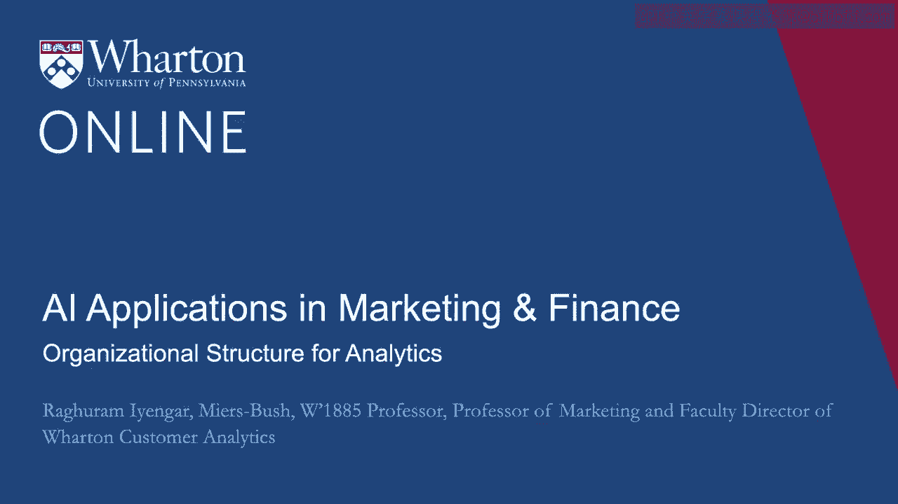
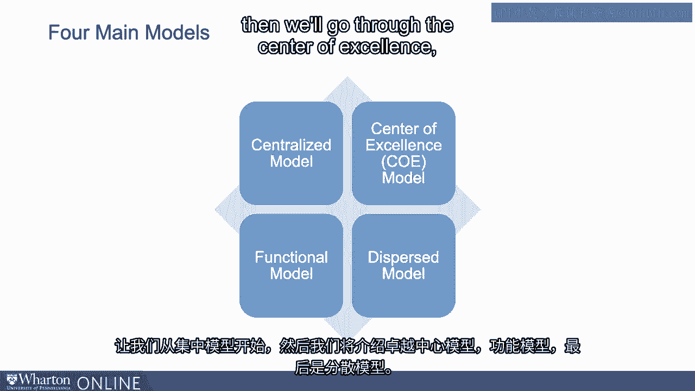

# 沃顿商学院《AI For Business（AI用于商业：AI基础／市场营销+财务／人力／管理）》（中英字幕） - P40：6_面向分析的组织架构.zh_en - GPT中英字幕课程资源 - BV1Ju4y157dK

 We've talked a lot about voice， vision， all of the different types of AI。

 I think of course what's important is within an organization， how do we get success？ Well。

 a large part of that success is depending upon how the structure for analytics is set。

 up within the organization。 So let's take some examples and try to understand different types of structure and what can。

 be some good takeaways in terms of how organizations can become more structured for getting the。

 best out of analytics。 There are many different kinds of models out there。

 The big takeaway I wanted to have as we go through these models is of course there's no。

 one size fits all。 You have to see what the maturity within the organization is in terms of what model might。

 work best for you。 I'll go through all of these models。 So let's start with the centralized model。

 then we'll go through the center of excellence。

 the functional model and finally the dispersed model。 So when you go through these models。

 let's look at the pros and cons and then I would， urge you to start thinking about your own organizations and the level of maturity that。

 it has as to what type of structure you feel will best go for your organization。

 Let's start with the centralized model。 The idea here is that there's a core unit of analytics that serves the entire company。

 Of course， what are the advantages of this？ Many advantages。

 The ability to work on cross-functional projects for example， of course there's a core unit。

 that serves the entire company， they can see all kinds of analytics going across the entire。

 company。 What's happening operations， what's happening in marketing， what's happening perhaps in。

 finance。 This way you can share ideas across analysts who are working in different parts of the company。

 And of course， the fact that there is a central unit which is serving the entire company， lots。

 of analysts that are in there， there's a high level of dependability for the entire。

 company as well。 Clearly， it's a big structure that in some sense helps the whole company。

 What are the flip sides？ The flip side is there might be a lot of workload and time constraints depending upon how the。

 analysts are set up， depending upon the investment that the company has made in terms of the。

 number of analysts。 Of course， given that there is one core unit。

 sometimes you might end up prioritizing the， projects that come to marketing。

 sometimes operations and so on。 And another big disadvantage so to speak is agility。 Again。

 if there's one big unit， it's much harder to be agile because you're handling， many。

 many different projects at the same time。 Let's take another model。

 It's called the center of excellence model。 It's a very interesting combination。

 The term that is typically used in the industry is called COE， center of excellence。

 It's an interesting combination where activities and analysts are based in their business units。

 but there is a small core group as well。 What is the idea here？ In some sense。

 you're trying to have the best of both worlds。 What that means is there is a central group of people in the small organization。

 central， group。 On the other hand， analysts being embedded in the business units。

 they also have business， knowledge as well。 So substantive knowledge。 So what are the positives？

 Training is centralized because the central group is handling all the training。

 There's also good coordination as well。 On the flip side， what are the negatives？

 The negatives might be the COE， the center of excellence， may not have enough control because。

 it's a much smaller group。 And of course， the fact that it's a smaller group。

 how much signal do we have within the， organization that there is a lot of support for it？

 Then there's a model， what I call the functional model。 I think it depends again。

 we'll talk a little bit more about the maturity of the organization。

 but the idea here is the following。 Analysts are typically based within the functions that dominate the analytics activity。

 Now for example， it's possible that the finance group within your company has a lot of different。

 things going on or the operations group， whatever the case might be。

 So the company may decide the operations group let's say because there are a lot of。

 activity going on， that's where analytics should be concentrated。 Well， on the positive side。

 analytics is concentrated where it can benefit the most。 So you can look at the ROI。

 you can do all kinds of things which can help you understand。

 how good is analytics and the practice of analytics for your company。

 Where are all the different things， the new technologies that you're adopting， where are。

 they having benefit？ What's the negative？ The negative is other functions may not get the support that you want。

 So marketing for example， let's say， is not getting the support because a lot of the analysts。

 are within quote unquote the operations area。 And finally， this is a model but not really a model。

 It's called the dispersed model。 The idea is basically analysts are spread throughout the organization with no central。

 support。 And unfortunately for many organizations， I see this as well。

 What's the positive if there is some？ Is that well。

 some units get it because they just happen to have analysts。

 But I think there are many disadvantages。 First of all， this is not really a model。 In some sense。

 you can think about little kind of sparks in different parts of the organization。

 but not enough to catch fire。 And so in some sense。

 there is no real one way in which the dispersed model can hope to， get structure around it。

 But this is where I see a lot of organizations so I wanted to bring it up just so that you。

 realize that if this is where your organization is， it's time to start thinking about how。

 you should change the structure of analytics in that organization。 Now of course。

 a quick question and a big one is which model to use then？ We've talked about different models。

 the CUE model， the functional model and so on。 Well， honestly。

 it depends on the needs of the organization。 And in some organization。

 what I've seen is as they become more mature， initially when， they start。

 you need some amount of centralization because you do want to understand what are。

 the activities that are happening across the organization in terms of marketing， operations。

 and so on。 What can in some sense be leveraged in one part of the organization that might be happening。

 in other part of the organization？ So you do need some kind of centralization。 On the flip side。

 I think， you need to constantly monitor。 The model that you have in your organization is congruent with the maturity that you have。

 So what I've seen in the best organizations that are more mature， they do have some centralized。

 kind of structure， the CUE type structure， but at the same time， they have analysts embedded。

 within the functional units。 Why？ Because I think for analysts， it's very。

 very important to understand the substantive nature。

 of the decision making that's happening within the organization。 So this way。

 when analysts are building their models， when analysts are adopting new technology， to help。

 quote unquote， within their own businesses， they understand what the decision。

 makers are going through。 They understand the kind of hurdles that decision makers within the company are having when they。

 go ahead and use new technologies。 So start looking at your organization and see where you are in the level of maturity and。

 then see what kind of model best works for you。 [BLANK_AUDIO]。

