# 沃顿商学院《AI For Business（AI用于商业：AI基础／市场营销+财务／人力／管理）》（中英字幕） - P50：16_信用风险KPI.zh_en - GPT中英字幕课程资源 - BV1Ju4y157dK

 So now I want to start talking about credit risk KPIs or key performance indicators。

 I'm going to build up to them by first talking about how to assess credit risk。

 So the way I want to do this is let's look at some data。

 Admittedly small and simple data， but data nonetheless。

 What I have here on the screen are the P&L and the balance sheet for Intel Corp。

 I think this is their fiscal year in 2014。 It's just some historical data to illustrate some of the concepts I want to discuss。

 And let's start by looking at their P&L， their income statement here。

 You can see they had a little over $55 billion in revenue。

 They had operating income in excess of $14 billion。 And net income or earnings of about $10 billion。

 So from a credit risk perspective， just looking at their P&L， we can see that this is a fairly。

 profitable company， but that doesn't necessarily imply that they're capable of repaying all。

 their financial obligations since we don't know what they are。

 So let's take a look over at their balance sheet and see what kind of obligations they， have。

 Now they've got some non-financial debt， things like accounts payable， which we're。

 going to ignore just for the time being。 And we're going to focus on the financial obligations。

 most notably the short-term debt， and debt due。 So that's debt that is coming due within a year。

 either because it has a very short maturity， something like commercial paper。

 or because it's long-term debt that is just coming up， on its maturity。 So a little bit over $1。

6 billion of short-term debt。 And they've got about $12 billion of long-term debt。

 So a little bit over $13。7 billion of financial debt。

 What's interesting is they actually have $14 billion of cash and short-term investments。

 So of course it's not literally sitting in a savings account in some bank， but it's in。

 short-term liquid assets that are easily converted into cash。

 So looking at sort of a very high level at both their income statement and balance sheet。

 a first glance would suggest that Intel is not a particularly high-risk firm when it。

 comes to repaying its financial obligations in light of how much cash it's sitting on。

 as well as it's just its earnings， its annual earnings。 But this is very loosey goose。 Again。

 I'd like to move towards something that's a little bit more formal。

 So why don't we take a look at some key performance indicators as they relate to credit risk。

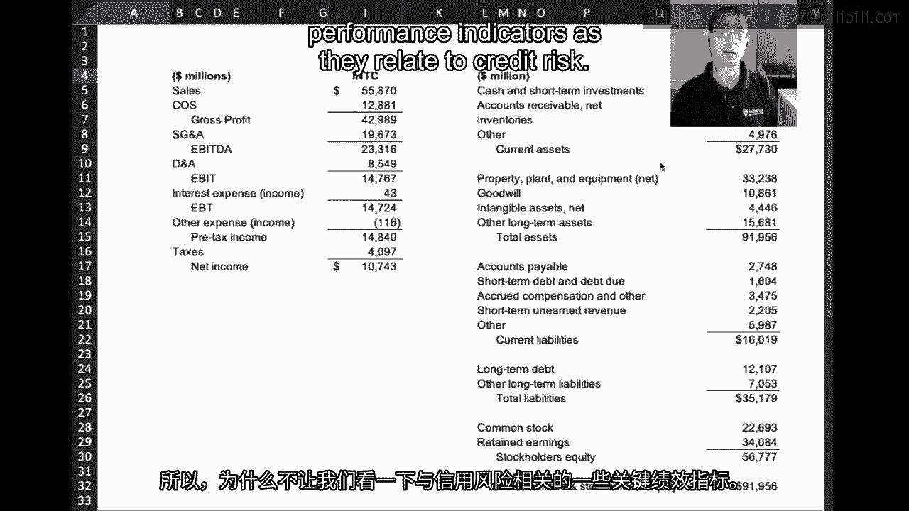

 So let me scoot over here on my spreadsheet and have you focus attention on this table。

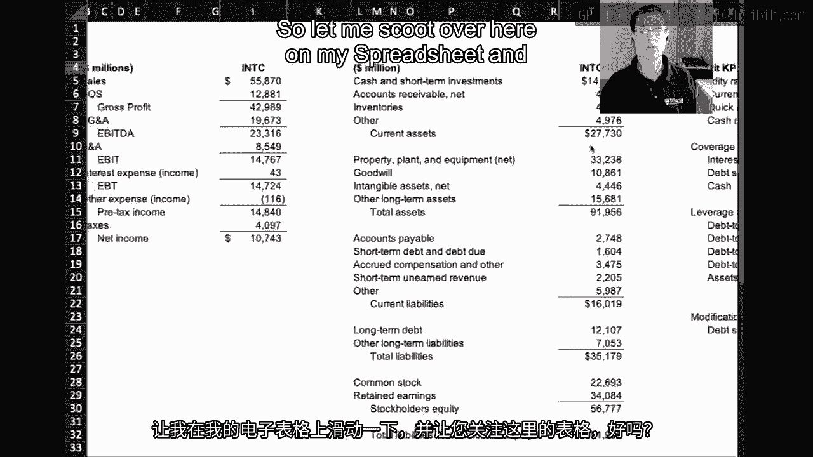

 right here， if you will。 Now let's start with some liquidity ratios because arguably most solvency problems begin。

 as liquidity problems， not that every liquidity problem turns into a solvency problem。

 But the importance of liquidity for default is well known and well understood。

 So let's look at three ratios that attempt to capture the liquidity position of a firm。

 And I'm talking about the current ratio， the quick ratio and the cash ratio。

 So let's start at the top。 The current ratio and I've got definitions over here in this column， A。G。

 The current ratio is just a ratio of current assets。

 That is all the assets the company has that can be easily converted to cash within a year。

 divided by current liabilities， which are all the liabilities or all the money it owes。

 within a year。 Now that ratio is 1。73， which can be interpreted quite simply as follows。

 Well has $1。73 of current assets for each dollar of current liabilities。 That is $1。

73 of liquid assets that it can easily convert into cash to pay off each dollar。

 of liability that it owes over the next year。 Now that seems pretty good。

 So it's got more than enough assets to cover its liabilities。

 But of course this notion of current assets being easily converted into cash， not all。

 current assets are the same。 And so the quick ratio acknowledges that by booting from the numerator inventory。

 So it just considers cash and accounts receivables。 So once we boot inventory， our quick ratio。

 well the current ratio， net of inventory comes， down from 1。73 to 1。15。

 So we've got cash and accounts receivables， $1。15 for each dollar of current liabilities。

 And then if we really just focus on cash， we've got 88 cents of cash for each dollar of current。

 liabilities。 So mechanically these numbers are going to decline because we're moving more and more。

 from the numerator and we're removing it in a fashion that is prioritizing by the relative。

 liquidity of each of the assets。 Now which measure is the right measure is the wrong way to think about it。

 Each measure provides slightly different information。

 It's just we're going from a more aggressive current ratio to a more conservative cash ratio。

 But regardless of which one we look at， it's fairly clear that Intel has a reasonable stock。

 of liquid assets that it can use to pay its current liabilities， its upcoming or short-term。

 obligations。 Now shifting gears from liquidity， we're going to go to coverage ratios starting with the。

 interest coverage ratio。 And this is a very common ratio that appears in most financial credit agreements。

 most， bank loans。 As a covenant， firms are required to maintain a certain coverage ratio over the life of。

 the loan lest they be in violation of that particular covenant。

 The interest coverage ratio is just the ratio of EBIT or operating income to interest expense。

 And we can see that for Intel， it's got $343。42 of operating income for each dollar of interest。

 expense。 Think about what that means。 It means they can easily handle all of their interest expense for the year just out of their。

 operating income， never mind their current assets。

 But we don't just have to pay interest on our borrowings， we also have to pay principal。

 And so the debt service ratio accounts for that by including not just interest expense。

 but also debt due within the year in the denominator。

 And so we see a large decline in the coverage ratio moving from interest to debt service。

 as you might expect， but still， Intel has almost $9 of operating income for every dollar。

 of interest and principal that's owed over the next year。 In other words。

 they have a great deal of coverage from their operations to take care。

 of their financial obligations。 And then there's also something called a cash coverage ratio that looks at the ratio。

 of cash assets from the balance sheet to interest expense。 And as we saw earlier。

 they've got over $14 billion of cash assets more than enough to， take care of any interest expense。

 So again， not to get lost in the forest here。 Intel has a decent amount of liquidity relative to its current obligations。

 It's generating a lot of operating income relative to its financial obligations， its。

 current financial obligations。 Then the last set of ratios I want to focus on are leverage ratios。

 which are a slightly， different take。 leverage ratios are looking at how the company is financing its operations。

 And one of the more popular ones is debt to EBITDA。

 This much like interest coverage shows up in a lot of different bank loans as a popular。

 covenant that borrowers have to abide by。 They have to maintain a leverage ratio below a certain threshold。

 such as three or four， whatever it may be， lest they be in violation of that particular covenant。

 You see for Intel， the debt to EBITDA ratio is 。59 times， right？ So the amount of debt。

 short term and long term debt， is 。59 times their operating income。

 as measured by EBITDA as opposed to EBITDA。 So think about that。

 Does that mean that they have an enormous amount of debt relative to the operations？ Hardly， right？

 They've got， they've got， they're generating enough operating income basically to pay off。

 their entire debt bill almost twice over。 The remaining leverage ratios， debt to equity。

 cap debt to capital debt to assets， assets， to equity are again different versions of how the firm is funding itself from the perspective。

 of just the balance sheet as opposed to both balance sheet and P&L。

 And so we can see that for example， the debt to asset ratio is 。15， meaning for every dollar。

 of assets， 15 cents of those assets is being funded by debt， the other 85 by equity。 Again。

 not a highly levered or a low levered company as suggested by these different ratios。

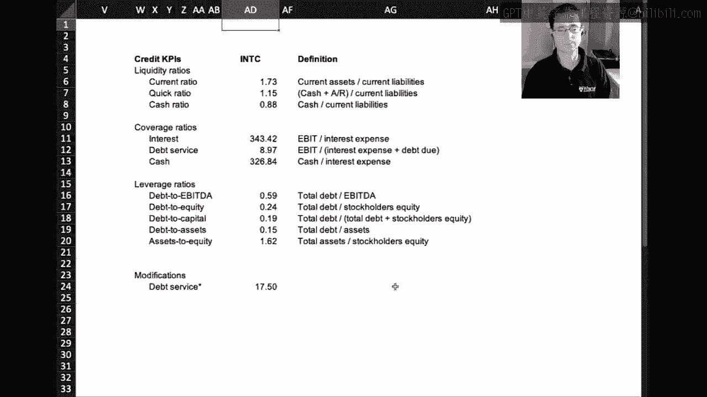

 Now let's compare and contrast that with AMD， another chip maker， right？

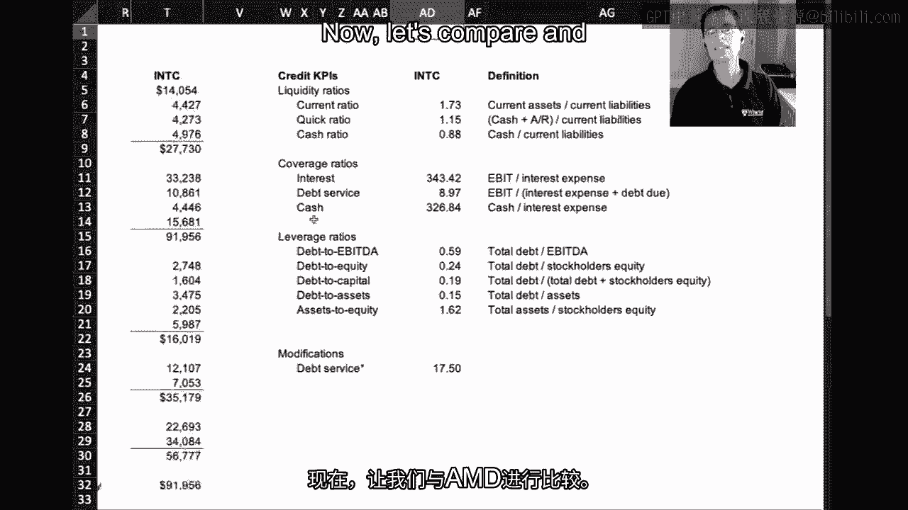

 So same industry， I'm going to pull up their P&L here and before I get to the other tables。

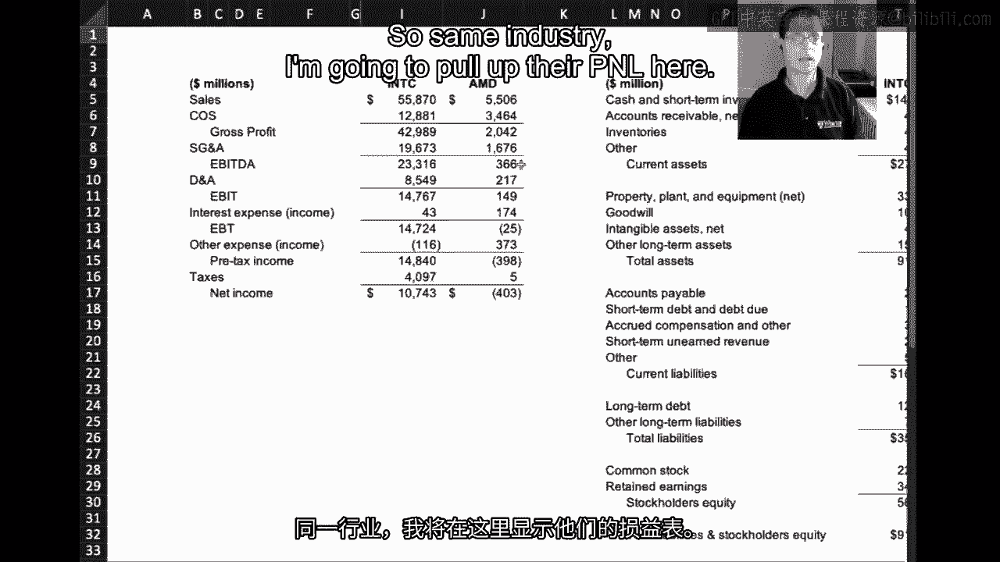

 we can see that AMD back in 2014 at least was losing money， at least in terms of its。

 bottom line， it was generating positive operating income of about $149 million， but had losses。

 earnings losses of almost half a billion dollars down here。

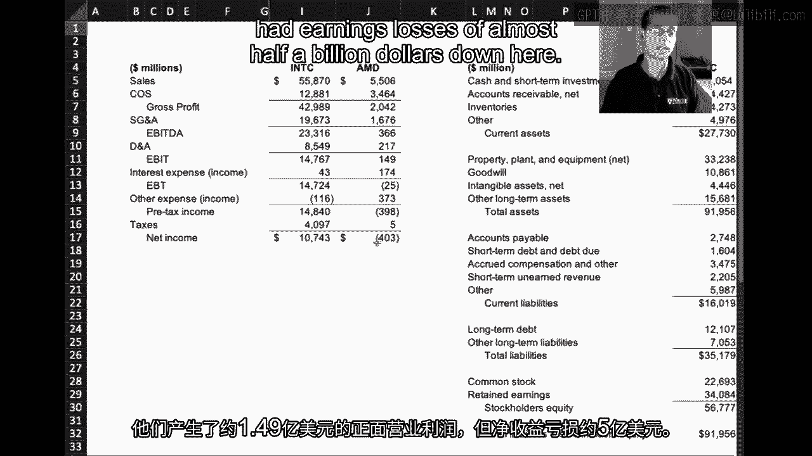

 If we look at its balance sheet， you can see that it's got quite a bit less cash， but of。

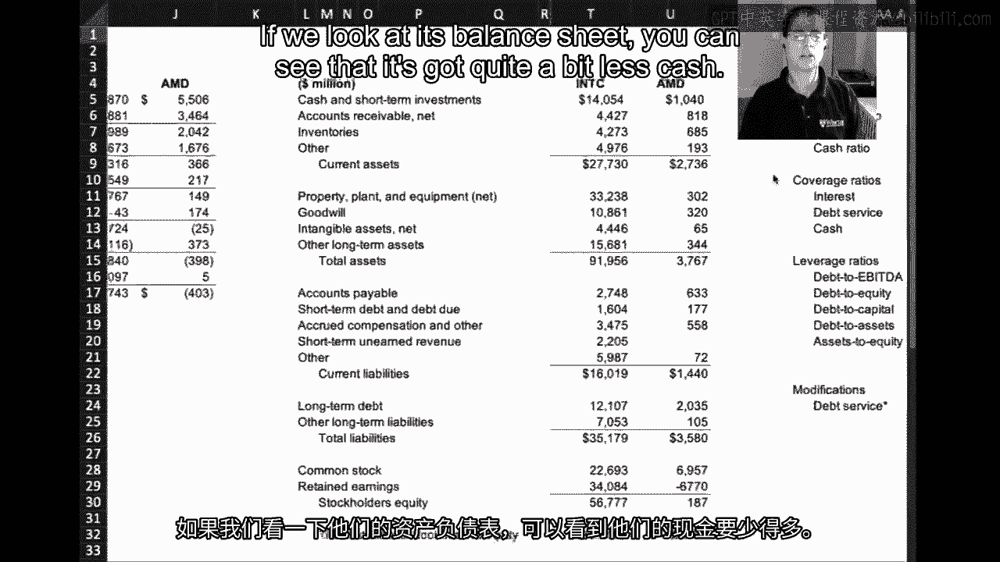

 course this is a much smaller firm。 So it's really a bit of an apples to oranges comparison here。

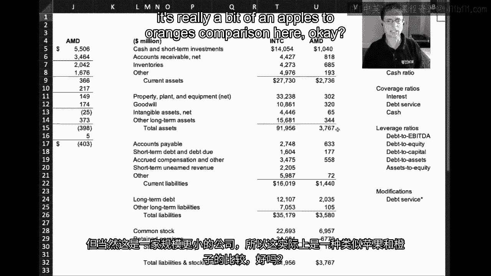

 What's much more interesting is going over to the credit KPIs。

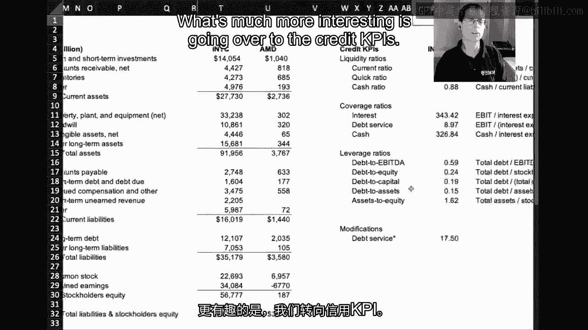

 If we look at AMD's liquidity coverage and leverage ratios and how they compare to Intel。

 we get a very interesting contrast。

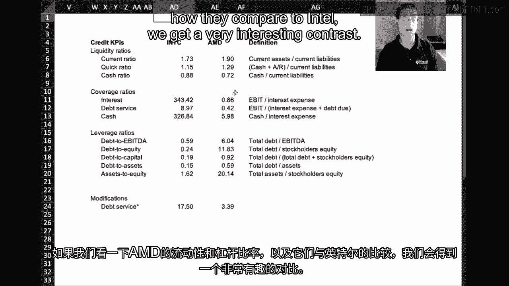

 So let's start at the top with liquidity ratios again。 Interestingly AMD has similar。

 if not stronger depending on which ratio you look at， liquidity， ratios relative to Intel。

 It's got a higher current ratio， a higher quick ratio and a slightly lower cash ratio， but。

 just looking at the liquidity ratios， it doesn't look as if AMD is in any imminent danger in。

 the sense that it has significant current assets or liquid assets to take care of its。

 upcoming or short term liabilities。

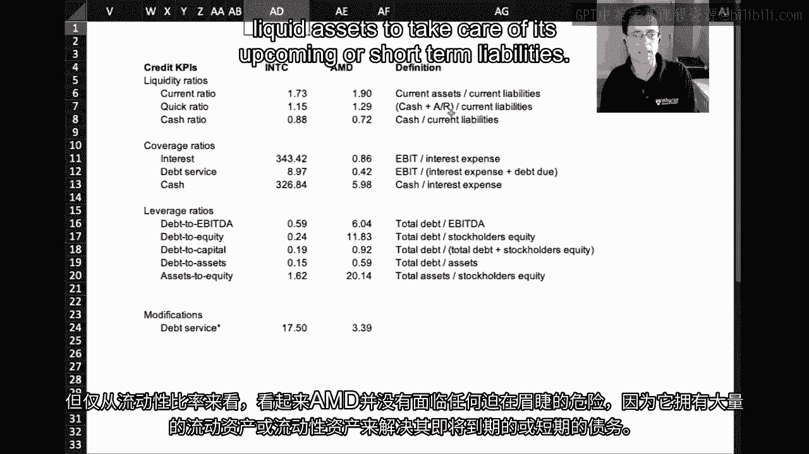

 However， when we start looking at their coverage ratios， we see the picture changing quite a， bit。

 So let's take a look at the interest coverage ratio， remember which is their operating income。

 divided by their interest expense。 And we can see that that's actually less than one， it's 。86。

 So for each dollar that they owe in interest in the upcoming year， they're only generating。

 86 cents of operating income， which means if they're going to make the interest payment。

 they're going to have to find money elsewhere， probably on their balance sheet somewhere in。

 their current assets。 If we look at debt service， that is throw in the debt coming due over the next year。

 we， see that that figure drops quite dramatically at more than halves so that for each dollar。

 owed in either interest or principal over the next year， they've only got 42 cents of。

 operating income。 Again， that's telling us they've got to find money elsewhere because the operations aren't。

 generating enough to cover the debt burden。

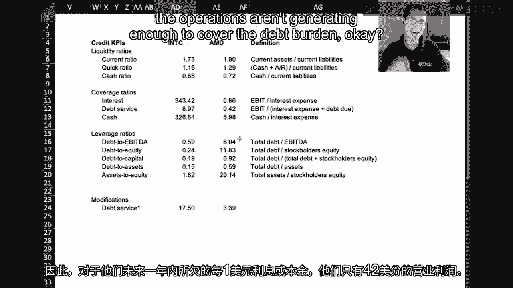

 And you can see where it's most likely coming from， this nice liquidity cushion that they。

 seem to have is going to have to be used。 And additional borrowing or equity issuances。

 it's going to have to be used to help make。

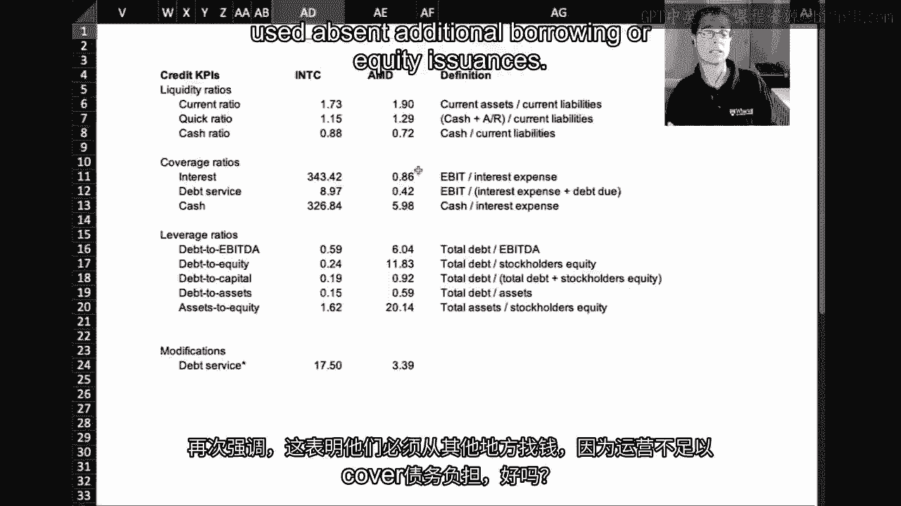

 these debt service payments。

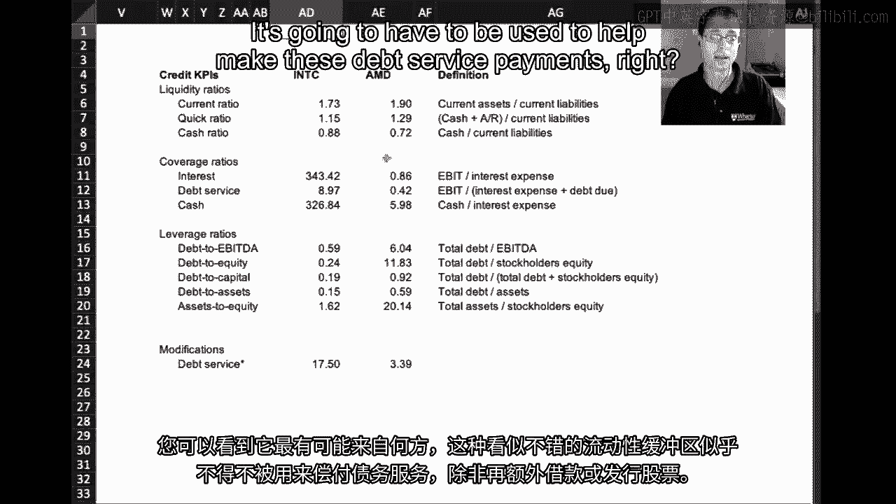

 And that's why the cash balance to interest expense ratio is so high， they're sitting on。

 a relatively large amount of cash。 It also presents an interesting contrast with Intel。 See。

 Intel can go about its operations and just from its operations， take care of all。

 of its debt servicing needs。 Which means it can use its liquidity for strategic and operating reasons as opposed。

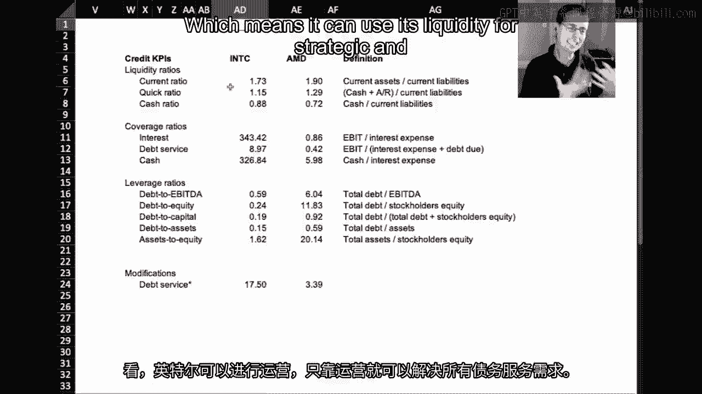

 to helping to pay down debt， whereas AMD clearly needs this liquidity to take care of its debt。

 service or at a minimum at least give its creditors some confidence that it will be able。

 to pay its upcoming debts。 Now this difference shows up again in AMD's and Intel's leverage ratios。

 whereas Intel。

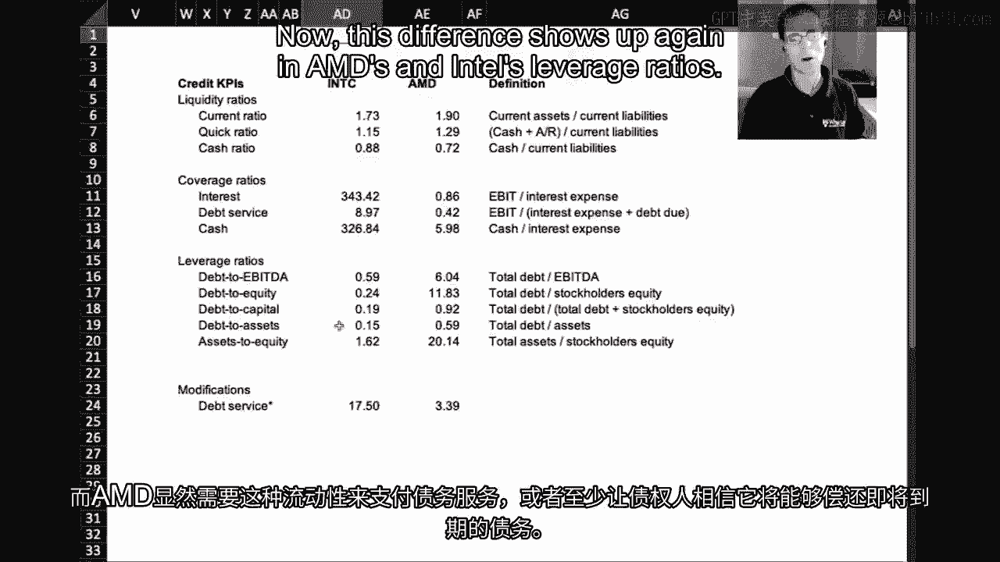

 had 59 cents of total debt per dollar of operating income as measured by EBITDA。 AMD is $6。

 So it's six times， its leverage ratio is six times EBITDA。 Similarly。

 whereas Intel was funding its assets with 15 cents of debt and 85 cents of equity。

 AMD is funding its assets with almost 60 cents of debt and 40 cents of equity。

 So a lot more debt usage and a relative sense for AMD。

 Now pause and think about what all this means。 What is this telling you about the relative credit risk of these two companies？

 Really they're different。 And if you haven't already figured it out。

 though I imagine most everyone has， it should， be clear that AMD is in a much more financially precarious position than Intel。

 Intel is in a much better position to take care of its financial obligations than AMD。

 And so we would say that AMD is a much riskier firm from a credit risk perspective than Intel。

 So bringing this all together， what have we learned？

 We've actually learned sort of the fundamentals of credit risk analysis。

 Now there's a lot more to it， but we've actually gotten quite far in terms of laying out some。

 of the relevant KPIs that identify both liquidity and potential solvency issues。

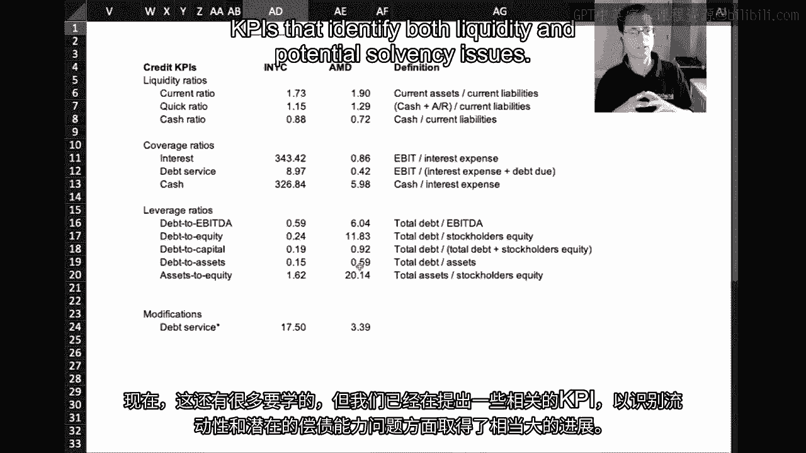

 We've seen how they can vary even within the same industry， same business， well， not quite。

 the same business model， but the same industry， in this case chip makers。

 We see dramatic variation in the credit risk of Intel and AMD。

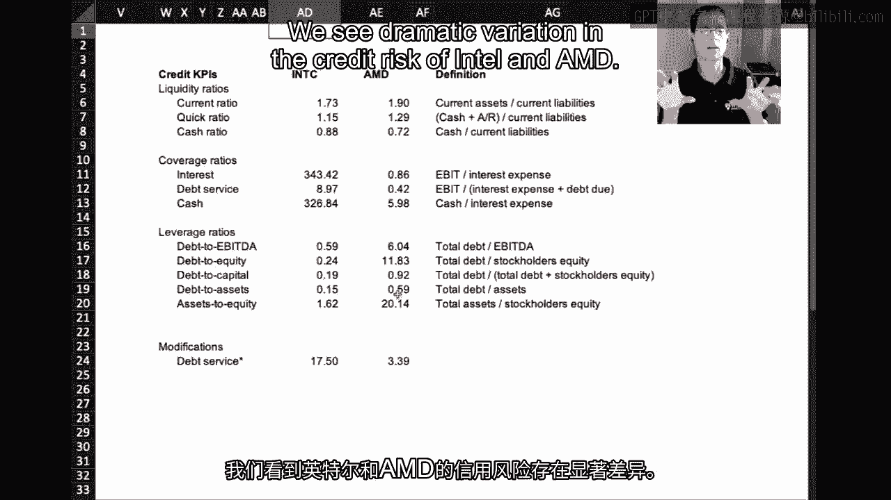

 [BLANK_AUDIO]。

