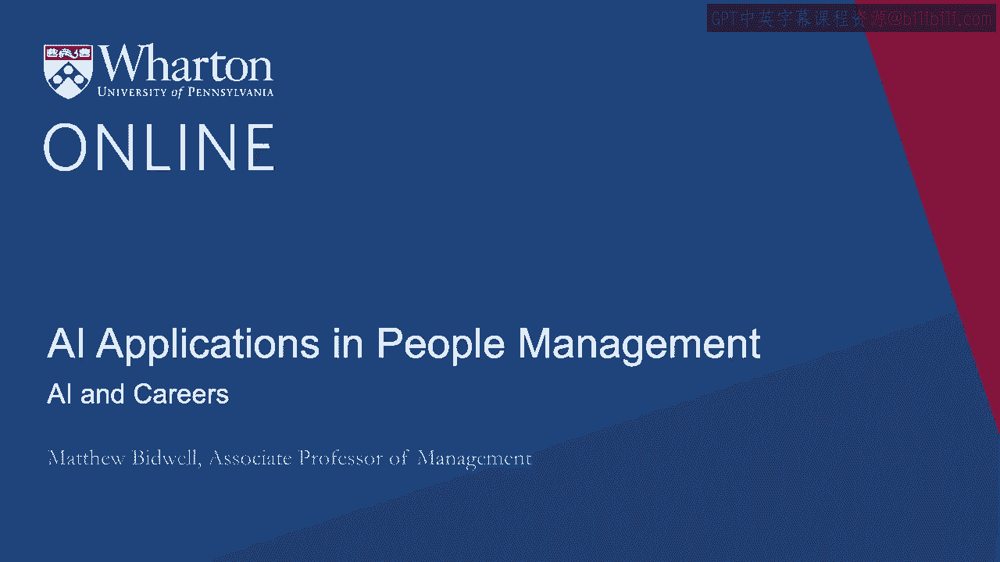
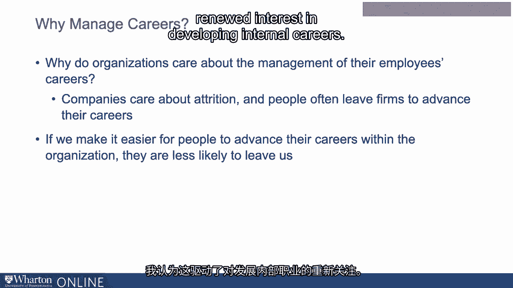
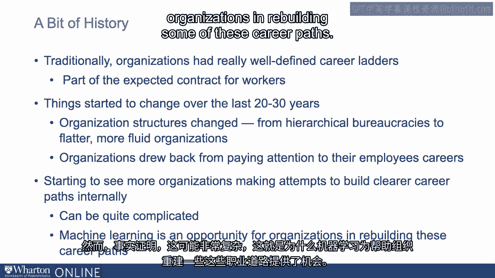
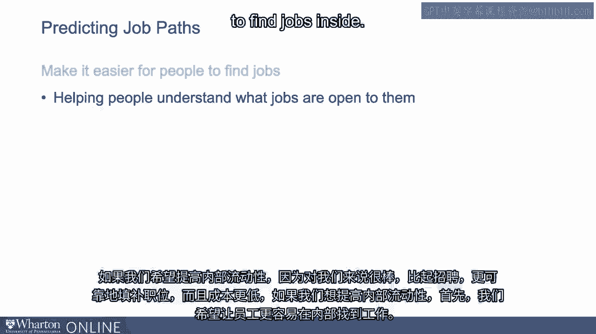
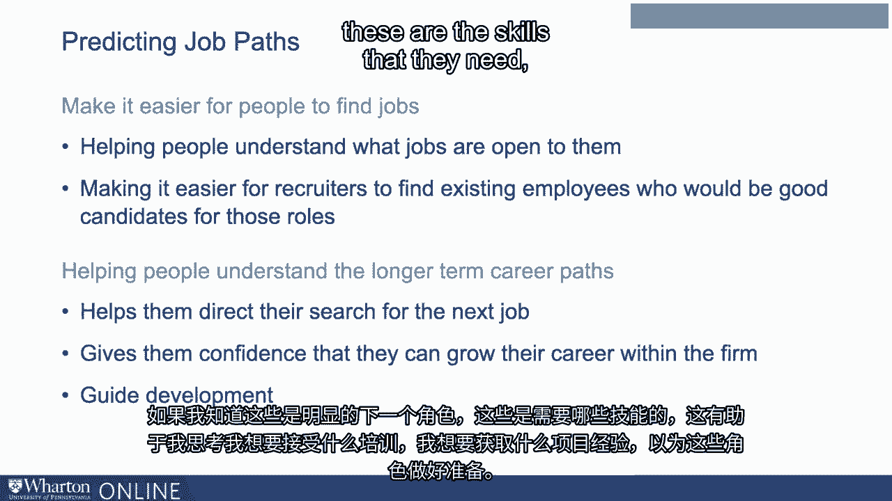
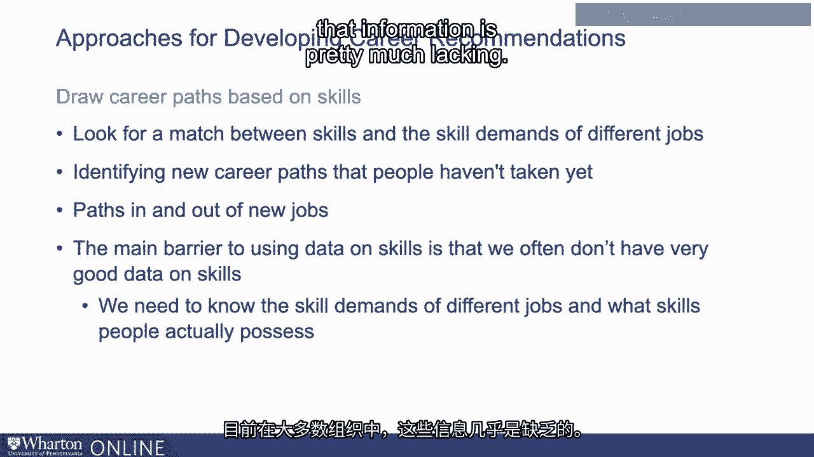

# 沃顿商学院《AI For Business（AI用于商业：AI基础／市场营销+财务／人力／管理）》（中英字幕） - P79：16_AI与职业生涯.zh_en - GPT中英字幕课程资源 - BV1Ju4y157dK

 The third application of machine learning that I want to talk about is in managing internal。

 careers。 It's an area of particular interest to me and I think it's also a topic that's of growing。

 importance among companies and it's somewhere where machine learning is proving really useful。

 in passing just the complexity of Moncris。 Let me give you a little bit of background。

 Why do organizations care about the management of their employees' careers？

 The main reason is that companies care about attrition and people often leave firms to advance。

 their careers。 The idea is if we make it easier for people to advance their careers within the organization。

 they're less likely to leave us。 I think this has driven a lot of renewed interest in developing internal careers。

 To give a little bit of context， I think it's useful just to give a very small bit of business。

 history。 I know that business history is not what you thought you would get in a course on AI and。

 HR but just indulge me for a minute。 The idea is that traditionally。

 organizations had really well-defined career ladder。 You knew what would happen。

 You came in at a certain level and then you could advance across these various different。

 jobs as your career evolving。 In a sense， it was part of an expected contract。

 That's what you got from working there。 A couple of things really changed over the course of the last 20 to 30 years。

 One is that organization's structures changed。 We went from these hierarchical bureaucracies to these much flatter。

 more fluid network-based， project-based organizations。 This has been great for a lot of reasons。

 It makes organizations much more flexible and innovative， more collaborative。

 We have less of that deadweight of bureaucracy。 All of those sorts of things。 We like that。

 It also makes it much harder to chart careers because there's no longer this hierarchy to， climate。

 We've got all of these separated organizations and understanding how I move from one place。

 to another where the opportunities are。 That's a lot harder。

 We blew up the career ladder as we did that。 The other thing that happened is that organizations at a certain point drew back from paying attention。

 to their employees' careers。 They made very clear that as far as the company's concerned。

 your career development， that， kind of sounds like a you problem to us。

 There's not something that we're terribly interested in helping you。

 You figure out your own career development。 That's your responsibility。

 Organizations went down this route。 Over time， a limitation to that strategy has become fairly clear。

 which is that if you， tell your employees that their career is a you problem， Chancellor。

 they're going to， come up with a me solution， which doesn't necessarily have very much to do with staying。

 in your organization。 There's been a gradual realization here。

 When somebody leaves for a job in another organization， that's a loss to us。

 It's a lot easier for us to fill roles effectively with our own people。 We want them to stay。

 Helping them to stay is about helping them understand that they can build careers internally。

 We're helping them to understand what kind of jobs they can get here and how they can。

 actually move into those jobs。 We're starting to see more and more organizations make these attempts to build clearer career。

 paths internally and make sure they look to those internal career paths first when， filling jobs。

 It turns out， though， that that can be quite complicated。

 That's why machine learning has been an opportunity to help organizations in rebuilding some of。

 these career paths。 How can we use machine learning to help employees build career paths internally？

 The simplest approach is really helping them to understand their career paths。

 I talked earlier about how organizations blew up these job ladders。

 We no longer have this very structured advancement。 What that means is。

 as somebody in an organization， if I want to build a career inside the organization。

 it's more effort for me to figure out what's the next job that I should be moving to。

 If we want to enhance internal mobility because it's great for us， much more reliable for。

 filling jobs than hiring， much cheaper as well。 If I want to enhance internal mobility。

 first of all， I want to make it easier for people， to find jobs inside。

 That may partly be helping people understand what jobs are open to them， also making it。

 a lot easier for recruiters to find existing employees who would be good candidates for。

 those roles。 More broadly， helping people understand those slightly longer-term career paths can be good。

 because it helps them direct their search for the next job。

 When I think about these are the different roles that I could move into， I know who to。

 start talking about where to start building my networks to figure out my next opportunity。

 More broadly， it's a signal to me that I can grow my career within the firm。

 I start to understand what are the possibilities and see all these things open for me。

 More technically， I can also start to guide my development。

 If I know these are the obvious next roles， these are the skills that they need。

 It helps me think about what training might I want to take on， what kind of project experiences。

 do I want to get to prepare me for those sorts of roles。

 We want to find ways to help people understand the next jobs that they can move into。

 People have often turned to machine learning to help build those maps in a world where the。

 traditional career paths no longer exist。 An early example of an organization trying to do this was IBM Watson's career coach。

 You might have heard of IBM Watson。 This was IBM's pioneering artificial intelligence product。

 Based on this， they built a tool which employees could interact with to explain their preferences。

 for their careers and then Watson would take their preferences and then combine it with。

 a sense of what kind of career paths were possible inside an organization to provide。

 them guidance on what they should be thinking about next。

 The goal being this would increase retention and engagement。 How do these sorts of tools work？

 How do they actually help provide recommendations to people of the career paths that they can。

 follow within the organization？ There are a couple of approaches that are common。

 The simplest one is basically just to analyze the career paths of people who have come before， them。

 For example， if you're a market analyst and you're wondering what you want to do next。

 let's troll through the data and figure out previous market analysts what other roles have。

 they gone on to so that they might continue。 These are the common options。

 This is what you might think of doing。 Some organizations might do that in reverse。 They might say。

 "Instead， great。 You want to become a controller。 Let's look at what jobs people have moved into controller positions from so you can start。

 to think about which role you might want to take next to position you for。

 Both sorts of information， potentially quite helpful for people as they think about potential。

 next moves。 There are a couple of challenges with this。 First of all。

 it works well for very common roles。 We've got a lot of marketing analysts。

 We've got a lot of controllers。 It's easy to see multiple routes in and out。 For fairly rare roles。

 we just might not have very much data on what people have done before。

 in terms of entering those roles or leaving them。 The other challenges。

 this is all about what's happened in the past。 Jobs are changing very fast。 Being able to tell you。

 "Well， in the past， people followed these routes。"， Well。

 maybe this is what market analysts did five years ago， but today， there's a whole。

 raft of jobs that maybe market analysts are going to that didn't even exist when we are。

 putting this data together。 In a fast-moving environment。

 just relying on prior roles might not be that effective。 A second approach， which is more robust。

 but also more tricky， is to draw career paths， based on skills。

 The idea here is that whether or not I can take a job really depends on the skills that， I have。

 Jobs that I have the right skills for， I can move into people， be happy to hire me into， them。

 They think I can do the job well。 Jobs where I don't have the skills。

 that's not really an option for me。 If we can think about my skills and the skill demands of the jobs。

 that's another way to， identify all of the various different possibilities for me in terms of my next movement。

 There are some nice ideas here， the idea that maybe I'm a market analyst and I hadn't really。

 thought that maybe I can move into HR as a data scientist， but actually the skills that。

 are necessary are all the same。 When we look at skills。

 we don't need to have this kind of lots of transitions that have， happened in the past。

 It is really good for identifying new career paths that people haven't taken yet， paths。

 in and out of new jobs。 This is a nice approach， it has its own problems though。

 The particular barrier to using data on skills to identify career paths in the organization。

 is that often we don't have very good data on skills。 In order to do this。

 we need to know what the skill demands are of different jobs and。

 we need to know what skills people actually possess。

 That's the kind of core data that this and frankly a lot of workforce planning applications。

 that organizations also want to engage in。 But where do we find that data？

 Where do we actually find out what skills are people have？ Currently in most organizations。

 that information is pretty much lacking。

 [BLANK_AUDIO]。

