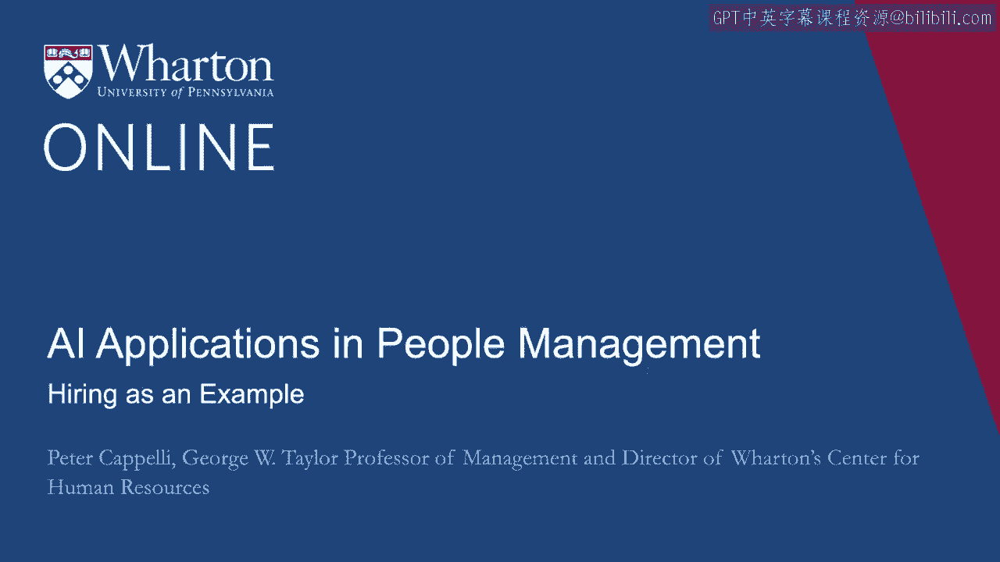
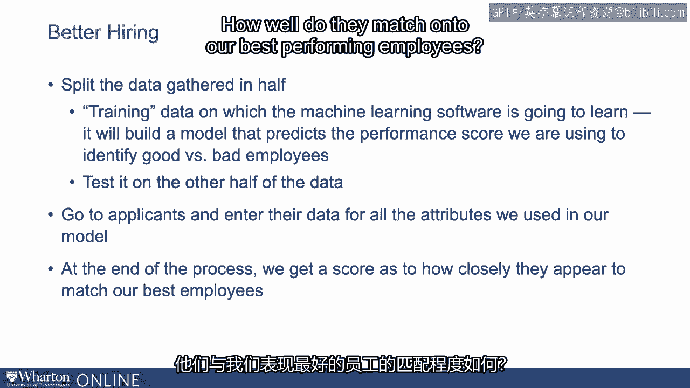
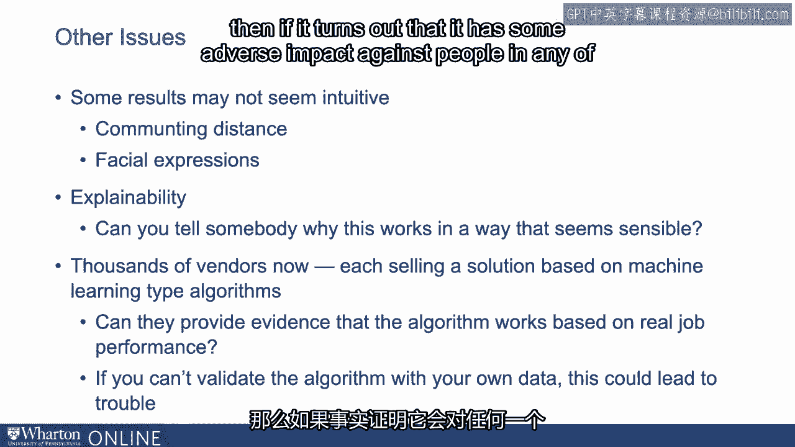

# 沃顿商学院《AI For Business（AI用于商业：AI基础／市场营销+财务／人力／管理）》（中英字幕） - P81：18_招聘作为一个例子.zh_en - GPT中英字幕课程资源 - BV1Ju4y157dK

 In this segment， we're going to illustrate some of the issues around data science as。

 applied to managing people issues in the context of one very practical， really important problem。

 And that is hiring。 So Matthew talked a little bit about the general context in which managing people decisions。

 had been made and actions had been made before data science came along。

 We're going to drill down on this a little bit now in hiring。 By hiring， because this is by far。

 at least right now， the most important people management， issue。

 it's the one on which most money is spent。 The administrative costs alone of replacing somebody。

 even the lowest level workers， about， $4，000。 When you start looking at the costs of turnover and you move up higher in the organization。

 it's not uncommon to hear estimates that about two years salary is the equivalent cost of。

 having to bring in a new person。 If you make a mistake and that person quits， a bad hire。

 that's really expensive。 There's an industry， about $200 billion industry of helping companies fill positions。

 It's a really big， big business that we're talking about here。 How's it supposed to work？ Well。

 just as a reminder， most of you probably live through this。

 If you look at a textbook on how hiring works， they'll say， you start with a job description。

 Here's what will be required。 Here's the kind of person we're looking for。

 Then you post and add someplace， wait for people to apply。 Once you get your applications。

 then you try to whittle them down to a short list。 Short list， you use more expensive whittling。

 Basically， maybe you interview these people and give them tests。 Then at the end of this。

 you make a hiring decision。 The reality doesn't look at all like this now。

 The census reports or data from the census reported last year that the majority of people。

 who changed employers were not looking to move。 They weren't searching for a job。

 Somebody came and got them or enticed them to move。 That process of creating a short list。

 these days that's done by applicant tracking software。

 People aren't even touching the resumes anymore。 It's automation on keywords。

 It's not artificial intelligence。 It's not even data science。 It's just keyword tracking。

 It's just looking to see in your resume whether you use the magic words in some cases。

 Because this is complicated， a lot of people outsource it in their companies。

 A company that may hire more people than anybody else in the US is a company you may not have。

 heard of。 It's a company called PeopleScout。 They are a recruitment process outsource。

 They hire for other companies。 They hire 300，000 people per year。 Put that in perspective。

 The US army brings in maybe 120，000 new recruits every year。 People scout is hiring 300，000。

 It's a big， big operation with a lot of scale。 We look at how things are done right now。

 There's a real big push on passive candidates。 That means let's see if we can find people who are not applying and go grab them and bring。

 them into our system。 The goal of most employers seems to be to get more and more and more people to apply to。

 their positions。 The way to think about this in most organizations， which by the way。

 I think is a mistake。 I'll come to this in a second， is to think about this as a funnel。

 We're trying to get lots and lots of people to apply at the very top。

 Then we'll screen them down with applicant tracking systems。 And then from there。

 we will try to use other screens to pull them down into the bottom of， the funnel。

 If 100 people apply at the very beginning here at the top of our funnel， how many of。

 those people are going to get job offers？ Well， the evidence seems to suggest about 2%。

 Your odds on getting a job offer when you toss your application into an electronic hiring， model。

 go to a company and apply that way or you go to job boards like Indeed and apply， that way。

 about a 2% chance that you will get a job offer。 The reason for that is because there are so many people applying for jobs because the。

 probability is low， we have people applying for 20 jobs。 30 jobs， 100 jobs。

 We made it easy for people to apply and so that's what they do。

 That's the reality here and it's followed by an incredibly strange finding and that is。

 when companies look to see how they're hiring， whether doing a good job or bad job， here's。

 what they track。 How long does it take for us to fill a position？

 How much do we spend to fill a position？ What they don't track。

 so maybe only a quarter try to look at this， is whether we make good， hires or not。

 Think about this。 We're measuring how expensive it is and how fast we can do it。

 but not whether we do a， good job。 If you were to think about reviewing， let's say。

 restaurants this way and the way you judge， restaurants was fast and cheap。

 that Michelin star guide would really look different。 If all you cared about is fast and cheap。

 When we start talking about hiring， one of the things to recognize is first， the way things。

 are going now doesn't look like the textbook and second， for most employers， we have no。

 idea whether we're doing a good job or not。 It's not going to be hard to do better than what we're doing right now。

 Let's talk about how we do better and how we apply data science to making hiring decisions。

 Two issues， the first issue is applicants and a lot of data science energy is going into。

 trying to find those passive applicants， people who might look like the ones who are going。

 to be good。 Then the second which gets even more attention is let's look at applicants and see if we can。

 pick which ones are the ones we should offer jobs to。 How do we start？ With data science。

 you start the same way you would have before data science came along。

 We're trying to figure out now what is a good hire。 Rather than saying as we did before。

 let's look at what the job requires and then we're。

 going to build an applicant tracking screening system or something like that。 We say。

 "Tell me who your best workers are。"， The first thing we got to do is figure out who's good and who's bad。

 How are we going to do that？ We got this data problem as well here。

 Maybe there's not a single good measure but we're going to take a measure and maybe it's。

 performance appraisals。 We use that one。 What we're going to do once we've defined what's good is we are going to try to identify what。

 we know about those people。 Where did they go to school？ What kind of training did they have？

 If they had test scores， what were those test scores like？

 The way we did it before is we relied on measures that mainly psychologists have said， "We looked。

 at these and these really do predict。"， With data science， we don't care。

 Tell us everything you know about them because we don't have to look at them one at a time。

 These attributes are characteristics。 We're going to pile them all in together and build one model out of this。

 Once we identify everything about our best employees， then we're going to say， "Okay。

 now let's see if you can give me that information about you're not good employees because we。

 need variation。"， Just as we're looking for ball bearings。

 we want to see the ones that break but we want， to see ones that don't break too to figure out when they break what causes it。

 We're trying to figure out here what is associated with being a good employee and also what is。

 associated with being a not good employee。 The difference with data science is that we don't care what those measures look like。

 It could be， "Just tell me whatever you know about the person because we are completely。

 agnostic about where the explanation is going to be driven by。"， As you know。

 with a machine learning model and the algorithm that it produces， it is。

 a really complicated nonlinear combination of all kinds of attributes about that person。

 At the end of the day， it's going to produce a one number score for us。

 The first thing we do is we look at our workforce and that data we've got。 We cut it in half。

 We have the training data on which the machine learning software is going to learn。

 That is it's going to build a model that predicts the performance score that we're using to。

 identify good versus bad workers。 We're going to use the second set of the data。

 the second half of it to test it and see how， well it does。 Assuming it does a pretty good job。

 then what we're going to do is we're going to try to。

 go to applicants and get their measures on all those attributes that we included in our。

 model of our own employees， where they went to school， how they did there， where they worked。

 before， where they lived。 Anything we think might be relevant that we used in our first model on the training data。

 to build the algorithm， we got to ask those same questions of our applicants and get all。

 that same data。 When we do that， at the end of the process。

 what we get is a score for each candidate。 The score is going to be how well do they match on to our best-performing employees。

 You're going to get a one-number score。 Before this， in the old days。

 you might give people personality tests， you might give them， IQ tests or dexterity tests。

 three different tests， three different measures。 They do interviews， you get an interview score。

 maybe there's something about their references， you get a score for those， you get five scores。

 and then you turn it over to some recruiter， or some expert you hope who's going to look across those five and make a decision。

 We move to machine learning and algorithms， you get one number。

 That number is the score and that's what you get。 What do we know about this model？

 It is likely to be much better at predicting than anything that you were doing before， because。

 it's only got one goal， and that is to predict how well somebody is going to look like the。

 people who performed well here or before。 It doesn't have to be something which psychologists or economists or anybody else has said in。

 the past predicts。 All we care about is association。

 Do these attributes that we're measuring and capturing for applicants？ Those measures。

 are they associated with good performers and if they are， you get a good， score。

 What else do we need here？ We need lots of data。 We need thousands of applicants to build a machine learning model。

 That's going to be tricky unless you're a big employer。

 That's going to make an argument for trying to use vendors who might have access to lots。

 and lots of applicants across many different companies， but there are issues there that。

 are legal ones that we'll come back to a little later here。 Let's talk about the question of bias。

 bias has gotten a lot of attention in the discussion of machine learning hiring。

 Here's the good news about algorithms that are generated by machine learning。

 The good news is they treat every candidate the same。 For example。

 if we're thinking about how much should a college degree matter and that's。

 all we tell them is college degree， it's going to treat all college degrees the same。

 It's not going to treat college degrees for men differently than for women。 Recruiters。

 when they're looking at this stuff and their heads are full of bias， their judgments。

 are going to be full of bias as well。 When you're using an algorithm。

 you don't get any of that bias。 Everybody is treated consistently。

 The bad news is that if there is bias in the training data that built the algorithm， there's。

 going to be bias in the algorithm itself。 It gets repeated。

 The example that gets a lot of attention from this is that Amazon built an algorithm to。

 do its hiring for it。 The motivation for this was a perfectly reasonable one。

 Let's see if we can get better at hiring and also cheaper。 Because if we get a good algorithm。

 we don't need recruiters， we don't have to bother with， this interviewing。 It could be cheaper。

 faster， and by the way， maybe better。 What Amazon discovered when it started to use its algorithm is that when you looked at。

 the scores， it appeared that women were getting lower scores than otherwise equivalent men。

 which was a puzzle。 What they did is they went back in and they took out anything that might identify the sex。

 or the gender of the applicant。 Took out names， for example。

 made sure that there was nothing that had a feminine masculine。

 pronoun and it took out all that stuff。 What they discovered was that the results didn't change very much。

 The reason was because in the training data， which was based on prior employees in Amazon。

 current ones too， what was there was that men on average had gotten higher scores than， women。

 Maybe some of this was simply because there were more men in the data disproportionately， there。

 but no doubt there was bias in promotion rates and in overall performance scores as， well。

 What was happening， the Amazon algorithm was looking for anything that might show up a。

 relationship with gender。 If for example you had taken a women's studies course。

 it assumed that it's highly correlated， with women， women do worse。

 you're going to get a lower score。 If the algorithm worse than what was happening without it。

 we will never know。 The difference was because you're using this algorithm and you're applying it to everybody。

 you can see the bias instantly because you can look at those scores， look at them for， men。

 look at them for women， see what appears to be different about them for the same job。

 same education level， same other things that the courts and lawyers might care about and。

 you'll see if there's a difference。 Particularly if you're worried about getting sued。

 here's the problem with using these algorithms。 They may be better than what you were doing before。

 they may be less biased than what you， were doing before。

 but you can see the bias easily and that's a problem。 The other issues about this。

 if it's a good algorithm， you can get rid of these applicant， tracking systems。

 You don't have to bother trying to screen out people based on this measure or that measure。

 Just give them all to us and we'll just score them up because it's quick and easy and give。

 them a score。 You might also find as some research has found as well that some people who turn out to be。

 really good fits with your job don't have the attributes that you thought were important， before。

 Our colleague at Columbia， Bo Kogel has done a study of this algorithm that was used for。

 hiring and one of the things he discovered is that the algorithm was able to identify。

 people who were good performers in jobs where they assumed you needed a college degree。

 Some of those people who got good scores that is saying they're going to be good at this。

 job did not have college degrees anymore。 The problem with that though is if you only hire people with college degrees you'll never。

 know that。 In order to really make use of these algorithms you need to build them with data which doesn't。

 begin with this selecting out of people already。 In the future in order to know that the algorithm continues to be good if for example the population。

 changes or the jobs change you have to do some hiring that's random that doesn't begin with。

 screening out people and with job requirements that say must have this， this or this。

 That's by the way that's true in general of hiring but with algorithms it becomes even。

 more obvious that if you're screening people out you'll never know whether you still need。

 those screens and if they're still reasonable。 The other thing about algorithms is that you can get some results which don't seem particularly。

 intuitive。 For example years ago there was a company that we had some dealings with here which discovered。

 in their applications that the zip code where people were living was a pretty good predictor。

 of turnover for call center jobs。 What was going on there was really a measure of distance to the workplace and these were。

 jobs that didn't pay very well。 The farther the commuting distance was the more likely you were to be absent。

 more likely， therefore you were to ultimately turn over or quit or whatever。

 That was because low wage jobs you needed reliable transportation， public transportation。

 wasn't always so good。 A really reliable car took maybe more money than many people had。

 So nobody ever thought to look at commuting distance before and these folks discovered it。

 But then you see other vendors and other people making claims as well。

 So a well known one is a company that was claiming that facial expressions predicted。

 your job performance。 Well how were they doing that？

 They were trying to map your facial expressions on to the facial expressions of their best。

 employees in a company and then giving applicants a score based on how closely your facial expressions。

 mapped onto the facial expressions of your best performers。 Well how do you feel about that？

 Let's say it actually predicted would you be okay with that？

 With a hiring model based on the facial expressions of your applicants would you be okay with that。

 or not？ Look this more carefully this is something data science people refer to as explainability。

 Probably heard that before by now。 Explainability means can you tell somebody why this works in a way that seems sensible。

 If you had to go before a judge for example and it turned out that your facial expression。

 measure gave worse scores to African Americans because reading facial expressions with cameras。

 might be more difficult to do in that context。 Suppose that happened and you had to explain to the judge how you were hiring and you said。

 based on facial expression。 Would you feel comfortable doing that？

 Well it's not clear that that actually did predict afterwards when you looked at those。

 outcomes not clear that that actually does predict but you might very well end up with。

 some evidence suggesting at least initially that it does。

 One of the problems here is that there's thousands of vendors now。

 Each one selling a solution a hiring solution based on machine learning type algorithms。

 One of the things you want to be very careful about in dealing with vendors and whatever。

 their claims are is ask them can you show me the evidence that this works based on real。

 job performance。 I understand how you built the algorithm but afterwards when you tested it and you hired。

 people or selected people based on it did those people really perform well。

 The final thing to remember about this is if you really want to be able to defend your。

 hiring practices particularly against lawsuits that your criteria has an adverse impact against。

 women or minorities or virtually any other protected group which includes everybody。

 Can you do it with your own data？ If you can't show it with your own data that this algorithm really predicts then if it。

 turns out that it has some adverse impact against people in any of those categories。

 which is basically everybody you're in trouble。 If a vendor tells you that it's valid that it predicts that's fine but it doesn't help。

 you to demonstrate that your own hiring practices are good ones。

 So one of the things you have to think about you can't just buy these things off the shelf。

 even if a vendor can persuade you that their data looks good their evidence shows it works。

 you have to be able to test it on your own data and do that。

 So it's a complicated set of issues here when we start thinking about applying this to hiring。

 which is where most of the action is right now。 [BLANK_AUDIO]。

